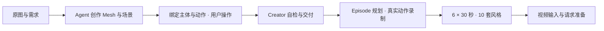

# Three SDK 与数据生产

默认开发主分支为 `main`。新功能从最新 `origin/main` 创建分支，PR 目标选择 `main`。

Agent 使用普通 Three.js 创建简洁可玩的白模，复用或修改人物、动作、物理与镜头能力。
还原参考图片的样式与主要形态，简化细节；环境整体以白色为主，仅使用基础照明。
主体、关键客体与标识物用少量识别色区分，地形用轻微灰度或色调差区分。
保留参考图的构图、尺度、空间关系及真实碰撞和动作条件，省去装饰、氛围、反射和复杂阴影。
人形默认保留 `humanoid.uefn-mannequin` 提供的可见模型、骨架与动作；其他主体优先复用，
没有合适的再自绘 Mesh 并绑定能力。Creator 自检以核心功能覆盖决定长度。



Agent 按四层使用：**直接复用 → 场景与能力绑定 → 参数配置 → 源码修改**。
按键、Agent 指令和录制共用执行逻辑；能力说明明确前置条件、场景要求和实际结果。
当前视频流程执行到 Seedance 提交前。

- [包职责与两条工作链路](docs/workspace-packages.md)
- [文档索引](docs/README.md) · [设计与职责](docs/three-sdk-architecture.md)
- [SDK 用法与动作条件](packages/three-world/README.md)
- [Creator 创作工具](packages/creator-host/README.md) · [云生成](apps/creator-cloud/three-eval-README.md)
- [Episode 录制与素材](packages/episode-pipeline/README.md) · [生产流程](docs/three-sdk-data-production.md)

```sh
pnpm install --frozen-lockfile
pnpm dev
```

默认启动 React + shadcn/ui 编辑器，地址为 `http://127.0.0.1:5178/`，支持热更新。
`pnpm dev:example` 在 `http://127.0.0.1:5175/` 预览独立 SDK 集成示例，不提供编辑器。
编辑器位于 `apps/sdk-playground`，共享场景、模型和配置位于 `packages/preset-content`。
项目参数保存在 `packages/preset-content/config/profiles.json`，界面支持导出。
`?debugProfiles=1` 可加载浏览器本地调试参数，正式交付使用项目配置。

独立集成示例位于 [character-actions](examples/three-creator/character-actions/main.ts)
和 [custom-vehicle](examples/three-creator/custom-vehicle/main.ts)。
`pnpm test:editor:browser` 检查工作台，`pnpm test:preset:delivery` 验证真实浏览器
自检、交付和独立 Episode 消费；后者需要 FFmpeg/ffprobe。

```sh
pnpm three:creator:prebuild --profile three-sdk --output .codex-tmp/three-runtime
```

维护代码可运行：

```sh
pnpm lint
pnpm lint:fix  # 可选：执行规则提供的自动修复，提交前查看 diff
pnpm typecheck
```

ESLint 10 使用 flat config，覆盖仓库的 JS/TS/TSX、脚本、示例与测试；忽略依赖、
构建产物、临时 case 和 worktree。开发环境使用受支持的 Node 20（≥20.19）、
Node 22（≥22.13）或 Node ≥24，CI 固定为 24.3.0。
规则侧重重复分支、无效表达式、不安全可选链和 finally 控制流；暂不统一格式、
清理 unused/any 或启用需要类型分析的 Promise 规则。已有清理/交付错误优先级
保留带理由的局部豁免。`pnpm lint` 在 CI 中执行，警告也会失败。
这是仓库维护检查，不增加 Creator 作品生成门禁；运行时副作用仍需测试和真实试跑验证。

构建与本地验证不启动云生产。外部运行配置和任务身份见各组件说明。
