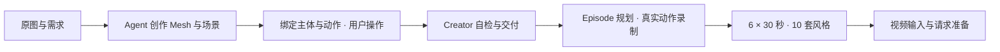

# Three SDK 与数据生产

Agent 使用普通 Three.js 创建可玩世界，复用或修改人物、动作、物理与镜头能力。
人形推荐 `humanoid.source-101`，包含 48 个动画片段和对应的场景动作控制；
其他主体可自行绘制 Mesh，再绑定移动、碰撞和交互能力。



Agent 按四层使用：**直接复用 → 场景与能力绑定 → 参数配置 → 源码修改**。
按键、Agent 指令和录制共用执行逻辑；能力说明明确前置条件、场景要求和实际结果。
当前视频流程执行到 Seedance 提交前。

- [文档索引](docs/README.md) · [设计与职责](docs/three-sdk-architecture.md)
- [SDK 用法与动作条件](packages/three-world/README.md)
- [Creator 创作工具](scripts/three-creator/README.md) · [云生成](scripts/cloud/three-eval-README.md)
- [Episode 录制与素材](scripts/three-episode/README.md) · [生产流程](docs/three-sdk-data-production.md)

```sh
pnpm install --frozen-lockfile
pnpm dev
```

本地训练场默认地址为 `http://127.0.0.1:5175/`，展示完整人物、19 个载具和三张
示例地图。修改源码后重启服务；项目参数保存在 `profiles.json`，界面支持导出。
`?debugProfiles=1` 可加载浏览器本地调试参数，正式交付使用项目配置。

独立集成示例位于 [character-actions](examples/three-creator/character-actions/main.ts)
和 [training-independent](examples/three-creator/training-independent/main.ts)。
`pnpm test:training:browser` 检查工作台，`pnpm test:training:delivery` 验证真实浏览器
自检、交付和独立 Episode 消费；后者需要 FFmpeg/ffprobe。

```sh
pnpm three:creator:prebuild --profile three-sdk --output .codex-tmp/three-runtime
```

构建与本地验证不启动云生产。外部运行配置和任务身份见各组件说明。
