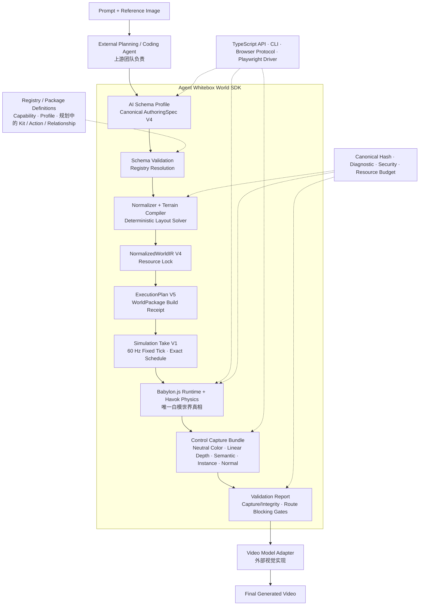

# Agent Whitebox World SDK

一个面向 AI 的确定性白模世界编译与交互模拟 SDK。

外部 Agent 使用稳定的 Canonical Schema 描述世界、主体和约束；SDK 负责校验、
资源解析、确定性编译、Babylon.js/Havok 运行、物理控制、状态查询和结构捕获。
后续视频模型只消费 SDK 输出的白模与控制通道，不负责决定碰撞、位置、导航或
Gameplay 真相。

> 当前长期重构总进度约 **65%**；“JSON → IR → Babylon/Havok → 多主体控制、
> 确定性落位与截图”的第一条 Canonical 纵向切片约 **90%**。详细口径和全部待办见
> [SDK 重构总进度与 Backlog](docs/18-refactor-progress-and-backlog.md)。

> Golden Humanoid S1b 首个可视纵向切片已完成并进入回归；S1b 整体与 Semantic Actions 整体仍未完成.

> Placement Solver S1 首个海湾纵向切片已完成并进入回归；通用 Terrain Mask、更多
> Constraint 与 P0.1 整体仍未完成。

> Route R1 Heightfield 与 R1b Static Platform 已完成，M5 已关闭：Authoring V4
> Golden/Adversarial Fixture、双 Blocking Gate、真实 Babylon/Havok Probe、11 个 R1b
> Fixture 和 V2/V5 clean break 均已进入回归。候选 `506e088` 相对 base `9c5a615`
> 的修后完整矩阵通过（148 files / 1577 tests，R1b 11/11），主 Agent 深审及两轮
> Cursor 独立复核均为 Final GO / No findings，且无 open confirmed P0/P1。

第一次阅读建议依次查看：

1. [项目总览](docs/00-project-overview.md)：产品范围、当前能力和明确不支持的部分；
2. [SDK 分层架构](docs/02-sdk-architecture.md)：系统边界、八层架构、代码包归属和运行时序列；
3. [Canonical JSON V4 快速接入](docs/17-canonical-json-quickstart.md)：当前世界输入、CLI 与 Browser Protocol；
4. [主体手感配表与版本工作区](docs/19-subject-preset-workspace.md)：本地版本、公共默认、发布与回滚；
5. [Gameplay 正式对接合同](docs/20-gameplay-integration-contract.md)：当前 Domain Schema、Browser V5 / Snapshot V4 与 clean-break 边界；
6. [Hosted Scene Brief 与评测工作流](docs/22-hosted-scene-brief-and-evaluation.md)：可选托管编排、权威边界、自检与 Studio；
7. [录制与视频工作台](docs/23-recording-and-video-workbench.md)：独立手动录制、Provider Adapter 与下载包；
8. [重构总进度与 Backlog](docs/18-refactor-progress-and-backlog.md)：完成度、优先级、依赖和验收标准。

## 核心链路



> 这张图用于说明数据处理顺序，不是完整的软件架构图。系统上下文、八层架构、
> 代码包依赖边界和运行时序列见 [SDK 分层架构](docs/02-sdk-architecture.md)。

### 核心链路节点说明

这条链路可以先用一句话理解：**AI 不直接操作 3D 引擎，而是先写一份结构化的
世界说明书；SDK 再把说明书逐步编译成可运行、可验证的白模世界，最后交给视频
模型增加材质、光影和艺术风格。**

主链路中每个节点的职责如下：

| 节点 | 通俗解释 | 主要输入与输出 |
|---|---|---|
| **Prompt + Reference Image** | 用户的原始需求，例如“生成一个海湾，山坡上站着人物，右侧有灯塔” | 文字和参考图 |
| **External Planning / Coding Agent** | 上游 AI，负责理解图片和 Prompt，并把自然语言翻译成 SDK 能理解的结构化 JSON | 图片、Prompt → `AuthoringSpec` |
| **AI Schema Profile / Canonical AuthoringSpec** | 世界的“设计图纸”，描述需要什么地形、水面、主体、物件、动作和空间约束；它不是 Babylon 代码，也不是 3D 模型文件 | AI 意图 → 标准世界 JSON |
| **Schema Validation / Registry Resolution** | 检查图纸结构、字段、单位和引用是否合法，并从 Registry/Package 中找到指定版本的主体、动作、碰撞体等内容 | AuthoringSpec + Registry → 已校验、已解析的输入 |
| **Normalizer + Terrain Compiler / Deterministic Layout Solver** | 补齐默认值、生成确定的地形高度数据，并把“灯塔在右侧、人物不要出生在水里”等约束计算成最终坐标和朝向 | 高层语义和约束 → 确定布局 |
| **NormalizedWorldIR / Resource Lock** | SDK 内部统一的“施工图”。所有简写已经展开，最终位置已经确定，资源版本和内容 Hash 已锁定 | 已校验世界 → 规范化中间数据 |
| **ExecutionPlan / WorldPackage** | 交给 Runtime 的“施工任务单和材料包”，列明要创建的地形、物体、主体、碰撞体、动作、相机及控制关系 | IR → 可执行世界计划 |
| **Simulation Take** | 一段可复现的表演时间线，例如“人物走 3 秒、跳跃、相机持续跟随” | 世界计划 + 控制序列 → 固定时间线 |
| **Babylon.js Runtime + Havok Physics** | 真正运行白模世界的地方。Babylon.js 负责模型、场景、相机、骨骼动画和画面；Havok 负责重力、地面支撑、墙体碰撞和物理运动 | ExecutionPlan → 可交互白模世界 |
| **Control Capture Bundle** | 从同一个 Runtime、同一时刻导出白模画面和结构通道，让下游模型同时知道“看到了什么、在哪里、属于谁、表面朝向哪里” | 运行中的世界 → 多通道结构捕获 |
| **Validation Report / Blocking Gate** | 统一质检协议。当前 V1 已验收 Capture Bundle 的 Pass、Depth、Hash 与归属；后续位置、碰撞、构图等继续接入同一协议。任一已声明 Blocking Gate 失败都拒绝继续 | 世界和捕获证据 → 可哈希报告与通过/拒绝 |
| **Video Model Adapter** | 把 SDK 的白模和结构通道转换成外部视频模型需要的输入格式，但不能修改世界中的主体数量、位置、碰撞和动作结果 | 白模证据 → 视频模型输入 |
| **Final Generated Video** | 视频模型在结构正确的白模基础上增加材质、光影、人物细节和视觉风格后的最终结果 | 经过验证的结构 → 最终视频 |

其中最容易混淆的是 `AuthoringSpec`、`NormalizedWorldIR` 和 `ExecutionPlan`：

- **AuthoringSpec 是设计意图**：主要由 AI 编写，例如“人物位于观景区”“灯塔在
  海湾右侧”“人物与悬崖保持至少 2 米距离”。AI 不需要猜测大量 3D 坐标。
- **NormalizedWorldIR 是确定的施工图**：默认值、资源引用、地形数据和最终坐标
  都已经解析完成，相同输入应得到相同 IR 和 Hash。
- **ExecutionPlan 是引擎任务单**：告诉 Runtime 具体创建哪些对象、在哪里创建、
  使用什么碰撞体和动作、相机跟随谁，以及当前控制哪个主体。

`Babylon.js Runtime + Havok Physics` 也可以拆开理解：

- **Babylon.js 是 3D 舞台系统**，负责场景、模型、相机、灯光、骨骼动画和渲染；
- **Havok 是物理规则系统**，负责重力、碰撞、支撑、跳跃和实际可移动的位置。

例如人物向前走时，控制器先产生移动意图，Havok 判断前方是否有墙、脚下是否有
地面并计算实际位置，Babylon.js 再把人物渲染到该位置并播放走路动作。因此
“动画中的脚在走”不等于“人物可以穿墙”，Gameplay 结果始终由 Runtime 世界决定。

Control Capture Bundle 中的通道分别表示：

- **Neutral Color**：没有复杂材质和最终风格的白模彩色图；
- **Linear Depth**：每个像素距离相机有多远；
- **Semantic**：每个像素属于人物、地形、水面、建筑等哪一类；
- **Instance**：每个像素具体属于哪个人物或哪个物件；
- **Normal**：表面朝向，用于理解坡面、墙面和光照方向。

图中的虚线节点是贯穿主链路的支撑能力，而不是单独的前后步骤：

- **Registry / Package Definitions** 是“乐高零件目录”，保存主体、资产、骨骼、
  动作、Collider、Capability、Socket 和 Relationship 等可复用定义；
- **TypeScript API / CLI / Browser Protocol / Playwright Driver** 是人和其他程序
  调用 SDK、控制主体、查询状态和自动截图的入口；
- **Canonical Hash / Diagnostic / Security / Resource Budget** 提供确定性 Hash、
  AI 可修复的稳定错误、安全边界和资源上限。

以“人物从海湾山坡走向灯塔”为例：Agent 先用 AuthoringSpec 描述山坡、海面、
人物、灯塔、道路和空间约束；Validator 检查资源；Terrain Compiler 和 Layout
Solver 生成高度并计算位置；IR 固化结果；ExecutionPlan 创建可运行任务；Babylon
加载场景和动画；Havok 处理坡面、重力和墙体；Simulation Take 控制人物移动；
Capture 导出白模及结构通道；当前 Validation Capture/Integrity V1 检查五 Pass、
Linear Depth、Bundle Hash 和 Package/Take/Session 归属。人物是否掉入水中、穿墙或
偏离构图仍由现有专项 Gate 检查，后续再接入统一 Report。全部已声明 Gate 通过后，
视频模型才负责把白模变成最终画面。

因此，这个 SDK 不只是对 Babylon.js 做一层简单封装，而是在 AI 与 3D 游戏引擎
之间提供一套**稳定、确定、可验证、可复现的世界编译系统**。

当前所有 Canonical 世界统一使用 AuthoringSpec V4、NormalizedWorldIR V4 和
ExecutionPlan V5；基础世界与 Route 世界不再分别暴露旧版本入口。已交付
Placement Solver S1、Babylon/Havok Runtime、Simulation Take / Control Capture V1，
以及统一 Validation 的 Capture/Integrity V1 窄切片：精确 Tick/Frame Schedule、五
Pass、Render Ready Receipt、原子 Bundle、版本化 Profile、Canonical Report、
`verify capture|explain` 和正负向门禁。Route Task 8 还实现了正式的最小
WorldPackage Root/Build Receipt、Validation Subject、Recast Graph/Path、真实
Babylon/Havok `NullEngine` 固定 Tick Probe、Canonical Route Evidence/Report、
`worldkit verify route` 和只读 Browser Protocol V5；Task 8 最终门禁已关闭。
Placement/Physics/Composition 等其余统一 Validation 扩展、完整 P1.4
WorldPackage 发布格式、恢复续拍和视频模型 Adapter 仍在后续 Backlog 中。

## 职责边界

| 角色 | 负责 | 不负责 |
|---|---|---|
| 上游 Agent 团队 | 理解 Prompt/参考图，选择 Registry 内容，生成和修复 Canonical JSON | 不直接操作 Babylon、Havok、DOM、Mesh 或物理 Handle |
| 本 SDK | Schema、IR、Compiler、Registry、Runtime、物理、控制、相机、状态、Capture 和 CLI/Browser 协议 | 不实现通用 LLM Agent，不生成最终高质量视觉 |
| 3D 资产团队 | 提供带版本、单位、Pivot、Forward Axis、Rig、Animation、Socket 和许可证信息的资产 | 不定义世界 Gameplay 或运行时控制权 |
| 视频模型与 Adapter | 根据白模控制通道实现材质、光影、风格和视觉细节 | 不修改世界位置、碰撞、主体数量、动作结果或语义身份 |

白模 Runtime 是唯一世界真相。凡是影响位置、数量、碰撞、遮挡、导航、动作、
关键轮廓或玩法结果的变化，都必须先进入 Canonical 世界并通过 Runtime Gate。

### Hosted 创作与评测链路

当前 Studio 将上游创作流程保持为清晰的阶段边界：Unified Planner 在一个 Codex
任务中生成 `scene-brief.md`、简化世界规划图和入口白膜目标；Canonical Builder
在另一个 Codex 任务中生成 AuthoringSpec V4 与实现映射。Codex 默认通过 LWDP 云端
运行，也可在 Studio 顶栏一键切换为已安装并登录的本地 Codex；后端在创建任务时冻结，
不会迁移已排队或运行中的任务。两种后端都使用同一 formal 模型、Skill、自检和输出合同。
本地后端在 `.codex-tmp/local-codex` 创建一次性隔离工作区，只复制任务所需上下文，
通过本机已有 Codex 登录完成认证但不会复制或提交凭证，并在 Host 验证非空产物后原子回传。
可信 Host 负责校验、
编译 ExecutionPlan V5、捕获真实白膜首帧和按完整视觉目标分组的三视图。随后 Gemini
只合成共享视觉规范与结构锁定 Prompt，Direct ImageGen 并发生成样式化首帧和各组
样式化三视图。规划图或生成图都不能替代 Runtime 世界真相。

Studio 与公网评测页展示同一批场景状态、诊断和产物；可玩入口必须进入 Gameplay
Browser，而详情与产物浏览保持独立。人工试玩录制及后续视频生成是工作流完成后的
显式用户操作，不会被自动插入 Planner、Builder、白膜捕获或样式化图片阶段。

## 核心设计原则

- **AI-friendly Schema**：一个概念只有一个公共名称；使用稳定 ID、精确 Ref、
  闭合枚举、判别 Union 和带单位的数值字段。
- **高层语义优先**：Agent 选择 Definition、Capability、Relationship 和约束，
  不拼装引擎对象或猜测底层生命周期。
- **确定性编译**：相同输入、Registry Lock、Compiler Version 和 Seed 产生相同
  Canonical Hash、IR 和执行结果。
- **协议与引擎分离**：Canonical Schema、IR 和 Runtime Contracts 不包含
  Babylon/Havok 类型；引擎细节只存在于 Adapter 内。
- **逻辑、渲染、物理三图分离**：RenderNode 父子层级不是 Gameplay 真相；
  Relationship、Collider 和 Visual Attachment 分别编译并保持一致。
- **Definition、Instance、Relationship 分离**：定义“是什么”、实例“世界里是谁”、
  关系“两个实例当前怎样连接”，三者不能互相替代。
- **开放但受控的扩展**：内容级扩展通过 Package/Registry Definition；算法级
  扩展经过 Plugin Conformance、签名和版本锁后才能进入生产世界。
- **生成结果不可信**：图片、模型和外部工具输出必须被固化、校验、哈希并重新
  通过物理、构图、资源和安全 Gate。
- **空间意图与运行时关系分离**：Placement Constraint 只负责编译时最终落位；
  骑乘、装备、拖拽和控制权继续使用类型化 Gameplay Relationship。
- **世界、操作和捕获分离**：WorldPackage、Simulation Take、Runtime Session、
  Control Capture Bundle 与生成视频分别版本化和哈希。
- **量化门禁优先**：Validation Profile 固定 Metric、阈值、单位和证据；Blocking
  Gate 或 Required Metric 缺失不能被综合分数抵消。

详细命名规则见仓库根目录的 [`AGENTS.md`](AGENTS.md) 与
[AI-first LEGO 游戏 SDK 总体设计](docs/superpowers/specs/2026-08-17-ai-first-lego-game-sdk-design.md)。

## LEGO 世界模型

| 概念 | 含义 | 当前状态 |
|---|---|---|
| Subject Definition | 可复用主体定义，组合 Geometry/Asset、Socket、Collider Policy、Profile 和 Capability | Primitive Package/Registry Definition 已交付；Normalizer/Plan 要求完整锁定的 Capability Assembly |
| Subject Instance | 世界中的具体主体，具有独立 Entity ID、Transform、状态和控制权 | 已交付 |
| Visual Part | Definition 内部的可渲染组成部分，不自动成为独立 Entity | Primitive Part、Golden GLB 与首个产品 G Bot Asset Part 已交付；更多拓扑仍未完成 |
| Subject Socket | 主体局部空间中的稳定连接点，例如手、座位或拖车钩 | 声明与编译已交付，关系绑定未交付 |
| Capability/Profile | 运动、控制、物理、动作等可组合能力及其锁定配置 | 首个 Ground Locomotion/Collider Profile 已交付 |
| Relationship | `mountedOn`、装备、拖拽等实例之间的类型化 Gameplay 关系 | Runtime 控制权已使用 `possessedBy`；通用 Authoring Relationship 仍在 S2 规划中 |
| Semantic Action | 与具体动画 Clip 解耦的移动、攻击、交互等动作 | Golden 与 G Bot 的 `idle/walk/run/jump` 固定 Tick 地面切片已交付；通用 Action 协议仍未完成 |

主体类别不决定能力。人、马、滑板、汽车、拖车或飞龙都使用同一套
Definition/Instance/Capability/Relationship 原则；差异由已注册能力、Profile、
Socket 和类型化关系表达。

## 当前能力与后续边界

| 领域 | 当前已交付 | 尚未交付 |
|---|---|---|
| 世界输入 | Canonical Authoring V4 → Normalized IR V4 → ExecutionPlan V5；严格 Schema、当前 Registry/Package Definition、八种 Placement Constraint 与确定性 Solver S1 | 通用 Terrain Mask、更多 Constraint、完整 P1.4 WorldPackage 发布格式 |
| 地形 | 室外 Heightfield、基础 Relief、静态障碍、水域和物理查询 | Canonical Raster/Mask/Region Pipeline；已设计但未实现的 Hybrid Terrain、洞穴、Overhang、多层可行走表面和完整室内 |
| 主体 | Primitive 人形/四足代理；Golden 与首个产品 G Bot 的 GLB、Rig/Animation/Collider Profile、多实例与独立控制 | 更多产品资产、Compound Collider、LOD、更多拓扑和独立动画资产 |
| 关系 | Socket 数据可以声明和查询 | 动态 Bind、骑乘、装备、拖拽、Joint、事务与回滚 |
| 运动与相机 | 地面移动、跳跃、第三人称跟随；WaterBody 可查询/可渲染，主体介质只发布 `ground / air` | 游泳与 `movementMedium: water`、第一人称、飞行、车辆、Camera Director 和多 Rig 切换 |
| 自动化 | validate/build/run/capture、Registry Discovery、Definition Validate、Subject Explain、`verify route`、Browser Protocol V5、Take Driver 与 Control Capture Gate | 持久 Runtime Session、恢复续拍、多人同时控制 |
| Capture | 单帧截图、World Runtime Snapshot V4、Simulation Take V1、Neutral/Depth/Semantic/Instance/Normal 五 Pass、原子 Bundle | Event/Action/Relationship Receipt、Motion Vector、完整 Replay/Resume 与视频 Adapter |
| Validation | Canonical Browser Gate、现有物理/构图检查；Capture/Integrity V1；Route 双 Blocking Gate、R1 Heightfield Golden Fixture；R1b 的 11 个 Fixture、完整验证矩阵、Canonical Evidence/Report 与可信 Host 只读投影 | Placement/Physics/Composition/Replay/Performance 接入统一 Report、Profile 组合、compare 与完整生产 Policy |
| Gameplay | 基础固定输入、Gameplay `possessedBy` 权威控制权与 Golden/G Bot `idle/walk/run/jump` 动作状态；Browser 不提供旁路 `bindControl` | 完整 Semantic Action、姿态、游泳、装备、NPC、导航、任务、战斗、联网 |
| 最终视觉 | 本地白模渲染 | Render Bridge、实时世界模型和生产 Video Model Adapter |

当前 Route 能力只承诺室外 Heightfield 与普通静态平台地面通行。不要把 H1/H2/H3
桥下双层/洞口/洞穴、动态平台、NPC 或公开 `goTo`、车辆、坐骑、飞行、室内、联网
或视频模型接入当作已经存在的生产能力。

## 快速开始

安装依赖并验证 Canonical 示例：

```bash
pnpm install
pnpm worldkit validate examples/authoring/package-subject-world.json --json
pnpm worldkit build examples/authoring/package-subject-world.json \
  --output artifacts/examples/package-subject-world/world.build.json --json
```

查看 Package Subject Definition 的确定性解析结果：

```bash
pnpm worldkit subject explain \
  examples/authoring/package-subject-world.json \
  --entity-id pack-animal-a --json
```

启动 Canonical Babylon/Havok Runtime：

```bash
pnpm worldkit run examples/authoring/package-subject-world.json
```

验证一个 Canonical Authoring V4 Route 世界，并原子发布 Canonical Report 与兄弟
Evidence 目录：

```bash
pnpm worldkit verify route <world-v4.json> \
  --profile worldkit://validation-profile/outdoor-world-package-dev@1 \
  --output /tmp/route.validation-report.json --json
```

该命令的可信 Node 链路依次创建 WorldPackage Build Receipt、Validation Subject、
Recast Graph/Path、真实 Babylon/Havok `NullEngine` 固定 Tick Probe 和统一 Route
Report。成功、确定性不可达与证据不完整分别退出 `0 / 2 / 3`，基础设施失败退出
`1`；已存在的 Report 或 Evidence 路径不会被覆盖。`worldkit run <world-v4.json>`
复用同一可信链路，再通过 Host 私有临时文件和只读端点把已完成证据注入页面；页面
自身不构图、不运行 Probe、也不生产证据。R1 Heightfield Golden 示例：

```bash
pnpm worldkit verify route examples/traversal/r1-heightfield/success.json \
  --profile worldkit://validation-profile/outdoor-world-package-dev@1 \
  --output /tmp/route-r1-success.validation-report.json --json
pnpm verify:route-r1-heightfield
```

本地体验产品 G Bot 时使用固定入口；它会同时注入 AuthoringSpec 并打开
`?authoring=1` 对应的 Canonical Runtime：

```bash
pnpm dev:g-bot
```

不要用普通 `pnpm dev` 配合 `?authoring=1`。普通 Vite Playground 没有配置
`WORLDKIT_AUTHORING_SPEC_PATH`，该组合会被明确拒绝。如果切换分支或依赖后浏览器
出现 `504 Outdated Optimize Dep`，停止旧服务后只执行一次：

```bash
pnpm dev:g-bot:refresh
```

刷新命令只重建 Vite 的本地依赖缓存，不修改 SDK 源码、AuthoringSpec 或资产；正常
启动不要默认使用它。

截图并保存 Runtime Snapshot：

```bash
pnpm worldkit capture examples/authoring/package-subject-world.json \
  --output artifacts/examples/package-subject-world/world.png \
  --snapshot artifacts/examples/package-subject-world/snapshot.json --json
```

校验并运行一个确定性 Simulation Take，生成五 Pass Control Capture Bundle：

```bash
pnpm worldkit take validate examples/takes/coastal-walk-opening.take.json --json
pnpm worldkit take inspect examples/takes/coastal-walk-opening.take.json --json
pnpm worldkit take run examples/takes/coastal-walk-opening.take.json \
  --world examples/authoring/placement-coastal-world.json \
  --output /tmp/coastal-walk-opening.bundle \
  --width-pixels 160 --height-pixels 90 --json
pnpm worldkit capture validate /tmp/coastal-walk-opening.bundle --json
pnpm worldkit capture inspect /tmp/coastal-walk-opening.bundle --json
pnpm worldkit verify capture /tmp/coastal-walk-opening.bundle \
  --output /tmp/coastal-walk-opening.validation-report.json --json
pnpm worldkit verify explain /tmp/coastal-walk-opening.validation-report.json \
  --gate-id capture-completeness --json
```

`take run` 由 Node/Playwright 驱动固定 Tick Runtime，并在精确 Capture Schedule 上等待
Render Ready Receipt；页面不获得文件系统权限。输出目录已存在时命令会拒绝覆盖。

Canonical Authoring V4 是基础世界和 Route 世界的唯一当前输入。旧版
Authoring/IR/Plan 只能在明确标记的历史文档中用于理解演进，不是可调用的
兼容入口。

让 SDK 根据空间意图求解海湾场景，而不是由 Agent 为地标填写最终坐标：

```bash
pnpm worldkit layout validate examples/authoring/placement-coastal-world.json --json
pnpm worldkit layout solve examples/authoring/placement-coastal-world.json \
  --output /tmp/placement-coastal-layout --json
pnpm worldkit layout explain /tmp/placement-coastal-layout/layout-report.json \
  --entity-id lighthouse --json
pnpm verify:placement-layout
```

`validate` 只校验并解析输入；`solve` 事务性写入 Report、Normalized IR 和完整性
清单；`explain` 只读取 Report。`verify:placement-layout` 额外验证 Browser/Havok、
正负向完整性门禁、并发确定性和 936×596 可见截图。

验证首个 Rigged Subject 可视切片的最小接入流程：

```bash
pnpm worldkit validate examples/authoring/rigged-subject-world.json --json
pnpm worldkit capture examples/authoring/rigged-subject-world.json \
  --output artifacts/examples/rigged-subject-world/world.png \
  --snapshot artifacts/examples/rigged-subject-world/snapshot.json \
  --json
pnpm verify:rigged-subject
```

前两条分别演示校验与捕获；只有 `pnpm verify:rigged-subject` 是覆盖 CLI、Browser、
Havok、四动作、实例隔离、墙体碰撞、截图与 Hash 篡改失败的单命令 Gate。

验证首个产品人物 G Bot；Agent 仍只需要选择稳定 Subject Definition：

```bash
pnpm worldkit validate examples/authoring/g-bot-subject-world.json --json
pnpm worldkit subject explain examples/authoring/g-bot-subject-world.json \
  --entity-id g-bot-primary --json
pnpm verify:g-bot-subject
```

产品侧的 `asset.manifest.json` / `action-manifest.json` 记录原始模型、骨骼与 Clip
事实；SDK Registry 的 Rig Profile / Animation Set 把它们映射为稳定 Bone ID 和
Semantic Action。普通 World Agent 不读取模型路径、Mixamo Bone 名或源 Clip 名。

### Source-only FBX 资产清单

`assets/subjects/source-fbx/vehicles/` 保存 12 个载具与可骑乘主体的原始 FBX，
`catalog.json` 记录稳定英文 `sourceId`、原始中文相对路径、仓库路径、字节数与
SHA-256，便于团队拉取、审计和后续转换。它们当前统一标记为
`runtimeStatus: "source-only"`：尚未转换为 Runtime 使用的 GLB，也没有注册到
Subject Asset Resolver，因此不能直接在页面中运行。

当前 Playground 中除 G Bot 外的主体仍由 Registry `visualParts` 生成程序化白模；
把 FBX 放入仓库只建立了可追溯的美术源文件基线，不会替换这些白模或伪装成已完成
的 Runtime 接入。后续必须经过格式转换、坐标/尺寸检查、Collider、Socket、动作或
Pose 配置及 Registry 锁定，才能成为可运行的主体资产。

## 验证

常规只读基础门禁按受影响输入选择：

```bash
pnpm typecheck
pnpm test
pnpm build
```

Studio 和 LWDP 使用独立 Node Test Runner，不在根 Vitest 内：

```bash
pnpm test:studio
pnpm test:lwdp-client
```

需要证明真实 Browser/Capability 接线时，再选择直接相关的 verifier：

```bash
pnpm verify:canonical
pnpm verify:rigged-subject
pnpm verify:g-bot-subject
pnpm verify:placement-layout
pnpm verify:control-capture
pnpm verify:validation-capture
pnpm verify:route-r0-contract
```

这是一张完整能力覆盖表，不要求每次小改都机械重跑全部命令。先跑受影响的定向回归，
在最终待合入树上把相关完整门禁各跑一次；只要后续改动没有触及某条门禁的输入或承诺，
它的通过证据可以复用。根 `pnpm test` 已包含 `pnpm test:scenes` 的两个 Vitest 文件，
不要连续重复执行；Studio/LWDP、未聚合的 Node/Python/Site tests 需要按改动范围单独跑。
生产构建、Browser/Capability verifier、截图检查和人工交互属于不同证据层，不能由单元
测试替代。详细失效规则见
[`runtime-deep-review-checklist.md`](docs/reviews/runtime-deep-review-checklist.md#6-required-completion-gates)。

当前 `verify:canonical`、`verify:placement-layout`、`verify:rigged-subject` 和
`verify:g-bot-subject` 的成功路径会 promotion tracked golden。它们在 check/update 拆分前不是
只读审查命令：只读审查应复用 exact-input evidence 或明确记为未跑，不能运行后丢弃写入；只有
得到更新制品授权的实施变更才可以运行并审查其 diff。

`verify:canonical` 会在真实 Chromium 中验证 Canonical Build Artifact、
Babylon/Havok、墙体碰撞、水域切换、两个 Package Subject 独立控制、截图、
Snapshot 和确定性 Reset。

`verify:rigged-subject` 会验证项目自有 Golden GLB 的内容 Hash、Rig、
`idle/walk/run/jump` 固定 Tick 动画、两个实例状态隔离、Havok 墙体停止和篡改失败；
它是底座回归，不代表任意产品资产、Compound Collider、LOD 或全部 Semantic Actions
已可用。

`verify:g-bot-subject` 会验证首个产品 G Bot GLB、产品交付 Manifest、65 根源 Bone、
25 个源 Clip、17 个语义 Bone 映射、当前开放的四个 Semantic Action、双实例隔离、
Havok 墙体停止和五张 936×596 截图。它证明这一版本 G Bot 已接入，不把其余 21 个
Clip、游泳、装备、坐骑、LOD 或任意后续产品包标记为可用。

`verify:placement-layout` 会验证海湾 Fixture 的 19 条约束、八种 S1 Constraint、
Report → IR → Plan → Snapshot 一致性、Required Runtime Assertion、接地/净空/路线
坡度/镜头可见性、固定 Seed/Profile 的连续与并发确定性，以及冲突、篡改和预算耗尽
不会生成或覆盖 WorldPackage。

`verify:control-capture` 会从两个 600 Tick / 240 Frame Take 派生有界单帧 Probe，在真实
Chromium 中验证 Neutral/Depth/Semantic/Instance/Normal、Camera/Snapshot/三种计数器、
稳定 ID Table、同 World Identity/不同 Take Hash，以及 Bundle 的原子完整性校验。

`verify:validation-capture` 不重跑 Babylon；它验证已经生成的 Bundle 能稳定产出
Canonical Validation Report，并覆盖正常、缺 Pass、坏 Depth、混 Take 和坏 Hash 五类
Fixture。Blocking Failure 不能被其他 Gate 抵消，Required Metric 缺失会得到
`incomplete` 而不是静默跳过。

`verify:route-r0-contract` 只验证 Route Graph R0 的 Authoring V4 连通约束、Planner
投影、Traversal Surface 身份、Lock Hash、Driver 白名单、Canonical Graph Bytes 和
Validation 词汇。它不构建 Traversal Graph，不跑 Character Controller，也不表示
`route-connectivity` 或 `route-runtime-conformance` 已经通过。已评 Runtime Metric
必须引用 `route-runtime-probe-receipt`；一份 Traversal Graph 不能让 Runtime Gate 通过。

## Workspace Package Map

内部按稳定合同、领域能力、运行时和 Provider Adapter 拆包；AI 与 SDK 使用者不需要理解
这些内部目录，只使用统一 Schema、CLI、Browser Protocol 和顶层 `world.*` API。`公开边界`
表示该包是否定义可序列化合同或 SDK 入口；它不表示允许绕过 Compiler/Runtime Host 直接调用。

| Package | 核心职责 | 公开边界 | 明确禁止 |
|---|---|---|---|
| `packages/contracts/` | Alpha 层共享 ID、Transform、Frame、Action 与 Diagnostic 基础类型 | 仅底层共享类型 | 承载新 Canonical Schema 或引擎对象 |
| `packages/protocol/` | Canonical JSON Bytes、稳定排序与 SHA-256 Hash | Canonical 序列化基础 | 依赖领域 Runtime 或 Provider |
| `packages/runtime-contracts/` | ExecutionPlan V5、World Runtime Snapshot V4、Camera 参数和 Browser Protocol V5 | Runtime/Browser 当前公共合同 | 暴露 Babylon、Havok、Recast Handle |
| `packages/gameplay-contracts/` | Gameplay Command、Receipt、Event、State 与 Bootstrap 的关闭合同 | Gameplay 当前公共合同 | 实现 Gameplay 规则或依赖引擎 |
| `packages/world/` | `world.*` Authoring DSL、Feature、Terrain、Landmark、规划工件与场景规格 | AI/场景作者入口 | 直接创建 Provider 对象或修改 Runtime 内部 |
| `packages/authoring/` | Authoring V4 Schema、Parser、Normalizer、Resource Lock、Preset Candidate 与 Normalized IR V4 | AI Schema 与 Authoring Pipeline | 执行 Babylon/Havok 或反向读取 Runtime State |
| `packages/layout-solver/` | 候选生成、Constraint Evaluator、确定性搜索和 Layout Report | 引擎无关 Solver 合同 | 直接修改场景或依赖渲染结果 |
| `packages/compiler/` | NormalizedWorldIR V4 到锁定 ExecutionPlan V5 的确定性编译 | Compiler API | 读取 Prompt、执行 Gameplay 或创建引擎对象 |
| `packages/world-package/` | WorldPackage Manifest、Package Root、Build Closure 与 Receipt | 正式内容包合同 | 保存运行时 Handle 或未锁定草稿 |
| `packages/validation/` | Validation Profile、Metric、Evidence、Gate、Report 与 Package 校验 | CLI/自动化验证合同 | 用渲染成功替代合同/身份校验 |
| `packages/subject-registry/` | 精确版本的 Subject Definition、Capability Assembly、Profile 与 Asset Inventory | 当前 Registry 资源入口，不回退到旧 Definition | 保存会话状态或未版本化数字 overlay |
| `packages/subject-composition/` | Primitive Bounds、Collider 推导、角色胶囊和资源成本 | 内部可复用 LEGO 几何合同 | 依赖 Babylon Mesh 或场景层级 |
| `packages/subject-actions/` | Character State、Ground Humanoid Action 与动作解析 | 引擎无关动作语义 | 直接播放 AnimationGroup 或控制输入设备 |
| `packages/camera/` | Provider-neutral 命名 Camera Rig/Modifier/Context Profile、View Preference、纯 Selection/Explain | Camera 领域合同；Runtime/Browser 接线尚未完成 | 创建渲染相机、执行碰撞查询、拥有 Gameplay State，或把纯选择误写成已交付 Runtime selector |
| `packages/terrain-surface/` | Heightfield、Triangle Mesh、Collider Support 与 Surface Query | Traversal/Runtime 内部几何合同 | 把单一 Heightfield 冒充全部空间拓扑 |
| `packages/traversal/` | Traversal Surface、Lock、Capability Envelope、Graph/Path/Probe Receipt 与 Route Overlay | Provider-neutral Route 合同 | 暴露 Recast 数据或替代 Runtime 支撑事实 |
| `packages/traversal-recast/` | Recast/Detour Graph Build、Query 与 Route Evidence Provider Adapter | 不直接面向 AI | 让 Provider 名称或 Handle 进入 Canonical 协议 |
| `packages/gameplay/` | Gameplay State、Feature、Semantic Action 与 Command Dispatcher | 引擎无关 Gameplay 组合层 | 依赖 Babylon、Browser DOM 或设备输入 |
| `packages/runtime-host/` | WorldSession、Command Journal、事务、容量和生命周期所有权 | Runtime Host API | 实现 Babylon 场景细节或重复推导 Gameplay State |
| `packages/runtime-babylon/` | Babylon/Havok Runtime、Camera Director、Subject Controller、Capture 与资产生命周期 | Engine Adapter，不直接面向 AI | 定义 Canonical Schema 或泄漏引擎 Handle |
| `packages/control-capture/` | Simulation Take、Capture Schedule、Profile、严格校验与 Hash | Take/Capture 自动化合同 | 把 Authoring Preview 当作 Gameplay Ground Truth |
| `packages/testkit/` | Feature Ownership、Transform、Spawn Safety 与诊断测试辅助 | 仅测试/门禁 | 被生产 Runtime 依赖为业务实现 |

旧的 `@whitebox-world/physics` 和 `@whitebox-world/subjects` 已删除，也没有被一对一合并成
新的大包。Subject 的公共资源、组合和动作语义分别由 `subject-registry`、
`subject-composition` 和 `subject-actions` 持有；Babylon Mesh、Havok Collider、角色控制器、
动画播放和资源释放等 Provider 实现统一由 `runtime-babylon` 持有，并在包内按职责分模块。
只有当一项能力具有独立的公共合同、复用边界或生命周期所有权时才拆成 Workspace Package；
不按领域名词机械拆包，也不让 Provider 实现反向污染公共合同。

Gameplay 合同、引擎无关规则、Runtime Host 生命周期和 Babylon Adapter 各自拥有
独立边界。控制权只能通过 Gameplay possession 事务改变，Browser/Adapter 不提供
绕过关系真相的直接绑定入口。应用与工具入口保持为：

| 路径 | 职责 |
|---|---|
| `apps/playground/` | Canonical Runtime 页面、Babylon-backed catalog/artifact 场景和浏览器验证入口 |
| `scripts/worldkit.ts` | SDK CLI |

Compiler 和 Runtime 不能反向读取 Agent Prompt；Runtime Adapter 不能把 Babylon
对象泄漏到公共协议；场景模块不能为了创建内容而修改 Runtime、Physics 或 Camera
内部实现。

### 贡献者的未发布协议规则

项目尚未对外发布，不为开发历史保留公共 alias、双轨 parser、旧 Browser 方法或
仅用于迁移本地 Fixture 的 migration。合同改动应一次性更新 Schema、生成类型、CLI、
Browser、示例和门禁。若本轮确实无法删除某个旧路径，技术设计和 Backlog 必须同时
记录它的具体 consumer、owner、removal gate 和 deadline；达到门禁后删除，不能把
“暂时兼容”固化成新的公共合同。

## 文档导航

### 使用与当前状态

- [项目总览：范围、状态与阅读顺序](docs/00-project-overview.md)
- [Canonical JSON V4：AI/CLI 接入与运行指南](docs/17-canonical-json-quickstart.md)
- [主体手感配表与版本工作区](docs/19-subject-preset-workspace.md)
- [Hosted Scene Brief 与评测工作流](docs/22-hosted-scene-brief-and-evaluation.md)
- [录制与视频工作台](docs/23-recording-and-video-workbench.md)
- [SDK 重构总进度与 Backlog](docs/18-refactor-progress-and-backlog.md)
- [当前实验与验证记录](docs/10-current-experiments.md)
- [第一期 Alpha 实现与运行指南](docs/07-alpha-implementation.md)

### 架构评审

- [PR #14 Hosted Scene Brief / Evaluation 选择性融合审查](docs/reviews/2026-08-25-pr14-spatial-platform-main-integration-review.md)
- [AI-first 白模游戏 SDK 设计评审简版](docs/reviews/2026-08-18-ai-first-sdk-design-review-brief.md)
- [AI-first LEGO 游戏 SDK 总体设计](docs/superpowers/specs/2026-08-17-ai-first-lego-game-sdk-design.md)
- [Canonical Runtime State 与 Semantic Projection 设计](docs/superpowers/specs/2026-08-22-canonical-runtime-state-and-semantic-projection-design.md)
- [Gameplay Framework 与 Route R1b 融合设计](docs/superpowers/specs/2026-08-24-gameplay-framework-r1b-integration-design.md)
- [Gameplay Framework 与 Route R1b 实施计划](docs/superpowers/plans/2026-08-24-gameplay-framework-r1b-integration-implementation-plan.md)
- [未发布协议兼容层 Clean Break 设计](docs/superpowers/specs/2026-08-24-unreleased-compatibility-clean-break-design.md)
- [历史命名与兼容路径清理专项计划](docs/superpowers/plans/2026-08-25-historical-naming-and-compatibility-path-cleanup-plan.md)
- [Gameplay RuntimeHost G19-3 审查处置](docs/reviews/2026-08-24-gameplay-runtime-host-g19-3-review.md)
- [上下文驱动 Gameplay 与 Camera 组合设计](docs/superpowers/specs/2026-08-24-context-driven-gameplay-camera-composition-design.md)：Camera 领域包已实现，Gameplay/Browser/Runtime 集成仍按 Backlog 推进。
- [Babylon-only Runtime 收口实施计划](docs/superpowers/plans/2026-08-25-babylon-only-threejs-retirement.md)
- [AI-first Terrain Authoring Pipeline 设计](docs/superpowers/specs/2026-08-17-terrain-authoring-pipeline-design.md)
- [Hybrid Terrain 与非 Heightfield 特殊地形设计](docs/superpowers/specs/2026-08-21-hybrid-terrain-and-non-heightfield-topology-design.md)
- [可扩展主体组装 Authoring 专项设计](docs/superpowers/specs/2026-08-19-extensible-subject-authoring-design.md)
- [Asset Subject S1b 可视切片字段级设计](docs/superpowers/specs/2026-08-19-asset-subject-s1b-visible-slice-design.md)
- [Placement Constraint 与确定性 Layout Solver 设计](docs/superpowers/specs/2026-08-19-placement-constraint-layout-solver-design.md)
- [Route Graph 与主体可通行性设计](docs/superpowers/specs/2026-08-21-route-graph-and-traversability-design.md)
- [Route Graph 与主体可通行性初次作者审查](docs/reviews/2026-08-21-route-graph-traversability-design-review.md)
- [Route Graph 与主体可通行性独立审查及处置](docs/reviews/2026-08-21-route-graph-traversability-independent-review.md)
- [Route Graph / Traversability R0 实施计划](docs/superpowers/plans/2026-08-21-route-graph-traversability-r0-implementation-plan.md)
- [Route Graph / Traversability R1 Heightfield 实施计划](docs/superpowers/plans/2026-08-22-route-graph-traversability-r1-heightfield-implementation-plan.md)
- [Route R1 Heightfield Runtime Review](docs/reviews/2026-08-22-route-r1-heightfield-runtime-review.md)
- [Simulation Take 与 Control Capture Bundle 设计](docs/superpowers/specs/2026-08-19-simulation-take-control-capture-design.md)
- [World Validation Report 与质量门禁设计](docs/superpowers/specs/2026-08-19-world-validation-report-and-quality-gates-design.md)
- [AI 自定义场景几何扩展候选方案（未来探索）](docs/superpowers/specs/2026-08-20-ai-authored-geometry-extension-design.md)
- [Package 局部 Subject Definition（S1a）设计](docs/superpowers/specs/2026-08-19-package-subject-definition-design.md)
- [主体资产与 3C 配置接入契约](docs/16-subject-assets-3c-integration.md)
- [模块化 Subject 资产导入与 xier120 修改清单](docs/20-modular-subject-source-assets.md)
- [世界模型团队接入说明](docs/11-world-model-team-handoff.md)
- [运行时世界导演与受控世界操作协议](docs/09-runtime-world-director.md)

### 外部依据与可行性

- [业界对照与可落地性核查报告](docs/superpowers/specs/2026-08-18-industry-alignment-and-feasibility-review.md)
- [Agentic 白模世界到可控视频：开源方案调研与架构启示](docs/superpowers/specs/2026-08-19-agentic-whitebox-to-video-open-source-research.md)
- [阶段 0 技术探针计划与外部资料核查](docs/superpowers/specs/2026-08-18-phase0-probe-plan-and-external-research.md)

### 未来探索（非 Roadmap）

- [AI 自定义场景几何扩展候选方案](docs/superpowers/specs/2026-08-20-ai-authored-geometry-extension-design.md)：
  只记录未来可能需要解决的能力缺口和候选技术，不表示确定会做、没有排期，也没有
  选定 Recipe、MeshDraft、GLB、Sandbox 或其他 Authoring Provider 等技术路线。

### 已完成实施切片

- [Subject Foundation 可视切片](docs/superpowers/plans/2026-08-19-subject-foundation-visible-slice.md)
- [Package Subject Definition 可视切片](docs/superpowers/plans/2026-08-19-package-subject-definition-visible-slice.md)
- [Canonical JSON Babylon 历史实施计划](docs/superpowers/plans/2026-08-18-canonical-json-babylon-v1.md)：已被当前 Authoring V4 主链取代，仅保留历史上下文，不提供生产兼容。
- [Placement Solver S1 海湾纵向切片](docs/superpowers/plans/2026-08-20-placement-layout-solver-s1.md)：记录当时 Authoring/IR/Plan V3/V3/V4、八种 Constraint、CLI、Browser/Havok 与事务证据；版本组合仅为历史，当前入口为 V4/V4/V5。
- [Simulation Take / Control Capture V1](docs/superpowers/plans/2026-08-21-simulation-take-control-capture-v1.md)：精确 Schedule、五 Pass Babylon Capture、Render Ready、原子 Bundle、CLI/Browser/Playwright 与真实浏览器 Gate 已完成。
- [Validation Capture/Integrity V1](docs/superpowers/plans/2026-08-21-validation-capture-integrity-v1.md)：版本化 Profile、Canonical Report、Blocking/Incomplete Policy、Capture Adapter、verify/explain 与五类 Conformance Fixture 已完成。

### 已完成首个切片、继续回归

- [Asset Subject S1b 可视切片实施计划](docs/superpowers/plans/2026-08-19-asset-subject-s1b-visible-slice.md)：项目自有 Golden GLB、Rig、Collider Profile、`idle/walk/run/jump` 和 Babylon/Havok 端到端接入已完成；S1b 后续能力仍按 Backlog 推进。
- [P1.5 Control Feel / Medium / State Resolver](docs/superpowers/plans/2026-08-21-p15-control-feel-state-resolver.md)：Ground/Air 首切片已通过生产 Gate 并由 PR #10 合入 `main`；Motion 仅选择算法，速度与跳跃归锁定 Control Feel，Character 支撑由每 Tick 唯一一次 Havok `checkSupport()` 决定。水介质和 P1.5 合入后收尾仍按 Backlog 推进。

### 架构决策

- [ADR-0001：向 Agent 暴露主体套餐](decisions/0001-subject-kits.md)
- [ADR-0002：第一、二期范围](decisions/0002-phased-scope.md)
- [ADR-0003：Agent、Director 与 World Model 边界](decisions/0003-agent-director-world-model-boundaries.md)
- [ADR-0004：新场景采用 Plan-first 创作](decisions/0004-plan-first-world-authoring.md)
- [ADR-0005：分离 Planner、Builder 与 Visual Bible](decisions/0005-separated-planner-builder-visual-bible.md)
- [ADR-0006：AuthoringSpec 编译架构与 Babylon Runtime](decisions/0006-authoring-spec-compiler-architecture.md)

## Catalog 场景与创作制品

Plan-first 多 Agent 场景流程、Creator Studio 和已验证 catalog 场景继续作为创作、
视觉回归与产品 Fixture。Gameplay、Opening Composition、规划捕获和 SDK-derived tri-view
都由 Babylon-backed Playground 承载；World Plan、Opening Shot、plan lock、白膜三视图和
Visual Bible 工件合同不因 Runtime 收口而改变。

```bash
pnpm dev
pnpm studio
```

`pnpm dev` 用于 Babylon-backed catalog Playground，不能为 `?authoring=1` 注入
AuthoringSpec。Canonical G Bot 体验使用 `pnpm dev:g-bot`；新外部程序使用 `worldkit`、
Canonical Authoring V4 和 Browser Protocol V5。Camera 的命名 Profile/Context、Preference、
纯 Selection/Explain 已在 `@whitebox-world/camera` 实现；committed Gameplay Context
Projection、Browser 命令、Registry Lock 和 Babylon CameraDirector 消费 Selection Decision
仍未交付，详见[重构总进度与 Backlog](docs/18-refactor-progress-and-backlog.md#p24-多-controller相机模式与受控操作)。
