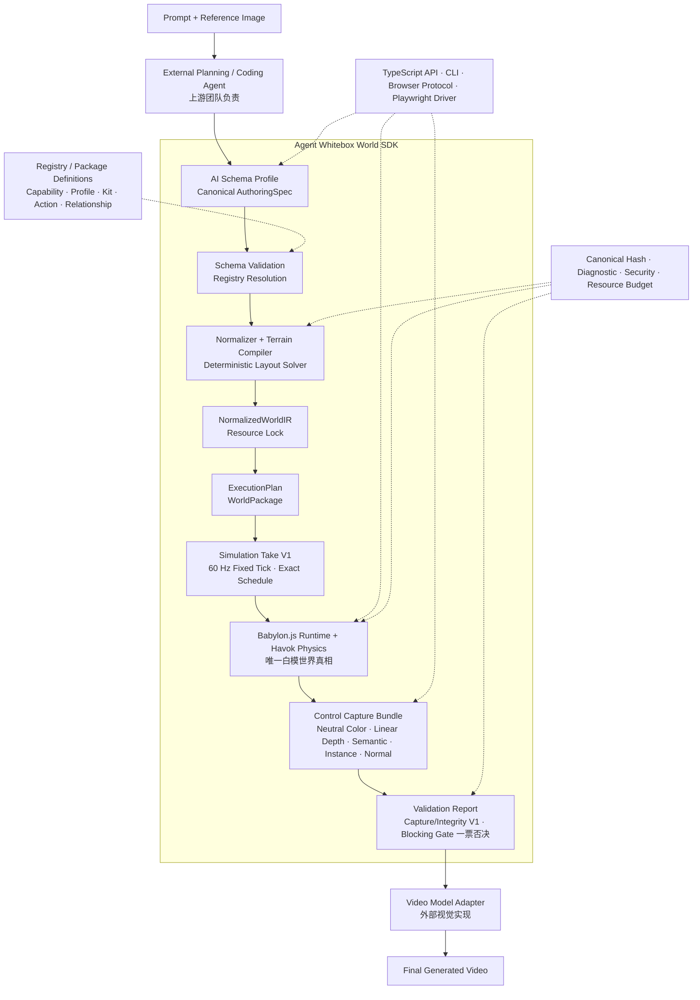

# Agent Whitebox World SDK

一个面向 AI 的确定性白模世界编译与交互模拟 SDK。

外部 Agent 使用稳定的 Canonical Schema 描述世界、主体和约束；SDK 负责校验、
资源解析、确定性编译、Babylon.js/Havok 运行、物理控制、状态查询和结构捕获。
后续视频模型只消费 SDK 输出的白模与控制通道，不负责决定碰撞、位置、导航或
Gameplay 真相。

> 当前长期重构总进度约 **62%**；“JSON → IR → Babylon/Havok → 多主体控制、
> 确定性落位与截图”的第一条 Canonical 纵向切片约 **90%**。详细口径和全部待办见
> [SDK 重构总进度与 Backlog](docs/18-refactor-progress-and-backlog.md)。

> Golden Humanoid S1b 首个可视纵向切片已完成并进入回归；S1b 整体与 Semantic Actions 整体仍未完成.

> Placement Solver S1 首个海湾纵向切片已完成并进入回归；通用 Terrain Mask/Route Graph、更多 Constraint 与 P0.1 整体仍未完成。

第一次阅读建议依次查看：

1. [项目总览](docs/00-project-overview.md)：产品范围、当前能力和明确不支持的部分；
2. [SDK 分层架构](docs/02-sdk-architecture.md)：系统边界、八层架构、代码包归属和运行时序列；
3. [Canonical JSON V3 快速接入](docs/17-canonical-json-quickstart.md)：当前唯一 JSON 协议和命令；
4. [主体手感配表与版本工作区](docs/19-subject-preset-workspace.md)：本地版本、公共默认、发布与回滚；
5. [重构总进度与 Backlog](docs/18-refactor-progress-and-backlog.md)：完成度、优先级、依赖和验收标准。

## 核心链路



> 这张图用于说明数据处理顺序，不是完整的软件架构图。系统上下文、八层架构、
> 代码包依赖边界和运行时序列见 [SDK 分层架构](docs/02-sdk-architecture.md)。

### 核心链路节点说明

这条链路可以先用一句话理解：**AI 不直接操作 3D 引擎，而是先写一份结构化的
世界说明书；SDK 再把说明书逐步编译成可运行、可验证的白模世界，最后交给视频
模型增加材质、光影和艺术风格。**

主链路中每个节点的职责如下：

| 节点 | 通俗解释 | 主要输入与输出 |
|---|---|---|
| **Prompt + Reference Image** | 用户的原始需求，例如“生成一个海湾，山坡上站着人物，右侧有灯塔” | 文字和参考图 |
| **External Planning / Coding Agent** | 上游 AI，负责理解图片和 Prompt，并把自然语言翻译成 SDK 能理解的结构化 JSON | 图片、Prompt → `AuthoringSpec` |
| **AI Schema Profile / Canonical AuthoringSpec** | 世界的“设计图纸”，描述需要什么地形、水面、主体、物件、动作和空间约束；它不是 Babylon 代码，也不是 3D 模型文件 | AI 意图 → 标准世界 JSON |
| **Schema Validation / Registry Resolution** | 检查图纸结构、字段、单位和引用是否合法，并从 Registry/Package 中找到指定版本的主体、动作、碰撞体等内容 | AuthoringSpec + Registry → 已校验、已解析的输入 |
| **Normalizer + Terrain Compiler / Deterministic Layout Solver** | 补齐默认值、生成确定的地形高度数据，并把“灯塔在右侧、人物不要出生在水里”等约束计算成最终坐标和朝向 | 高层语义和约束 → 确定布局 |
| **NormalizedWorldIR / Resource Lock** | SDK 内部统一的“施工图”。所有简写已经展开，最终位置已经确定，资源版本和内容 Hash 已锁定 | 已校验世界 → 规范化中间数据 |
| **ExecutionPlan / WorldPackage** | 交给 Runtime 的“施工任务单和材料包”，列明要创建的地形、物体、主体、碰撞体、动作、相机及控制关系 | IR → 可执行世界计划 |
| **Simulation Take** | 一段可复现的表演时间线，例如“人物走 3 秒、跳跃、相机持续跟随” | 世界计划 + 控制序列 → 固定时间线 |
| **Babylon.js Runtime + Havok Physics** | 真正运行白模世界的地方。Babylon.js 负责模型、场景、相机、骨骼动画和画面；Havok 负责重力、地面支撑、墙体碰撞和物理运动 | ExecutionPlan → 可交互白模世界 |
| **Control Capture Bundle** | 从同一个 Runtime、同一时刻导出白模画面和结构通道，让下游模型同时知道“看到了什么、在哪里、属于谁、表面朝向哪里” | 运行中的世界 → 多通道结构捕获 |
| **Validation Report / Blocking Gate** | 统一质检协议。当前 V1 已验收 Capture Bundle 的 Pass、Depth、Hash 与归属；后续位置、碰撞、构图等继续接入同一协议。任一已声明 Blocking Gate 失败都拒绝继续 | 世界和捕获证据 → 可哈希报告与通过/拒绝 |
| **Video Model Adapter** | 把 SDK 的白模和结构通道转换成外部视频模型需要的输入格式，但不能修改世界中的主体数量、位置、碰撞和动作结果 | 白模证据 → 视频模型输入 |
| **Final Generated Video** | 视频模型在结构正确的白模基础上增加材质、光影、人物细节和视觉风格后的最终结果 | 经过验证的结构 → 最终视频 |

其中最容易混淆的是 `AuthoringSpec`、`NormalizedWorldIR` 和 `ExecutionPlan`：

- **AuthoringSpec 是设计意图**：主要由 AI 编写，例如“人物位于观景区”“灯塔在
  海湾右侧”“人物与悬崖保持至少 2 米距离”。AI 不需要猜测大量 3D 坐标。
- **NormalizedWorldIR 是确定的施工图**：默认值、资源引用、地形数据和最终坐标
  都已经解析完成，相同输入应得到相同 IR 和 Hash。
- **ExecutionPlan 是引擎任务单**：告诉 Runtime 具体创建哪些对象、在哪里创建、
  使用什么碰撞体和动作、相机跟随谁，以及当前控制哪个主体。

`Babylon.js Runtime + Havok Physics` 也可以拆开理解：

- **Babylon.js 是 3D 舞台系统**，负责场景、模型、相机、灯光、骨骼动画和渲染；
- **Havok 是物理规则系统**，负责重力、碰撞、支撑、跳跃和实际可移动的位置。

例如人物向前走时，控制器先产生移动意图，Havok 判断前方是否有墙、脚下是否有
地面并计算实际位置，Babylon.js 再把人物渲染到该位置并播放走路动作。因此
“动画中的脚在走”不等于“人物可以穿墙”，Gameplay 结果始终由 Runtime 世界决定。

Control Capture Bundle 中的通道分别表示：

- **Neutral Color**：没有复杂材质和最终风格的白模彩色图；
- **Linear Depth**：每个像素距离相机有多远；
- **Semantic**：每个像素属于人物、地形、水面、建筑等哪一类；
- **Instance**：每个像素具体属于哪个人物或哪个物件；
- **Normal**：表面朝向，用于理解坡面、墙面和光照方向。

图中的虚线节点是贯穿主链路的支撑能力，而不是单独的前后步骤：

- **Registry / Package Definitions** 是“乐高零件目录”，保存主体、资产、骨骼、
  动作、Collider、Capability、Socket 和 Relationship 等可复用定义；
- **TypeScript API / CLI / Browser Protocol / Playwright Driver** 是人和其他程序
  调用 SDK、控制主体、查询状态和自动截图的入口；
- **Canonical Hash / Diagnostic / Security / Resource Budget** 提供确定性 Hash、
  AI 可修复的稳定错误、安全边界和资源上限。

以“人物从海湾山坡走向灯塔”为例：Agent 先用 AuthoringSpec 描述山坡、海面、
人物、灯塔、道路和空间约束；Validator 检查资源；Terrain Compiler 和 Layout
Solver 生成高度并计算位置；IR 固化结果；ExecutionPlan 创建可运行任务；Babylon
加载场景和动画；Havok 处理坡面、重力和墙体；Simulation Take 控制人物移动；
Capture 导出白模及结构通道；当前 Validation Capture/Integrity V1 检查五 Pass、
Linear Depth、Bundle Hash 和 Package/Take/Session 归属。人物是否掉入水中、穿墙或
偏离构图仍由现有专项 Gate 检查，后续再接入统一 Report。全部已声明 Gate 通过后，
视频模型才负责把白模变成最终画面。

因此，这个 SDK 不只是对 Babylon.js 做一层简单封装，而是在 AI 与 3D 游戏引擎
之间提供一套**稳定、确定、可验证、可复现的世界编译系统**。

当前已经交付到 AuthoringSpec V3、NormalizedWorldIR V3、ExecutionPlan V4、
Placement Solver S1、Babylon/Havok Runtime、Simulation Take / Control Capture V1，
以及统一 Validation 的 Capture/Integrity V1 窄切片：精确 Tick/Frame Schedule、五
Pass、Render Ready Receipt、原子 Bundle、版本化 Profile、Canonical Report、
`verify capture|explain` 和正负向门禁。Placement/Physics/Composition 等统一
Validation 扩展、完整 WorldPackage、通用 Terrain/Route、恢复续拍和视频模型
Adapter 仍在后续 Backlog 中。

## 职责边界

| 角色 | 负责 | 不负责 |
|---|---|---|
| 上游 Agent 团队 | 理解 Prompt/参考图，选择 Registry 内容，生成和修复 Canonical JSON | 不直接操作 Babylon、Havok、DOM、Mesh 或物理 Handle |
| 本 SDK | Schema、IR、Compiler、Registry、Runtime、物理、控制、相机、状态、Capture 和 CLI/Browser 协议 | 不实现通用 LLM Agent，不生成最终高质量视觉 |
| 3D 资产团队 | 提供带版本、单位、Pivot、Forward Axis、Rig、Animation、Socket 和许可证信息的资产 | 不定义世界 Gameplay 或运行时控制权 |
| 视频模型与 Adapter | 根据白模控制通道实现材质、光影、风格和视觉细节 | 不修改世界位置、碰撞、主体数量、动作结果或语义身份 |

白模 Runtime 是唯一世界真相。凡是影响位置、数量、碰撞、遮挡、导航、动作、
关键轮廓或玩法结果的变化，都必须先进入 Canonical 世界并通过 Runtime Gate。

## 核心设计原则

- **AI-friendly Schema**：一个概念只有一个公共名称；使用稳定 ID、精确 Ref、
  闭合枚举、判别 Union 和带单位的数值字段。
- **高层语义优先**：Agent 选择 Definition、Capability、Relationship 和约束，
  不拼装引擎对象或猜测底层生命周期。
- **确定性编译**：相同输入、Registry Lock、Compiler Version 和 Seed 产生相同
  Canonical Hash、IR 和执行结果。
- **协议与引擎分离**：Canonical Schema、IR 和 Runtime Contracts 不包含
  Babylon/Havok 类型；引擎细节只存在于 Adapter 内。
- **逻辑、渲染、物理三图分离**：RenderNode 父子层级不是 Gameplay 真相；
  Relationship、Collider 和 Visual Attachment 分别编译并保持一致。
- **Definition、Instance、Relationship 分离**：定义“是什么”、实例“世界里是谁”、
  关系“两个实例当前怎样连接”，三者不能互相替代。
- **开放但受控的扩展**：内容级扩展通过 Package/Registry Definition；算法级
  扩展经过 Plugin Conformance、签名和版本锁后才能进入生产世界。
- **生成结果不可信**：图片、模型和外部工具输出必须被固化、校验、哈希并重新
  通过物理、构图、资源和安全 Gate。
- **空间意图与运行时关系分离**：Placement Constraint 只负责编译时最终落位；
  骑乘、装备、拖拽和控制权继续使用类型化 Gameplay Relationship。
- **世界、操作和捕获分离**：WorldPackage、Simulation Take、Runtime Session、
  Control Capture Bundle 与生成视频分别版本化和哈希。
- **量化门禁优先**：Validation Profile 固定 Metric、阈值、单位和证据；Blocking
  Gate 或 Required Metric 缺失不能被综合分数抵消。

详细命名规则见仓库根目录的 [`AGENTS.md`](AGENTS.md) 与
[AI-first LEGO 游戏 SDK 总体设计](docs/superpowers/specs/2026-08-17-ai-first-lego-game-sdk-design.md)。

## LEGO 世界模型

| 概念 | 含义 | 当前状态 |
|---|---|---|
| Subject Definition | 可复用主体定义，组合 Geometry/Asset、Socket、Collider Policy、Profile 和 Capability | Primitive Package/Registry Definition 已交付 |
| Subject Instance | 世界中的具体主体，具有独立 Entity ID、Transform、状态和控制权 | 已交付 |
| Visual Part | Definition 内部的可渲染组成部分，不自动成为独立 Entity | Primitive Part、Golden GLB 与首个产品 G Bot Asset Part 已交付；更多拓扑仍未完成 |
| Subject Socket | 主体局部空间中的稳定连接点，例如手、座位或拖车钩 | 声明与编译已交付，关系绑定未交付 |
| Capability/Profile | 运动、控制、物理、动作等可组合能力及其锁定配置 | 首个 Ground Locomotion/Collider Profile 已交付 |
| Relationship | `mountedOn`、装备、拖拽等实例之间的类型化 Gameplay 关系 | S2 规划中，当前 Authoring V3 不支持 |
| Semantic Action | 与具体动画 Clip 解耦的移动、攻击、交互等动作 | Golden 与 G Bot 的 `idle/walk/run/jump` 固定 Tick 地面切片已交付；通用 Action 协议仍未完成 |

主体类别不决定能力。人、马、滑板、汽车、拖车或飞龙都使用同一套
Definition/Instance/Capability/Relationship 原则；差异由已注册能力、Profile、
Socket 和类型化关系表达。

## 当前能力与后续边界

| 领域 | 当前已交付 | 尚未交付 |
|---|---|---|
| 世界输入 | Canonical Authoring V3、严格 Schema、Registry/Package Definition、八种 Placement Constraint 与确定性 Solver S1 | 通用 Terrain Mask、Route Graph、主体 Profile 驱动的真实通行 Gate、更多 Constraint、完整 WorldPackage |
| 地形 | 室外 Heightfield、基础 Relief、静态障碍、水域和物理查询 | Canonical Raster/Mask/Region Pipeline；已设计但未实现的 Hybrid Terrain、洞穴、Overhang、多层可行走表面和完整室内 |
| 主体 | Primitive 人形/四足代理；Golden 与首个产品 G Bot 的 GLB、Rig/Animation/Collider Profile、多实例与独立控制 | 更多产品资产、Compound Collider、LOD、更多拓扑和独立动画资产 |
| 关系 | Socket 数据可以声明和查询 | 动态 Bind、骑乘、装备、拖拽、Joint、事务与回滚 |
| 运动与相机 | 地面移动、跳跃、水域状态、第三人称跟随 | 第一人称、飞行、车辆、Camera Director 和多 Rig 切换 |
| 自动化 | validate/build/run/capture、Registry Discovery、Definition Validate、Subject Explain、Browser V3、Take Driver 与 Control Capture Gate | 持久 Runtime Session、恢复续拍、多人同时控制 |
| Capture | 单帧截图、Runtime Snapshot、Simulation Take V1、Neutral/Depth/Semantic/Instance/Normal 五 Pass、原子 Bundle | Event/Action/Relationship Receipt、Motion Vector、完整 Replay/Resume 与视频 Adapter |
| Validation | Canonical Browser Gate、现有物理/构图检查；Capture/Integrity V1 的版本化 Profile、严格 Report、Blocking Policy、Evidence/Diagnostic、verify/explain | Placement/Physics/Route/Composition/Replay/Performance 接入统一 Report、Profile 组合、compare、Browser/CI Evidence 发布与完整生产 Policy |
| Gameplay | 基础固定输入、控制绑定与 Golden/G Bot `idle/walk/run/jump` 动作状态 | 完整 Semantic Action、姿态、游泳、装备、NPC、导航、任务、战斗、联网 |
| 最终视觉 | 本地白模渲染 | Render Bridge、实时世界模型和生产 Video Model Adapter |

当前阶段只承诺室外 Heightfield 白模世界。不要把 NPC、车辆、坐骑、飞行、室内、
洞穴、联网或视频模型接入当作已经存在的生产能力。

## 快速开始

安装依赖并验证 Canonical 示例：

```bash
pnpm install
pnpm worldkit validate examples/authoring/package-subject-world.json --json
pnpm worldkit build examples/authoring/package-subject-world.json \
  --output artifacts/examples/package-subject-world/world.build.json --json
```

查看 Package Subject Definition 的确定性解析结果：

```bash
pnpm worldkit subject explain \
  examples/authoring/package-subject-world.json \
  --entity-id pack-animal-a --json
```

启动 Canonical Babylon/Havok Runtime：

```bash
pnpm worldkit run examples/authoring/package-subject-world.json
```

本地体验产品 G Bot 时使用固定入口；它会同时注入 AuthoringSpec 并打开
`?authoring=1` 对应的 Canonical Runtime：

```bash
pnpm dev:g-bot
```

不要用普通 `pnpm dev` 配合 `?authoring=1`。普通 Vite Playground 没有配置
`WORLDKIT_AUTHORING_SPEC_PATH`，该组合会被明确拒绝。如果切换分支或依赖后浏览器
出现 `504 Outdated Optimize Dep`，停止旧服务后只执行一次：

```bash
pnpm dev:g-bot:refresh
```

刷新命令只重建 Vite 的本地依赖缓存，不修改 SDK 源码、AuthoringSpec 或资产；正常
启动不要默认使用它。

截图并保存 Runtime Snapshot：

```bash
pnpm worldkit capture examples/authoring/package-subject-world.json \
  --output artifacts/examples/package-subject-world/world.png \
  --snapshot artifacts/examples/package-subject-world/snapshot.json --json
```

校验并运行一个确定性 Simulation Take，生成五 Pass Control Capture Bundle：

```bash
pnpm worldkit take validate examples/takes/coastal-walk-opening.take.json --json
pnpm worldkit take inspect examples/takes/coastal-walk-opening.take.json --json
pnpm worldkit take run examples/takes/coastal-walk-opening.take.json \
  --world examples/authoring/placement-coastal-world.json \
  --output /tmp/coastal-walk-opening.bundle \
  --width-pixels 160 --height-pixels 90 --json
pnpm worldkit capture validate /tmp/coastal-walk-opening.bundle --json
pnpm worldkit capture inspect /tmp/coastal-walk-opening.bundle --json
pnpm worldkit verify capture /tmp/coastal-walk-opening.bundle \
  --output /tmp/coastal-walk-opening.validation-report.json --json
pnpm worldkit verify explain /tmp/coastal-walk-opening.validation-report.json \
  --gate-id capture-completeness --json
```

`take run` 由 Node/Playwright 驱动固定 Tick Runtime，并在精确 Capture Schedule 上等待
Render Ready Receipt；页面不获得文件系统权限。输出目录已存在时命令会拒绝覆盖。

Canonical Authoring V3 是唯一输入；未发布的旧版本已经删除，也不存在兼容字段。

让 SDK 根据空间意图求解海湾场景，而不是由 Agent 为地标填写最终坐标：

```bash
pnpm worldkit layout validate examples/authoring/placement-coastal-world.json --json
pnpm worldkit layout solve examples/authoring/placement-coastal-world.json \
  --output /tmp/placement-coastal-layout --json
pnpm worldkit layout explain /tmp/placement-coastal-layout/layout-report.json \
  --entity-id lighthouse --json
pnpm verify:placement-layout
```

`validate` 只校验并解析输入；`solve` 事务性写入 Report、Normalized IR 和完整性
清单；`explain` 只读取 Report。`verify:placement-layout` 额外验证 Browser/Havok、
正负向完整性门禁、并发确定性和 936×596 可见截图。

验证首个 Rigged Subject 可视切片的最小接入流程：

```bash
pnpm worldkit validate examples/authoring/rigged-subject-world.json --json
pnpm worldkit capture examples/authoring/rigged-subject-world.json \
  --output artifacts/examples/rigged-subject-world/world.png \
  --snapshot artifacts/examples/rigged-subject-world/snapshot.json \
  --json
pnpm verify:rigged-subject
```

前两条分别演示校验与捕获；只有 `pnpm verify:rigged-subject` 是覆盖 CLI、Browser、
Havok、四动作、实例隔离、墙体碰撞、截图与 Hash 篡改失败的单命令 Gate。

验证首个产品人物 G Bot；Agent 仍只需要选择稳定 Subject Definition：

```bash
pnpm worldkit validate examples/authoring/g-bot-subject-world.json --json
pnpm worldkit subject explain examples/authoring/g-bot-subject-world.json \
  --entity-id g-bot-primary --json
pnpm verify:g-bot-subject
```

产品侧的 `asset.manifest.json` / `action-manifest.json` 记录原始模型、骨骼与 Clip
事实；SDK Registry 的 Rig Profile / Animation Set 把它们映射为稳定 Bone ID 和
Semantic Action。普通 World Agent 不读取模型路径、Mixamo Bone 名或源 Clip 名。

### Source-only FBX 资产清单

`assets/subjects/source-fbx/vehicles/` 保存 12 个载具与可骑乘主体的原始 FBX，
`catalog.json` 记录稳定英文 `sourceId`、原始中文相对路径、仓库路径、字节数与
SHA-256，便于团队拉取、审计和后续转换。它们当前统一标记为
`runtimeStatus: "source-only"`：尚未转换为 Runtime 使用的 GLB，也没有注册到
Subject Asset Resolver，因此不能直接在页面中运行。

当前 Playground 中除 G Bot 外的主体仍由 Registry `visualParts` 生成程序化白模；
把 FBX 放入仓库只建立了可追溯的美术源文件基线，不会替换这些白模或伪装成已完成
的 Runtime 接入。后续必须经过格式转换、坐标/尺寸检查、Collider、Socket、动作或
Pose 配置及 Registry 锁定，才能成为可运行的主体资产。

## 验证

```bash
pnpm typecheck
pnpm test
pnpm test:scenes
pnpm build
pnpm verify:canonical
pnpm verify:rigged-subject
pnpm verify:g-bot-subject
pnpm verify:placement-layout
pnpm verify:control-capture
pnpm verify:validation-capture
pnpm verify:route-r0-contract
```

`verify:canonical` 会在真实 Chromium 中验证 Canonical Build Artifact、
Babylon/Havok、墙体碰撞、水域切换、两个 Package Subject 独立控制、截图、
Snapshot 和确定性 Reset。

`verify:rigged-subject` 会验证项目自有 Golden GLB 的内容 Hash、Rig、
`idle/walk/run/jump` 固定 Tick 动画、两个实例状态隔离、Havok 墙体停止和篡改失败；
它是底座回归，不代表任意产品资产、Compound Collider、LOD 或全部 Semantic Actions
已可用。

`verify:g-bot-subject` 会验证首个产品 G Bot GLB、产品交付 Manifest、65 根源 Bone、
25 个源 Clip、17 个语义 Bone 映射、当前开放的四个 Semantic Action、双实例隔离、
Havok 墙体停止和五张 936×596 截图。它证明这一版本 G Bot 已接入，不把其余 21 个
Clip、游泳、装备、坐骑、LOD 或任意后续产品包标记为可用。

`verify:placement-layout` 会验证海湾 Fixture 的 19 条约束、八种 S1 Constraint、
Report → IR → Plan → Snapshot 一致性、Required Runtime Assertion、接地/净空/路线
坡度/镜头可见性、固定 Seed/Profile 的连续与并发确定性，以及冲突、篡改和预算耗尽
不会生成或覆盖 WorldPackage。

`verify:control-capture` 会从两个 600 Tick / 240 Frame Take 派生有界单帧 Probe，在真实
Chromium 中验证 Neutral/Depth/Semantic/Instance/Normal、Camera/Snapshot/三种计数器、
稳定 ID Table、同 World Identity/不同 Take Hash，以及 Bundle 的原子完整性校验。

`verify:validation-capture` 不重跑 Babylon；它验证已经生成的 Bundle 能稳定产出
Canonical Validation Report，并覆盖正常、缺 Pass、坏 Depth、混 Take 和坏 Hash 五类
Fixture。Blocking Failure 不能被其他 Gate 抵消，Required Metric 缺失会得到
`incomplete` 而不是静默跳过。

`verify:route-r0-contract` 只验证 Route Graph R0 的 Authoring V4 连通约束、Planner
投影、Traversal Surface 身份、Lock Hash、Driver 白名单、Canonical Graph Bytes 和
Validation 词汇。它不构建 Traversal Graph，不跑 Character Controller，也不表示
`route-connectivity` 或 `route-runtime-conformance` 已经通过。已评 Runtime Metric
必须引用 `route-runtime-probe-receipt`；一份 Traversal Graph 不能让 Runtime Gate 通过。

## 代码边界

| 路径 | 职责 |
|---|---|
| `packages/protocol/` | Canonical JSON Bytes 与 Hash |
| `packages/subject-composition/` | 引擎无关的 Primitive Bounds、Collider 推导和资源成本 |
| `packages/subject-registry/` | 精确版本的 Definition、Capability 和 Profile Registry |
| `packages/authoring/` | Authoring V3 Schema、V4 connectivity、解析、语义校验、资源解析、Solver 编排和 Normalized IR V3 |
| `packages/layout-solver/` | 引擎无关的候选、八种 Constraint Evaluator、确定性搜索、冲突与 Report |
| `packages/compiler/` | NormalizedWorldIR → ExecutionPlan 的确定性编译 |
| `packages/control-capture/` | 引擎无关的 Simulation Take、Schedule、Profile、严格校验与 Hash |
| `packages/validation/` | 引擎无关的 Validation Profile/Report/Gate/Metric/Evidence、严格解析、Policy 与 Hash |
| `packages/traversal/` | 引擎无关的 Traversal Surface 身份、Lock、Driver/Graph Builder Profile 与 Graph 合同 |
| `packages/runtime-contracts/` | ExecutionPlan、Snapshot 与 Browser Protocol 数据协议 |
| `packages/runtime-babylon/` | Babylon/Havok Runtime Adapter |
| `apps/playground/` | Canonical Runtime 页面、旧 Alpha 场景和浏览器验证入口 |
| `scripts/worldkit.ts` | SDK CLI |

Compiler 和 Runtime 不能反向读取 Agent Prompt；Runtime Adapter 不能把 Babylon
对象泄漏到公共协议；场景模块不能为了创建内容而修改 Runtime、Physics 或 Camera
内部实现。

## 文档导航

### 使用与当前状态

- [项目总览：范围、状态与阅读顺序](docs/00-project-overview.md)
- [Canonical JSON V3：AI/CLI 接入与运行指南](docs/17-canonical-json-quickstart.md)
- [主体手感配表与版本工作区](docs/19-subject-preset-workspace.md)
- [SDK 重构总进度与 Backlog](docs/18-refactor-progress-and-backlog.md)
- [当前实验与验证记录](docs/10-current-experiments.md)
- [第一期 Alpha 实现与运行指南](docs/07-alpha-implementation.md)

### 架构评审

- [AI-first 白模游戏 SDK 设计评审简版](docs/reviews/2026-08-18-ai-first-sdk-design-review-brief.md)
- [AI-first LEGO 游戏 SDK 总体设计](docs/superpowers/specs/2026-08-17-ai-first-lego-game-sdk-design.md)
- [AI-first Terrain Authoring Pipeline 设计](docs/superpowers/specs/2026-08-17-terrain-authoring-pipeline-design.md)
- [Hybrid Terrain 与非 Heightfield 特殊地形设计](docs/superpowers/specs/2026-08-21-hybrid-terrain-and-non-heightfield-topology-design.md)
- [可扩展主体组装 Authoring 专项设计](docs/superpowers/specs/2026-08-19-extensible-subject-authoring-design.md)
- [Asset Subject S1b 可视切片字段级设计](docs/superpowers/specs/2026-08-19-asset-subject-s1b-visible-slice-design.md)
- [Placement Constraint 与确定性 Layout Solver 设计](docs/superpowers/specs/2026-08-19-placement-constraint-layout-solver-design.md)
- [Route Graph 与主体可通行性设计](docs/superpowers/specs/2026-08-21-route-graph-and-traversability-design.md)
- [Route Graph 与主体可通行性初次作者审查](docs/reviews/2026-08-21-route-graph-traversability-design-review.md)
- [Route Graph 与主体可通行性独立审查及处置](docs/reviews/2026-08-21-route-graph-traversability-independent-review.md)
- [Route Graph / Traversability R0 实施计划](docs/superpowers/plans/2026-08-21-route-graph-traversability-r0-implementation-plan.md)
- [Simulation Take 与 Control Capture Bundle 设计](docs/superpowers/specs/2026-08-19-simulation-take-control-capture-design.md)
- [World Validation Report 与质量门禁设计](docs/superpowers/specs/2026-08-19-world-validation-report-and-quality-gates-design.md)
- [AI 自定义场景几何扩展候选方案（未来探索）](docs/superpowers/specs/2026-08-20-ai-authored-geometry-extension-design.md)
- [Package 局部 Subject Definition（S1a）设计](docs/superpowers/specs/2026-08-19-package-subject-definition-design.md)
- [主体资产与 3C 配置接入契约](docs/16-subject-assets-3c-integration.md)
- [世界模型团队接入说明](docs/11-world-model-team-handoff.md)
- [运行时世界导演与受控世界操作协议](docs/09-runtime-world-director.md)

### 外部依据与可行性

- [业界对照与可落地性核查报告](docs/superpowers/specs/2026-08-18-industry-alignment-and-feasibility-review.md)
- [Agentic 白模世界到可控视频：开源方案调研与架构启示](docs/superpowers/specs/2026-08-19-agentic-whitebox-to-video-open-source-research.md)
- [阶段 0 技术探针计划与外部资料核查](docs/superpowers/specs/2026-08-18-phase0-probe-plan-and-external-research.md)

### 未来探索（非 Roadmap）

- [AI 自定义场景几何扩展候选方案](docs/superpowers/specs/2026-08-20-ai-authored-geometry-extension-design.md)：
  只记录未来可能需要解决的能力缺口和候选技术，不表示确定会做、没有排期，也没有
  选定 Recipe、MeshDraft、GLB、Sandbox 或 Three Authoring Bridge 等技术路线。

### 已完成实施切片

- [Subject Foundation 可视切片](docs/superpowers/plans/2026-08-19-subject-foundation-visible-slice.md)
- [Package Subject Definition 可视切片](docs/superpowers/plans/2026-08-19-package-subject-definition-visible-slice.md)
- [Canonical JSON Babylon 历史实施计划](docs/superpowers/plans/2026-08-18-canonical-json-babylon-v1.md)：已被 Authoring V3 取代，仅保留历史上下文。
- [Placement Solver S1 海湾纵向切片](docs/superpowers/plans/2026-08-20-placement-layout-solver-s1.md)：Authoring/IR/Plan V3/V3/V4、八种 Constraint、CLI、Browser/Havok 与事务证据已完成。
- [Simulation Take / Control Capture V1](docs/superpowers/plans/2026-08-21-simulation-take-control-capture-v1.md)：精确 Schedule、五 Pass Babylon Capture、Render Ready、原子 Bundle、CLI/Browser/Playwright 与真实浏览器 Gate 已完成。
- [Validation Capture/Integrity V1](docs/superpowers/plans/2026-08-21-validation-capture-integrity-v1.md)：版本化 Profile、Canonical Report、Blocking/Incomplete Policy、Capture Adapter、verify/explain 与五类 Conformance Fixture 已完成。

### 已完成首个切片、继续回归

- [Asset Subject S1b 可视切片实施计划](docs/superpowers/plans/2026-08-19-asset-subject-s1b-visible-slice.md)：项目自有 Golden GLB、Rig、Collider Profile、`idle/walk/run/jump` 和 Babylon/Havok 端到端接入已完成；S1b 后续能力仍按 Backlog 推进。
- [P1.5 Control Feel / Medium / State Resolver](docs/superpowers/plans/2026-08-21-p15-control-feel-state-resolver.md)：Ground/Air 首切片已通过生产 Gate 并由 PR #10 合入 `main`；Motion 仅选择算法，速度与跳跃归锁定 Control Feel，Character 支撑由每 Tick 唯一一次 Havok `checkSupport()` 决定。水介质和 P1.5 合入后收尾仍按 Backlog 推进。

### 架构决策

- [ADR-0001：向 Agent 暴露主体套餐](decisions/0001-subject-kits.md)
- [ADR-0002：第一、二期范围](decisions/0002-phased-scope.md)
- [ADR-0003：Agent、Director 与 World Model 边界](decisions/0003-agent-director-world-model-boundaries.md)
- [ADR-0004：新场景采用 Plan-first 创作](decisions/0004-plan-first-world-authoring.md)
- [ADR-0005：分离 Planner、Builder 与 Visual Bible](decisions/0005-separated-planner-builder-visual-bible.md)
- [ADR-0006：AuthoringSpec 编译架构与 Babylon Runtime](decisions/0006-authoring-spec-compiler-architecture.md)

## Legacy 与实验路径

仓库仍保留 Three.js/Rapier Alpha Playground、Plan-first 多 Agent 场景流程、
Creator Studio 和若干已验证场景，作为创作实验、视觉回归和迁移 Fixture。

```bash
pnpm dev
pnpm studio
```

`pnpm dev` 只用于 Legacy/场景目录 Playground，不能为 `?authoring=1` 注入
AuthoringSpec。Canonical G Bot 体验使用 `pnpm dev:g-bot`。这些 Legacy 入口不是新
程序的 Canonical 协议真相，不再承接新的底层能力。新外部程序应
使用 `worldkit`、Authoring V3 和 Browser Protocol V3。最终切换计划见
[重构总进度与 Backlog](docs/18-refactor-progress-and-backlog.md#p32-默认实现切换)。

仓库不分发来源尚未确认的 Xbot。以下 Mixamo 入口只属于 Legacy Three/Rapier
实验路径，不是 Canonical Babylon S1b。需要本地验证 Mixamo 兼容 GLB 时，请按照
[Alpha 运行指南](docs/07-alpha-implementation.md)链接自己的合规资产；没有资产时
Runtime 会明确显示白模占位体，不会伪装成已绑定角色。
