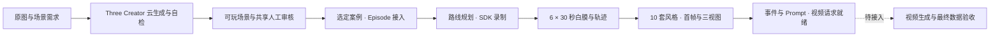

# Three SDK + 数据生产

本分支 `codex/three-sdk-data-production-20260907` 将当前 Three 场景生成、SDK 和
后续 Episode 数据生产整合在一起。以已验证的 Creator 生产契约生成场景，
由独立 Episode 流程规划路线、录制白膜、制作风格素材并准备视频请求。



当前已实现到 **Seedance 提交前**，不包含视频提供商提交或 Creator 交付自动订阅。
SDK 已包含步态连续性和小台阶下坠误触发修复。审核记录沿用现有通用身份。

- [当前文档索引](docs/README.md) · [Three SDK 设计与职责](docs/three-sdk-architecture.md)。
- [统一分支与数据生产说明](docs/three-sdk-data-production.md)：来源、流程、命令、产物和后续衔接。
- [Three SDK](packages/three-world/README.md)：物理、角色、动作、相机与捕获接口。
- [Creator 工具](scripts/three-creator/README.md) · [云生成](scripts/cloud/three-eval-README.md)。
- [Three Episode](scripts/three-episode/README.md)：批量录制、样式、检查点与恢复。

```sh
pnpm install --frozen-lockfile
pnpm three:creator:prebuild --profile three-sdk --output .codex-tmp/three-runtime
```

运行配置、素材和云任务状态均为外部输入；安装依赖或构建 SDK 不会启动数据生产。

## 训练场

`pnpm dev` 编译并打开本地训练场服务，默认入口 `http://127.0.0.1:5175/`。
它使用原始 101 骨人物、48 个运行时动作、19 个载具和三张地图；运行代码由
Three/Rapier SDK 执行，资产、地图与工作台位于 `examples/three-creator/sdk-capabilities`。
这是编译后的固定候选，修改源码后需要重启服务。

项目覆盖配置在 `profiles.json`，界面可导出。只有显式添加 `?debugProfiles=1`
才读取本地调试配置；交付与 Episode 默认不读取这些调试覆盖。
独立资产消费示例位于 `examples/three-creator/training-independent`，不依赖训练园区布局。
执行 `pnpm test:training:browser` 检查工作台，`pnpm test:training:delivery` 执行
至少 180 秒真实浏览器自检、交付与独立 Episode 消费检查（需要 FFmpeg/ffprobe）。
这些本地验证不等同于云端真实生成、13 类完整 Episode 六段录像或外部发布验收。

移植边界与验收进度见 [实施记录](docs/superpowers/plans/2026-09-07-training-ground-migration.md)。
新需求创建独立港区、人物/载具调用、Creator 交付与 Episode 消费的本地证据见
[端到端验收记录](docs/reviews/2026-09-07-training-flow-acceptance.md)。

工作区仅保留 `three-world` 与共享 `camera-collision`；旧 Babylon/Havok 包、演示、
CLI、技能和架构站点已移除。当前测试清单覆盖全部剩余测试，`pnpm build` 构建 Three SDK。
