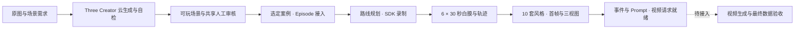

# Three SDK + 数据生产

本分支 `codex/three-sdk-data-production-20260907` 将当前 Three 场景生成、SDK 和
后续 Episode 数据生产整合在一起。以已验证的 Creator 生产契约生成场景，
由独立 Episode 流程规划路线、录制白膜、制作风格素材并准备视频请求。



当前已实现到 **Seedance 提交前**，不包含视频提供商提交或 Creator 交付自动订阅。
SDK 已包含步态连续性和小台阶下坠误触发修复。审核记录沿用现有通用身份。

- [当前文档索引](docs/README.md) · [Three SDK 设计与职责](docs/three-sdk-architecture.md)。
- [统一分支与数据生产说明](docs/three-sdk-data-production.md)：来源、流程、命令、产物和后续衔接。
- [Three SDK](packages/three-world/README.md)：物理、角色、动作、相机与捕获接口。
- [Creator 工具](scripts/three-creator/README.md) · [云生成](scripts/cloud/three-eval-README.md)。
- [Three Episode](scripts/three-episode/README.md)：批量录制、样式、检查点与恢复。

```sh
pnpm install --frozen-lockfile
pnpm three:creator:prebuild --profile three-sdk --output .codex-tmp/three-runtime
```

运行配置、素材和云任务状态均为外部输入；安装依赖或构建 SDK 不会启动数据生产。

旧 packages、脚本和架构站点留待后续单独清理；当前文档不再以旧编号路线图作为设计依据。
