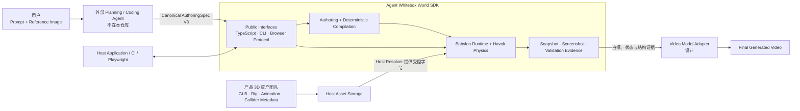
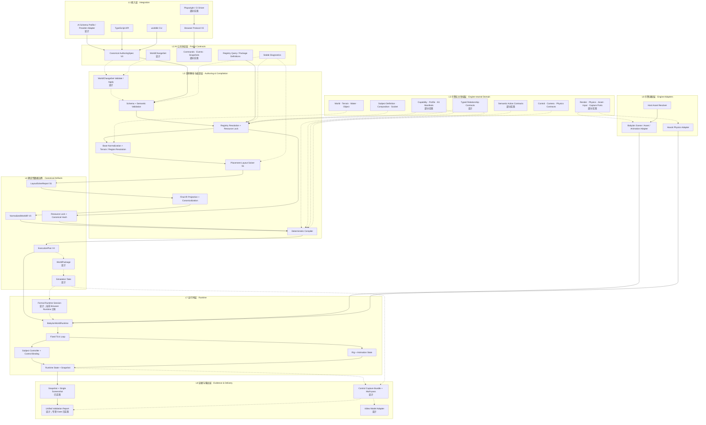
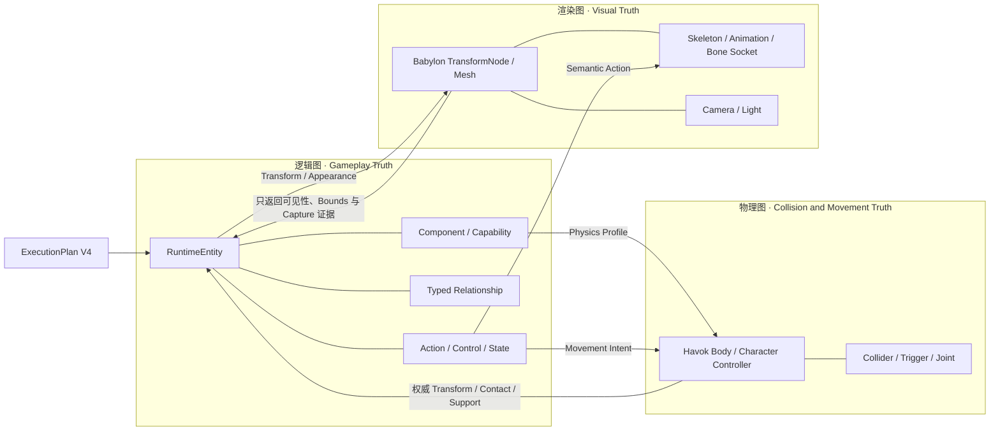
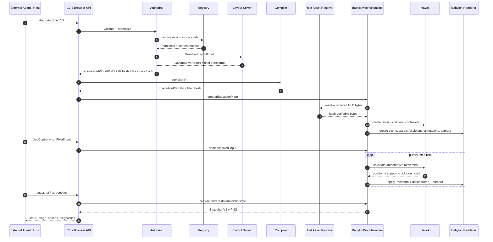
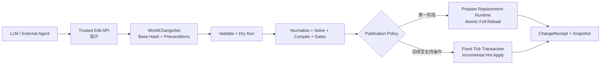

# SDK 分层架构

> 状态：Active。本文是当前重构后 SDK 的分层架构入口。
>
> 当前 Canonical 主链路为：`AuthoringSpec V3 → Placement Solver S1 →
> NormalizedWorldIR V3 → ExecutionPlan V4 → Babylon.js/Havok Runtime`。
>
> 图中状态说明：**已实现**表示已有代码和回归门禁；**部分实现**表示只有窄纵向
> 切片；**设计**表示已有专项方案但尚未形成完整生产实现。

README 中的“核心链路”回答的是数据先后经过哪些步骤；本文回答的是系统由哪些层
组成、各层负责什么、代码依赖可以朝哪个方向流动，以及 Babylon/Havok 被隔离在
哪里。

## 1. 系统上下文

SDK 位于上游 AI、产品资产、3D 游戏引擎和下游视频模型之间。它不负责通用 Agent
推理，也不负责生成最终高质量视觉；它负责把结构化世界意图变成确定、可运行、可
验证的白模世界。



边界含义：

- 外部 Agent 只提交 Canonical JSON，不接触 Babylon、Havok、DOM、Mesh 或物理
  Handle。
- 产品资产由 Host 保存；Runtime 只通过受控 Asset Resolver 获取经过长度、Hash、
  GLB 结构和 Inventory 校验的字节。
- 视频 Adapter 只能消费白模和结构证据，不能重新决定主体数量、位置、碰撞和动作
  结果。
- Babylon/Havok Runtime 是白模世界运行时真相，最终视频不是 Gameplay 真相。

## 2. SDK 分层架构



这不是“上层可以随意调用所有下层”的图。正式依赖必须服从以下方向：

1. 接入层只能通过公共协议进入 SDK。
2. Authoring/Compiler 可以依赖引擎无关领域契约，不能依赖 Babylon/Havok。
3. Runtime 只消费 ExecutionPlan，不重新读取原始 Prompt 或 AuthoringSpec。
4. Babylon/Havok 类型只能留在引擎适配层和 Runtime 实现内部。
5. Snapshot/Capture/Validation 读取运行结果，但不能反向偷偷修改世界真相。

## 3. 每层具体负责什么

| 层 | 核心职责 | 明确不负责 | 当前主要代码 |
|---|---|---|---|
| L1 接入层 | 给人、Agent、Host 和自动化程序提供稳定入口，并把 Provider 能力投影回唯一 Canonical 方言 | 不包含第二套 Provider 私有世界语义 | `scripts/worldkit.ts`、`apps/playground`；AI Schema Provider Adapter 尚在设计 |
| L2 公共协议层 | 定义 AI 可以写什么、Host 可以调用什么、Runtime 返回什么 | 不执行地形、物理或渲染 | `packages/protocol`、`packages/authoring` 的公开 Schema、`packages/runtime-contracts` |
| L3 解析与编译层 | 校验、资源/地形/Region 解析、Constraint 求解、最终 IR 投影和确定性编译 | 不创建 Babylon Scene、Mesh 或 Havok Body | `packages/authoring`、`packages/layout-solver`、`packages/compiler` |
| L4 数据边界 | 保存版本化、可哈希、可验证的世界与操作计划 | 不包含可变运行时 Handle | IR、Resource Lock、ExecutionPlan；WorldPackage/Simulation Take 尚在设计 |
| L5 领域层 | 定义世界、主体、Capability、Relationship、动作、控制、相机、物理和 Runtime Port 的引擎无关语义 | 不决定 Babylon API 的调用方式 | 当前分布在 `packages/authoring`、`subject-composition`、`subject-actions`、`subject-registry` 与 `runtime-contracts`；通用 Capability/Relationship/Port 仍未完成 |
| L6 引擎适配层 | 把 ExecutionPlan 和资产字节翻译为 Babylon/Havok 对象 | 不补写 AI 意图、不修改 Schema | `packages/runtime-babylon` 内的 Asset Resolver、Cache、Visual、Physics Adapter |
| L7 运行时层 | Session、固定 Tick、控制绑定、物理移动、动画状态、相机跟随和 Snapshot | 不重新求解 Placement，不读取 Registry URI | `packages/runtime-babylon`；正式持久 Session 尚在设计 |
| L8 证据层 | 输出截图、状态、Hash、指标和下游模型输入 | 不用视觉结果掩盖结构错误 | 当前 verifier、snapshot/screenshot；Take、Bundle、统一报告待实现 |

`Registry` 是横跨 L2、L3 和 L5 的“乐高零件目录”：公共面提供可发现的 Ref 和
Manifest，Authoring 负责解析并锁定版本，领域定义则描述 Subject、Rig、Animation、
Collider、Capability 和 Profile 的含义。Runtime 不直接查询 Registry，而是消费已经
投影进 ExecutionPlan 的最小描述。

Capability 与 Relationship 是长期扩展性的核心：主体类别不直接决定行为；移动、
骑乘、拖拽、装备和飞行由版本化 Capability/Profile 与类型化 Relationship 表达。
Compiler Core 处理统一依赖、Manifest 和事务协议，不应为“马”“汽车”或“飞龙”持续
增加产品特有分支。

## 4. 逻辑图、渲染图和物理图

Runtime 内部不是一棵万能节点树，而是三套通过明确 Binding 同步的图：



- **逻辑图**决定“世界里是谁、拥有什么能力、与谁是什么关系、当前执行什么动作”。
- **物理图**决定“实际上能移动到哪里、是否碰撞、是否被支撑、Joint 是否成立”。
- **渲染图**决定“如何画出来、骨骼怎样播放、Socket 对应哪个 Bone、相机怎样观察”。

Babylon 父子节点只是 Render Binding 的实现结果，不能代替 `mountedOn`、装备、拖拽
或控制权等 Gameplay Relationship；Havok Joint 也只是关系事务提交后的物理派生物。
关系解除时，逻辑边、视觉挂载、Collider/Joint、Action Lock、Listener 和控制绑定必须
作为一个事务完整回滚，不能只把 Mesh 从父节点摘下来。

## 5. 三个最重要的数据边界

### 5.1 AuthoringSpec V3：AI 的设计意图

由外部 Agent 编写，描述世界、主体、资源引用和 Placement Constraint。它可以表达
“灯塔位于海湾右侧”“人物与水面至少保持两米”等空间意图，不要求 AI 猜出所有最终
坐标。

### 5.2 NormalizedWorldIR V3：确定的内部施工图

由 SDK 生成。默认值、Registry 资源、Resource Lock、最终 Transform、Placement
Provenance、冻结断言和 `layoutSolveReportHash` 已经确定并进入 Canonical Hash。完整
`LayoutSolveReport` 是独立求解证据，不会整体内联到 IR。IR 不包含 Babylon/Havok
类型，也不包含 Host 的资产 URI。

### 5.3 ExecutionPlan V4：Runtime 的施工任务单

由 Compiler 从 IR 生成，只保留 Runtime 创建地形、主体、碰撞体、动画、控制和相机
所需的信息。Runtime 不需要理解 AI 为什么这样设计，只需严格执行并复验冻结断言。

```text
AI 可编辑                    SDK 拥有                         Runtime 只读
AuthoringSpec V3  ───────→  NormalizedWorldIR V3  ───────→  ExecutionPlan V4
空间意图 / Ref / Constraint   最终 Transform / Lock / Hash    运行描述 / Assertion
```

这三个对象不能合并：如果 Runtime 直接消费 AI 原始 JSON，就会被迫在运行时补默认值、
查 Registry 和猜布局，结果无法稳定复现；如果 AI 直接写 ExecutionPlan，又会重新承担
大量底层 3D 坐标和引擎细节。

## 6. 从 JSON 到截图的运行时序列



当前序列已经覆盖单截图和固定输入。未来 `Simulation Take` 会把一段控制时间线变成
版本化制品，`Control Capture Bundle` 会把同一 Tick 的 Neutral Color、Linear Depth、
Semantic、Instance、Normal 等通道绑定到一起；它们目前仍是设计能力。

### 6.1 运行中修改不是直接操作页面

运行中的世界有两类完全不同的修改：

| 修改类型 | 示例 | 协议 | 当前状态 |
|---|---|---|---|
| Runtime 状态操作 | 移动、跳跃、攻击、切换控制目标 | 固定 Tick Command/Intent | Browser V3 部分实现 |
| Authoring 结构修改 | 增加人物、房屋、障碍，删除实体，替换地形 | `WorldChangeSet` | 设计，尚未实现 |

LLM 不直接执行 `scene.add(mesh)`、修改 DOM 或创建 Havok Body。结构修改必须通过受信
Host/Browser Edit API 进入以下链路：



第一阶段采用隔离构建和原子 Full Reload：Replacement Runtime Ready 后才切换句柄，失败
时旧世界继续运行；新 Runtime 默认从 Tick 0 启动，不隐式继承旧位置、速度、Action、
Controller Binding 或 Camera 状态。后续增量热更新只允许有 Transaction Handler 的
Operation/Node Kind，并在固定 Tick Phase Barrier 同时提交逻辑、渲染和物理变化；地形、
全局物理、Major Schema/Profile、插件等变化仍强制 Full Reload。

因此“画面运行时让 LLM 加一个人或一栋房屋”是明确的长期能力，但不属于当前 Browser
Protocol V3。详细事务、状态保留和权限边界见总体设计 §16.4–16.5，实施任务见 P1.6。

## 7. 核心代码包与依赖边界

### 7.1 Canonical 生产方向

| 包 | 架构位置 | 作用 |
|---|---|---|
| `@whitebox-world/protocol` | L2/L4 基础 | Canonical JSON、Hash 等无引擎协议基础 |
| `@whitebox-world/subject-composition` | L5 | Subject Definition、Visual Part、Socket 等组合语义 |
| `@whitebox-world/subject-actions` | L5 | 引擎无关的语义 Action 契约 |
| `@whitebox-world/subject-registry` | L2/L3/L5 | 版本化 Subject、Asset、Rig、Animation、Collider 和 Profile Registry |
| `@whitebox-world/layout-solver` | L3 | 纯函数、确定性的 Placement Constraint 求解 |
| `@whitebox-world/authoring` | L2/L3/L4 | Schema、校验、资源锁定、Normalizer 和 IR |
| `@whitebox-world/runtime-contracts` | L2/L4/L5 | ExecutionPlan、Snapshot 和 Runtime 公共契约 |
| `@whitebox-world/compiler` | L3/L4 | IR → ExecutionPlan 的确定性编译 |
| `@whitebox-world/runtime-babylon` | L6/L7 | Babylon/Havok 运行、资产、骨骼动画、控制、相机和状态 |

### 7.2 Legacy 回归路径

`packages/contracts`、`core`、`world`、`camera`、`physics`、`subjects`、`animation` 和
相关 `testkit` 仍包含旧 Three.js/Rapier 路径，用于旧场景回归与迁移对照。它们不是
Canonical Babylon Runtime 的公共协议，也不能把 Three/Rapier 类型反向带入
Authoring、IR、ExecutionPlan 或 Browser Protocol。

`apps/playground` 在迁移期间同时承载 Canonical Browser Gate 和 Legacy 场景回归，
因此看到它同时依赖两组包并不代表两套 Runtime 可以在 Canonical 协议内混用。

## 8. 横向基础能力

下列能力不属于单独的一层，而是所有层共同遵守的基础规则：

- **Canonical Hash**：IR、Resource Lock、ExecutionPlan 和证据必须可以稳定哈希。
- **Stable Diagnostic**：错误使用稳定 Code、精确 Path 和安全详情，不能泄露 Provider
  私有信息。
- **Security Boundary**：资产字节、外部工具输出和生成结果默认不可信，必须校验后
  才能进入 Runtime。
- **Resource Budget**：顶点、三角面、Collider、资产字节和运行资源都必须受限。
- **Deterministic Tick**：Gameplay 状态由固定 Tick 推进，不能依赖截图时机或浏览器
  帧率。
- **Ownership / Disposal**：Asset、Skeleton、Animation、Collider、Scene 和 Engine
  必须有明确所有者，并支持失败回滚与幂等释放。

## 9. 当前完成边界

截至 2026-08-20，以下窄纵向切片已经运行并进入回归：

- Canonical Authoring V3 → IR V3 → ExecutionPlan V4；
- Placement Solver S1 的八种 Constraint 和海湾 Golden 场景；
- Babylon/Havok Heightfield、障碍、水域、第三人称和多主体控制；
- Golden Humanoid GLB、17 根解剖语义骨骼、独立 Skeleton Root、Bone Socket 与 `idle/walk/run/jump`；
- CLI/Browser V3 的校验、编译、运行、控制、Snapshot 和单截图；
- Canonical、Rigged Subject 和 Placement Layout 三条真实 Chromium Gate。

以下能力不能从图中误读为已经完成：

- 通用 Relationship、骑乘、装备、拖拽、Joint 和事务回滚；
- 通用 Semantic Action、攻击、游泳、飞行、车辆和 NPC；
- 任意产品资产自动 Retarget、Compound Collider、LOD 和更多拓扑；
- 完整 WorldPackage、WorldChangeSet、持久 Runtime Session；
- Simulation Take、Control Capture Bundle、多 Pass 和视频序列；
- 统一 Validation Profile/Report 与生产 Video Model Adapter；
- 室内、洞穴、Overhang、联网和完整 Gameplay。

最新完成度、优先级和验收证据以
[SDK 重构总进度与 Backlog](18-refactor-progress-and-backlog.md)为准。

## 10. 相关设计文档

- [AI-first LEGO 游戏 SDK 总体设计](superpowers/specs/2026-08-17-ai-first-lego-game-sdk-design.md)
- [可扩展 Subject Authoring 设计](superpowers/specs/2026-08-19-extensible-subject-authoring-design.md)
- [Placement Constraint 与 Layout Solver 设计](superpowers/specs/2026-08-19-placement-constraint-layout-solver-design.md)
- [Simulation Take 与 Control Capture 设计](superpowers/specs/2026-08-19-simulation-take-control-capture-design.md)
- [World Validation Report 与质量门禁设计](superpowers/specs/2026-08-19-world-validation-report-and-quality-gates-design.md)
- [ADR-0006：AuthoringSpec 编译架构与 Babylon Runtime](../decisions/0006-authoring-spec-compiler-architecture.md)
