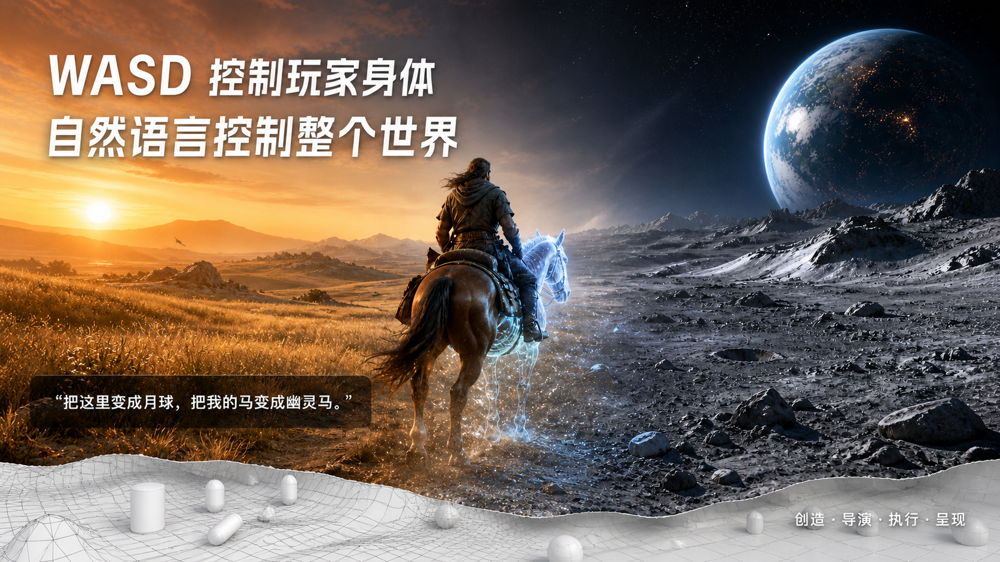
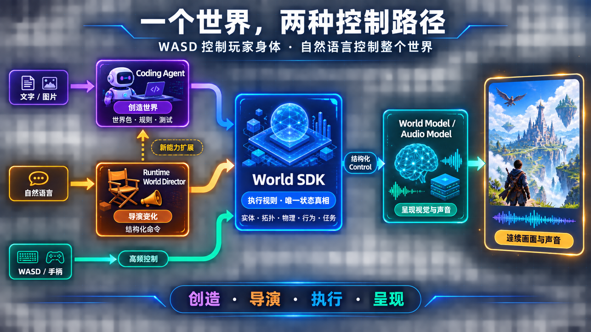
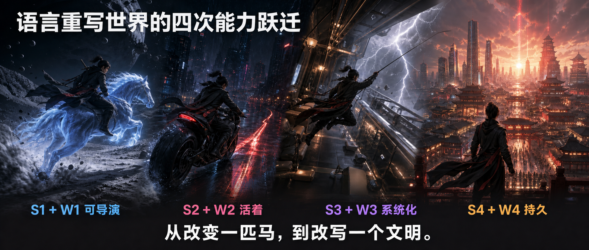
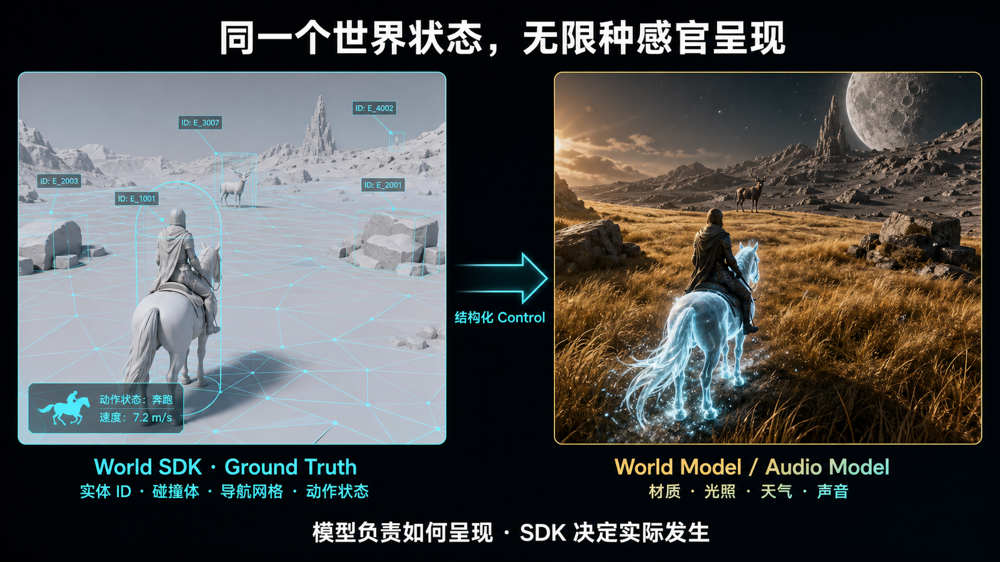

# 能力分层与体验路线

## 1. 产品目标

我们的目标不是只生成白膜场景，而是逐步达到 AAA 城市游戏的复杂度，同时打破传统游戏内容和规则被预先固定的边界：

> WASD 控制玩家身体，自然语言控制整个世界。

这个世界由四个核心系统共同完成：

- **Coding Agent：创造世界。** 根据用户的文字或图片，在沙箱中生成场景、规则、世界自动化脚本和测试。它主要工作在创作期；运行期只在现有 SDK 命令无法表达新规则时，异步生成经验证的扩展，不进入逐帧链路。
- **World SDK：执行世界。** 维护几何拓扑、实体身份、空间关系、物理碰撞、行为和任务状态，是世界唯一的确定性状态真相（Ground Truth）。
- **Runtime World Director：导演世界。** 理解运行期的自然语言，读取 SDK 状态，将意图编译成可校验、可授权、可回放的命令计划，再由 SDK 执行。
- **World Model / Audio Model：呈现世界。** 以 SDK 输出的相机、深度、语义实体、Bounding Box、动作、材质意图和逻辑状态作为结构化 Control / Condition 信号，生成美观、连续且与世界状态一致的视觉与声音。

### 1.1 系统关系

```text
创作期
[用户文字 / 图片]
          ↓
    [Coding Agent] ──生成世界包、规则与测试──> [沙箱校验]
                                                        ↓
                                                   [World SDK]

运行期
[玩家 WASD / 手柄] ──高频输入─────────────> [World SDK]
[玩家自然语言] ──> [Runtime World Director] ──结构化命令─> [World SDK]
                                  │                         │
                                  └─新能力请求─> [Coding Agent 沙箱]
                                                               │
                                              验证后扩展───────┘

[World SDK] ──结构化状态 / Control 信号──> [World Model / Audio Model]
                                                         │
                                                         ↓
                                              [连续画面与声音]
```

四者的边界可以用四句话概括：

1. Coding Agent 扩展“世界能做什么”。
2. Runtime World Director 决定“用户此刻想让世界怎么变”。
3. World SDK 决定“世界实际发生了什么”。
4. World Model / Audio Model 决定“它应该如何被看见和听见”。

## 2. World Model 原子能力维度

美观、时空连续性和对 SDK 状态的忠实性，是所有等级的质量底线。在此前提下，World Model 沿四个独立维度增长：

| 维度 | 0 | 1 | 2 | 3 | 4 |
|---|---|---|---|---|---|
| 场景结构复杂度 | 开阔室外 | 城市街景、多个客体 | 室内、多房间 | 室内外连续、多层空间 | 完整城市与流式世界 |
| 镜头变化速度 | 静止或缓慢观察 | 步行、奔跑 | 载具、追逐、快速旋转 | FPS 甩枪等极快变化 | 同时覆盖全速度并无缝切换 |
| 世界维持时长 | 1 分钟以内 | 1–10 分钟 | 10–60 分钟 | 小时级稳定 | 跨会话持久化维持 |
| 状态遵循能力 | 保持整体风格 | 保持地形、镜头和大轮廓 | 保持实体身份、数量和动作 | 局部变化不破坏其他区域 | 多视角、跨会话保持同一世界 |

**评测原则：** 四个维度必须解耦评测。例如，FPS 镜头与高速运动先在简单竞技场验证；小时级一致性先在慢速场景验证。不在一次评测中同时抬高所有难度。

## 3. World SDK 原子能力维度

自由性与确定性是 SDK 的设计底线。在此前提下，SDK 沿五个独立维度增长：

| 维度 | 0 | 1 | 2 | 3 | 4 |
|---|---|---|---|---|---|
| 主体与镜头 | 第三人称人形 | 第一/第三人称人形 | 动物、汽车等单体主体 | 骑乘、组合载具等复合主体 | 飞行、特殊镜头、多主体与控制权切换 |
| 世界复杂度 | 开阔室外 | 更多标志物与客体 | 城市街区和道路 | 室内、多房间、多层 | 室内外连续、完整城市与流式加载 |
| LLM 可控制能力 | 查询与观察世界 | 修改外观与实体参数 | 位置、尺度、出现/消失与基础物理 | 动作、寻路、行为与 NPC AI | 多步任务、关系、规则与世界级编排 |
| 物理与因果一致性 | 静态碰撞、重力、角色接地与确定性 Transform | Trigger、简单刚体与可调物理参数 | 动态破坏、简化流体与状态传播 | 复杂系统联动，例如停电导致安防失效 | 跨区域因果链、持久状态与逻辑守恒 |
| 游戏性复杂度 | 移动与碰撞 | Trigger 与基础交互 | 道具、车辆、任务与目标 | 战斗、潜行、阵营和动态事件 | 联机、经济、长期状态与社会系统 |

表中的 `0` 只表示某一原子维度的工程起点，不构成组合交付等级。

**横向底座：** Coding Agent 贯穿所有维度。每增加一级世界能力，都必须能被 Agent 以可审计的代码或声明式规格定义、检查、沙箱重建和自动化测试。Runtime World Director 产生的每一次变化也必须可授权、可记录、可回放，必要时可撤销。

## 4. 组合能力分层

原子维度用于工程评测；组合等级用于定义最终能交付的完整产品体验。组合等级不是原子维度的简单取最小值，而是为具体体验选择的最小可交付能力包。

### 4.1 World Model 组合等级

| 等级 | 场景 | 镜头 | 时长 | 状态遵循 |
|---|---|---|---|---|
| W1 开阔世界 | 室外、少量主体 | 步行 / 奔跑 | 数分钟 | 地形、主体和镜头稳定 |
| W2 密集空间 | 城市街景、多客体、基础室内 | 奔跑 / 载具 | 10–30 分钟 | 多实体身份和局部变化稳定 |
| W3 AAA 动作世界 | 室内外、多层、大量角色 | 载具 / 战斗 / FPS | 约一小时 | 极速运动下仍服从实体与动作状态 |
| W4 持久世界 | 完整城市与流式区域 | 全速度无缝切换 | 小时级至跨会话 | 多视角共享长期身份、外观和世界记忆 |

### 4.2 World SDK 组合等级

| 等级 | 主体与镜头 | 世界 | LLM 控制 | 物理与游戏性 |
|---|---|---|---|---|
| S1 可导演世界 | 人形与首批骑乘主体 | 开阔世界 | 外观、参数、Transform 与基础物理 | 基础碰撞、刚体、Trigger 与基础交互 |
| S2 活着的空间 | 人形、车辆、复合主体 | 城市与基础室内 | NPC 动作、寻路与行为 | 状态传播、任务、载具与角色交互 |
| S3 系统化游戏 | 多主体与专用镜头 | 连续多层城区 | 多步事件与任务即兴编排 | 复杂系统联动、战斗、潜行与阵营 |
| S4 持久世界 | 多玩家、多控制源 | 完整流式城市 | 长期关系、规则与多 Director 协作 | 全局因果链、联机、经济与持久社会系统 |

## 5. 分阶段体验路线

### P1：月球幽灵骑士 —— 法则重构

**组合等级：S1 + W1**

玩家骑马疾驰在夕阳下的金黄草原，对世界说：“把这里变成月球，把我的马变成幽灵马，再降低重力。”玩家的操控始终不中断：草原从近处向远方连续转化为月壤，马匹化为散发星尘的半透明骨马，玩家随后在低重力下跃过陨石坑。

**关键突破：** 验证运行中对场景外观、实体材质和物理参数的秒级重构，以及重构过程中的无闪烁时空连续性。

### P2：雨夜赛博逃生 —— 世界即兴响应

**组合等级：S2 + W2**

雨夜的赛博街区里，玩家骑着重型摩托躲避警用无人机追捕。面对死胡同，玩家喊道：“让整个街区停电，只保留通往地下酒吧的红色应急指示。”电网熄灭，广告牌、摄像头和安防门禁按各自的供电关系相继失效，NPC 和车流对停电作出反应。玩家沿唯一的红光路径冲向地下酒吧。

**关键突破：** 自然语言不再只是调参工具，而是实时生成关卡解法；世界变化遵守电力、安防、交通和 NPC 行为之间的因果关系。

### P3：城堡前的世界级浪漫 —— 角色与群体编排

**组合等级：S2 + W2**

在游乐园的夜景中，玩家与一位具有独立记忆和性格的数字伙伴散步。玩家说：“去城堡前和我跳一支舞，让周围的人为我们鼓掌。”伙伴寻路到广场，面向玩家伸手邀舞；周围 NPC 暂停原有行为，自然围拢、欢呼。玩家再说“下雪吧”，烟花和雪花便在舞步不被打断的情况下覆盖广场。

**关键突破：** 验证双人动作和 IK、角色记忆、寻路、群体行为以及天气系统的自然语言联合编排。

### P4：30,000 英尺高空劫案 —— 动态沙盒与任务即兴流

**组合等级：S3 + W3**

玩家潜入一列穿越云层的巨型空中列车，试图盗取机密数据库。警报触发后，玩家没有重启关卡，而是说：“让右侧引擎遭受雷击，让列车向右倾斜。”右侧动力失效，列车姿态、物体受力、守卫站立和玩家移动同时变化。玩家利用抓钩在倾斜车厢中穿行，在混乱中夺走数据。

**关键突破：** 玩家可以用语言改变任务条件，并借助可重现的物理与 AI 连锁反应创造自己的破局方式。

### P5：凌晨四点的第九区 —— 活着的 AAA 连续城市

**组合等级：S3 + W3**

玩家从高层公寓出发，无加载地滑翔至街道，再进入地铁、酒吧、地下设施和公司大楼。帮派、警察、交通和任务持续运行。玩家俯瞰街区，说：“让码头帮派今晚叛乱，把废弃汽修厂改成我的装甲基地。”叛乱从已有的人物关系中发生；汽修厂立即开始分阶段改造，并在之后的任务中持续存在。

**关键突破：** 达到高密度实体、无缝室内外和流式加载下的城市级持续模拟，让语言指令变成城市历史的一部分。

### P6：文明级重写·赛博长安 —— 持久平行世界

**组合等级：S4 + W4**

玩家站在一座已经与朋友共同生活数百小时的赛博都市顶端，对世界说：“从下一个街区开始，把城市重构为盛唐长安，但保留所有人的记忆、敌对关系和正在发生的任务。”高楼、道路、交通和装备体系在流式区域中逐步重构为长安，但角色身份、记忆、关系、资产和任务因果保持连续。其他玩家从地图另一端登录时，看到的是同一个被共同改写的世界。

**关键突破：** 实现跨区域、跨会话、多玩家的概念级重构，同时保留长期世界的逻辑与社会连续性。

## 6. 路线判断标准

每个阶段只有在定性产品原则与定量工程指标同时达成时，才算成功交付。

### 6.1 三大定性原则

1. **直观操控性：** 玩家可以以低延迟直接操控主体，而不是观看生成视频。
2. **即时导演性：** 玩家可以在游玩过程中用自然语言改变实体、规则和正在发生的事件。
3. **状态真伪一致性：** 确定性状态（SDK Ground Truth）与视觉/听觉表现（World Model / Audio Model）严格对齐。

### 6.2 工程与体验指标

| 指标 | 目标 | 说明 |
|---|---|---|
| 操控延迟 | WASD / 手柄输入到 SDK 状态更新 P95 `≤ 50 ms` | 该指标独立于自然语言与生成模型链路 |
| Director 响应 | 已有 SDK API 范围内，意图确认与简单状态修改 P95 `≤ 2 s` | 复杂重构必须先返回可见计划并渐进执行，不得阻断玩家移动 |
| 交互帧率 | W1–W2 不低于 `30 fps`；W3–W4 高速游玩目标 `≥ 60 fps` | 帧率与运动到画面延迟需分别评估 |
| 意图编译忠实度 | 版本化评测集上语义通过率 `≥ 90%` | 所有命令必须 `100%` 通过 Schema、权限与参数安全校验后才可执行 |
| 状态对齐 | 关键实体的身份、数量、位置、动作与可见性一致率 `≥ 95%` | 对每个组合等级建立固定场景与指令集 |
| 长时漂移 | 连续游玩 30 分钟后，关键实体异常消失或身份错置率 `< 5%` | W4 额外要求跨会话和多视角的同一性校验 |

上述指标是产品验收目标，不代表当前系统已经达成。每一个指标都需要绑定版本、硬件、分辨率、测试场景和统计口径。

## 7. 图像化表达方案

对外讲述时，使用 **3 张主图 + 1 张技术图**，而不是把所有信息挤在一张大流程图中。下面四张成图的文字与技术标注均由 ImageGen 直接生成在图片像素中，没有使用后期叠字或额外绘制。

### 图 1：产品愿景主视觉



**画面：** 一个正在骑马前进的玩家位于画面中央，左侧是夕阳草原，右侧在不切镜的情况下渐变为月球，棕马渐变为幽灵马。地表下隐约透出白膜网格、碰撞体和导航路径，表达“确定性世界托住生成画面”。

**图内文案：**

> WASD 控制玩家身体。自然语言控制整个世界。

**作用：** 先让人在三秒内理解产品的独特价值，不承担架构解释。

### 图 2：四层系统关系图



**画面：** 以 World SDK 为中央状态核心，Coding Agent 位于左上方输入世界包，Runtime World Director 位于左下方输入运行时命令，WASD 从玩家直接进入 SDK，World Model / Audio Model 位于右侧消费结构化状态。

**图中只保留四个动词：**

> 创造 · 导演 · 执行 · 呈现

**作用：** 讲清责任边界和数据流，尤其是 WASD 与自然语言两条控制路径如何汇入同一个 World SDK Ground Truth。

### 图 3：能力跃迁长卷



**画面：** 一张横向长图分为四个无缝衔接的世界：月球幽灵骑士、雨夜赛博街区、高空列车劫案、赛博长安持久世界。玩家角色在四个画面中保持同一身份，表达能力从局部改变增长到文明级重写。

**图内文案：**

> 可导演 → 活着 → 系统化 → 持久。从改变一匹马，到改写一个文明。

**作用：** 将 S1/W1 到 S4/W4 的抽象能力变成可记忆的产品旅程。

### 图 4：同一状态，两种呈现



**画面：** 同一相机下的左右分屏。左侧是 SDK 白膜世界，展示实体 ID、Bounding Box、导航网格、碰撞体和动作状态；右侧是 World Model 生成的高保真画面。两侧的实体、姿态、遮挡和镜头完全对齐。

**图内文案：**

> 同一个世界状态，无限种感官呈现。

**作用：** 专门向 World Model 团队解释 SDK Ground Truth 与生成式渲染的契约。

四张图的完整图内文案与生成提示记录见 [能力路线视觉资产](assets/capability-roadmap/README.md)。
