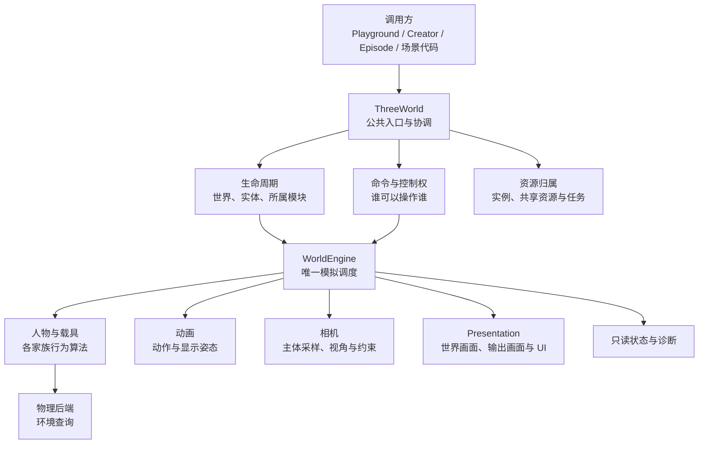

# Whitebox 项目底层架构与重构规划

本文面向 Whitebox 项目的开发、测试和技术评审人员，说明项目各部分的职责、现有实现、
待核查事项及重构顺序。目标是在保持现有玩法、画面和操作体验的前提下，减少模块之间的依赖，
使功能扩展、问题定位和维护更容易。

版本依据：文中状态来自编写时的本地测试项目 `sdk-lifecycle-lab-20260916`，提交 `ca51505d`
及当时未提交的改动。该记录是设计讨论的依据，不代表已合入共享分支或已通过完整验收。
“已有实现”“待核查事项”“目标设计”分别表述；实际交付须附对应版本的测试结果。

## 1. 重构目标与设计原则

**由同一套 SDK 执行世界模拟，内容包提供模型与参数，创作和生产工具调用 SDK 完成各自工作。
每项运行状态和资源都应有明确的管理模块。**

重构应带来以下开发收益：

- 在已有接口支持的范围内，新增车、船或生物主要涉及模型、配置和对应行为模块。
- 在骨架、尺寸和能力接口兼容的前提下，更换人物模型、动作或资产来源无需重写输入、物理和交互系统。
- 调整某种相机策略，不修改载具的姿态与物理；调整载具物理，也不直接写相机坐标。
- Playground 中验证过的能力，Creator 创建的世界和 Episode 录制使用同一份实现。
- 暂停、重置、删除实体、退出场景时，状态、任务、绑定和资源有明确处理规则。
- 性能问题、操作失败和录制异常能够关联到具体模块、运行状态与源码版本。

设计原则是复用已有能力、明确模块职责、通过组合接入功能，并保持更新阶段和执行顺序稳定。
仅在发现重复逻辑、越界访问或难以维护的依赖时调整实现。重构完成度以职责清晰度、接口一致性
和行为验证结果衡量。

为便于阅读，本文使用以下术语：

| 术语 | 本文含义 |
| --- | --- |
| 运行时 | 在世界运行期间执行输入、物理、动画、相机和渲染等工作的代码 |
| 实体与主体 | 实体是世界中被登记管理的对象；主体通常指当前被操控或被相机跟随的人物、载具或生物 |
| 固定步 | 按固定模拟时长执行一次状态更新；一帧画面可能对应零次或多次固定步 |
| 显示采样 | 根据模拟状态生成用于当前画面的姿态；临时显示处理不得改变模拟结果 |
| 资源归属 | 明确哪个模块负责持有、共享和释放模型、材质、监听器等资源 |
| 宿主与调用方 | 使用 SDK 的应用或工具，例如 Playground、Creator 和 Episode |
| 接口约定与 schema | 接口约定定义参数、状态和结果；schema 是数据结构及其校验规则 |
| 版本标识 | 用于追溯源码、构建产物或任务的提交号、哈希或唯一编号 |

## 2. 项目整体：运行时、内容、工具与生产

### 2.1 项目组成

```text
完整项目
├─ 核心运行时：世界、实体、输入、运动、物理、动画、相机、展示
├─ 内容与资源：模型、动作、环境、预设参数、加载与实例绑定
├─ 创作与调试：Creator、Playground、能力发现、配置编辑与诊断
└─ 生产与交付：编译、录制、视频处理、云请求、产物与审核
```

创作、调试和生产流程共同使用 SDK 提供的世界模拟。预设内容提供模型、配置与场景组装，
由 SDK 统一调度。生命周期管理负责对象的创建、启停和清理；编译、录制和云端任务仍由各自工具负责。

### 2.2 已有包边界与最终职责

| 当前目录 | 最终应负责 | 不应承担 |
| --- | --- | --- |
| `packages/three-world` | 公共接口约定、世界运行、主体行为、物理、动画、相机和展示 | 云任务调度、编辑器页面逻辑、特定生产批次 |
| `packages/camera-collision` | 相机碰撞求解，供相机所有者使用 | 玩家控制、世界时钟、其他载具碰撞算法 |
| `packages/preset-content` | 人物/载具/生物/环境内容、模型、标定和预设参数 | 第二套运行时或输入系统 |
| `packages/creator-host` | Agent 能力发现、工具、编译、浏览器桥接、自检与交付 | 重新实现 SDK 的物理、动画或镜头 |
| `apps/sdk-playground` | 开发、编辑、检查与交互标定 | 只有测试页面才生效的核心玩法规则 |
| `packages/episode-pipeline` | 录制来源检查、动作计划、录制、视频准备、恢复与生产报告 | 通过另一套模拟产生与试玩不同的行为 |
| `packages/browser-capture` | 浏览器启动与视频编码基础能力 | 具体世界的玩法、能力判定和生成服务策略 |
| `packages/cloud-generation-client` | 请求、查询、轮询、取消与产物传输 | 世界行为或 Creator/Episode 的完整业务流程 |
| `apps/creator-cloud` | 云端任务、运行时打包、恢复与评测发布 | 浏览器内的帧更新或碰撞算法 |
| `apps/creator-evaluation-site` | 交付作品浏览与共享审核界面 | 更改被审核产物的版本标识或替代运行时验收 |
| 根目录 `scripts/` | 跨包验证、维护与集成流程 | 承载本应属于某个包的生产核心逻辑 |

上述包划分已基本建立。后续重点是核对包内部职责和跨包调用是否符合约定，
并针对发现的问题调整实现。现有依赖说明见 [工作区职责](workspace-packages.md)。

依赖规则：SDK 不依赖应用；内容依赖 SDK；宿主通过公开导出使用 SDK 与公共基础能力。
跨包直接依赖应显式声明，测试专用依赖与生产依赖分开。事件通信也应明确发送方、接收方和数据结构。

## 3. SDK 内部职责图

下图展示世界运行时各模块如何配合，包括生命周期、人物与载具、物理、动画、相机和画面展示。
创作工具、预设内容、录制与云端任务的项目职责见第 2 节。
箭头表示主要协作关系；实际帧内执行顺序见第 6 节。图中的职责可以由已有模块共同实现。



资源管理为相关运行模块提供资源，展示和诊断将结果提供给调用方。为保持图示清晰，这些跨模块连线未全部绘出。
实体管理、导航和交互的具体职责见第 4 节。

## 4. 模块职责与重构要求

以下各节列出已有实现、目标职责、待核查事项和验收标准。待核查事项用于指导后续代码审查；
只有取得源码或测试证据后，才能将其列为已确认的问题。

### 4.1 公共接口约定与世界入口

**已有实现：** `contracts.ts`、`index.ts` 和 `ThreeWorld`，以及 `createWorld/createHumanoidWorld` 等入口。
`createHumanoidWorld` 组合人物能力，并复用 `createWorld` 的世界实现。

**目标职责：** 调用方知道如何创建、操作、读取和结束一个世界。公开命令、参数单位、成功/失败语义明确；
模块通过执行职责所需的少量方法或数据协作，减少对整个运行时对象的依赖。

**待核查事项：** 公共接口、Host schema、能力说明与实际执行是否一致；是否有宿主导入内部路径；
入口是否包含应由特定运动类别处理的玩法判断。提取代码应解决明确的职责或依赖问题。

**验收标准：** 普通主体、完整人物、Creator 生成项目和 Episode 都通过公开入口工作，错误语义一致。

### 4.2 世界调度与时间

**已有实现：** `WorldEngine` 的固定步、显示采样，`WorldLifecycle` 的实时帧调度，以及 Episode 时钟接管。

**目标职责：** 同一个世界只有一个模拟时间来源，固定步、输入处理、动画和相机更新顺序明确。
浏览器刷新率、暂停恢复、手动推进与录制不能创建互相竞争的模拟循环。

**待核查事项：** 是否存在模块按系统时间独立推进玩法；显示回调是否反过来改模拟；一次按键触发的跳跃等输入是否被多个固定步重复执行。
实例停用时的局部时间可以由同一模拟时间派生，不另起循环。

**验收标准：** 相同输入和模拟步得到相同状态；不同显示帧率、暂停恢复、录制接管不改变玩法。

### 4.3 场景、实体与空间关系

**已有实现：** 世界的实体登记、引擎的运行绑定、父子关系、用于 reset 的初始状态记录，以及移除后的对象保留与清理逻辑。地图和环境定义由相关模块管理。

**目标职责：** 清楚区分“实体身份”“Three 显示对象”“物理绑定”“行为能力”“资产实例”。
场景负责组装对象并确定归属，实体按需绑定行为、物理和显示能力。

**待核查事项：** 公共登记与内部绑定是否一致；实体 ID 重用时旧引用是否失效；父子变换、单位和坐标空间是否明确；
动态增加/移除对象后，物理、导航、交互和相机是否获得需要的更新。

**验收标准：** 创建、挂接、重定位、移除、重置与切场景后，实体标识、世界坐标、碰撞和可见状态符合接口约定。
普通装饰 Three 对象无需强制全部注册为 SDK 实体。

### 4.4 生命周期与任务有效性

**已有实现：** 启停调度已经提取到 `world-lifecycle.ts`，任务取消登记在 `world-task-scopes.ts`；
已有实体注册、初始状态恢复、资源释放和模块回调。编写时的工作区还包含实体启停和永久销毁改动，验收状态须以对应版本的测试报告为准。

**目标职责：** 世界、实体、所属模块纳入同一套存活与归属规则，分别执行自己的清理。
世界暂停保留实体；隐藏只改变可见性；停用暂停约定范围内的运行活动；移除与永久销毁分别明确 reset 能否恢复。

**待核查事项：** 重复启停/销毁、任务取消、迟到结果、异常清理、共享资源和骑乘关联。
相机由世界管理。移除跟随目标时应解除或切换绑定，保留世界相机。

**验收标准：** 没有重复模拟循环；过期任务结果不能重新绑定已失效实体；失效绑定得到解除，共享资源按归属释放。
一项清理失败后仍执行其他独立清理，并报告错误。模块优先复用现有回调，详细约定见 [生命周期维护边界](world-lifecycle-maintenance.md)。

### 4.5 输入、命令与控制权

**已有实现：** 输入路由、键盘/指针处理、控制主体、世界命令和 `ActorResources` 通道占用。

**目标职责：** 区分原始输入、操作意图、执行权限和最终结果。
玩家、导航、脚本、交互和录制向既有控制器提交意图，同一通道不能被多个来源无规则地覆盖。

**待核查事项：** UI 焦点和观察镜头的鼠标操作是否意外中断角色控制；输入提示、按键重绑和录制是否使用一致的操作定义；
操控对象切换和控制权释放是否清掉旧输入；接受命令是否被错误当作动作已完成。

**验收标准：** 徒步、上下载具、观察镜头、表单输入、失焦恢复和脚本接管均无卡键、双重驱动或失控。

### 4.6 人物、载具与生物行为

**已有实现：** `humanoid-runtime/motion-families/` 已按 human、ground-vehicle、surface-vessel、
aircraft、flying-creature、space、underwater 等运动类别组织；预设模型与配置在内容包。

**目标职责：** 外形、运动能力、控制主体和乘骑关系分别表达。每个家族拥有自己的算法，
复用公共输入、环境查询、资源与时间边界。新增同类别载具优先增加配置和模型；确有新行为再加算法。

**待核查事项：** 是否通过模型名称隐式选择物理算法；特定运动类别的规则是否散落在相机/UI/世界入口；
可复用的查询是否重复实现。共享能力只在语义一致时提取。

**验收标准：** 各运动类别加速、减速、滑行、转向、坡面、越障、起降/入水等表现与基准一致。
独轮车、坦克等特定载具的问题应在对应实现中处理，相关修复不得改变其他载具的物理行为。

### 4.7 物理、碰撞与环境查询

**已有实现：** `physics.ts`、物理绑定与查询适配、人物运行时环境查询、共享 Rapier 使用边界。

**目标职责：** 物理负责碰撞与支撑等事实，对应控制器据此实现行为，场景提供碰撞和环境描述。
相机可以查询环境，但不拥有人物或载具的物理步。

**待核查事项：** 同一对象是否重复生成碰撞/刚体；查询缓存何时失效；可见模型、碰撞几何和导航数据是否错位；
不同调用方是否各维护一份互相漂移的地面/水面判断。

**验收标准：** 地面、坡侧、悬崖、低障碍、移动支撑和水体等代表场景对照通过；查询次数和耗时无明显退步。
保持求解器、碰撞尺寸与物理参数不变；算法或参数调整作为独立行为变更评审。

### 4.8 动画、骨架与显示采样

**已有实现：** 人物动作与绑定、资产动画、移动动画选择，以及运行时显示采样。

**目标职责：** 动作选择、动画播放、骨架绑定与最终显示姿态职责明确。
明确角色根变换由谁写入、何时采样；多个角色可共享源资源，但各实例的姿态互不影响。

**待核查事项：** 动画是否重复推进；物理与动画是否抢写根位置；显示插值是否写回模拟；
骑乘姿态、助跑等状态输入是否在转接时丢失；骨架和材质释放是否影响其他存活实例。

**验收标准：** 步行、跑步、跳落、翼装助跑、上下坐骑及静态乘坐姿态对照一致，无浮空、拉伸和帧率相关抖动。
动画基准包括：载具上的人物保持既定静态乘坐姿态，翼装助跑保留跑步动画，载具自身的机械或运动动画正常运行。

### 4.9 相机系统

**已有实现：** `camera/` 已拆出主体适配、输入基准、视角策略、构图、约束、显示采样和生命周期处理。
相机碰撞求解另有公共包。

**目标职责：** 主体接口提供位置、朝向、速度以及控制主体的标识；相机模块计算镜头位置、方向和参数，并由相机控制器统一提交。
世界观察、实时取景和录制复用同一状态来源，不抢写游戏相机。

**待核查事项：** 模块是否仍依赖整个人物运行时；主体切换/重定位能否失效旧状态；
配置、显示采样和物理步的顺序是否一致；观察是否意外推进碰撞或模拟。

**验收标准：** 第一/第三人称、越肩、坡侧、主体切换、上下载具、世界观察及录制对照通过。
保持已建立的模块边界。主体数据、更新时机或碰撞接口发生变化时，执行对应相机回归。

### 4.10 交互、导航与行为任务

**已有实现：** 交互接口约定与关系、导航/路径查询、移动目标、动作请求及能力通道仲裁。

**目标职责：** 交互决定资格、目标和动作结果；导航输出行进意图，控制器和物理执行真实移动。
任务有明确的开始、进行、完成、失败、取消结果；退出清理接入生命周期。

**待核查事项：** 导航是否直接瞬移或绕过碰撞；上车/携带/攀爬和导航是否争抢同一控制通道；
目标删除、地图替换或停用后是否留下任务；失败反馈是否与实际条件一致。

**验收标准：** 到达、不可达、被阻挡、取消、目标失效以及交互中断都有正确结果，没有永久占用。
交互资格和行为规则由交互模块负责，取消与清理由生命周期规则协调。通用 AI 行为树平台不在当前范围内。

### 4.11 资产、预设内容与实例

**已有实现：** `assets.ts`、`WorldAssets`、模型加载、预设目录及人物动作资源。完整资产库的接口与交付方案尚待确定。

**目标职责：** 资产库将来负责发现、版本与交付；加载器负责把数据变成可用资源；
场景组装实例；运行模块绑定能力；资源所有者按共享与独占关系释放。
模型外形、运动配置、骨架映射与玩法能力不能混成一个不可分割的资产类型。

**待核查事项：** 业务代码是否硬编码目录和文件名；加载与实例创建是否混在控制器里；
取消、失败和共享引用是否正确；预设内容是否自行实现运行逻辑；浏览器和 Node 加载接口约定是否一致。

**验收标准：** 同一模型多实例、换模型、共享材质/几何、失败重试和实例销毁不相互影响状态或误释放。
**分批加载和预加载暂不纳入当前计划。** 无贴图资源交付、模型与动作分离作为独立优化评估。
缓存、打包和流式加载方案在资产库接口明确后设计。

### 4.12 渲染展示、UI 与世界模型画面

**已有实现：** `ThreePresentation` 已有世界画面、模型输入/输出和 DOM UI 的分离边界；
Playground 提供观察、调试与编辑界面。外部世界模型服务的接入状态需另行确认。

**目标职责：** 纯世界画面可作为模型输入；返回画面与其真实源帧对应后，叠加对应 UI。
发送给世界模型的画面不包含 UI；调试线、摄像机模型和碰撞体属于明确可控的辅助显示。

**待核查事项：** UI 是否读取错误时刻的状态；取景预览是否额外推进动画；
多个面板是否争抢焦点；显示临时变换是否被还原；视频/画布大小和画面捕获约定是否一致。

**验收标准：** 游戏操控继续有效，预览与主画面来源一致，纯画面无意外 UI；
reset 或输出切换后旧帧标识失效；模型输出与 UI 通过实际源帧标识关联。

### 4.13 配置、状态读取与诊断

**已有实现：** `config/` 保存默认值、字段与解析；运行时有配置、相机、主体和性能观察接口。

**目标职责：** 默认配置、每世界生效配置和当前运行状态分清；字段有单位与适用范围。
同一能力的表单、schema、导出和执行共享定义；读取状态不能改变世界。

**待核查事项：** 是否存在多份默认值、保存了但未生效的字段、角度/弧度混用；
诊断是否在读取状态时额外执行模拟；错误是否只有码而没有对象、条件和版本。

**验收标准：** 配置往返一致，修改只影响目标世界，SDK/Host/Playground 对字段解释一致。
辅助诊断失败应局部处理。只有影响执行或必需交付证据的问题才阻止流程继续。

### 4.14 创作、编译、录制与交付工具链

**已有实现：** Creator 已分 discovery/compiler/browser/schema/tools；Episode 已分 source/planning/capture/workflow 等；
浏览器采集和云传输有独立公共包，云任务与审核站点也已分应用。

**目标职责：** 工具发现真实能力并使用 SDK；编译产生可追溯运行时；录制使用相同输入和模拟规则；
云请求、重试、产物和审核能够追溯到对应的源码版本、运行时版本和任务编号。

**待核查事项：** Host 是否复制运行算法；相同 schema 是否各写一份；构建路径是否依赖单一系统；
测试超时后后台工作是否仍写入已清理目录；结果尚未确认的云请求是否被当作新请求重复提交；
审核的源码是否与实际录制版本一致。

**验收标准：** 最小世界从创建、编译、预览、操作到录制和本地交付走通；异常与恢复有证据。
共享接口变更须验证直接调用方。本地验证与生产发布、真实云请求、外部审核分别执行并记录。

## 5. 实施状态与待核查范围

| 范围 | 当前判断 | 处理方式 |
| --- | --- | --- |
| 包划分、SDK/Host/内容/生产边界 | 已建立包边界 | 核查依赖与公开接口，针对越界调用调整 |
| 相机系统职责拆分 | 已有专项整理成果 | 保留现有结构，维护接口及对应回归 |
| 世界生命周期调度与任务取消 | 已有提取与清理规则 | 完成对应版本的正常行为与异常处理验收 |
| 实体启停与永久销毁 | 本地有未提交实现 | 验证普通实体、原生人物/载具及 Host 对新增命令的实际执行 |
| 输入、控制权、实体与交互之间的接口 | 已有实现，模块间调用关系待系统核查 | 核查状态的写入模块，针对重复逻辑或越界访问调整接口 |
| 运动、物理、动画 | 已有分类实现和公共模块 | 根据依赖分析限定修改范围，保持算法与操作体验 |
| 资产实例与内容目录 | 已有加载和资源归属 | 明确接口和资源归属；资产库方案单独设计 |
| 展示、配置、诊断 | 已有模块 | 核查宿主调用方式和状态来源，按发现的问题调整 |
| 编译/录制/云端工具链 | 已有分包和流程 | 分别处理重复逻辑、跨平台问题和版本记录不一致 |
| 预加载、资产瘦身、完整流式资产库 | 当前计划未纳入 | 暂缓，后续按产品需求与实测收益独立决定 |

**核对范围：** 项目目录、架构文档及关键源码入口。上述待核查事项尚未全部完成代码审查和测试。
历史验证仅适用于其记录的源码版本；当前版本的通过项、失败项和未验证项应在测试报告中单独列出。

## 6. 跨模块接口与变更影响

模块协作优先复用现有类型、回调和方法，按实际依赖补充必要接口。

| 模块关系 | 交换的信息 | 职责限制 |
| --- | --- | --- |
| 调用方 → 世界 | 命令、配置、输入意图 | 宿主另行推进第二套物理或绕开控制权 |
| 世界/实体管理 → 业务模块 | 有效实体标识、绑定变化、重定位、退出通知 | 不在实体管理中计算转向、动作或镜头 |
| 输入/导航/交互 → 主体控制器 | 获准的移动或动作意图 | 多个来源无仲裁地写主体位置 |
| 控制器 ↔ 物理/环境 | 驱动请求、接触、支撑和查询结果 | 混淆视觉姿态与碰撞事实 |
| 主体 → 动画 | 速度、姿态、动作阶段、乘骑状态 | 把一次显示采样反写成模拟状态 |
| 主体/环境 → 相机 | 位置、朝向、控制主体标识、碰撞查询 | 相机修改载具物理，或载具直接提交镜头 |
| 资产 → 实例/绑定 | 模型、动作、元数据、所属资源 | 不以资产路径代替实体标识；行为能力须显式绑定 |
| 运行时 → 展示/诊断 | 同一帧的显示样本、只读状态与帧标识 | 查询时额外推进世界 |
| SDK → Creator/Episode | 公开能力、配置、结果与构建产物标识 | 宿主复制另一套成功条件或执行算法 |

模块拆分后，接口变化仍可能影响调用方。主体采样、坐标、时间、输入基准、重定位或碰撞查询发生变化时，
须运行相机相关回归。相机效果调整限定在相机职责内；如需改变车辆物理，应单独说明行为变更及验收范围。

当前更新顺序保持：更新回调 → 相机输入准备 → 人物/物理推进 → 动画更新 → 相机提交 → 更新后回调。
显示阶段再进行采样、渲染和临时状态还原。具体步骤以引擎实现为准，重构应保持其调用顺序和更新次数。

## 7. 建议的实施顺序

各阶段独立核查、实施和验收。代码修改应有明确的问题依据与预期收益。

| 阶段 | 做什么 | 输出与完成标准 |
| --- | --- | --- |
| 0：确定基准 | 记录源码提交、未提交改动、代表场景和已有测试失败 | 能区分旧问题、新回归、环境失败；保留可恢复版本 |
| 1：完成已有改动验收 | 相机和生命周期已做的部分先完成对应验收 | 相关行为对照通过，异常处理和已知限制有记录 |
| 2：梳理主体控制链 | 优先审查输入 → 控制权 → 实体 → 交互/导航 | 明确输入来源、执行权限和状态写入模块，完成必要的接口调整与回归 |
| 3：整理运动、物理与显示接口 | 按具体问题整理运动类别、物理查询、动画与显示边界 | 每次调整一项明确的模块间依赖；受影响运动类别及相机对照通过 |
| 4：梳理资源与内容接入 | 整理加载/实例/能力/所有权，结合资产库确定后续协议 | 资源来源变化保持核心行为一致；预加载另行规划 |
| 5：验证宿主与工具链 | 持续核对配置、UI、Creator、Episode、构建和诊断 | 遵守同一套公开接口约定，代表性完整交付流程通过验证 |

配置、展示和工具链的直接调用方应随每次接口变更同步验证。阶段 5 负责完整流程的集成验收。
物理、动画和资产的实施顺序可根据阶段 2 的依赖分析结果调整。

**近期建议：** 确认相机与生命周期已有改动的验收状态，随后梳理输入、控制权、实体、交互和导航的
调用关系与数据流。输出已确认问题、影响范围及最小修改方案，作为下一阶段实施依据。

## 8. 行为一致性与性能验收

| 维度 | 需要留下的对照证据 |
| --- | --- |
| 操作与状态 | 相同场景、输入、模拟步下的位置、速度、朝向、动作阶段和交互结果 |
| 镜头与画面 | 视角切换、主体切换、坡侧、世界观察和预览；动画、贴图及辅助显示一致 |
| 调度与生命周期 | 更新次数/顺序、暂停恢复、reset、切场景、实体失效、任务取消与异常收尾 |
| 物理与行为 | 各受影响运动类别的加减速、转向、支撑、越障、飞行/游泳等代表场景 |
| 资源 | 各实例状态独立、共享资源不被误释放；清理后无残留任务/监听；长期泄漏另做压力验证 |
| 性能 | 同机器、场景和采样条件比较启动耗时、帧时间分布和资源趋势；预先确定测法 |
| 工具链 | 对应 schema 与运行结果一致，编译/录制/交付使用正确源码及运行时版本标识 |

确定性数据应保持一致。浮点或性能比较如需容差，应在测试前确定范围和依据。
测试报告应明确覆盖时长、场景和运动类别；偶发失败需保留首次记录并说明原因是否已查清。
系统权限、文件路径和符号链接等环境问题应与代码回归分别记录和定位。

每次改动应记录问题证据、影响范围、保持不变的接口约定、测试结果和未验收项。
发现行为或性能退步后，应完成定位和修复再继续下一阶段。自动验证通过后，进行代表场景的实际试玩验收。

## 9. 完成标准与范围限制

完成以下条件后，当前范围的重构可以进入交付评审：

1. 每类状态、资源和时间都有明确所有者，不存在已知的竞争写入或重复模拟。
2. 常见功能修改集中在对应模块：新增载具主要涉及内容和运动类别，镜头调整集中在相机，UI 调整保持物理行为不变。
3. 跨模块通过可说明、可验证的现有接口协作；公开接口约定与调用方的实际行为一致。
4. 世界、实体和所属模块退出能正确收尾，失败可追踪，资源不误释放。
5. 相同功能需求的操作、物理、动画、镜头及代表性能不退步。
6. 当前范围的验证通过，已知限制、未完成事项和后续功能分别记录。

当前范围不包含完整 ECS（实体组件系统）、通用组件继承体系、全局事件总线、自动依赖排序、
全项目服务容器、网络同步与多人服务器、通用存档、完整流式世界或资产预加载平台。
上述能力如有明确产品需求，应分别制定设计和验收计划。

## 10. 源码与文档索引

| 范围 | 阅读入口 |
| --- | --- |
| 项目原则与分包 | [SDK 设计](three-sdk-architecture.md)、[工作区职责](workspace-packages.md)、[生产流程](three-sdk-data-production.md) |
| 公共入口与运行调度 | [world.ts](../packages/three-world/src/world.ts)、[engine.ts](../packages/three-world/src/engine.ts)、[contracts.ts](../packages/three-world/src/contracts.ts) |
| 生命周期与实体回归 | [维护边界](world-lifecycle-maintenance.md)、[world-lifecycle.ts](../packages/three-world/src/world-lifecycle.ts)、[实体测试](../packages/three-world/src/world-entity-lifecycle.test.ts) |
| 输入与控制权 | [input.ts](../packages/three-world/src/input.ts)、[actor-resources.ts](../packages/three-world/src/actor-resources.ts) |
| 运动类别 | [motion-families](../packages/three-world/src/humanoid-runtime/motion-families/) |
| 物理与环境 | [physics.ts](../packages/three-world/src/physics.ts)、[environment](../packages/three-world/src/humanoid-runtime/environment/) |
| 动画与人物绑定 | [locomotion-animation.ts](../packages/three-world/src/locomotion-animation.ts)、[character-binding.ts](../packages/three-world/src/humanoid-runtime/character-binding.ts) |
| 相机 | [camera](../packages/three-world/src/camera/)、[camera-collision](../packages/camera-collision/) |
| 导航与交互 | [navigation.ts](../packages/three-world/src/navigation.ts)、[interaction-contracts.ts](../packages/three-world/src/interaction-contracts.ts) |
| 资源与内容 | [assets-library.ts](../packages/three-world/src/assets-library.ts)、[assets.ts](../packages/three-world/src/assets.ts)、[预设内容说明](../packages/preset-content/README.md) |
| 展示与配置 | [presentation.ts](../packages/three-world/src/presentation.ts)、[配置说明](../packages/three-world/src/config/README.md) |
| Creator 与 Playground | [Creator 说明](../packages/creator-host/README.md)、[Playground 说明](../apps/sdk-playground/README.md) |
| 录制与外部服务 | [Episode](../packages/episode-pipeline/README.md)、[浏览器采集](../packages/browser-capture/README.md)、[云请求客户端](../packages/cloud-generation-client/README.md) |
| 云端与审核界面 | [Creator Cloud](../apps/creator-cloud/)、[评测站点](../apps/creator-evaluation-site/) |
