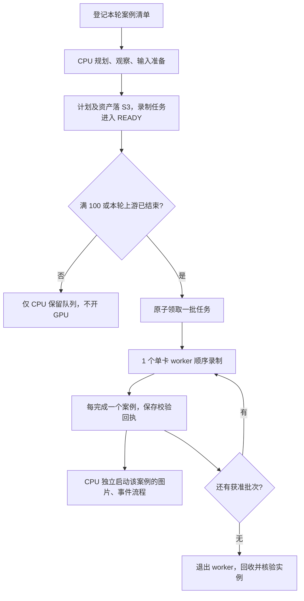

# Three Episode：满 100 发批次，上游结束立即发尾批

日期：2026-09-06。状态：仓库实现与文档已更新；部署清单通过服务端 dry-run，尚未部署或启动付费任务。
本计划按用户最新要求修订成本调度设计，保留禁止 H100、真实录制和停在 pre-Seedance 的边界。

## 核心规则

- GPU 仅执行白膜录制以及同阶段的首帧/三视图提取。规划、观察/点选、物理探测、图片模型调用、事件和打包都不申请专用 GPU。
- 同兼容组就绪任务满 100 个，提交一批 100 个；本轮上游明确结束后，剩余 1–99 个立即提交。
- 100 是批次任务数，GPU worker 初始总并发为 1。一个长驻于当前批次的 worker 顺序消费任务，复用节点和镜像。
- 只消费已获准批次。上游未结束、队列不足 100 时，不能通过 ready-wave、定时强刷或预热续租绕过门槛。
- 默认一个任务是一个 Episode 的整套六段录制，包含首帧和三视图；不是一帧、一段或一种风格。段级修复仍属于原任务，不把六段计成六个新案例凑批。

## 已有逻辑及接入缺口

| 位置 | 已有能力 | 本次应如何复用/修订 |
| --- | --- | --- |
| `scripts/lib/cloud-production-run.mjs` | 默认 minimumBatchSize=100、最大 128，按 workerImage 分组；批次 hash 与尾批校验 | 保留核心选择器，新增显式上游完成凭据的版本契约；本 profile 固定每批最多 100 |
| `scripts/cloud/dispatch-worldkit-gpu-capture-batch.mjs` | 就绪队列、execution 去重、上游状态查询、producer-drained | 复用 dispatcher；尾批从“活动记录归零+空闲时间”改为完整 cohort 账本关闭 |
| `config/cloud-episode-production.json` | 配置存在 minimumBatchSize=100 | 当前本地配置同时为 dispatchReadyImmediately=true、caseConcurrency=16；不能把它称为正在执行 100 门槛。新 profile 必须禁用 immediate、固定总 GPU 并发 1 |
| `scripts/cloud/run-worldkit-cloud-gpu-capture-batch-worker.mjs` | 默认顺序循环、已有结果复用、单案例文件清理、调用已有 stage claim | 复用批次循环并接 Three capture adapter；不能直接调用旧 episode-render，避免越过 pre-Seedance |
| `scripts/cloud/launch-worldkit-cloud-gpu-capture-batch-job.mjs` | 支持单 worker；高并发时转为每 task 一个 Indexed completion | 本 profile 禁用逐案例 Indexed Pod 模式，硬限制 GPU=1、精确单卡机型 |
| `scripts/three-episode/capture-cloud.mjs` | 当前按每个案例直接 create Job、轮询结果 | 改为 durable enqueue + receipt reconcile，移除绕过队列的正式直提入口 |

以上是仓库静态证据，不代表旧 dispatcher 当前线上部署配置已确认。
本次运行旧选择器、dispatcher、worker、Job launcher 的 40 项测试，全部通过；这是已有能力的基线，不是本计划的新封口、调度和回收机制已经实现的证据。
旧 worker 的结果回执和 CPU 后处理启动需要解耦：后处理提交失败不能把已成功白膜重新标为录制失败。

## 流程

GPU worker 从 CPU 已冻结的输入开始，不在 GPU 上进行模型规划或等待上游补齐。
每个案例独立加载页面、重置物理状态并释放场景资源；复用浏览器进程须验证状态隔离及显存归还，否则只复用节点/镜像。
CPU 可预取下一个任务的资产，预取最多两个案例并设缓存字节上限；GPU 上传当前结果时不等待图片生成。
已完成的一个案例立即发 CPU 后处理事件，不等整批 100 个全部完成。

规划中的真实观察/点选保留 SDK 工具契约，采用 CPU 浏览器路径并验证软件 renderer 的稳定性。
如果当前观察实现无法在 CPU 正确运行，作为 CPU prepare 能力缺口修复；不能静默再引入一个 GPU 观察阶段，也不能用旧截图冒充实时反馈。

## 上游结束必须可证明

每轮使用 `cohortId`、不可变案例清单 hash、预期生产任务数和版本。所有 queued、running、重试、未知提交结果都纳入账本。
动态添加案例允许发生在 input-open 阶段；明确 seal 后禁止追加，新增案例进入下一轮。

关闭条件同时成立：

1. 输入清单已 sealed，生产者不能再登记新案例。
2. 所有已登记 prepare 都为 succeeded、failed-final 或 cancelled-final；没有 queued、running、retry-pending、submission-unknown。
3. 每个 prepare succeeded 都有已持久化的 capture-ready 项及输入 hash；成功计数包括已被前一批领取或录完的任务。
4. `registered = prepareSucceeded + prepareFailedFinal + prepareCancelledFinal`，计数来自同一持久状态修订。

达到以上条件后写一次可校验的 upstream-complete 回执并立即触发尾批；不再额外等待 120 秒。
以事件触发为主，CPU 定期对账补漏；查询失败或状态不明不能伪造关闭。
一个慢任务阻挡封口时，对它执行自身超时/重试规则，真正进入终态后才发尾批。
一轮的关闭不受另一轮未结束影响；取消整轮时先停止派发，不会把剩余队列作为尾批执行。

任务按 worker image digest、capture 协议、资源 profile 分兼容组。不同世界可以共批，不同 Runtime 必须有显式兼容证明。
门槛按兼容组计；同轮封口后所有兼容组尾批均可发，避免旧镜像小队列永久等待。

## 防重复、恢复和检查点

- task 身份绑定 episodeId、source/runtime/plan/录制参数 hash；attempt 独立记录，不能因重试产生同内容第二个 READY。
- dispatcher 使用持久化条件写领取批次与任务；实例数或本地文件锁不是跨副本原子性的替代。
- 优先复用已有 execution stage claim 和 heartbeat；必须补证批次领取原子性与 Three execution 接入能力，不假设现有 S3 list+写 manifest 已提供互斥。
- 发布不可变 batch manifest，冻结有序 taskId、输入 hash、profile 和 cohort 关闭凭据。创建 K8s Job 超时只对账同一 batchId，不重建另一个批次。
- worker 持原子租约逐任务领取；过期旧 worker 的提交由 fencing/version 拒绝。确认旧 worker 已终止或失去执行资格后再重派，避免双重 GPU 执行。
- 逐段保存检查点，逐案例执行“产物上传 → hash 校验 → 成功回执 + CPU 后处理 outbox 持久化 → ACK”。删除 S3 队列对象只是存储清理，不能用作唯一完成证据。
- GPU worker 不需要发布模型任务的凭证或权限；CPU 消费后处理 outbox，按同一任务身份幂等提交 pre-Seedance 流程。
- Spot 中断后仅补未完成的段/案例；已准入批次的残余恢复继承原准入身份，不必重新攒够 100，也不得借恢复加入新的未准入任务。
- 对已确认终止的暂时故障进行有限重试；数据/契约错误记录终态并继续下一案例，不能让坏案例耗尽整批预算。

## GPU 生命周期和成本

初始允许机型仅单卡 `g6.2xlarge`；它仍是待实测候选。CPU、GPU、上传和所有恢复入口共同禁止 H100。
单卡不足时允许排队，不自动扩到大卡或更多 GPU；只有交付时限确有需要，且测得总成本合理，才调整并发。

已经运行的 worker 完成一批后，若下一批已获准且镜像兼容，就在同一 Pod 领取下一批；镜像不兼容时换 Pod，调度到仍满足约束的已有节点。
不存在可消费批次时立即退出，不为了等上游凑齐 100 保留 GPU。专用池从无负载起短等待回收，初始两分钟；这是回收开始考虑时间，不是关机 SLA。
CPU 回收器独立检查 Pod/Job、NodeClaim、EC2、相关独占卷及是否误生替代任务；没有 EC2 terminated 证据不报告 resource-closed。

预算分三层：单任务无进度/绝对超时、批次总预算、整轮全局预算。不能把此前单案例 15 分钟 Job deadline 原样套给 100 个案例。
批次 deadline 按 `启动余量 + 本批任务时长上限之和 + 上传/退出余量` 计算，并受本轮剩余预算约束；跨批复用 worker 时，按剩余 deadline 决定续领或安全轮换。
保留独立节点存活计量和失败尾时；实例终止延迟会计入实耗，预算触发不等于精确停止计费。

比较指标为整轮成本/成功录制任务数，包含冷启动、实例空闲、Spot 重试、EBS 与上传。满 100 主要摊薄启动和加载成本，不意味着渲染计算量减少一百倍。
先获得单卡顺序处理基线；后续只在显存、帧时延和成本均证实有益时尝试同卡轻并行，不能从当前配置的 16 并发起步。

## 行为示例与验收

| 情形 | 预期 |
| --- | --- |
| READY=99，上游尚在生产 | 不创建 GPU Job |
| READY=100，上游仍在生产 | 发 100 个任务的批次，最多 1 个 GPU worker |
| 总计 250 个成功准备，上游已关闭 | 100 + 100 + 50；尽可能复用同一 worker |
| 80 个成功准备、20 个最终失败，上游已关闭 | 发 80 个的尾批；失败原因保留 |
| READY=99，上游还有一个未知提交结果 | 继续对账，不能假称尾批 |
| 100 个中第 61 个录制时发生中断 | 复用前 60 个回执，恢复第 61 个缺失段及余下任务 |
| 两个 dispatcher 同时看到 100 个 READY | 仅一个批次获得有效所有权，不生成双重执行 |
| 上游封口前收到迟到成功结果 | 状态修订与 outbox 对账后才封口；封口后不接受旧版本改写 |
| 取消后 reconciler 重启 | 不再创建 Job 或补 GPU |
| 单卡无货、CPU 池已满 | 等待；H100 Job 负例必须被入口及集群准入拒绝 |

此外测试：成功回执写完但 ACK 前崩溃、ACK 超时、outbox 重复投递、CPU 后处理提交失败、兼容组尾批、旧 worker 租约失效、资源回收查询无权限。
成本基准至少区分冷启动单任务与同一 worker 连续任务；录制完成帧数、物理 ticks、轨迹和输出规格不得为省钱下降。

## 实施顺序和所有权

| ID | 目标与独占文件/资源 | depends_on / blocks | 输入输出及集成点 | 验证 | 方式 |
| --- | --- | --- | --- | --- | --- |
| B1 | 定义 cohort/task/batch/closure 契约；`cloud-production-run.mjs` 与相应测试 | 无 / B2,B3,B4 | 新 profile/version → 批次准入规则，保留历史 manifest 只读兼容 | 99/100/尾批/未知结果/兼容组反例 | main-agent-only |
| B2 | CPU prepare 生产账本及 S3 outbox；`workflow.ts`、`outbox.mjs`、`capture-cloud.mjs` | B1 / B4 | 冻结 plan → durable READY；替换 Three 直提 Job | 真实 CPU 观察工具验证；成功结果不丢队列；封口竞态 | sequential |
| B3 | 单卡限制与统一调度 profile；Job launcher、profile 配置及专用池/准入提案 | B1 / B4 | profile → 必须的 CPU/单卡约束；禁 ready-wave 和 Indexed-per-case | H100/空 selector/16 并发拒绝；server dry-run | main-agent-only |
| B4 | 批次 dispatcher 领取与 Three capture adapter；两个 batch 脚本及其测试 | B2,B3 / B5 | READY + closure → 批次 → 逐案例 receipt/outbox | 重复 dispatcher、中断恢复、CPU 下游失败不重录 | sequential |
| B5 | CPU 回收器和预算；独占新回收脚本、服务、回执前缀 | B4 / B6 | Job/租约身份 → EC2 闭合状态 | 取消、预算耗尽、替代实例、共享节点保护 | sequential |
| B6 | 冻结真实案例的有界单卡验证，独占基准 run 和 S3 prefix | B5 / 正式启用 | 小规模已封口尾批验证 + 无 GPU 的 100 门槛测试 → 成本/正确性报告 | 输出完整、GPU 只在 capture、H100 零调度、资源终止 | main-agent-only |

优先复用旧流程的选择器、批次循环、stage claim 与回执，不另建一套功能重复的调度系统。
旧后处理与 Three pre-Seedance 的契约必须明确适配，不能直接把旧自动视频生成路径接回来。
本轮已完成下列仓库实现。正式部署后通过已封口的小尾批做 L4 验证，无须为了测试生成 100 个真实案例。

## 2026-09-06 实现记录（优先于上文设计假设）

- B1：满 100 的批次仍复用旧选择器；新增 hash 绑定的 `producer-complete` 凭据。每轮预登记最多 250 个案例，ConfigMap 状态限制 850 KB。未知/待重试 producer 仍保留 pending，不能触发尾批。
- B2：Three capture 直提 Job 已替换为持久入队。CPU 提前上传 checkpoint，再将任务和续跑描述原子写入队列；Host 返回 `paused-capture-queue` 后退出。父 CPU Job 未结束时不会启动其续跑。真实观察/点选继续使用 CPU SwiftShader。
- B3：CPU Host/上传锁到 platform CPU 池及 CPU 机型；GPU 仅允许专用池的 g6.2xlarge。CPU Host factory 拒绝 gpuCount=1。提供独立服务账号、RBAC、Pod/Job 准入策略、单卡 NodePool 和 CPU CronJob 的生成器。旧仓库配置关闭 immediate，改成最大 100、并发 1，但尚未更新线上旧 dispatcher。
- B4：复用旧 batch worker 的顺序任务循环和 receipt 跳过逻辑，新增 Three capture adapter。批次所有权由 Kubernetes ConfigMap CAS 和物理 Job 身份控制，不另假定 S3 list 是原子队列。GPU worker 不挂模型凭证，不启动旧 episode-render。CPU continuation 独立对账。
- B5：单任务子进程硬超时 900 秒；批次 Job deadline 为 600 + 900 × taskCount 秒，失败 Pod 至多两次执行尝试。已准入残余可作为恢复尾批；取消/暂停不会自动补机器。独立 CPU 资源核验记录 EC2/Spot/卷证据；没有证据保持 pending，不假报清零。
- 同 Pod 续领必须满足原绝对 deadline 的剩余预算；放不下则结束 Pod，由下一 Job 复用仍符合约束的已有单卡节点。当前没有 GPU 内存共享/同卡并行和额外预取缓存优化。
- B6：本地合约、故障注入、真实 CPU Chromium/物理测试已执行；L4 真机性能与成本基准、线上准入负例和真实实例生命周期闭合仍待部署后验证。没有将单元测试称为云 GPU 验证。

部署和使用入口见 `scripts/three-episode/README.md`。本次未创建 GPU Job、未发布新的 worker 镜像、未修改线上 NodePool/自动调度器，也未提交 Seedance。

### 最终验证记录

本次验证输出保存在 `.codex-tmp/three-episode-batch-verification/`，范围记录在 `scope.json`。

| 命令/验证 | 结果 | 实际证明范围 |
| --- | --- | --- |
| `node --test scripts/three-episode/*.test.mjs scripts/lib/cloud-production-run.test.mjs` | exit 0，71 项通过 | 队列门槛、尾批、CAS 争抢、取消、残余恢复、每案例回执、CPU 两槽、资源闭合失败路径及原视觉流程合约 |
| `pnpm test:cloud-orchestration` | exit 0，118 项通过 | 原云编排回归及新增 CPU/H100/直提 GPU 防护 |
| `pnpm exec vitest run scripts/three-episode packages/three-world/src/episode.test.ts packages/three-world/src/presentation.test.ts` | exit 0，45 项通过 | 包含真实 Chromium MCP 观察、点选、探测；SDK 物理/录制及暂停检查点回归 |
| `pnpm typecheck` | exit 0 | TypeScript / 声明接口 |
| `pnpm test:census` | exit 0 | 368 个 Vitest 文件的既有测试分组；不是 368 项全部重跑 |
| 生成部署清单后 `kubectl apply --dry-run=server` | exit 0，14 个对象通过 | API 对象校验；未安装，不证明线上准入执行或真实 L4 启动 |
| `git diff --check` | exit 0 | 改动空白检查 |

补充实现：整个 capture task（含下载/解包）有 CPU reconciler 的 900 秒看门狗检查，受一分钟轮询及 Pod 退出时间影响；实际录制子进程另有 900 秒硬超时。CPU 后处理使用独立的两槽 CAS 限额，不会一次把 100 个重 CPU Job 全部提交，也不占 GPU 槽。

仍需部署时闭合：更新并发布真实镜像/源码胶囊、安装服务账号和准入策略、确认 CPU 容量/NodeClass 图形驱动和 AWS 只读权限、关闭这些任务的旧 dispatcher 后启用新 reconciler，最后用一个已封口的小尾批验证 L4 性能和 EC2/Spot/EBS 回收。没有执行上述生产变更，不能称线上已切换。

## 修复及真实小尾批完成

后续已修复生产就绪审查发现的 CPU 生命周期、批次领取竞态和回收独立性问题，并完成单案例六段 L4 录制及 CPU 交付校验。专用权限/节点池/准入策略已安装；自动 CronJob 和全局队列保持暂停。由于 Spot 无容量，本次临时采用相同单卡机型 On-Demand，随后恢复 Spot，实例/根卷/Node/NodeClaim 均已闭合。最新事实以 [小尾批验证报告](../../reviews/2026-09-06-three-episode-small-tail-validation.md) 为准；未重跑样式生成或 Seedance，未做 100 案例吞吐压测。

## Post-smoke closure update — r13

The follow-up review found three gaps beyond the successful recording tail test:
error masking/false success, active CPU cancellation, and receipt-before-create-ACK
recovery after Job TTL. The implementation now closes these paths with regression
tests, including late Job creation, late receipts and failed cleanup/publication.

Authority boundaries: the cohort owns cancellation and pending producer state;
each task owns its CPU attempt/receipt; workflow state owns the original failure;
local/S3 provider journals retain history while the cohort tracks only outstanding
remote identities. Explicit successful application state and checkpoint publication
are required for a success receipt. Kubernetes completion alone is not success.

The CPU reconciler has the generation-token Secret reference for exact-ID remote
cancellation; the resource reconciler and GPU worker do not receive that token.
Synchronous Gemini requests already in flight cannot be recalled by this API;
record them as cancellation-unconfirmed/attention-required and block further work.
This capability limit does not authorize a retry or a claim of zero external cost.

See `docs/reviews/2026-09-06-three-episode-fixes-validation.md` for exact commands,
results, image/archive identities and paused deployment evidence. No new recording,
image generation or Seedance submission is part of this fix verification.
