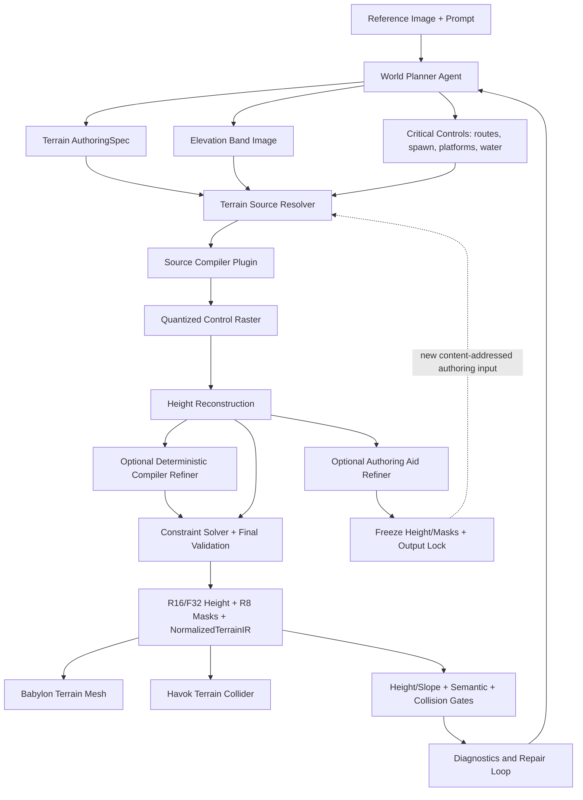

# AI-first Terrain Authoring Pipeline 设计

## 1. 文档状态

- 状态：Draft，进入接口级评审前不得作为已冻结 Public API。
- 所属系统：Agent Whitebox World SDK。
- 上位规格：`2026-08-17-ai-first-lego-game-sdk-design.md`。
- 目标读者：World Planner Agent 团队、SDK Schema/Compiler 团队、Babylon/Havok Runtime 团队和自动验收团队。
- 设计前提：当前仓库中的 Three.js/Rapier 实现是 Demo 和回归基准，不拥有新架构兼容性要求。

本文件定义从 AI 地形意图到生产 Heightfield、语义层、物理碰撞和验收报告的完整工程链路。它不规定上游必须使用某个模型供应商，也不把 GPT Image 等生成模型的进程内 API 放入 SDK Core。

## 2. 决策摘要

第一版生产方案采用 **生成式地形规划图 + 少量结构化控制数据 + 确定性 Terrain Compiler** 的混合路线：

```text
参考图 + Prompt
  → 上游 Planner 生成正交俯视地形规划图
  → Planner 输出世界尺度、色带含义、路线、出生点和关键约束
  → SDK 导入并量化 Elevation Band Image
  → SDK 重建连续高度场
  → 可选：确定性 Refiner 使用冻结配方，或 Authoring Aid 先冻结内容寻址输出
  → SDK 应用水位、路线、平台、坡度和出生点硬约束
  → SDK 固化 16-bit/Float 高度场、R8 语义 Mask 和 NormalizedTerrainIR
  → Babylon Mesh 与 Havok Collider 使用同一份高度场
  → Browser Gate 输出 Height/Slope、Semantic、Collision 和 Opening Shot 报告
```

该选择接受产品侧的实际观察：强图像生成模型通常比大模型直接书写大量等高线坐标更擅长保持海湾、山脊、岛屿和前中后景的整体空间构图。但生成图片仍是不可信 Authoring Input，不是最终数值地形。颜色、高度、拓扑和 Gameplay 约束必须由 SDK 确定性编译和验证。

同时保留以下正式 Terrain Source 扩展点：

- 已编译数值高度场。
- 生成式等高色带图。
- 矢量控制线与区域。
- 程序化地形参数。
- 多来源组合。

单目深度估计和直接生成 3D Mesh 只作为可选证据或未来插件，不是第一版权威地形来源。

外部工具调研后的格式决策是：**生成图片是规划/控制输入，米制 Heightfield 才是地形高度的单一真相，地表语义、路线、保护区和证据来源使用独立 Mask/Layer 表达。** 编译产物默认使用带固定 Scale/Offset 的 `R16`，需要超大高度范围或更高精度时使用直接存储米制高度的 `F32`；语义与约束 Mask 使用 `R8`。具体图片模型、Houdini、Gaea、World Machine 等工具只能出现在上游配置、Host Registry 和 Provenance 中，不能成为 AuthoringSpec 或 Runtime 的必需依赖。

## 3. 目标与非目标

### 3.1 目标

- AI 能用少量、直观的声明表达复杂自然地形，不需要输出数万高度值或大量折线点。
- 可见海湾、岸线、山脊、谷地、岛屿、平台和道路与参考图的空间语义相符。
- 单图不可见区域可以被明确标记为推断并补全成连贯世界。
- 相同 Authoring Input、Registry Lock、Compiler Profile 和 Seed 产生相同 NormalizedTerrainIR Hash。
- 地形视觉和物理使用同一份权威 Heightfield。
- 关键路线、出生点、地标平台、水位和坡度具有机器可验证的硬约束。
- 新增 Terrain Source 类型不修改 Terrain Compiler Core 和 Runtime Core。
- 所有失败都返回包含图像位置、世界位置和修复建议的结构化 Diagnostic。
- 大地图支持分块、流式加载、LOD、资源预算和无缝碰撞。

### 3.2 非目标

- 不承诺从单张透视图恢复唯一真实三维地形。
- 不把云、花、纹理、笔触、树叶等表现细节编码成碰撞高度。
- 第一版不支持洞穴、天然拱门、悬挑、垂直墙体内部空间等非 Heightfield 拓扑。
- 不要求图像生成模型输出像素级精确的颜色或无噪声高度图。
- 不允许 AuthoringSpec 携带任意图像处理脚本、Shader、模块路径或动态代码。
- 不将某个模型名称写成 Terrain Source 的公共类型。
- 不为了兼容旧 Demo 的地形函数而污染新协议。

## 4. 责任边界

### 4.1 上游 Planner Agent 负责

- 理解参考图中的可见地形、水域、遮挡、视点和构图。
- 选择 Terrain Source 类型。
- 生成正交俯视地形规划图或提供其他受支持 Source。
- 声明世界 Bounds、方向、海拔范围、水位、色带、Seed 和关键语义。
- 声明主路线、出生点、地标平台、岸线目标和关键拓扑预期。
- 区分 `user-explicit`、`reference-visible`、`planner-inferred` 和 `planner-optional`，与上位规格的四类证据保持一致。
- 根据 Compiler Diagnostic 和 SDK-derived Height/Slope Plan 迭代 Authoring Input。

### 4.2 SDK 负责

- Terrain Source Schema、版本、发现接口和示例。
- 资产解析、解码、规范化、哈希和预算限制。
- 色彩量化、分区、有限拓扑修复和连续高度重建。
- 路线、出生点、水位、平台、坡度和世界边界等硬约束求解。
- 统一 NormalizedTerrainIR、分块 Heightfield、语义 Raster 和 Collision 数据。
- Babylon/Havok Runtime Adapter。
- Diagnostic、可视化调试产物、缓存、重放和自动验收。

### 4.3 图像生成模型的定位

图像生成模型是上游可替换的 **Terrain Plan Producer**：

- SDK Public Schema 识别 `elevation-band-image@1`，不识别 `gpt-image-*`。
- 具体模型、Prompt 和生成参数可以保存在 provenance 中，但不影响 Runtime API。
- 更换模型供应商不改变 Terrain Source Schema、NormalizedTerrainIR 或 Runtime。
- Compiler 不假设生成图严格遵守颜色；它必须量化、校验并在无法安全修复时拒绝输入。

## 5. 候选方案比较

以下评价是本项目基于工程属性的设计判断，不是外部模型 Benchmark。

| 方案 | AI 生成负担 | 参考图整体构图 | 数值可控性 | 硬约束能力 | 可诊断/可编辑 | 第一版定位 |
|---|---|---|---|---|---|---|
| 程序化参数/噪声 | 低 | 低至中 | 高 | 中 | 高 | 微观细节和无参考场景 |
| AI 直接输出密集高度数组 | 极高 | 中 | 高 | 高 | 低 | 不采用为 AI-facing 入口 |
| AI 输出矢量等高线/多边形 | 高 | 中至高 | 高 | 高 | 高 | 精确局部控制和补丁 |
| 生成灰度 Heightmap | 低 | 高 | 中 | 低至中 | 低 | 可选 Source，不作为默认 |
| 生成离散等高色带图 | 低 | 高 | 中至高 | 中 | 高 | 默认宏观地形入口 |
| 从原始透视图估计深度 | 低 | 可见区域高 | 低 | 低 | 低 | 参考证据，不是完整世界 |
| 直接生成 3D Mesh | 低 | 高 | 低 | 低 | 低 | 当前 Heightfield 阶段不采用 |
| 图像规划 + 结构约束 + Compiler | 中 | 高 | 高 | 高 | 高 | 推荐生产方案 |

### 5.1 程序化参数与噪声

示例：`plain`、`hills`、振幅、频率、Seed、若干圆形 Raise/Lower。

优点：

- 确定性强，性能可预测。
- Schema 简单，容易测试。
- 适合无参考图的随机开放世界和最终微观粗糙度。

缺点：

- 很难复现特定海湾、复杂岸线、分层山脊和画面中的空间轮廓。
- Agent 容易不断叠加局部形状，形成不可维护的参数堆。

决策：保留为底层 Capability 和微观 Detail Layer，不作为参考图宏观拓扑的默认表达。

### 5.2 AI 直接输出密集数值高度场

优点：

- Compiler 输入明确，运行时最直接。
- 不需要从颜色恢复高度。

缺点：

- 数万个数字不符合大模型表达优势，Token 成本高且容易产生长度、顺序和数值错误。
- 人类和 Agent 难以理解局部数字对应哪个海湾或山脊。
- 小范围修改通常需要重写大数组。

决策：`height-raster@1` 是正式 Source，但主要供专业工具、GIS、离线生成器和编译缓存使用，不是默认 AI Authoring 方式。

### 5.3 矢量等高线、脊线和区域

优点：

- 几何和海拔精确。
- 易于表达硬边界、平台、路线和局部修复。
- 结构化 Diff 和 Diagnostic 很清晰。

缺点：

- 复杂自然地形需要大量点和嵌套多边形。
- Agent 容易生成自相交、方向错误、非单调等高线或不闭合区域。
- 全局构图可能被大量局部坐标淹没。

决策：保留 `vector-control@1`，用于关键岸线、山脊、路线和 Compiler Patch；不要求 Agent 用它描述整个自然地形。

### 5.4 生成灰度 Heightmap

优点：

- 一张图可以直接近似连续高度。
- 输入体积小，工程转换简单。

缺点：

- 图像模型可能把光照、阴影、雾和材质误画成高度。
- 灰度没有天然的绝对米制标定。
- 人类难以检查一个灰度差是地形意图还是生成噪声。
- 海岸、水位、平台和路线没有清晰语义。

决策：支持受信工具生成的灰度或 16-bit Heightmap；生成模型产出的灰度图必须通过严格 Profile，不作为第一版推荐入口。

### 5.5 生成离散等高色带图

优点：

- 强图像模型擅长保持宏观形状和空间构图。
- 离散颜色比连续灰度更容易量化、检查和解释。
- 少量色带就能表达海底、岸线、低地、丘陵、高地和山脊。
- Agent 不需要手写大量轮廓坐标。
- Compiler 可以把不精确颜色吸附到有限 Palette，并输出可视化修复结果。

缺点：

- 色带只提供高度区间，不唯一确定区间内部的连续高度。
- 生成图仍可能出现孤立噪点、非法相邻色带、断裂岛屿和不闭合岸线。
- 单张 RGB 图不能同时无歧义表达高度、地表语义和证据来源。

决策：作为默认宏观地形 Source，但必须与少量结构化控制、确定性重建和硬约束组合。

### 5.6 从参考图进行单目深度估计

优点：

- 可见区域的前后层次和轮廓可能较贴近原图。
- 可以为开场视点提供深度线索。

缺点：

- 透视深度不能直接当成世界正交高度。
- 遮挡后方、画面外区域和真实米制尺度不存在唯一答案。
- 天空、水面、反射和风格化插画容易产生错误深度。

决策：只作为 `reference-depth-evidence` 辅助 Planner，不直接进入权威 Heightfield。

### 5.7 直接生成 3D Mesh

优点：

- 理论上可以表达悬挑、洞穴和非 Heightfield 结构。

缺点：

- 拓扑、UV、法线、尺度、Collider 和可玩性难以稳定验证。
- 难以保证路线坡度、出生点、Tile LOD 和物理一致性。
- 不符合当前户外 Heightfield 阶段边界。

决策：不作为当前生产路线；未来如果进入非 Heightfield 世界，单独设计 Mesh Terrain/Volume Terrain 子系统。

### 5.8 推荐：图像引导的混合控制方案

采用一张机器导向的 Elevation Band Image 表达宏观地形，用少量结构化控制表达必须精确的内容：

- 世界 Bounds 和高度范围。
- 水位与主要水域。
- 出生点和安全半径。
- 主路线中心线、宽度和最大坡度。
- 灯塔、建筑等地标平台。
- 必须存在的岛屿、海湾开口、山脊和连通关系。

程序化噪声只在硬约束完成后增加低幅度微观变化。这样图像模型负责它擅长的整体布局，工程系统负责它不擅长的数值、拓扑、物理和可玩性。

### 5.9 外部生产工具的共同模式

本项目调研到的成熟地形链路虽然产品形态不同，但数据边界高度一致：

- [Houdini HeightFields](https://www.sidefx.com/docs/houdini/heightfields/index.html) 把地形表示为二维 Height Volume，并用独立 Mask Layer 驱动侵蚀、散布和选择；其 [Masking 文档](https://www.sidefx.com/docs/houdini/heightfields/masking.html) 也把图片 Mask、绘制 Mask 和特征 Mask 作为组合层。
- [World Machine](https://help.world-machine.com/topic/file-input-and-output/) 将 Heightfield、Mesh、Bitmap/Mask 分开输出，并将 Heightfield 作为紧凑、高效的首选地形表示；其文件输出支持 [16-bit PNG/TIFF、RAW16、浮点与 Tiled Build](https://help.world-machine.com/topic/device-fileoutput/)。
- [Gaea Automation](https://docs.gaea.app/developers/automation/index.html) 使用预构建 `.terrain` 配方、暴露变量和 Seed 执行可重复 Build；[Build and Export](https://docs.gaea.app/using/using-gaea/build-and-export/) 将 Heightfield、Mask、Color Map、Mesh 和 Tiled World 分开导出。
- [Unreal Landscape](https://dev.epicgames.com/documentation/unreal-engine/creating-and-using-custom-heightmaps-and-layers-in-unreal-engine) 使用单通道 16-bit Heightmap 和单通道 8-bit Layer 数据，并明确支持在外部工具生成基础地形后回到引擎做 Gameplay 调整。
- [Unity Terrain](https://docs.unity.cn/2020.2/Documentation/Manual/terrain-Heightmaps.html) 以矩形高度数组导入/导出 16-bit RAW Heightmap。
- Babylon/Havok 的 Heightfield 物理接口最终消费规则采样的浮点高度，而不是一张供人观看的 RGB 图片；例如 Babylon 的 [`PhysicsShapeHeightField`](https://doc.babylonjs.com/typedoc/classes/BABYLON.PhysicsShapeHeightField) 接收采样数和 `Float32Array`。

因此本项目不发明另一套“图片即运行时地形”的协议，而是采用业界容易互操作的 Height + Masks + Layers 模型。图片只降低 AI Authoring 难度，Compiler 负责把它变成确定、可验证、可交换的数值数据。

### 5.10 GPT Image 2 的合适位置

[GPT Image 2 官方模型页](https://developers.openai.com/api/docs/models/gpt-image-2) 将其定义为图像生成/编辑模型，并支持高保真图像输入；[ChatGPT Images 2.0 发布说明](https://openai.com/index/introducing-chatgpt-images-2-0/) 强调更强的指令遵循、精度和控制。这支持使用它生成宏观地形概念图或受限 Palette 的控制图，但官方能力描述没有承诺像素级 Palette、拓扑、米制高度或重复生成完全一致。

所以 GPT Image 2 的生产定位是可替换的 `Terrain Plan Producer`，不是权威 Heightfield Generator：

1. 可以根据参考图和 Prompt 生成正交俯视、无光照、无材质的离散色带图。
2. 也可以先生成便于人理解的概念图，再由上游 Vision/Segmentation 转成 Canonical Control Map。
3. 每张候选图仍必须经过 Palette Quantization、Topology Validation、Constraint Solver 和 Browser/Physics Gates。
4. 原始模型、Prompt、Seed/生成参数和资产 Hash 只记录在 Provenance；更换模型不改变 Source Schema。

### 5.11 深度模型与专用地形生成研究

单目深度可作为可见区域的空间证据，但不能成为完整世界的高度真相。[Marigold](https://arxiv.org/abs/2312.02145) 明确将单图深度描述为几何上不适定的问题；[Depth Anything V2](https://arxiv.org/abs/2406.09414) 展示了强单目深度能力和 Metric Depth 变体，但仍无法从单张图恢复遮挡后方、画面外区域与唯一世界拓扑。因此它只输出 `reference-depth-evidence`，由 Planner 结合正交规划和世界约束使用。

[TerraFusion](https://arxiv.org/abs/2505.04050) 和 [MESA](https://openaccess.thecvf.com/content/CVPR2025W/MORSE/papers/Borne--Pons_MESA_Text-Driven_Terrain_Generation_Using_Latent_Diffusion_and_Global_Copernicus_CVPRW_2025_paper.pdf) 说明扩散模型已经能生成或辅助生成 Heightmap/2.5D Terrain。这类方案可注册为实验性 Terrain Source 或离线 Refiner，但在通过本项目的确定性、硬约束、物理和构图 Gate 前，不进入 Core，也不替代统一 NormalizedTerrainIR。

### 5.12 Hunyuan3D-WorldClaw 外部案例与设计启示

#### 5.12.1 参考资料与公开状态

本节基于以下官方公开材料，调研时间为 2026-08-18：

- [Tencent-Hunyuan/Hunyuan3D-WorldClaw 官方 GitHub 仓库](https://github.com/Tencent-Hunyuan/Hunyuan3D-WorldClaw)
- [WorldClaw 官方项目页](https://tencent-hunyuan.github.io/Hunyuan3D-WorldClaw/)
- [官方 Pipeline 图](https://raw.githubusercontent.com/Tencent-Hunyuan/Hunyuan3D-WorldClaw/main/assets/pipeline.jpg)
- [论文摘要：Hunyuan3D-WorldClaw: An Agentic Framework for Open-World 3D Scene Generation](https://arxiv.org/abs/2608.05248)
- [论文全文 HTML](https://arxiv.org/html/2608.05248v1)

截至本次调研，官方 GitHub 仓库公开了 README、演示资产和论文入口，但没有公开 Pipeline 脚本、Agent Skill、Prompt 模板或 YAML Schema 实现。因此 WorldClaw 在本设计中属于**有论文和流程证据的外部研究案例**，不是可直接安装、审计和集成的开源依赖；下文只吸收公开方法，不假设未公开实现细节。

#### 5.12.2 已公开的技术链路

WorldClaw 的核心不是“一个模型直接生成完整世界”，而是 Agent 编排多个模型和 Blender 工具完成三阶段流水线：

```text
自然语言需求
  → 意图分析与全局/区域规划
  → 全局地形生成、材质与散布
  → 区域构图、实例分割、3D 重建与落位
  → Blender 渲染检查与迭代修正
  → 可编辑 Mesh、材质、独立物体实例和渲染通道
```

论文和官方 Pipeline 图公开的信息包括：

- Agent 使用结构化场景计划拆分全局地形条件与区域物体条件，而不是让下游从自然语言临时猜测所有参数。
- 示例流程使用 GPT-Image-2 生成语义布局图和物体参考图，SAM3 做实例分割，SAM3D 做粗 3D 重建，Hunyuan3D 做高质量 Mesh/PBR 细化。
- Blender 负责场景组装、材质、渲染和检查；Agent 通过 BlenderMCP 执行多轮 Render-Inspect-Refine。
- 官方图中展示了 `scene_plan.yaml`、`terrain_param.yaml`、`scatter_plan.yaml`，以及 `img_gen.py`、`terrain.py`、`scatter.py`、`img_edit.py`、`img_to_3d.py`、`3d_placement.py`、`tex.py` 等阶段名。这证明其流水线存在显式中间产物，但公开材料不足以确认这些文件的完整字段、兼容性和版本协议。
- 论文实验环境列出了 Claude Opus 4.8、Blender 5.1.1 和 4 张 NVIDIA H20；这些是论文实现选择，不应进入本 SDK 的公共 Schema。

#### 5.12.3 值得吸收的地形与物体方法

WorldClaw 的地形路线与本方案的 `Height + Masks + Layers` 有较强一致性：

1. 先生成使用预定义颜色区分山地、沙地、水域等类别的俯视语义布局图。
2. 从布局图提取每个区域的 Mask，并对边界做平滑，得到可混合的区域权重。
3. 为每个区域绑定基准高度、分形噪声和山峰、沙丘、台地、侵蚀等地貌算子，再按区域权重合成统一高度场。
4. 同一组区域权重同时驱动高度合成、材质混合和资产散布，避免三套系统各自维护不一致的区域定义。
5. 散布阶段继续使用高度、坡度和法线筛选或调整物体落点。

它的区域物体链路则是：先渲染局部地形并保存相机参数，再通过图像编辑得到区域构图；随后做实例分割和单体 3D 重建，通过相机射线与地形求交恢复落位，并继续修正比例、接地、悬浮和穿插。这个流程对未来的地标、建筑、植被和道具放置有参考意义，但视觉接地检查不能替代 Havok Collider、Nav/Route 和实际 Gameplay Gate。

#### 5.12.4 与本 SDK 的边界映射

| WorldClaw 公开概念 | 本 SDK 对应边界 | 设计结论 |
| --- | --- | --- |
| 场景计划、地形计划、散布计划 | `WorldSpec`、`WorldPromptBundle`、`TerrainAuthoringSpec` 和后续 Asset Placement Spec | Agent 输出声明式结构，不把临时代码当世界真相 |
| 语义颜色布局图 | `CompositeTerrainSourceSpec` 中的 Semantic Raster 候选输入 | 先作为 T2 Probe，不立即新增公共 Source ID |
| 每区域地貌参数 | 结构化 Elevation Constraint、Procedural Modifier 和 Compiler Profile | 数值参数与图像区域分离，允许单独验证和替换 |
| 区域 Mask 同时驱动地形、材质和散布 | `NormalizedTerrainIR` 的 Height 与独立 R8 Semantic Layers | 同一个 Canonical Region ID 跨系统引用，不复制区域真相 |
| 区域物体生成与三维落位 | 未来独立 Asset Generation / Placement Pipeline | 不塞进 Terrain Runtime，也不允许物体生成器修改权威 Heightfield |
| Render-Inspect-Refine | Authoring Aid Refiner、Browser Gate、Physics Gate 和 ChangeSet | 非确定性修正先冻结产物，再重新进入确定性 Compiler |
| 独立可编辑对象实例 | Prototype/Instance、Asset Slot 和 Relationship | 保留 LEGO 化替换、组合和后续交互能力 |

WorldClaw 支持了本项目“全局到区域、结构先于生成”的总体判断，但不改变 Runtime 归属：本 SDK 仍采用 `Agent → Versioned Schema → Compiler → NormalizedTerrainIR / WorldPackage → Babylon + Havok Runtime`。WorldClaw 主要可参考的是上游 Planning、Terrain Authoring、Asset Generation 和自动质检，不是角色控制、物理、3C、动作系统或多主体控制的替代方案。

#### 5.12.5 明确吸收与不吸收

吸收以下思想：

- 全局地形与区域物体分阶段生成，先解决大尺度拓扑，再解决局部资产。
- 用语义布局图降低 Agent 表达区域边界的难度，同时用结构化参数保留米制高度和 Gameplay 控制。
- 用同一组 Canonical Region Mask 驱动高度、地表语义和资产放置。
- 每个生成物体保持独立 Prototype/Instance 身份，支持替换、验证和局部修复。
- 生成后必须经过渲染、构图、接地、物理和可玩性检查，并输出机器可读 Diagnostic/ChangeSet。

不吸收以下实现耦合：

- 不把 GPT-Image-2、SAM3、SAM3D、Hunyuan3D、Claude 或 Blender 写入公共 Schema。
- 不允许运行时执行 Agent 临时生成的 Python/Blender 脚本；外部生成只在受控 Authoring Host 内运行。
- 不让 Blender 文件或渲染结果成为运行时世界的单一真相；最终仍冻结为版本化、可 Hash、可验证的 SDK 资源。
- 不把图片中的物体接触关系当作物理正确性证据；Collider、可行走区域、路线、浮空和穿插必须由 Runtime Gate 验证。
- 不因论文 Demo 质量而跳过 Provider 可替换性、失败回退、确定性、资源预算和长期版本迁移设计。

#### 5.12.6 对当前地形决策的影响

WorldClaw 为“图像模型生成语义区域图，再由工程 Compiler 生成高度场”的路线提供了外部案例，但没有证明语义图能够单独恢复精确高度，也没有公开足够实现用于直接复现。因此：

- 第一版推荐路线仍是 Elevation Band Image + Critical Structured Controls。
- T2 Bake-off 增加第四条候选：**语义区域布局图 + 每区域结构化地貌参数**。第一轮使用既有 `CompositeTerrainSourceSpec` 表达，避免过早冻结新 Source Schema。
- 第四条路线必须与离散色带、连续灰度、概念图转 Canonical Map 使用同一 Dataset、Constraint 和 Runtime Gate。
- 只有当第四条路线显著改善宏观拓扑、区域一致性或 Agent 收敛，并能给出稳定 Canonicalization 规则时，才提出新的公共 Source ID；否则它保持为 Composite Source 的上游生成 Profile。

## 6. 总体架构



关键边界：

- Planner 产出 Authoring Input，不调用 Runtime 内部对象。
- Source Compiler Plugin 只负责把某种输入转换成统一控制场，不创建 Babylon/Havok 对象。
- Terrain Refiner 只接收统一的 Macro Heightfield、Mask 和受信配置；它不是另一套 AuthoringSpec，也不能绕过最终约束求解。只有通过确定性 Conformance 的实现留在 Compiler 内，其他实现先冻结输出并以新的内容寻址 Source 重新进入流水线。
- Constraint Solver 对所有 Source 使用同一套 Gameplay 约束。
- NormalizedTerrainIR 是 Compiler 与 Runtime 之间唯一权威协议。
- Mesh、Collider 和调试图都从同一 NormalizedTerrainIR 派生。

## 7. Terrain Source 插件协议

### 7.1 AI-facing Union

```ts
type TerrainSourceSpec =
  | HeightRasterSourceSpec
  | ElevationBandImageSourceSpec
  | VectorControlSourceSpec
  | ProceduralTerrainSourceSpec
  | CompositeTerrainSourceSpec;
```

首批注册 ID：

```text
terrain-source.height-raster@1
terrain-source.elevation-band-image@1
terrain-source.vector-control@1
terrain-source.procedural@1
terrain-source.composite@1
```

每个插件必须声明：

- Source Schema 和默认值。
- 支持的输入格式和资源预算。
- 输出控制场的坐标、精度和语义。
- 编译器 ID、算法版本和缓存键。
- Diagnostic 集合。
- Golden Fixtures 和 Conformance Tests。
- 是否允许作为 Base Source、Modifier 或 Mask Source。

### 7.2 Source Compiler Interface

```ts
interface TerrainSourceCompiler<TSource extends TerrainSourceSpec> {
  readonly manifest: TerrainSourceCompilerManifest;
  validate(source: TSource, context: TerrainCompileContext): Diagnostic[];
  compile(
    source: TSource,
    context: TerrainCompileContext,
  ): Promise<TerrainControlFieldResult>;
}

interface TerrainControlFieldResult {
  elevationConstraints: ElevationConstraintField;
  semanticLayers: readonly SemanticRasterLayer[];
  evidenceLayers: readonly EvidenceRasterLayer[];
  topology: TerrainTopologySummary;
  diagnostics: readonly Diagnostic[];
  debugArtifacts: readonly ArtifactRef[];
}
```

Compiler Plugin 不能直接写入 Runtime Scene，也不能持有 Babylon、Havok、DOM 或 Playwright 对象。

### 7.3 Terrain Refiner 插件协议

Terrain Refiner 是可选的离线编译扩展，用于侵蚀、河谷、冲积、平滑和自然化；它不是 Runtime 依赖，也不是 Terrain Source。首批可研究的 Host Registry ID：

```text
terrain-refiner.native@1
terrain-refiner.gaea-recipe@1
terrain-refiner.houdini-hda@1
terrain-refiner.world-machine@1
```

```ts
interface TerrainRefiner {
  readonly manifest: TerrainRefinerManifest;
  refine(
    input: MacroTerrainField,
    context: TerrainRefinementContext,
  ): Promise<TerrainRefinementResult>;
}

interface TerrainRefinementContext {
  readonly semanticMasks: readonly SemanticRasterLayer[];
  readonly protectedMasks: readonly ProtectedTerrainMask[];
  readonly profile: LockedTerrainRefinementProfile;
  readonly seed: number;
  readonly budget: TerrainRefinementBudget;
}

interface TerrainRefinementResult {
  readonly candidateHeight: MetricHeightRaster;
  readonly derivedMasks: readonly SemanticRasterLayer[];
  readonly report: TerrainRefinementReport;
  readonly diagnostics: readonly Diagnostic[];
}

type TerrainRefinementClass =
  | "deterministic-compiler-refiner"
  | "authoring-aid-refiner";
```

约束：

- AI-facing Spec 只表达 `natural-erosion`、强度、尺度等语义意图；Host Registry 决定具体实现。
- Gaea 只运行仓库审核过的 `.terrain` Recipe，Houdini 只运行审核过的 HDA，World Machine 只运行审核过的 Graph；AuthoringSpec 不能注入脚本、节点代码、命令行或任意文件路径。
- `spawn`、`primary-route`、`platform`、`shoreline` 等 Protected Mask 在 Refiner 前生成；Refiner 后必须重新应用硬约束并执行全部 Gate。
- Refiner 输出只是 Candidate，不能直接写 WorldPackage 或 Runtime Scene。
- Manifest 和 Report 记录工具/插件版本、Recipe/HDA/Graph Hash、Seed、平台类别、许可证、耗时、输入输出 Hash 和修改量。
- 没有安装外部 Refiner 时，`terrain-refiner.native@1` 或无 Refiner 必须仍能完成 Core Pipeline；WorldPackage 加载不依赖任何 Authoring 工具。

### 7.4 Refiner 的确定性等级与冻结边界

固定 Recipe 和 Seed 不等于确定性。每个 Refiner Manifest 必须声明 `refinementClass`，两类实现进入不同的信任路径：

| Class | 准入要求 | 在流水线中的位置 | Cache/Hash 输入 |
|---|---|---|---|
| `deterministic-compiler-refiner` | 在声明的平台类别、线程/精度配置和资源预算下，通过重复、并发与跨机器 Conformance，产生 bit-for-bit 相同的 Canonical Candidate | 可以作为 Terrain Compiler 的锁定阶段 | Refiner/Recipe/Profile/Seed/输入/Protected Mask Hash |
| `authoring-aid-refiner` | 允许 GPU、启发式算法或外部服务造成输出漂移，但仍必须满足安全、格式和 Provenance 契约 | 位于确定性 Compiler 之前的 Authoring 阶段 | 固化后的 Height/Mask/Report 内容 Hash；Recipe 和 Seed 只作 Provenance |

`authoring-aid-refiner` 的输出不得以“Recipe + Seed”冒充可复现输入。Host 必须：

1. 校验候选 Raster、Mask、坐标、数值范围、预算和许可证。
2. 将 Height 与派生 Mask 规范化为固定字节序和 Layout。
3. 生成 `refinement-output-lock.json`，记录原始输入、工具、Recipe、Seed、平台和每个冻结文件的内容 Hash。
4. 把冻结 Height/Mask 作为内容寻址 `height-raster@1`/Composite Authoring Source 送入确定性 Compiler。
5. 后续缓存、WorldChangeSet、Registry Lock 与 WorldPackage 只依赖冻结输出 Hash；重新运行工具产生不同字节时视为新的 Authoring Input。

`deterministic-compiler-refiner` 只在它声明的 Determinism Profile 内获得该资格。工具升级、Recipe 变化、驱动/平台类别变化或 Conformance 失败时必须自动降级为 `authoring-aid-refiner`，禁止继续复用旧 Cache。无论属于哪一类，候选都必须在之后重新应用 Protected Mask 与 Gameplay 硬约束；确定性等级不代表语义正确性。

## 8. Elevation Band Image 契约

### 8.1 AuthoringSpec 示例

```json
{
  "id": "main-terrain",
  "kind": "terrain",
  "bounds": {
    "center": [0, 0],
    "size": [1200, 1000],
    "heightRange": [-12, 92]
  },
  "grid": {
    "metersPerCell": 2,
    "tileSizeMeters": [200, 200]
  },
  "source": {
    "type": "terrain-source.elevation-band-image@1",
    "asset": "package://terrain/elevation-bands.png",
    "registration": {
      "imageRightMapsTo": "+X",
      "imageUpMapsTo": "-Z",
      "crop": [0, 0, 1, 1]
    },
    "palette": [
      {
        "id": "deep-water",
        "color": "#174A73",
        "heightRangeMeters": [-12, -4]
      },
      {
        "id": "shallow-water",
        "color": "#3F82A8",
        "heightRangeMeters": [-4, 0]
      },
      {
        "id": "shore",
        "color": "#DDC98C",
        "heightRangeMeters": [0, 3]
      },
      {
        "id": "lowland",
        "color": "#A7C77B",
        "heightRangeMeters": [3, 18]
      },
      {
        "id": "hills",
        "color": "#608E55",
        "heightRangeMeters": [18, 42]
      },
      {
        "id": "highland",
        "color": "#846849",
        "heightRangeMeters": [42, 72]
      },
      {
        "id": "summit",
        "color": "#D8D4C8",
        "heightRangeMeters": [72, 92]
      }
    ],
    "quantizationProfile": "terrain-quantization.lab-nearest@1",
    "reconstructionProfile": "terrain-reconstruction.monotonic-bands@1",
    "unknownPixelPolicy": {
      "maximumRatio": 0.01,
      "action": "error"
    }
  },
  "controls": {
    "waterLevelMeters": 0,
    "spawnAreas": [
      {
        "id": "player-spawn",
        "center": [0, 360],
        "radius": 8,
        "targetHeightMeters": 82,
        "maximumSlopeDegrees": 4
      }
    ],
    "routes": [
      {
        "id": "spawn-to-bay",
        "points": [[0, 360], [0, 280], [0, 180], [0, 80]],
        "widthMeters": 8,
        "maximumSlopeDegrees": 35
      }
    ],
    "platforms": [
      {
        "id": "lighthouse-platform",
        "center": [110, 100],
        "size": [28, 28],
        "targetHeightMeters": 42,
        "maximumSlopeDegrees": 3
      }
    ]
  },
  "provenance": {
    "evidence": "planner-inferred",
    "generator": {
      "kind": "image-model",
      "name": "optional-audit-metadata"
    }
  }
}
```

`generator.name` 只是审计信息，不能参与插件选择或 Runtime 分支。

普通模式优先选择注册的 `paletteProfile`，例如 `terrain-palette.coastal-7@1`；Normalizer 将它展开成完整 Palette 和高度映射。上例展开 Palette 是为了展示规范化后的含义。只有高级模式允许显式 Palette，并且仍需通过颜色距离、Band 顺序和高度范围校验。

像素到世界坐标的映射必须无歧义。上述方向表示：图片右侧是世界 `+X`，图片顶部是世界 `-Z`。在完整 Crop 下，左上角映射到 `center - size / 2`，右下角映射到 `center + size / 2`。Compiler 必须把 Registration 写入 Debug Artifact，避免图像翻转后仍能生成“看似合理但方向错误”的世界。

### 8.2 规划图生成约束

Elevation Band Image 的存储 Prompt 和验收规则必须要求：

- 严格正交俯视，不使用鸟瞰透视。
- 世界矩形完整填满画布，不裁切地形边界。
- 使用有限、平坦、无渐变的 Palette。
- 不使用光照、阴影、雾、纹理、笔触、文字、图标和装饰边框。
- 水体、陆地和岛屿边界闭合。
- 高度带由低到高保持合理邻接，不让最低带直接接触最高带。
- 主海湾、山脊、谷地、岛屿和地标平台保持参考图意图。
- 不在机器输入图中绘制道路名称、箭头或图例；图例由 Schema 提供。

图像模型可能不完全服从这些要求，因此 Compiler 必须验证，不能把 Prompt 当作安全保证。

### 8.3 概念图与机器控制图分离

强图像模型可以生成两类用途不同的图片：

- `terrain-concept.png`：帮助 Planner、人类和视觉模型理解整体构图，可以更接近自然地形效果，但不直接编译。
- `elevation-bands.png`：严格 Palette、正交俯视、无光照纹理的机器控制图，可以进入 `elevation-band-image@1`。

不能因为 Concept Image 看起来像等高图，就绕过控制图 Gate。推荐两条接入路径：

```text
Path A: Image Model → compliant Elevation Band Image → deterministic Compiler

Path B: Image Model → Terrain Concept Image
                    → upstream vision/segmentation interpretation
                    → canonical Elevation Band Image or Vector Controls
                    → deterministic Compiler
```

Path A 延迟低、工程链路短，是首选技术探针。若真实生成样本频繁出现渐变、阴影、非法色带或结构歧义，则切换 Path B；图像模型仍然负责宏观地形设计，但由上游解释层生成规范控制数据。两条路径都不要求语言模型手写完整等高线集合，也不改变 SDK Runtime。

### 8.4 为什么不让一张 RGB 图表达所有语义

颜色已经用于编码高度带，不能同时无歧义编码草地、悬崖、道路、证据和所有权。第一版采用：

- Elevation Band Image：表达宏观高度拓扑。
- Terrain Control JSON：表达路线、出生点、平台、水位和少量必须精确的向量约束。
- 可选 Semantic Mask Source：表达大面积悬崖、沙滩、沼泽等语义。
- Evidence Layer：由 Planner 以区域或 Mask 单独提供。

如果未来使用多通道控制图，必须作为新的版本化 Source Plugin，不能静默改变 `elevation-band-image@1` 的含义。

## 9. Terrain Compiler Pipeline

### 9.1 阶段顺序

```text
resolve asset
  → decode and canonicalize pixels
  → register image to world bounds
  → quantize palette
  → segment connected regions
  → validate and minimally repair topology
  → reconstruct continuous macro height
  → apply water and shoreline constraints
  → derive protected masks
  → run optional trusted terrain refiner
  → apply routes, spawn areas and platforms
  → add optional micro-detail
  → re-assert all hard constraints and validate refiner delta
  → resample authoritative grid
  → derive semantic/evidence rasters
  → tile and build collision source
  → validate and package
```

所有阶段都产生带内容 Hash 的中间 Artifact；阶段参数来自 Registry Lock 中固定的 Compiler Profile。

### 9.2 解码与规范化

- 只接受注册格式、颜色空间和最大尺寸。
- 解码后转成固定颜色空间和无 Alpha 歧义的 Canonical Pixel Buffer。
- EXIF 方向、ICC Profile 和 Gamma 处理必须确定，不能依赖浏览器默认行为。
- 拒绝路径穿越、超大图、解压炸弹和未授权网络 URI。
- 计算原始资产 Hash 与规范化 Pixel Hash。

### 9.3 颜色量化

默认 `lab-nearest@1`：

- 每个像素吸附到 Palette 中距离最近的合法颜色。
- 超过最大颜色距离的像素标记为 unknown。
- 输出 unknown ratio、每个 Band 的面积和量化差异 Heatmap。
- unknown ratio 超过阈值时失败，不能把未知颜色默认当作低地。
- 量化实现、颜色距离和 tie-breaker 必须版本化。

### 9.4 区域清理与拓扑验证

允许的自动修复仅限显式预算内的机械操作：

- 删除小于阈值的孤立像素岛。
- 填补小孔洞。
- 对边缘做有限形态学开闭操作。
- 合并与周围一致的微小碎片。

以下情况默认报错而不是猜测：

- 大面积未知颜色。
- 高度 Band 顺序逆转或非相邻 Band 大面积直接接触。
- 必需岛屿、海湾开口或主陆地连通性消失。
- 水域泄漏到世界边界外的非法方向。
- 修复面积超过 `maximumRepairRatio`。

Topology Summary 至少记录：

- 每个 Band 的 Connected Components。
- 岛屿数量和面积。
- 岸线长度和闭合状态。
- Band 邻接图。
- 主陆地和水域连通性。

### 9.5 连续高度重建

离散 Band 提供高度区间，不直接生成台阶地形。`monotonic-bands@1` 的契约：

1. 将每个 Band 边界转换为距离场。
2. 根据较低和较高邻接 Band，计算当前 Band 内的归一化升高方向。
3. 在声明的 `heightRangeMeters` 内进行单调插值。
4. 使用固定迭代次数的平滑求解器消除局部尖峰，同时保持岸线、脊线和平台硬约束。
5. 对没有明确高低邻居的封闭区域使用稳定 Seed 和固定规则选择坡向，并在 Diagnostic 中记录推断。
6. 拒绝 NaN、无限值、越界高度和超过 Profile 允许的未约束区域。

算法输出是连续 Macro Heightfield。任何随机细节必须在宏观高度完成后作为独立 Modifier 应用。

### 9.6 水域与岸线

- Water Node/Body 是独立逻辑对象，Heightfield 只提供海床、湖床和岸边地形。
- 岸线目标高度锁定在 `waterLevelMeters ± shorelineToleranceMeters`。
- 水域内部地形必须低于水位并满足最小深度 Profile。
- 主路线和 Spawn Area 不能落入水域，除非对应 Capability 明确允许。
- Compiler 输出 Water Boundary 和 Heightfield 的交叉检查报告。

### 9.7 Gameplay 约束求解

约束按固定优先级处理：

```text
world bounds and finite heights
  > water/shore hard constraints
  > spawn safety
  > required landmark platforms
  > primary route slope and continuity
  > secondary routes
  > semantic preference
  > procedural micro-detail
```

同优先级冲突时不按输入顺序选择；必须根据稳定 Constraint ID 排序并检测不可同时满足的约束。硬约束冲突返回错误，不能通过降低总体评分掩盖。

路线求解必须：

- 保持声明宽度内的连续可通行 Corridor。
- 主路线不超过声明坡度，Humanoid 默认目标不超过 35°。
- 避免突然台阶、局部深坑和 Collider 断缝。
- 输出修改前后高度差和最大地形改造量。

### 9.8 微观细节

程序化 Noise/Erosion 只能作为最后阶段的低幅度 Modifier：

- 不能改变岸线拓扑。
- 不能破坏 Spawn、Route 和 Platform Mask。
- 不能让坡度 Gate 从通过变成失败。
- Profile 固定 Seed、频率、振幅、Octave 和应用顺序。
- 白模阶段默认使用保守幅度，不模拟纹理细节。

外部 Terrain Refiner 与本地 Noise/Erosion Modifier 遵守相同边界：都只能修改允许区域，不能拥有更高的约束优先级。Refiner 必须先输出 Candidate Height 和 Delta；Compiler 随后恢复 Protected Mask 内的权威高度、重新应用水位/路线/平台/出生点约束，并在修改量、拓扑或坡度超出预算时拒绝候选结果。

### 9.9 分块与输出

- 大地图按照约 1.25～2.5 米/格的目标分辨率选择 Grid，除非场景明确需要更细碰撞。
- 共享世界空间 Raster 先生成，再切 Tile，避免每个 Tile 独立生成导致接缝。
- 相邻 Tile 的边界高度和法线必须满足一致性测试。
- 视觉 Mesh 与物理 Collider 读取同一权威 Height Resource。
- LOD 可以降低 Render Mesh 分辨率，但不能改变权威 Gameplay Height Query。

## 10. NormalizedTerrainIR

```ts
interface NormalizedTerrainIR {
  id: string;
  version: 1;
  bounds: {
    center: readonly [number, number];
    size: readonly [number, number];
    heightRange: readonly [number, number];
  };
  grid: {
    columns: number;
    rows: number;
    metersPerCell: number;
    tileColumns: number;
    tileRows: number;
  };
  height: ContentAddressedHeightRasterRef;
  semanticLayers: readonly NormalizedSemanticLayer[];
  evidenceLayers: readonly NormalizedEvidenceLayer[];
  waterBindings: readonly NormalizedWaterBinding[];
  constraints: readonly NormalizedTerrainConstraintResult[];
  topology: TerrainTopologySummary;
  compiler: {
    sourceType: string;
    sourceHash: string;
    compilerId: string;
    compilerVersion: string;
    profileHash: string;
    seed: number;
    refinement?: {
      refinerId: string;
      refinerVersion: string;
      refinementClass: "deterministic-compiler-refiner";
      recipeHash: string;
      inputHash: string;
      outputHeightHash: string;
      outputMaskHashes: readonly string[];
      reportHash: string;
    };
  };
  budget: NormalizedTerrainBudget;
}
```

要求：

- 不包含原始 PNG Pixel Buffer、Babylon Mesh、Havok Handle、函数或进程对象。
- Height Resource 使用固定字节序、Sample Layout、Scale/Offset 和 NoData 规则。
- Runtime 不重新执行 AI 图像解释和颜色重建。
- Normalized IR Hash 覆盖 Height、Semantic、Evidence、Topology、Compiler Profile 和约束结果。
- `compiler.refinement` 只记录 `deterministic-compiler-refiner`。`authoring-aid-refiner` 不出现在该字段：它的输出已冻结为内容寻址 Source，`sourceHash` 已覆盖冻结结果，Output Lock 与工具信息只保存在该 Source 的 Provenance 中；确定性 Compiler 不重新执行该工具。
- Authoring 图片可以保存在审计包中，但不是 Runtime 必需资源。

`ContentAddressedHeightRasterRef` 必须显式声明：

```ts
interface ContentAddressedHeightRasterRef {
  readonly uri: `package://${string}`;
  readonly contentHash: string;
  readonly encoding: "uint16-linear" | "float32-meters";
  readonly byteOrder: "little-endian";
  readonly layout: "row-major-x-fastest";
  readonly columns: number;
  readonly rows: number;
  readonly offsetMeters: number;
  readonly scaleMetersPerUnit: number;
  readonly noData?: number;
}
```

- `uint16-linear` 是默认发布格式；实际米制高度为 `offsetMeters + sample * scaleMetersPerUnit`。
- `float32-meters` 直接存米制高度，适用于 `R16` 精度不足的世界；仍固定小端、Layout 和有限数值规则。
- Semantic、Evidence 和 Protected Mask 使用单通道 `R8`，并在各 Layer Metadata 中固定 `0..255` 的意义；不能把浏览用的 PNG 色彩解释当作运行时协议。
- Runtime Adapter 可以转成 Babylon/Havok 所需的 `Float32Array`，但转换结果必须在规定容差内等于该权威 Height Resource。

## 11. WorldPackage 地形产物

```text
world-package/
  terrain/
    main/
      source/
        elevation-bands.png
        terrain-authoring.json
      compiled/
        height.r16
        height-metadata.json
        semantic-cliff.r8
        semantic-route.r8
        protected-gameplay.r8
        evidence-visible.r8
        topology.json
        refinement-report.json
      debug/
        quantized-bands.png
        unknown-color-heatmap.png
        reconstructed-height.png
        slope.png
        constraint-delta.png
        collision-preview.png
      diagnostics.json
      integrity.json
```

当使用 `float32-meters` 时，`height.f32` 替代 `height.r16`。没有使用 Refiner 时不生成 `refinement-report.json`。生产发布可以剥离 `source/` 和部分 `debug/`；`compiled/`、必要 Manifest 和 Integrity 必须保留。Prompt、参考图 URI 和用户信息遵守总架构的数据脱敏策略。

## 12. Diagnostic 与 AI 修复循环

Diagnostic 示例：

```json
{
  "severity": "error",
  "code": "TERRAIN_BAND_ADJACENCY_INVALID",
  "instancePath": "/nodes/0/source",
  "terrainId": "main-terrain",
  "imageRegion": {
    "minimum": [0.62, 0.18],
    "maximum": [0.71, 0.29]
  },
  "worldRegion": {
    "minimum": [144, -320],
    "maximum": [252, -210]
  },
  "message": "Lowland touches summit across 8.2% of the summit boundary.",
  "details": {
    "lowerBand": "lowland",
    "upperBand": "summit",
    "contactRatio": 0.082,
    "maximumAllowed": 0.005
  },
  "suggestions": [
    {
      "kind": "regenerate-source-region",
      "region": [0.62, 0.18, 0.71, 0.29],
      "requireIntermediateBands": ["hills", "highland"]
    },
    {
      "kind": "supply-vector-control",
      "control": "ridge-or-slope-transition"
    }
  ]
}
```

首批稳定错误类别：

- `TERRAIN_SOURCE_UNSUPPORTED`
- `TERRAIN_IMAGE_DECODE_FAILED`
- `TERRAIN_IMAGE_REGISTRATION_INVALID`
- `TERRAIN_UNKNOWN_COLOR_RATIO_EXCEEDED`
- `TERRAIN_REPAIR_BUDGET_EXCEEDED`
- `TERRAIN_BAND_ADJACENCY_INVALID`
- `TERRAIN_TOPOLOGY_EXPECTATION_FAILED`
- `TERRAIN_HEIGHT_RECONSTRUCTION_UNDERCONSTRAINED`
- `TERRAIN_HEIGHT_OUT_OF_RANGE`
- `TERRAIN_SHORELINE_LEVEL_INVALID`
- `TERRAIN_SPAWN_UNSAFE`
- `TERRAIN_ROUTE_DISCONNECTED`
- `TERRAIN_ROUTE_SLOPE_EXCEEDED`
- `TERRAIN_PLATFORM_SLOPE_EXCEEDED`
- `TERRAIN_TILE_SEAM_FAILED`
- `TERRAIN_RESOURCE_BUDGET_EXCEEDED`
- `TERRAIN_REFINER_DETERMINISM_FAILED`
- `TERRAIN_REFINEMENT_OUTPUT_LOCK_REQUIRED`
- `TERRAIN_BENCHMARK_GATE_FAILED`

Agent 迭代优先级：

1. 修复 Source 无法解析和颜色问题。
2. 修复拓扑、水位和世界边界。
3. 修复 Spawn、Platform 和 Primary Route。
4. 修复构图与语义偏差。
5. 最后调整微观自然度。

Compiler 可以生成安全机械 WorldChangeSet，例如在固定 unknown threshold 内应用已声明的颜色吸附 Profile 或删除低于面积阈值的孤点；ChangeSet 必须携带 `baseAuthoringSpecHash`、Precondition 和明确的 `terrain-source-replace/constraint-set` 等领域操作。涉及海湾、岛屿、山脊和路线语义的修改必须返回建议，由 Planner 决定，不能由通用数组 Patch 静默改写。

## 13. 确定性、缓存与版本

### 13.1 Cache Key

```text
hash(
  canonical-source-bytes,
  terrain-source-schema-version,
  compiler-id-and-version,
  compiler-profile-hash,
  normalized-controls,
  world-bounds,
  target-grid,
  canonical-refinement-input,
  protected-mask-hash,
  seed
)
```

图像文件名、生成时间和绝对路径不能影响 Cache Key。

`canonical-refinement-input` 按 Refiner Class 计算：

```text
deterministic-compiler-refiner:
  refiner-id + exact-version + implementation-hash + recipe/profile-hash
  + refiner-input-hash + refiner-seed + determinism-profile

authoring-aid-refiner:
  refinement-output-lock-hash + frozen-height-hash + sorted-frozen-mask-hashes
```

Authoring Aid 的工具名称、Prompt、Recipe、Seed、时间和平台只进入 Provenance，不代替冻结输出 Hash。任何缺失 `refinement-output-lock.json` 的非确定性候选都不能命中生产 Compiler Cache。

### 13.2 确定性要求

- 图像解码、颜色空间、量化、形态学 Kernel、迭代次数和浮点精度固定。
- 重建与平滑求解不得直接调用 ECMAScript 内置超越函数（`Math.sin`、`Math.exp`、`Math.pow` 等为实现近似，跨 JS 引擎结果不同）；Compiler Profile 固定确定性数学实现，或将计算限制在 IEEE-754 完全确定的运算集合。
- `deterministic-compiler-refiner` 必须在锁定 Profile 内产生 Canonical Output 的 bit-for-bit 相同字节；只达到视觉或浮点容差的工具不能归入此类。
- `authoring-aid-refiner` 的输出必须先固化为内容寻址 Height/Mask 与 Output Lock，再作为新的 Authoring Input 进入 Compiler；Recipe 和 Seed 不参与“同配方同输出”的承诺。
- 多区域和多约束按稳定 ID 排序。
- 不使用线程完成顺序、Map 插入顺序或插件注册顺序作为语义顺序。
- CPU 并行实现必须与单线程 Reference Implementation 满足规定数值容差。
- 编译输出记录 Profile 和平台类别；权威 Height Resource 在 Package 中固化，Runtime 不重复浮点重建。

### 13.3 版本策略

- Source Schema、Quantization Profile、Reconstruction Profile 和 Constraint Solver 独立版本。
- Patch/Minor 不改变相同输入的既有输出语义；如果算法结果变化，增加 Compiler/Profile Major 或显式 Migration。
- Registry Lock 固定每个实现版本和内容 Hash。
- WorldPackage 加载时只需要理解 NormalizedTerrainIR 和编译资源，不要求安装 Authoring Source Compiler。

## 14. 安全与预算

- 图片、Raster、Mask、Tile 和 Diagnostic 数量均有硬上限。
- 解码在受限资源环境中运行，限制像素数、通道、解压大小、CPU 时间和内存。
- Source URI 只通过 AssetResolver 和允许的 Scheme。
- 禁止 SVG 脚本、任意本地路径、动态模块和隐式网络访问。
- Palette、Controls、ID 和字符串长度受限。
- Compiler 的自动修复有面积、次数和高度变化预算。
- Terrain Plugin 只能由宿主注册，Spec 不能指定 npm 包或可执行文件。
- 外部 Refiner 在无网络、只读 Recipe、受限输入输出目录、CPU/内存/时间上限的 Worker 中运行；禁止 AuthoringSpec 传递任意命令、脚本、表达式、环境变量和插件路径。
- Refiner 生成的 Height、Mask、Report 和日志重新经过尺寸、数值、Hash、路径与许可证校验，不能因为来自专业工具就视为可信。
- Debug Artifact 和日志不得泄露参考图凭证、内部路径或未脱敏 Prompt。

## 15. 测试策略

### 15.1 Unit Tests

- Canonical image decode。
- Palette quantization 和 unknown threshold。
- Connected Components、孔洞和 Band 邻接图。
- 单调高度重建。
- 水位、路线、Spawn 和 Platform Constraint。
- Raster 重采样、Tile 切分和边界一致性。
- Hash、稳定序列化和 Cache Key。
- Refiner Class 分支、Output Lock、冻结 Raster Canonicalization 和 Cache 失效。
- Benchmark Metric 聚合、阻断 Gate、缺失值和 Dataset/Manifest Hash。

### 15.2 Golden Fixtures

至少包含：

- 简单单岛。
- 海湾与两侧山脊。
- 多岛水域。
- 山谷与连续下坡路线。
- 非法色带跳跃。
- 大面积未知颜色。
- 路线无法满足坡度的冲突场景。
- Tile 边界穿过岸线和山脊的场景。

当前 `sunlit-flower-bay` 手写 Heightfield 作为行为 Golden，不作为新 Compiler 实现模板。新 Pipeline 的结果与它比较世界 Bounds、岸线拓扑、路线、Spawn、地标平台、坡度、Height/Slope Plan 和 Opening Shot，而不是要求逐像素复制旧函数。

### 15.3 Conformance Tests

每个 Terrain Source Plugin 必须通过：

- Schema Valid/Invalid Fixtures。
- 同输入多次编译 Hash 相同。
- 改变插件注册顺序输出不变。
- 资源 Budget 和超时。
- Diagnostic 结构与空间定位。
- Dispose 和临时资源清理。
- NormalizedTerrainIR 不包含插件私有对象。

每个 Terrain Refiner 还必须通过：

- Protected Mask 不可修改或修改后被确定性恢复的测试。
- Refiner 缺失、超时、崩溃和非法输出时的安全回退测试。
- Candidate Height 的 NaN、Inf、越界、Topology、Slope 和最大 Delta 测试。
- Provenance、许可证、输入输出 Hash 和机器可读 Report 完整性测试。

分级 Conformance：

- `deterministic-compiler-refiner` 在 Manifest 声明的平台矩阵、并发度和重复次数下必须产生 bit-for-bit 相同的 Candidate Height、Mask 和 Canonical Report；任何一项失败即降级并使旧 Cache 失效。
- `authoring-aid-refiner` 不测试“同 Recipe 同输出”，而是测试冻结流程：相同冻结字节得到相同 Output Lock/Compiler 结果，不同输出得到不同 `sourceArtifactHash` 和下游 `normalizedTerrainIrHash`，缺失或篡改 Output Lock 时阻断编译。

### 15.4 Browser/Physics Gates

- Babylon Mesh 与权威 Height Query 一致。
- Havok Collider 与 Height Query 在容差内一致。
- Spawn 无穿透、无悬空、无水域冲突。
- Primary Route 连续且满足坡度。
- Character Controller 能沿路线往返。
- 岸线、水面和地形无明显裂缝。
- Tile LOD 切换不改变物理高度。
- Height、Slope、Semantic、Instance、Collision Debug Capture 可重复生成。
- Opening Shot 必需 Region 和 Anchor 通过。

### 15.5 Terrain Benchmark Manifest

默认 Image Profile 和 Refiner 不能靠个别漂亮样例决定。SDK Testkit 维护版本化 `TerrainBenchmarkManifest`，使不同图像路线、模型 Profile、Compiler Profile 和 Refiner 的比较可重复：

```ts
interface TerrainBenchmarkManifest {
  id: string;
  version: number;
  datasetHash: string;
  annotationSchemaVersion: number;
  splits: {
    developmentCaseIds: readonly string[];
    holdoutCaseIds: readonly string[];
  };
  generatorProfiles: readonly LockedGeneratorProfileRef[];
  compilerProfiles: readonly LockedTerrainCompilerProfileRef[];
  runsPerCase: number;
  metrics: readonly TerrainBenchmarkMetricDefinition[];
  blockingGates: readonly TerrainBenchmarkGate[];
  artifactProtocolVersion: number;
}
```

每个 Case 必须固定：

- Reference Image 内容 Hash、许可/来源、Prompt Bundle Hash 和目标世界 Bounds。
- 可见/推断证据分区、预期水陆/岛屿/连通拓扑、Region、Anchor 和岸线目标。
- Spawn、Primary Route、Platform、水位、坡度和资源预算等阻断约束。
- Annotation 版本、审阅者共识和允许的几何容差；单图不可判断区域不能伪装成唯一 Ground Truth。

Benchmark 规则：

1. Development Split 用于调整 Prompt、Palette、Compiler 和修复策略；Holdout Split 在阈值冻结后运行，其期望标注不暴露给调参/Planner 流程。
2. 对随机生成器执行 Manifest 声明的重复次数，报告单次成功率、全 Case 通过率、分位数和跨运行漂移，禁止挑选最佳一次作为正式结果。
3. 比较离散色带、连续灰度、概念图转 Canonical Map，以及语义区域布局图 + 结构化区域参数时使用同一 Case、结构约束和 Runtime Gate；Provider 名称只进入 Benchmark/Provenance，不进入 Public Terrain Schema。
4. 阻断指标至少包括 Source 可解析、关键拓扑、必需 Region/Anchor、Spawn、Route、Water/Platform、Tile Seam 和 Physics。任何阻断 Gate 失败都不能由加权总分抵消。
5. 诊断指标至少包括 unknown pixel ratio、非法 Band 邻接、Constraint Repair Delta、地形修改面积/高度、Agent 收敛轮数、生成漂移、编译耗时和资源峰值。模型价格不是本项目的选择指标。
6. Metric 定义、聚合方式、缺失值策略和阈值都写入 Manifest；阈值变化必须增加 Manifest 版本，不能在看到 Holdout 结果后原地修改。
7. Holdout Split 至少包含 10 个 Case 并覆盖 Manifest 声明的全部地貌类别。两个候选 Profile 在阻断 Gate 通过率上的差异低于 Manifest 声明的最小区分度时，结论记为无法区分，必须以新 Manifest 版本扩充数据集后重跑；不得在同版本内择优、调整阈值或删除 Case。

每次 Run 输出 `terrain-benchmark-report.json`，并保存 Source、NormalizedTerrainIR Hash、Height/Slope/Semantic 图、Opening Shot、Diagnostic、ChangeSet/修复轮次、Compiler/Registry Lock 和失败分类。首批失败分类固定为 `source-generation`、`registration`、`quantization`、`topology`、`constraint`、`composition`、`physics`、`budget`、`nondeterminism` 和 `agent-convergence`，便于区分模型、Compiler、Runtime 与 Agent 的责任。

T0/T2 的 20～30 张真实参考图是第一版 Benchmark Dataset，不是永远充分的规模。进入生产前必须冻结数据清单、去重规则、Development/Holdout 分割、阈值和 Dataset Hash；后续新增地貌类型以新版本扩充，旧版本继续作为防回归集合。

## 16. 包边界与依赖方向

建议新包：

```text
packages/
  terrain-contracts/       # Source Schema、NormalizedTerrainIR、Diagnostic codes
  terrain-source-registry/ # Source Compiler manifests 与 resolver
  terrain-image-bands/     # Elevation Band Image compiler plugin
  terrain-vector/          # Vector control compiler plugin
  terrain-procedural/      # Noise/detail plugin
  terrain-refiner-native/  # 内置确定性平滑/侵蚀 Refiner
  terrain-refiner-host/    # 受信外部 Recipe/HDA/Graph 进程适配
  terrain-compiler/        # Reconstruction、constraints、tiling、package
  terrain-runtime-babylon/ # Mesh、LOD、material binding
  terrain-physics-havok/   # Collider 与 query adapter
  terrain-testkit/         # Golden fixtures、assertions、debug exports
```

以上目录发布为与上位规格同一 scope 的 `@worldkit/terrain-*` 包，位于同一 Monorepo；`terrain-contracts` 复用 `@worldkit/contracts` 的 Diagnostic、Canonical Bytes 与 Registry Lock 协议，不依赖任何 Runtime 包。

依赖方向：

```text
@worldkit/contracts
  ← terrain-contracts

terrain-contracts
  ← source plugins
  ← terrain-compiler
  ← runtime adapters

terrain-compiler 不依赖 Babylon/Havok
source plugins 不依赖 Runtime
refiner plugins 不依赖 Runtime，且只能消费统一 MacroTerrainField
runtime adapters 不读取 Authoring 图片
```

避免建立覆盖 Babylon 全部 API 的抽象层。Terrain Runtime Port 只包含从 NormalizedTerrainIR 创建、更新、查询和释放 Terrain Runtime Resource 所需的跨系统边界。

## 17. 实施顺序

T 阶段与上位规格阶段 0–F 的依赖关系：T0 与阶段 A 并行执行；T1、T2 依赖阶段 B 交付的 contracts、Canonical Bytes 与 Registry Lock 协议；T4 与阶段 C 是同一次 Babylon/Havok Vertical Slice 里程碑，由地形部分与主体部分共同组成，不重复建设两条切片；T5 依赖阶段 E 的 CLI 与 Browser Protocol。

### T0：冻结回归基准

- 保存当前海湾 Height/Slope、路线、Spawn、构图和物理结果。
- 准备小型手工 Golden Band Images。
- 固定世界坐标、Raster 采样和 Tile Seam 约定。
- 建立首版 TerrainBenchmarkManifest：清理重复参考图，固定许可/来源、标注协议、Development/Holdout 分割、Metric、阻断阈值和 Dataset Hash。

### T1：协议与 Reference Compiler

- 新建 terrain-contracts、Source Union 和 NormalizedTerrainIR。
- 实现 `height-raster@1` Reference Source。
- 实现稳定 Raster Package、Hash 和 Diagnostic。
- 不接入 Babylon，先在纯 Compiler 测试中通过。

### T2：Elevation Band Image Compiler

- 实现规范图像解码、Palette Quantization 和 Debug Artifact。
- 实现 Band Topology 和 `monotonic-bands@1`。
- 实现 unknown、repair 和 adjacency Diagnostics。
- 使用生成式规划图和人工 Golden 图双轨测试。
- 在冻结默认 Image Profile 前，对 20～30 张真实参考图执行四路线 Bake-off：离散色带控制图、连续灰度高度候选图、概念图再经 Vision/Segmentation 转 Canonical Map、语义区域布局图 + 每区域结构化地貌参数。第四条路线第一轮必须通过既有 `CompositeTerrainSourceSpec` 表达，不提前增加公共 Source ID。
- Bake-off 严格通过冻结的 TerrainBenchmarkManifest 运行，记录宏观拓扑正确率、Opening Shot Region/Anchor、unknown pixel ratio、非法 Band 邻接、Constraint Repair Delta、路线/出生点通过率、重复生成一致性和 Agent 收敛轮数；模型成本不是选择指标。
- Profile 和阈值在 Development Split 冻结后只运行一次正式 Holdout；失败后不得原地修改同版本阈值或删除失败 Case。

### T3：Gameplay Constraint Solver

- 实现 Water、Spawn、Platform 和 Route Constraints。
- 输出 Constraint Delta 和冲突报告。
- 加入低幅度 Procedural Detail Modifier。

### T3.5：可选 Terrain Refiner 探针

- 先实现 `terrain-refiner.native@1`，验证 Refiner 接口、Protected Mask、Delta 和回退语义。
- 分别用一套审核过的 Gaea Recipe、Houdini HDA 或 World Machine Graph 做离线互操作探针，不要求三者全部进入生产。
- 比较 Refiner 前后拓扑、坡度、路线、岸线、运行预算和可重复性；任何外部工具都不能成为 T4 Runtime Vertical Slice 的前置依赖。
- 只有通过 bit-for-bit Conformance 的实现可以标记为 `deterministic-compiler-refiner`；其余实现统一走 Authoring Aid 冻结输出路径，验证 Output Lock 与 Cache 失效。

### T4：Babylon/Havok Vertical Slice

- 由同一 NormalizedTerrainIR 创建 Mesh 与 Collider。
- 跑通海湾场景、固定输入、截图和物理 Gate。
- 验证大地图 Tile、LOD、内存和 Dispose。

### T5：Agent Repair Loop

- CLI 支持 validate、compile、inspect 和 debug artifacts。
- Browser Protocol 输出 Height/Slope、Collision 和 Terrain Diagnostics。
- 与上游 Planner 验证区域重生成、结构 Patch 和收敛行为。

### T6：可选 Source

- Vector Control Source。
- 受信灰度/16-bit Heightmap Source。
- Composite Source。
- 参考深度证据导入。
- 专用 Terrain Diffusion/Heightmap Generator 仅作为实验 Source 或 Refiner 接入。

不在 T2 前同时实现所有 Source，先用推荐路线验证公共 IR 和 Compiler 边界。

## 18. 生产验收标准

1. Agent 不需要输出密集高度数组或完整等高线集合即可表达参考驱动地形。
2. SDK Public Schema 不出现具体图像模型名称。
3. Elevation Band Image 的颜色误差、噪点和拓扑问题产生可定位 Diagnostic。
4. 相同输入、Registry Lock、Profile 和 Seed 生成相同 NormalizedTerrainIR Hash。
5. Babylon Mesh 与 Havok Collider 使用同一权威 Height Resource。
6. Spawn、Primary Route、Water 和 Landmark Platform 是阻断式硬 Gate。
7. 新增 Terrain Source 不修改 Terrain Compiler Core 或 Runtime Core。
8. 大地图 Tile 没有高度、法线和 Collider 接缝。
9. 所有中间修复可通过 Debug Artifact 和 Constraint Delta 审计。
10. Image Source 失败时可以替换为 Raster、Vector 或 Composite Source，而不修改 World Node、Runtime 和 Browser Protocol。
11. 旧 Demo 只作为 Golden Fixture，不形成新系统的兼容层。
12. 上游 Agent 可以根据结构化 Diagnostic 和 SDK-derived Height/Slope Plan 自动迭代。
13. 权威高度使用显式 `R16` Scale/Offset 或米制 `F32`，语义与约束使用独立 `R8` Mask；运行时不解释 RGB 规划图。
14. 可选 Refiner 不能修改 Public Schema、绕过 Protected Mask/硬 Gate，缺失时 Core Pipeline 仍可构建相同类型的 WorldPackage。
15. 默认 Image Profile 必须由真实参考集 Bake-off 决定，而不是仅凭单个模型样例或主观画质决定。
16. Refiner 必须声明确定性等级；非确定性 Authoring Aid 先冻结为内容寻址 Height/Mask 和 Output Lock，Recipe/Seed 不能代替输出 Hash。
17. TerrainBenchmarkManifest 固定 Dataset Hash、Development/Holdout、重复次数、Metric 和阻断阈值；正式结果保存完整制品与失败分类，且关键 Gate 不能被总分覆盖。

## 19. 冻结决策与待验证问题

### 19.1 本文冻结的方向

- 默认使用图像引导的混合方案，不要求 AI 手写大量等高线。
- Elevation Band Image 是不可信 Authoring Input，数值 Heightfield 是权威 Runtime 数据。
- 具体图片模型保持可替换，只进入 provenance。
- 一张 RGB 高度图不同时承担所有语义；关键 Gameplay 信息使用结构化 Controls。
- 所有 Source 汇聚到统一 NormalizedTerrainIR。
- Mesh、Physics 和调试视图从同一 Height Resource 派生。
- 程序化细节服从宏观拓扑和 Gameplay 硬约束。
- 外部专业工具是可替换的离线 Refiner，不是 Runtime 或 Public Schema 依赖。
- Refiner 分为确定性 Compiler Stage 与非确定性 Authoring Aid；后者必须冻结输出后再进入 Compiler。
- 权威 Heightfield 使用 `R16`/`F32`，Semantic、Evidence 与 Protected Layer 使用独立 `R8` Mask。
- Image Profile 和 Refiner 选择由版本化 TerrainBenchmarkManifest 与 Holdout Gate 决定，不以单张效果图或成本决定。

### 19.2 T2 技术探针必须回答

- 生成式等高色带图在推荐 Prompt 下的 unknown pixel ratio 分布。
- Palette 使用 6、8、12 个 Band 时，构图表达和重建平滑度的差异。
- Lab 最近色量化是否足够，还是需要先做区域级颜色聚类。
- 非法 Band 邻接的实际频率和安全自动修复上限。
- 单调距离场、Poisson/扩散求解等重建方法对海湾和山脊的表现差异。
- 路线约束对宏观地形改造量的可接受阈值。
- 1.25、2.0、2.5 米/格的碰撞、画面和资源差异。
- 生成图整体重做与局部 Patch 哪种更容易让 Agent 稳定收敛。
- 四条图像路线在 20～30 张真实参考图上的 Gate 通过率和 Agent 收敛轮数：离散色带、连续灰度、概念图转 Canonical Map、语义区域布局图 + 结构化区域参数。
- GPT Image 2 等具体 Provider 在推荐 Profile 下的重复生成漂移；结果只用于选择上游 Profile，不写入 Public Schema。
- Native、Gaea Recipe、Houdini HDA、World Machine Graph 中哪一种 Refiner 在自然度、确定性、Protected Mask 和自动化 Report 上真正增加价值。

这些问题通过仓库内 Golden Fixtures、生成样本和真实 Browser/Physics Gate 验证后，再冻结具体 Compiler Profile；不能仅凭主观认为某一种图像模型很强就跳过工程验收。
