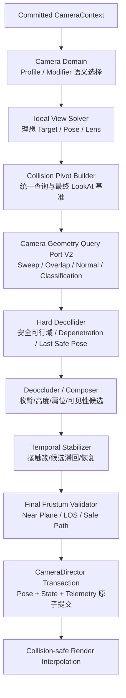

# Whitebox 第三人称镜头碰撞与弹簧臂重构方案

**状态：** Revised Proposed / 待实现
**版本：** v2
**初版日期：** 2026-08-30
**修订日期：** 2026-08-31
**修订依据：** 对照 UE Spring Arm、Unity Cinemachine Decollider/Deoccluder、Godot SpringArm3D 与公开商业游戏镜头实践后的二次架构复审
**适用范围：** Whitebox World SDK 第三人称 Camera、Spring Arm、Babylon/Havok 查询适配器
**本轮边界：** 只冻结产品方案、接口边界、实施任务图与验收标准，不修改 Runtime 代码
**事实基线：** GitHub `main` `2fd8c1c2694a861e213ad2c72e9cb3aefec087ce`；Babylon.js `9.23.0`；Havok `1.3.14`

## CF-04/12 Native Block 旧生产行为修订（2026-09-07）

用户最新要求完成 CF-04/12 并严格遵循旧 `codex/block-world-main-integration@9e35ab53`
的生产行为。实际旧 Block 路由启用遮挡实例淡出，并跳过第三人称 Spring Arm；
不能把本文面向硬碰撞 Golden 的“镜头绝不穿墙”同时宣称为旧 Block 行为。
本节明确修订 Native Block 的目标策略；下述接线已实现，但完整 CF-04/12 验收尚未完成。

- 已验证 Native Block Package 的第三人称使用旧构图/遮挡淡出策略。镜头可穿越场景
  遮挡几何，不再为这个场景源承诺相机硬碰撞；人物碰撞、支撑、行动和移动权威不变。
- Canonical 及非 Block Native Source 保留本文 Hard Decollider 策略。策略由 Host
  从已锁定的场景源/Profile 身份派生，不从 Mesh 名称、URL、环境变量或可变 Preview
  布尔开关推断，不增加旧/新迁移模式。两类场景仍只有一个 Camera Director。
- Profile → authored opening → Context Modifiers → Preview 顺序不变。Native Module
  不创建相机；不通过给 Query Provider 伪造“无碰撞”返回值实现旧策略。
- 旧九射线只选择展示遮挡实例，绝不用于人物接地或物理查询。选择周期 `1/15s`、
  水平/垂直 margin `0.45/0.55m`、coverage `0.3`、opacity `0.3/0.5`、淡入/恢复
  `0.15/0.25s` 与旧代码一致。唯一 Host 显示批次提供完整实例 bounds 和实际材料。
- 淡出状态必须随当前相机事务完成 Snapshot/Hash/Reset/Replay/Rollback；旧类只有
  不完整 inspection snapshot，不能原封不动复制为新的隐藏 Runtime 状态。Render
  不得推进另一份计时器。提交时序与旧呈现结果的关系须用逐步轨迹和 Browser 证明。
- Opening 使用同一实际相机/淡出；top-down 和 entity-triview 暂停淡出，异常也必须
  恢复完整原状态。Identity mask 保留现有不透明语义量测定义，不把淡出孔洞误当成
  实体几何缺失。需要更新量测解释时在同一合同内显式处理。
- 上述策略、状态合同、显示批次、材质/Shader、Capture、Reset、清理必须一起验证；
  不能仅删除 Spring Arm 调用就称完成。不得弱化 `verify:3c-migration` 的结构断言。

当前 `native-block-subject-occlusion.ts` 已接入 Host 真批次、唯一 CameraComponent
事务、Director 和公开 Snapshot；保留旧 controlled-Subject 采样回退，不在目标缺失时
新增失败门禁。实际 WebGL2 探针覆盖淡出、首张不透明身份 mask 和截图状态/像素恢复。
身份 Shader 在既有 render-ready 中预编译，不添加 render、Tick 或模型修复轮次。
这些 focused 证据不是整条多入口/真实生产验收。本文其余硬碰撞验收继续适用于硬碰撞策略，不把那些
验收套在旧式 Native Block 上制造额外生产 gate。两轮人工 Feel Review、正式 Browser
与整条生产链证据仍独立开放。完整任务见 CF 参数审计的 OCC-A/B/C 表。

---

## 0. 结论先行

用户看到的“进入室内或犄角旮旯时镜头跳变”，判断方向是对的：它确实发生在镜头碰撞和弹簧臂链路中。但根因不是单纯的“碰撞识别范围太小”，而是当前系统只完成了 **P0 防穿墙收臂**，还没有形成一套可在角落、门洞和室内稳定工作的 **镜头遮挡解算系统**。

当前生产路径已经使用 Havok 的真实 Sphere Sweep。问题主要有五个：

1. **查询信息不够。** 只返回最近距离和命中点，没有法线、穿透方向、多命中、碰撞分类和多个排除对象。
2. **解算维度不够。** Spring Arm 只会沿一条直线缩短长度；在 L 形角落里不会寻找更稳定的高度、肩位或侧向机位。
3. **查询与最终画面不一致。** Sweep 使用未平滑的 `target`，实际相机却朝向另一个独立平滑的 `smoothedTarget`；被验证安全的视线并不等于最终渲染视线。
4. **时序状态太弱。** 只有一个 `collisionDistanceMeters`，没有接触锁定、进入/退出滞回、角落命中切换抑制和“起点已在墙内”的恢复状态。
5. **安全与手感耦合。** 一旦碰撞，CameraDirector 立即绕过正常位置阻尼；当命中在相邻墙面间切换时，相机位置可逐帧跳变。

因此，本方案不建议“先把 Probe Radius 调大看看”。那只能让镜头更早收臂，也可能让窄门和走廊更容易触发。复审后的关键修订是：**硬碰撞安全与目标遮挡构图必须是两个职责，不能继续由一个弹簧臂函数同时处理。** 正确方向是把当前单一 Spring Arm 升级为：

> **理想构图 → Hard Decollider（绝不穿墙）→ Deoccluder / Composer（保持主体可见）→ Temporal Stabilizer（连续稳定）→ Final Frustum Validator → CameraDirector 原子提交 → Render 安全插值**

第一阶段仍保留“沿臂收缩”作为安全底线；第二阶段加入角落稳定、Near Plane 保护和候选机位；第三阶段才加入室内 Profile、软遮挡淡出和更复杂的镜头语言。

---

## 1. 双层解释：这套系统到底在解决什么

### 第一层：给产品、策划和体验负责人

把第三人称相机想象成一个摄影师：

- 摄影师先知道“理想机位”——应该离角色多远、从哪个肩膀拍、角色在屏幕什么位置。
- 摄影师发现后面有墙时，先保证自己不能钻进墙里。
- 如果只是把摄影师沿着角色方向硬拉近，他在墙角就会不停地在两面墙之间换位置，这就是玩家看到的跳变。
- 一个成熟的摄影师还会判断：稍微抬高、换肩、缩短距离、改变俯仰，哪个方案既不穿墙，又最接近原来的构图。
- 找到多个可行位置后，他不能每帧反复改主意，而要短暂“锁定”当前解法，除非新解法明显更好。

所以，**弹簧臂只是安全约束的一部分，不是完整镜头系统**。大型游戏手感稳定，通常不是因为一个 Sweep 参数调得好，而是因为它们把安全、构图、候选选择、时间连续性和特殊场景策略分开处理。

### 第二层：给工程负责人

当前 `SpringArmComponentV1` 把三维碰撞问题压缩成一个标量 `collisionDistanceMeters`：

```text
desiredTarget ───────────────── desiredCamera
       │             hit            │
       └──────────────×──────────────┘
                      ↓
           只把 arm length 截短
```

这在单面墙前有效，却无法表达：命中面法线、起点穿透、近裁剪面尺寸、相邻遮挡物、候选机位质量或跨 Tick 的接触身份。CameraDirector 又用不同的目标点进行碰撞检查与最终 LookAt，导致几何安全证明失效。

目标系统必须把几何查询和策略解算分开：Havok Adapter 只报告事实；provider-neutral 的 **Hard Decollider** 决定不可违反的安全可行域；**Deoccluder / Composer** 只在安全可行域内解决目标可见性与构图；Temporal Stabilizer 负责跨 Tick 的接触连续性；CameraDirector 仍然独占最终 Pose。

这里的职责优先级不可交换：Decollider 可以立即收缩以避免穿墙，Deoccluder 可以延迟、评分和换位以避免构图跳变。`minimumOcclusionTime`、候选延迟等表现参数不得阻止硬碰撞安全响应。

---

## 2. 当前实现审计

### 2.1 当前主路径（Current / 已核对源码）

```text
Committed CameraContext V2
        ↓
Camera Domain 选择 Profile / Modifiers
        ↓
CameraViewSolver 生成 desiredTarget + desiredPosition
        ↓
SpringArmComponentV1 做单次 Sphere Sweep
        ↓
若命中则沿臂立即收缩；若离开则按固定 m/s 恢复
        ↓
CameraDirector 独立平滑 target，提交最终 Pose
```

关键文件：

- `packages/camera`：provider-neutral Camera Domain、Profile 和上下文合同。
- `packages/runtime-babylon/src/camera-view-solver.ts`：计算理想目标点与理想机位，不负责碰撞。
- `packages/runtime-babylon/src/spring-arm-component.ts`：单一球形 Sweep 和一维臂长状态。
- `packages/runtime-framework/src/physics-world-query-port.ts`：`SphereSweepRequestV1` / `SphereSweepHitV1`。
- `packages/runtime-babylon/src/babylon-physics-world-query.ts`：Havok `shapeProximity` + `shapeCast` 实现。
- `packages/runtime-babylon/src/camera-director.ts`：最终 Pose 唯一 Owner。

### 2.2 已有能力

- 生产 Runtime 已使用 Havok 的真实 Sphere Sweep，而非用射线假装球扫。
- Sweep 起点会用 `shapeProximity` 检测重叠。
- 遇到障碍时立即缩臂，障碍消失后按 `collisionRecoveryMetersPerSecond` 慢慢恢复。
- 已有薄斜面、L 角、窄门和起点重叠的物理查询测试。
- 已有 Camera Profile、Context、Director、Telemetry 和事务 Snapshot 基础。

### 2.3 直接导致跳变的结构性缺口

| 缺口 | 当前行为 | 玩家看到的结果 | 优先级 |
|---|---|---|---|
| Query Target 与 Render Target 不同 | Sweep 从 `target` 出发，最终 `setTarget(smoothedTarget)` | 实际视线未被同一几何体积验证 | P0 |
| 碰撞时绕过位置阻尼 | `isCollisionRetracted` 时直接使用 `desiredPosition` | 命中距离变化直接变成单帧位移 | P0 |
| 起点重叠返回 0 | 没有穿透法线和 depenetration | 相机可能瞬间落到角色目标点，朝向剧变 | P0 |
| 单标量碰撞状态 | 只保存臂长 | 两面墙交替命中时无法锁定接触 | P1 |
| 无碰撞 Channel / Mask | 只有单个 `ignoredEntityId` | 装饰物、角色附件、软遮挡可能被当硬墙 | P1 |
| 无命中法线和多命中 | 只能知道“多远撞到” | 不能判断角落、沿面滑动或候选稳定性 | P1 |
| Probe 不代表最终视锥 | 球半径与 Near Plane/FOV 没有合同关系 | 中心不穿墙但画面边缘仍可切墙 | P1 |
| 参数合同漂移 | `collisionRetractionMetersPerSecond` 暴露但当前缩臂总是立即完成 | 调参面板给出不存在的控制感 | P1 |
| 旧九射线端口仍公开 | 生产未实例化，README 仍称其为当前路径 | 团队会调错模块、写错测试 | P1 文档/清理 |

### 2.4 不是本问题根因的部分

- 不是 Babylon 自带 ArcRotateCamera 突然失控；最终 Pose 由 Whitebox `CameraDirector` 写入。
- 不是 Havok 完全没有检测到墙；当前真实 Sweep 能检测基础几何。
- 不是角色移动权威或动画状态机直接改变相机；问题出在 Camera Projection 内部的几何和时序组合。
- 单独调大 `collisionRadiusMeters` 不足以修复角落跳变。

---

## 3. UE、Unity 与公开大型游戏实践给出的启示

### 3.1 Unreal Engine

UE 的 `USpringArmComponent` 把自然臂长、起点/末端 Offset、Probe Sphere 大小和专用 `ProbeChannel` 分开；`UpdateDesiredArmLocation` 在查询后通过 `BlendLocations` 组合命中位置，并提供位置/旋转 Lag、Lag Substepping 与最大 Lag 距离。官方文档还明确建议用 Spring Arm 防止相机穿入关卡。

Whitebox 应借鉴的不是 UE 类名，而是三个边界：

1. Camera Collision 必须有专用碰撞分类，而不是复用所有物理阻挡。
2. “理想臂长”和“碰撞修正后位置”是两种状态，不能混成一个位置变量。
3. Lag、碰撞修正和最终位置需要定义清晰顺序，并在不稳定帧率下保持等价。

参考：

- [Epic：Using Spring Arm Components](https://dev.epicgames.com/documentation/en-us/unreal-engine/using-spring-arm-components?application_version=4.27)
- [Epic：USpringArmComponent API](https://dev.epicgames.com/documentation/unreal-engine/API/Runtime/Engine/GameFramework/USpringArmComponent?application_version=5.5)
- [Epic：UpdateDesiredArmLocation](https://dev.epicgames.com/documentation/unreal-engine/API/Runtime/Engine/GameFramework/USpringArmComponent/UpdateDesiredArmLocation?application_version=5.5)

### 3.2 Unity Cinemachine

Cinemachine 的成熟点不仅是“不只做拉近”，而是把两类问题明确拆开：`CinemachineDecollider` 处理相机体积不得进入几何体，使用 Overlap、`ComputePenetration` 和安全位移；`CinemachineDeoccluder` 处理目标遮挡和构图，提供 `Pull Camera Forward`、`Preserve Camera Height`、`Preserve Camera Distance` 等策略。它还公开 Camera Radius、碰撞层、透明层、最短遮挡持续时间、进入/退出阻尼、最近位置保持时间、最大求解努力和 Shot Quality。Cinemachine 3rd Person Follow 也把肩点、垂直臂、相机距离、碰撞过滤和 Camera Radius 分开。

Whitebox 应借鉴：

1. Decollision 与 Deocclusion 必须分层：前者是不可延迟的安全约束，后者是可以延迟和评分的构图策略。
2. 收臂只是最低成本候选，不是唯一候选。
3. 遮挡进入和退出需要不同时间语义。
4. 候选机位要有 Shot Quality，而不是“第一个没撞到的位置”。
5. 硬碰撞和透明/软遮挡必须分层处理。
6. Target Warp、Force Camera Position 和 Previous State Reset 必须是正式生命周期合同，而不是特殊补丁。

参考：

- [Unity：Cinemachine Collider](https://docs.unity3d.com/ja/Packages/com.unity.cinemachine%402.6/manual/CinemachineCollider.html)
- [Unity：Cinemachine Collider ResolutionStrategy](https://docs.unity3d.com/ja/Packages/com.unity.cinemachine%402.6/api/Cinemachine.CinemachineCollider.ResolutionStrategy.html)
- [Unity：Cinemachine 3rd Person Follow API](https://docs.unity3d.com/ja/Packages/com.unity.cinemachine%402.6/api/Cinemachine.Cinemachine3rdPersonFollow.html)
- [Unity：Cinemachine 3.1 package status](https://docs.unity3d.com/jp/current/Manual/com.unity.cinemachine.html)
- [Unity：CinemachineDeoccluder 公开源码](https://github.com/Unity-Technologies/com.unity.cinemachine/blob/main/com.unity.cinemachine/Runtime/Behaviours/CinemachineDeoccluder.cs)
- [Unity：CinemachineDecollider 公开源码](https://github.com/Unity-Technologies/com.unity.cinemachine/blob/main/com.unity.cinemachine/Runtime/Behaviours/CinemachineDecollider.cs)

### 3.3 Godot SpringArm3D

Godot 的开源 `SpringArm3D` 支持沿臂做 Shape/Ray Cast、Collision Mask 和多个排除对象。官方教程还说明：当 `Camera3D` 是直接子节点时，Spring Arm 可使用代表相机 Near Plane 的金字塔形状进行 Sweep；退化成单 Ray 会不准确，不建议作为正式第三人称方案。

Whitebox 应借鉴：

1. Near Plane 安全是几何合同，不是只靠经验设置一个 Sphere Radius。
2. 排除列表必须覆盖完整 Subject Physics Group，而不是单个 Body。
3. 首期使用 Sphere Sweep + 最终 Oriented Box 是可接受的保守实现；若窄空间误收缩明显，再升级为精确 Near-plane Frustum/Pyramid，而不是先增加无界 Ray 数量。

参考：

- [Godot：SpringArm3D 类定义](https://github.com/godotengine/godot/blob/master/doc/classes/SpringArm3D.xml)
- [Godot：Third-person camera with spring arm](https://github.com/godotengine/godot-docs/blob/master/tutorials/3d/spring_arm.rst)

### 3.4 大型第三人称游戏公开经验

公开 GDC 资料反复强调：主角完全被遮挡会使玩家失去方向感；复杂环境下，相机应自动选择合适解法。`Full Spectrum Warrior` 的公开镜头系统资料也展示了多条碰撞 Probe，而不是仅依赖一条中心射线。

Whitebox 对这类经验的落地方式是：把“角色是否可见、构图连续性、与理想机位距离、与障碍安全距离”统一成候选评分，不把任何一条经验硬编码成具体游戏镜头。

参考：

- [GDC：Fundamentals of Real-Time Camera Design](https://media.gdcvault.com/gdc05/slides/GD_Haigh-Hutchinson_FundamentalsReal-TimeCameraDesign2.pdf)
- [GDC：The Full Spectrum Warrior Camera System](https://media.gdcvault.com/gdc04/slides/full_spectrum_warrior.pdf)

### 3.5 对比结论

| 能力 | 当前 Whitebox | UE Spring Arm | Unity Cinemachine | Godot SpringArm3D | Whitebox 修订目标 |
|---|---|---|---|---|---|
| 真实体积 Sweep | 有 | 有 | 有 | 有 | 保留并增强 |
| Decollider / Deoccluder 分层 | 无 | 基础臂约束，项目扩展 | 明确分层 | 主要是安全 Sweep | 明确分层且共享查询事实 |
| 相机专用碰撞分类 | 无 | Probe Channel | Layer Mask / Transparent Layers | Collision Mask | CameraCollisionClass |
| 收臂 | 有 | 有 | 有 | 有 | 保留为安全底线 |
| 高度/距离候选 | 无 | 需扩展 | 内建策略 | 无 | 有限候选 Composer |
| 进入/退出时序 | 立即进入、匀速退出 | 可扩展 Blend/Lag | 分离 Damping、Smoothing Time | 项目扩展 | 明确状态机与滞回 |
| Shot Quality | 无 | 项目自定义 | 有 | 无 | provider-neutral 评分 |
| 起点穿透恢复 | 返回 0 | 项目处理 | Decollider 处理 | 形状查询基础 | EmergencyInside + Depenetration |
| Near Plane 安全 | 无合同 | Probe Size 近似 | Camera Radius/FOV 调参 | 近裁剪面金字塔 Sweep | Sphere 粗筛 + 末端近裁剪面验证 |
| 多排除对象 | 单个 | Channel/项目设置 | Layer/Ignore | Excluded objects | Subject Physics Group |
| 确定性 Snapshot | 部分已有 | 非 Whitebox 目标 | 非 Whitebox 目标 | 非 Whitebox 目标 | 固定 Tick 可快照/回滚 |

复审结论：修订后的 Whitebox 目标架构比 UE/Godot 的基础 Spring Arm 更完整，并与 Cinemachine 的成熟分层方向一致；但 Cinemachine 仍拥有更多经过长期生产验证的 Warp、状态重置、裂缝、动态遮挡和构图边缘案例。Whitebox 的首个里程碑只宣称“成熟的 G-Bot 静态场景硬碰撞底座”，不宣称已经达到完整 AAA 产品相机。

---

## 4. 目标体验合同

按优先级排序：

1. **安全：** 相机和 Near Plane 不能穿入 `cameraBlocking` 几何。
2. **可读：** 主角关键身体区域和运动方向不得因普通遮挡长期完全不可见。
3. **连续：** 输入和主体运动连续时，相机不得因接触面切换发生高频位置/朝向跳变。
4. **可控：** 玩家 Orbit 输入仍然是理想构图来源；碰撞修正不能反写角色朝向或玩家输入。
5. **可预测：** 同一 committed CameraContext、固定 Tick、查询结果序列和 Profile 生成同一镜头状态。
6. **可解释：** 每次收臂或换位都能回答“撞了谁、处于什么状态、为什么选这个候选”。
7. **可扩展：** Outdoor、Indoor、Aim、Mounted 共享底层求解器，但可使用不同命名 Profile。

当目标冲突时，优先级固定为：

```text
不穿墙 > 不丢主体 > 不剧烈跳变 > 保持理想构图 > 保持原始距离
```

---

## 5. 目标分层架构



### L0：Camera Intent / Context

- 输入：已提交的角色状态、Action、Locomotion、玩家 Orbit、场景语义。
- 输出：语义化 Camera Profile 和 Modifier。
- 不读取 Havok，不写最终 Pose。

### L1：Ideal View Solver

- 只计算没有障碍时最想要的画面。
- 输出 `idealTarget`、`idealPose`、`idealLens`、肩位与构图目标。
- 不因为墙体改变角色朝向、Orbit 值或 Character State。

### L2：Collision Pivot Builder

- 生成一个本 Tick 内统一的 `collisionPivot`。
- Sweep、LOS 和最终 LookAt 都以同一个经过定义的基准为基础。
- 目标平滑必须发生在碰撞查询之前，或将同一个 resolved target 同时交给查询与最终渲染；禁止两条目标时间线。

### L3：Camera Geometry Query Port V2

- provider-neutral；Babylon/Havok 只实现几何事实。
- 支持多个排除 Entity、Subject Physics Group、Camera Collision Mask、起点重叠、法线、穿透深度和有界命中结果。
- Trigger 默认不作为硬阻挡。
- Query Port 不决定“镜头该去哪”。
- 如果当前 Havok Provider 只能可靠返回 Closest Hit，合同必须如实标记能力，不能伪造 Multi-hit；角落稳定先依靠跨 Tick Contact Cluster、法线和有界候选查询实现。

### L4：Hard Decollider（硬碰撞安全层）

- 责任只有一个：相机体积和 Near Plane 不能进入 `camera-hard` 几何。
- 保留当前沿臂收缩，作为最便宜、最稳定的第一安全候选。
- 输出安全可行域、最大安全臂长、Depenetration 建议和 `lastSafePose`，不直接写 Babylon Camera。
- 进入障碍时允许立即 Clamp；此响应不受 `minimumOcclusionTime`、构图评分或 Deoccluder 延迟影响。
- 起点重叠时进入 `emergency-inside`，使用穿透法线/深度或预验证近距离候选脱困；不得把臂长直接置 0 后结束。
- Hard Decollider 失败时只能回退到本 Tick 前的 `lastSafePose` 或明确的 Emergency Safe Pose，不能回退到未验证的 Ideal Pose。

### L5：Deoccluder / Occlusion Composer（可见性与构图层）

- 责任是让主体关键区域保持可读，并尽量保持原构图；它不能降低 L4 已建立的安全约束。
- `minimumOcclusionTime` 只抑制短暂遮挡导致的换位，不延迟硬碰撞收缩。
- 首期 Visibility 至少支持统一 Target/胸口采样；正式 Indoor/Combat 阶段升级为头部、胸口等 2–3 个语义采样点。
- 自动肩位切换必须是可选且缓慢的显著构图行为；玩家 Orbit 和手动肩位偏好仍是上游 Intent。

按有限、可审计的候选集求解：

1. 原构图位置。
2. 沿臂收缩。
3. 向内侧肩位移动。
4. 保持高度的横向小偏移。
5. 轻微抬高/降低。
6. 受限俯仰修正。
7. Emergency target push / 极近距离构图。

候选评分建议：

```text
score =
  safetyClearance
  + targetVisibility
  + continuityFromPreviousPose
  + compositionFidelity
  + preferredShoulder
  - distanceFromIdealPose
  - candidateSwitchCost
```

安全不达标的候选直接淘汰，不参与加权竞争。

### L6：Temporal Stabilizer

状态固定为：

```text
clear
  → entering-obstruction
  → constrained
  → recovering
  → clear

任意状态 → emergency-inside → constrained / clear
```

- **安全收缩：** 允许立即 Clamp，防止一帧穿墙；但不等于把所有相机阻尼清零。
- **接触锁定：** 保存稳定命中 Entity、命中法线簇和候选 ID。
- **切换滞回：** 新候选只有明显更安全或评分超过阈值时才替换旧候选。
- **Clear Hold：** 障碍刚消失时保持短时间，避免门框边缘反复进出。
- **恢复：** 无新障碍时必须单调回归理想位置；不可前后振荡。
- **不对称响应：** Hard Decollider 收缩可以立即发生；Deoccluder 候选进入、退出和恢复分别使用明确的延迟/阻尼语义。
- **Teleport / Rebind / Profile / Lens Change：** 显式 reset 或重建派生形状；不得把大位移、目标切换或 FOV/Aspect 变化当成普通碰撞恢复。

### L7：Final Frustum Validator

中心 Sphere Sweep 不足以证明画面不切墙。最终候选还需要：

- 根据当前 Tick 的 FOV、Aspect Ratio、Near Clip 和 Padding 推导 Oriented Box；首期使用保守 Box，不能缓存过期的 Lens 尺寸。
- 用最终相机位置到最终 resolved target 的同一条 LOS 做验证；需要多语义采样时，采样点必须来自 committed Subject Socket/Bounds。
- 对前后两个安全 Pose 的 Render 路径做安全判定；两个端点安全不代表它们之间的直线路径安全。
- 失败时回退到更保守候选，而不是把相机塞回角色 Target。

### L8：CameraDirector / Render

- CameraDirector 继续独占最终 Pose、Lens 和切换事务。
- Collision Resolver 不写 Babylon Camera，也不写 Character Transform。
- 物理世界先完成该 Tick 的解算与提交，相机几何查询再读取同 Tick 的 committed physics state；禁止对上一 Tick 墙体和当前 Tick 角色做混合查询。
- 固定 Tick 原子提交 Camera Pose、Decollider State、Deoccluder State 与 Telemetry；Render 只消费已提交的安全 Pose。
- Render 插值不能跨越墙体。如果两个端点之间的插值路径不安全，使用 committed safe path 或 Snap。
- 第一里程碑只承诺静态建筑硬碰撞；动态门、移动平台和可破坏物若未加入最终 Render-time 安全复核，必须标记为 Experimental。

---

## 6. 权威与包边界

| 数据/决策 | 唯一 Owner | 可以读取者 | 禁止行为 |
|---|---|---|---|
| Camera Profile 语义选择 | `@whitebox-world/camera` | Director、工具 | Provider 私建状态机 |
| 理想构图 | Camera View Solver | Decollider、Deoccluder | Havok Adapter 改构图 |
| 几何命中事实 | Query Provider | Decollider、Deoccluder、Validator | Provider 直接写 Pose |
| 硬碰撞安全域 / Last Safe Pose | provider-neutral Hard Decollider | Deoccluder、Director、Telemetry | Occlusion 延迟绕过安全 Clamp |
| 遮挡状态/候选选择 | provider-neutral Deoccluder / Composer | Director、Telemetry | Animation/Character 改写 |
| 时间连续性状态 | provider-neutral Temporal Stabilizer | Director、Snapshot | Render 私建另一套恢复状态 |
| 最终 Camera Pose | `CameraDirector` | Renderer、Inspection | SpringArm 或场景对象直接写 Camera |
| Character 朝向 | Movement/Character Authority | Camera Context | Camera Collision 反写角色 |

建议包结构：

```text
packages/camera/
  camera-context.ts
  camera-profile.ts
  camera-collision-contracts.ts
  camera-hard-decollider.ts
  camera-deocclusion-composer.ts
  camera-temporal-stabilizer.ts
  camera-collision-state.ts

packages/runtime-framework/
  camera-geometry-query-port.ts

packages/runtime-babylon/
  babylon-havok-camera-geometry-query.ts
  camera-director.ts
  camera-view-solver.ts
  final-frustum-validator.ts
```

`SpringArmComponentV1` 的安全约束逻辑迁入 provider-neutral Hard Decollider；它不再同时承担遮挡构图和最终 Pose 写入。Havok ShapeCast、Shape Proximity 和 Babylon Camera 写入继续留在 `runtime-babylon`。

---

## 7. 公共合同草案

以下是方向性接口，实施时由 CAM-1 冻结最终 schema：

```ts
interface CameraGeometryQueryRequestV2 {
  startPositionMetersXYZ: Vec3;
  endPositionMetersXYZ: Vec3;
  shape:
    | { kind: "sphere"; radiusMeters: number }
    | { kind: "near-plane-box"; halfExtentsMetersXYZ: Vec3; rotationQuaternionXYZW: Quat };
  collisionMask: "camera-hard" | "camera-line-of-sight";
  excludedEntityIds: readonly string[];
  maximumHitCount: number;
}

interface CameraGeometryHitV2 {
  hitEntityId?: string;
  travelFraction: number;
  travelDistanceMeters: number;
  hitPointMetersXYZ: Vec3;
  hitNormalXYZ: Vec3;
  startedOverlapping: boolean;
  penetrationDepthMeters?: number;
  obstructionClass: "hard" | "soft" | "transparent";
}

interface CameraDecollisionStateV1 {
  phase: "clear" | "entering" | "constrained" | "recovering" | "emergency-inside";
  stableHitEntityId?: string;
  stableNormalXYZ?: Vec3;
  constrainedArmLengthMeters: number;
  lastSafePose: CameraPoseV1;
  clearHoldRemainingSeconds: number;
  authorityTick: number;
}

interface CameraDeocclusionStateV1 {
  phase: "clear" | "pending" | "composing" | "recovering";
  selectedCandidateId: string;
  stableOccluderEntityIds: readonly string[];
  minimumOcclusionRemainingSeconds: number;
  targetVisibilityRatio: number;
  authorityTick: number;
}

interface CameraCollisionSnapshotV1 {
  decollision: CameraDecollisionStateV1;
  deocclusion: CameraDeocclusionStateV1;
  resolvedTargetMetersXYZ: Vec3;
  committedSafePose: CameraPoseV1;
}
```

合同要求：

- Hit 必须按 travel fraction 稳定排序。
- 相同输入和相同 Provider 命中序列必须生成相同选择。
- `maximumHitCount` 有固定上限，首期建议 4；Provider 只能给 Closest Hit 时通过 capability 明确降级，不得复制同一命中伪装多命中。
- Query 失败 fail-closed，但回退到最后安全 Pose；不得抛错后留下半提交相机状态。
- Snapshot/rollback 必须同时覆盖 Decollider、Deoccluder、接触锁定、Clear Hold、候选 ID、恢复状态、Resolved Target 与 Last Safe Pose。
- `excludedEntityIds` 由 Subject Physics Group 统一生成，至少覆盖主体 Body、骨骼/附件 Collider 和当前装备；Query Adapter 不通过 Mesh 名称猜测自碰撞。
- Near Plane Shape 的派生缓存 Key 必须包含 FOV、Aspect Ratio、Near Clip、Padding 和 Pose Orientation。

---

## 8. Camera Collision 分类

不要让“是否挡角色物理”自动等于“是否挡镜头”。定义独立 Camera Collision Class：

| 分类 | 例子 | 镜头行为 |
|---|---|---|
| `camera-hard` | 墙、柱、地面、天花板、封闭门 | 必须避让，不允许穿透 |
| `camera-soft` | 树叶、细枝、布帘、可淡出装饰 | 不强制大幅移位；进入淡出/透明策略 |
| `camera-los-only` | 会遮住角色但允许相机靠近的薄物 | 参与可见性评分，不一定限制相机体积 |
| `camera-ignore` | Trigger、VFX、角色自身附件、辅助 Collider | 完全忽略 |

首期只实现 `hard` 与 `ignore`，但合同保留分类字段。Golden Fixture 中所有静态建筑碰撞代理默认必须显式归入 `camera-hard`；薄装饰面、单面 Mesh 和不封闭碰撞体需要专项资产检查，不能依赖渲染 Mesh 名称猜测。Soft Occluder Fade 是后续呈现功能，不能替代硬碰撞安全。

---

## 9. 室内与角落策略

项目当前正式能力仍以 Outdoor Heightfield 为主；“完整室内镜头”在本方案中属于 **Target Capability**，不能宣称已经产品化。

### 9.1 室内不是靠一个特殊半径解决

室内 Profile 可以调整：

- 名义距离；
- FOV；
- 肩位幅度；
- 最大高度候选；
- 自动回中速度；
- Soft Occluder 策略。

但底层安全查询、起点穿透恢复和角落滞回必须在所有 Profile 中一致。不能用“房间触发器把距离改短”掩盖求解器缺陷。

### 9.2 角落处理

当两个相邻面轮流命中时：

1. 将相似法线聚为 Contact Cluster。
2. 保留上一 Tick 的稳定 Cluster。
3. 新 Cluster 只有在安全性显著提高或旧解不可用时才接管。
4. 优先保持上一候选的肩位和高度。
5. 如果两边都不安全，进入近距离构图，而不是左右反复跳。

### 9.3 起点已在遮挡物内

常见于角色贴墙、低顶、传送或相机 Target 进入厚墙：

1. `shapeProximity` 返回穿透事实、法线与深度。
2. 进入 `emergency-inside`。
3. 沿最小穿透方向修正 Collision Pivot 或选择预验证的极近候选。
4. 保持最小可用臂长；不得把相机位置等于 LookAt Target。
5. 连续多 Tick 无法恢复时发布诊断并保持最后安全 Pose。

### 9.4 肩位

- 碰撞可临时把肩位向角色中线收缩。
- 自动换肩属于显著构图变化，只有当前肩位长期不可用且另一侧评分明显更高时触发。
- 短暂门框碰撞不得自动左右换肩。
- 手动肩位偏好仍属于玩家/Camera Profile 权威。

---

## 10. 参数设计

### 10.1 对内容作者公开的少量参数

- `nominalDistanceMeters`
- `targetHeightMeters`
- `fieldOfViewDegrees`
- `preferredShoulderOffsetMeters`
- `collisionProfileRef`
- `occlusionStrategyRef`

### 10.2 由锁定 Profile 管理的工程参数

- `probeRadiusMeters`
- `nearPlanePaddingMeters`
- `minimumUsableArmLengthMeters`
- `collisionEnterClearanceMeters`
- `collisionExitClearanceMeters`
- `clearHoldSeconds`
- `minimumOcclusionSeconds`
- `candidateSwitchScoreThreshold`
- `contactNormalClusterAngleDegrees`
- `recoveryHalfLifeSeconds`
- `maximumRecoveryMetersPerSecond`
- `emergencyTargetPushMeters`
- `maximumCandidateCount`
- `visibilitySampleCount`
- `maximumCameraQueriesPerTick`

### 10.3 G-Bot 首轮调参起点（不是最终验收值）

| 参数 | 当前证据 | 首轮建议 |
|---|---:|---:|
| 名义距离 | 5.0 m | Outdoor 5.0 m；Indoor Profile 3.0–3.5 m |
| Target Height | 1.25 m | 保持，优先改 Socket 而非全局偏移 |
| Probe Radius | 资源证据中常见 0.20 m；面板说明仍写 0.12 m | 从 Near Plane 推导，G-Bot 先验证 0.18–0.22 m |
| 最小可用臂长 | 当前参数最短距离 0.5 m | 建议 0.60–0.75 m，并配极近构图 |
| Clear Hold | 无 | 0.10–0.16 s |
| Minimum Occlusion | 无 | 0.06–0.12 s；只作用于 Deoccluder 换位，不延迟 Hard Decollider |
| 恢复 | 当前 6 m/s | 改为 half-life + 最大速度；首轮 half-life 0.20–0.28 s、上限 4–6 m/s |
| 候选数 | 1 | 首期最多 6 个，单 Tick 有界 |
| Visibility Samples | 1 个 Target | Golden 先用 Target/胸口；Indoor 阶段升级头部+胸口等 2–3 点 |

这些数值必须通过固定 Fixture 和人工 Feel Review 冻结。UE 默认 Probe Size 或 Unity Camera Radius 只能作为量级参考，不能直接成为 Whitebox 的产品参数。

CF-04 旧链对齐修订（2026-09-06）：上述 Clear Hold 和 half-life 是首轮建议，不是
已验收默认值。按用户明确的旧链参数/时序原则，Babylon SpringArm adapter 使用
`clearHoldSeconds = 0`、`recoveryHalfLifeSeconds = 0`，并原样传递 Profile 的
`collisionRecoveryMetersPerSecond`，不额外限制为 3 m/s。这复现 `9e35ab53`
SpringArm 的立即收回、首个 clear tick 开始按配置速度线性恢复及到达即停止。
复用 Hard Decollider 已有的零 half-life 线性分支，不新增旧/新运行模式或状态所有者；
V2 query、紧急姿态验证、最终安全位置提交及 Snapshot/Reset/Rollback 边界不变。
本修订不宣称 Director 前后处理顺序、渲染插值或完整 Feel Review 已对齐。

CF-04/R3 顺序修订（2026-09-06，承接 R2）：恢复旧链“理想臂先碰撞/恢复，仍处于
收缩时不再套位置缓动”的行为。Director 同时提供围绕最终 resolved target 的理想
位置和无碰撞时的平滑/transition 位置；SpringArm 先把理想臂交给唯一 Hard Decollider。
仅当未收缩且平滑位置不同，才验证实际平滑位置：安全则由同一 Hard Decollider
记录实际 last-safe pose，不把显示臂长覆盖成下一 Tick 的名义恢复状态；遇障则在
同 Tick 以零额外时间做最终安全 clamp。任一步失败整体回滚，Director 仍唯一提交
相机，查询仍在 Physics commit 后。常态最多两次 query，含紧急验证最多三次，
没有第二个相机状态所有者、恢复计时器、质量门禁或旧/新模式。
这取代第 2.3 节、第 14.1 节中把“碰撞时绕过位置阻尼”一概视为待删除行为的建议：
当前用户要求优先复现旧恢复速度，最终几何安全仍保留。目标平滑后统一查询/LookAt
的现有修复没有回退成旧双 Target；移动 Target、完整 Profile 切换构图和 Render
插值仍须分别对拍，不能用静止 Target 的恢复轨迹宣称整体像素/手感等价。

CF-04/R4 移动目标修订（2026-09-06）：旧 View Solver 与 current 源码一致；旧 Director
分别对理想位置和 LookAt 做平滑，不把平滑 Target 的偏移叠加到理想位置，也不以
名义臂长再次裁剪到平滑 Target 的距离。恢复这两个旧行为。SpringArm 的
`desiredTarget` 是名义臂参考点，`resolvedTarget` 是本 Tick 实际 LookAt；前者仅用于
旧臂碰撞/恢复，不能冒充最终视线安全证据。即使仍处于收缩，只要最终 Target 或机位
不同，必须对真实最终路径重查并在必要时 clamp；紧急路径沿用已验证的脱困 Target。
这修订 L2 的查询组织，不恢复旧“只查 raw Target 却直接渲染另一个 Target”的缺陷。
Hard Decollider 的 `lastSafeTargetPositionMetersXYZ` 表示移动参考锚点；最终 clamp
若使用平滑 Target，由同一 owner 将距离重基到名义锚点，不能把下一 Tick 的恢复长度
和显示长度混用。无新增持久状态/计时器，最终 Pose 仍仅 Director 提交。五文件 132 项
focused/真实 Havok 回归通过，仅证明本批轨迹与安全事务，不宣称完整视觉/手感验收。

CF-04/R5 committed render history 修订（2026-09-06）：`9e35ab53` 已有相机显示插值，
不是新增手感功能。恢复同一个 CameraComponent 内的 previous/current committed
position、LookAt、FOV history、同 Tick 更新规则、reset marker 和事务 capture/restore；
Runtime.renderFrame 再次通过其 render(alpha) 调用 Scene。显示结束或抛错均在 finally
恢复权威 Pose，并刷新 Babylon View Matrix；插值不推进 Director、Gameplay 或 SpringArm。
不恢复旧 renderFrame 中的零时长 Director 更新，current 的固定 Tick 单次提交仍有效。
Director 直接返回 unchanged/committed/reset 的本次提交结果：重复 Tick 不消耗 pending
reset，已有 target-rebind/teleport 分支使显示历史塌缩，不在显示层复制运动/切换判断。

安全适配使用现有 V2 sphere port：仅 alpha<1 的显示采样最多检查两个几何段——完整
previous→current 相机位置段，以及实际采样 LookAt→机位。阻挡或查询不可用时直接显示
已提交 current pose，不更新状态、不产生 source repair、业务失败或新的普通 gate。
alpha=1 保持旧直接渲染，不额外查询。Babylon 9.23.0 setTarget 对精确平行 Z 的位置
微调由实际应用后的相机位置参与检查；没有复制引擎的 epsilon 算法。本批只承诺既有
sphere 安全合同，不冒充新增 Near-plane Box/FOV 体积能力。六文件 145 项通过，包括
真实 Havok 的“两端各自安全但中间被挡”、渲染异常恢复、FOV、重绑/传送和回滚。
这仍不是 Browser 像素/手感验收，也不关闭完整 CF-04。

CF-04/R6 切换与最终参考系（2026-09-06）：对照旧源码确认 Profile/algorithm 变化时
重置 SpringArm、捕获切换起点、使用新 Profile transitionSeconds 均为旧行为，保留。
Orbit↔Follow 在 30/60/120Hz 类步长、clear/blocked 共 12 组逐 Tick 位置/LookAt/FOV
轨迹已对拍通过。复核 R3/R4 最终安全适配发现旧名义臂长不能直接限制另一条最终路径：
已有 2m 名义约束会把 5m 安全终段误缩到 2m；10m 名义臂也会把安全的 12m 显示臂误缩
到 10m。最终 clamp 前由同一 Hard Decollider 只变换空间参考系和候选长度，不推进
时间、不将未验证候选写成 last-safe；clamp 后仍回到名义参考系供下一 Tick 恢复。
两个 RED 已转绿，原 state/rollback/query 数量及业务 gate 不变。此处没有修改 Profile
参数来遮掩换算错误。最终六文件 151 项通过，仍不代表全入口 Browser/真实效果验收。

---

## 11. 固定 Tick 顺序与失败语义

固定顺序：

```text
1. Physics/Movement 完成本 Fixed Tick 并提交 committed world state
2. 读取同 Tick 的 committed CameraContext / Orbit Command / Subject Physics Group
3. 选择 Profile 和 Modifier，解析当前 FOV / Aspect / Near Clip
4. 计算 resolved target、ideal pose 与 collision pivot
5. 执行有界 Hard Collision query batch
6. Hard Decollider 生成安全可行域、Depenetration 与 provisional safe pose
7. Deoccluder 在安全域内执行必要的 LOS 查询、候选生成与评分
8. Temporal Stabilizer 更新 Contact Cluster、候选滞回和恢复状态
9. Final Frustum Validator 验证 Near Plane、最终 LOS 与 Render safe path
10. prepare Camera Pose + Decollision State + Deocclusion State + Telemetry
11. CameraDirector 原子 commit；失败则整体 abort/restore
12. Render 只在已提交的 collision-safe path 上插值，必要时 Snap
```

失败语义：

- 查询或解算失败：恢复 Tick 前 Camera Snapshot，保持最后一个已提交安全 Pose，发布稳定诊断码。
- 禁止先写 Babylon Camera 再准备 rollback record。
- 禁止 Decollider 提交成功但 Deoccluder/Pose 提交失败，或反之。
- 连续失败进入 fail-closed，但不得清空相机或把位置重置到世界原点。
- Target Warp、Possession/Rebind、Profile 切换和 Lens/Aspect 变化必须进入显式 Reset/Invalidate 分支；Reset 本身也在同一事务内。
- 动态障碍首期若不支持 Render-time 最终复核，必须 fail-closed 到最近 committed safe pose，并发布 `CAMERA_DYNAMIC_OBSTRUCTION_UNSUPPORTED`，不能静默穿透。

---

## 12. Telemetry 与可审计性

每 Tick 至少记录：

- `decollisionPhase` / `deocclusionPhase`
- `queryShape` / `probeRadiusMeters`
- `fieldOfViewDegrees` / `aspectRatio` / `nearClipMeters`
- `idealPose` / `resolvedPose`
- `stableHitEntityId`
- `excludedEntityCount` / `subjectPhysicsGroupId`
- `hitNormalXYZ`
- `startedOverlapping`
- `penetrationDepthMeters`
- `lastSafePose`
- `selectedCandidateId`
- 每个候选的淘汰原因和简化评分
- `requestedArmLengthMeters`
- `constrainedArmLengthMeters`
- `nearPlaneClearanceMeters`
- `targetVisibilityRatio`
- `candidateSwitchReason`
- `clearHoldRemainingSeconds`
- `minimumOcclusionRemainingSeconds`
- `queryCount` / `queryDurationMicroseconds`
- `resetReason` / `renderInterpolationMode`

“可审计”意味着出现乱飞时，工程和策划不需要靠视频猜测，而能回答：

> 在 Tick 1832，镜头因 `wall-east` 的起点重叠进入 `emergency-inside`；原肩位候选 Near Plane 不安全，选择 `center-close`；随后保持 0.12 秒再恢复。

---

## 13. Golden Acceptance Matrix

### 13.1 自动化几何与时序场景

| Fixture | 操作 | 必须满足 |
|---|---|---|
| 正面单墙 | 向墙持续前进/后退 | 收缩安全；离墙单调恢复；不振荡 |
| L 形墙角 | 角色沿角落移动并 Orbit | 命中身份不高频切换；无左右乱跳 |
| 凹角静止 | 无输入静置 5 秒 | Camera Pose 保持稳定 |
| 窄门 | 穿门并旋转镜头 | 不穿门框；不因左右门框逐帧切换 |
| 窄走廊 | 前进、后退、180° Orbit | 保持角色可读；无单帧大角度翻转 |
| 低天花板 | 跳跃或上坡 | 不钻顶；不坍缩到 Target |
| 柱体绕行 | 围柱一圈 | 候选切换有滞回；恢复连续 |
| 贴墙角色 | Target 紧邻墙 | 正确处理起点重叠并保持最小可用距离 |
| 传送进角落 | Warp 后首 Tick | 显式 reset/emergency；无世界原点闪现 |
| Possession / Target Rebind | G-Bot 与另一 Subject 间切换 | 清除旧 Contact/Candidate；不继承上一主体的 Last Safe Pose |
| 肩位贴墙 | 左/右肩分别靠墙 | 优先向中线收肩；短遮挡不自动换肩 |
| 主体复合 Collider | 带骨骼附件/装备移动与 Orbit | Subject Physics Group 全部排除；无自身误命中 |
| FOV / Aspect / Near Clip 变化 | 桌面、窄屏、实时 Lens 切换 | 当 Tick 重建近裁剪体；画面边缘不切墙 |
| 安全端点跨凹角 | 两个安全 Pose 间 Render 插值 | 插值路径不穿墙；不安全时使用 Safe Path 或 Snap |
| 短暂细柱遮挡 | 遮挡时间低于阈值 | Hard Collision 仍立即安全；Deoccluder 不发生大幅换位 |
| 软遮挡 | 叶片/布帘 | 不触发硬收臂；进入 Soft 策略（后续里程碑） |
| Profile 切换 | Outdoor ↔ Indoor/Aim | 同一安全约束下平稳转换 |
| 动态门/平台 | 障碍物在两个 Fixed Tick 间移动 | 后续里程碑：最终复核通过；首期明确诊断而非静默穿透 |

### 13.2 机器门禁

- 最终 Near Plane 对 `camera-hard` 几何的安全间隙不小于 Profile 定义。
- Hard Decollider 的安全结果不受 `minimumOcclusionSeconds` 和 Deoccluder 阻尼延迟。
- 输入和环境静止时，Camera Pose 不持续漂移。
- 无新障碍时，恢复距离单调趋向名义距离。
- 静态凹角中，稳定命中 Cluster 在 0.25 秒内不得无理由切换超过 2 次。
- 相同固定 Tick 输入和命中序列产生相同 Camera Collision Snapshot Hash。
- 30/60/120-like Render 节奏下，固定 Tick 的 committed Camera State 相同。
- Query 失败注入、Provider 抛错和投影失败均恢复 Tick 前 Snapshot。
- 实际最终相机到实际最终 Target 的 LOS 与 Near Plane 验证通过，而非只验证理想 Pose。
- Teleport、Rebind、Profile 和 Lens Reset 后不存在旧 Contact/Candidate/Shape Cache 残留。
- 每 Fixed Tick 查询次数不超过 Profile 上限；稳态路径不得产生逐 Tick GC allocation。
- 静态建筑 Golden Fixture 中，Render 插值采样点均处于 Hard Collision 可行域。

### 13.3 浏览器与人工 Feel Review

浏览器证据必须覆盖：

- 录屏带 Camera Debug Overlay；
- 碰撞 Probe、命中法线、候选点和选中候选可视化；
- 桌面正常 FOV 与窄屏极端 Aspect；
- 鼠标和手柄 Orbit；
- Camera Radius/Near Plane、Hard Decollider 结果与 Deoccluder 候选使用不同颜色展示；
- 至少两轮人工评审：第一轮安全/稳定，第二轮构图/手感。

自动测试全绿不能独立把 Profile 从 `experimental` 升级；仍需绑定 Commit、Profile Hash、Fixture Take 的 `FeelReviewReceipt`。

---

## 14. 实施工作图

| ID | 工作 | depends_on | blocks | 独占文件/接口 | 执行模式 | 验证证据 |
|---|---|---|---|---|---|---|
| CAM-0 | 冻结现状 Census、复现场景、物理/相机更新时序和指标 | 无 | CAM-1 | Acceptance Matrix、迁移 Ledger | 主集成者独占 | 当前源码证据、六个最小 RED fixture |
| CAM-1 | 冻结 Geometry Query V2、Decollision/Deocclusion State、Reset、Profile 合同 | CAM-0 | CAM-2/3/4 | `packages/camera` 合同、`runtime-framework` Port | 串行冻结 | Schema/contract/snapshot tests |
| CAM-2 | Babylon/Havok Normal、Overlap、Subject Physics Group、Near-plane Query Adapter | CAM-1 | CAM-3/5 | 新 Havok geometry adapter | 可与 CAM-4 并行 | Havok real-engine fixtures、capability receipt |
| CAM-3 | provider-neutral Hard Decollider、Depenetration、Last Safe Pose | CAM-1/2 | CAM-5 | Hard Decollider 新文件 | 顺序执行 | 单墙/贴墙/低顶/失败回滚 RED→GREEN |
| CAM-4 | provider-neutral Deoccluder、有限候选、Temporal Stabilizer | CAM-1 | CAM-5 | Deoccluder/Temporal 新文件 | 可与 CAM-2 并行 | 纯函数、L 角、窄门、时序和 snapshot tests |
| CAM-5 | CameraDirector 原子集成、Target 统一、Final Frustum、物理后更新 | CAM-3/4 | CAM-6/7 | `camera-director.ts`、transaction、render safe path | 主集成者独占 | P0/P1 场景、失败回滚、30/60/120 |
| CAM-6 | Indoor Profile 基础、Visibility Samples、Debug/Telemetry、性能门禁 | CAM-5 | CAM-7 | Profile resources、inspection helpers | 可拆分但文件独占 | Profile fixtures、zero-GC、浏览器证据 |
| CAM-7 | Clean break、全门禁与两轮 Feel Review | CAM-5/6 | 合入 | Ledger、旧端口删除、evidence | 主集成者独占 | CI、real engine、browser、receipt |

稳定输入/输出合同：

- CAM-2 输入 `CameraGeometryQueryRequestV2`，只输出如实声明能力、稳定排序的几何事实。
- CAM-3 输入 Ideal View、Profile、Hard Query Result、Previous Decollision State，输出安全可行域、Provisional Safe Pose 与 Next Decollision State。
- CAM-4 输入安全可行域、Ideal View、LOS Query Result、Previous Deocclusion State，输出安全候选、选择与 Next Deocclusion/Temporal State。
- CAM-5 输入 committed CameraContext 和 CAM-3/4 结果，原子提交 Pose、Collision Snapshot、Reset State 与 Telemetry。

### 14.1 第一实施切片（建议 3–5 个工程日）

只修复当前最直接的跳变，不扩张到全部 Indoor：

1. 统一 Collision Target 与最终 LookAt Target。
2. 给 Geometry Query V2 增加法线、起点重叠事实、Subject Physics Group 和 Camera Mask，并如实冻结 Closest/Multi-hit 能力。
3. 落地独立 Hard Decollider、`emergency-inside`、Depenetration 与 Last Safe Pose，禁止臂长坍缩到 Target。
4. 加入稳定命中/法线 Cluster、Clear Hold 和候选切换滞回，但暂不实现复杂自动换肩。
5. 碰撞安全 Clamp 与画面平滑分离；Hard Safety 不受 Deocclusion 延迟影响，也不再简单绕过所有 Position Damping。
6. 固定 Physics Commit → Camera Query 时序，并补 Teleport/Rebind/Lens Reset。
7. 完成单墙、L 角、窄门、贴墙、复合 Collider 和失败回滚 RED→GREEN。

### 14.2 第二实施切片（建议 4–7 个工程日）

1. FOV/Aspect/Near Clip 驱动的 Near Plane、最终 LOS 和 Render Safe Path 验证。
2. 中线收肩、保高度、保距离与极近构图候选。
3. Minimum Occlusion、Visibility Samples、Shot Quality 和有限候选评分。
4. Debug Overlay、Telemetry、query budget、zero-GC 与 30/60/120-like 节奏门禁。
5. 两轮人工 Feel Review。

### 14.3 第三实施切片（后续能力）

1. 正式 Indoor Profile 与区域语义。
2. Soft Occluder Fade / 角色轮廓策略。
3. 动态障碍和移动平台专项。
4. 更复杂的战斗、锁定、Boss 和狭小空间镜头语言。

---

## 15. 保留、重构、删除

### 保留

- Camera Domain / Profile / Modifier 的 provider-neutral 方向。
- CameraDirector 最终 Pose 单一权威。
- Havok 真实 ShapeCast 能力。
- 固定 Tick、Snapshot、Rollback 和 Telemetry 基础。
- 安全立即收缩、离障碍较慢恢复的非对称原则。

### 重构

- `SpringArmComponentV1`：从“碰撞、恢复和位置混合的一维状态”拆成 Hard Decollider、Decollision State 和独立 Deoccluder；旧组件不继续充当组合权威。
- `PhysicsWorldQueryPortV1`：升级为 Camera Geometry Query V2，补全法线、分类、Subject Physics Group、多排除、重叠和 Provider Capability 信息。
- CameraDirector：统一 Target，按 Physics Commit 之后的同 Tick 状态查询，原子提交 Decollider、Deoccluder、Final Pose 与 Telemetry。
- Camera 参数：移除无效的缩臂速度语义或让其真正参与定义明确的安全响应。
- README 和调参面板：与 Babylon 9.23.0 / Havok 真实 Sweep 对齐。

### 删除或明确 Deprecated

- 未被生产 Runtime 实例化的 `BabylonCameraCollisionQueryPortV1` 九射线近似路径。
- README 中“当前仍是 9.21.2 ray-fan approximation”的过期描述。
- 任何允许 Camera Provider 私建 Gameplay/Character 状态机的路径。
- 以 Mesh 名称或临时 Tag 猜测硬遮挡的实现。

---

## 16. 明确不做

- 不重写 Babylon Renderer 或 Havok。
- 不把相机碰撞改成角色物理的一部分。
- 不让 Camera Collision 影响角色朝向、输入或 Locomotion State。
- 不以“多打几十条 Ray”代替有界体积查询和状态化解算。
- 不在第一切片实现通用导航、自动导演或任意场景全局搜索。
- 不因为自动测试通过就直接宣称完整室内镜头产品化。
- 不为 V1/V2 建立永久双权威；每个 Golden 切片完成时删除对应旧路径。

---

## 17. 风险与决策

| 风险 | 处理 |
|---|---|
| 多候选导致查询成本上升 | 候选与命中上限固定；先便宜 Sweep，必要时再做末端验证 |
| 安全 Clamp 和平滑冲突 | 安全约束先裁剪可行域，平滑只能在可行域内发生 |
| 室内内容未有规范 Collision Class | 首期默认静态墙体 hard，CI 检查未分类关键几何，逐步补资产合同 |
| Provider 结果不完全确定 | 固定排序、量化容差、记录 query receipt；Camera View Hash 与 Gameplay Hash 分开 |
| 候选选择频繁切换 | 接触 Cluster、候选切换成本、Clear Hold 和评分滞回 |
| 参数过多导致策划不可控 | 对作者只暴露命名 Profile 与少量构图参数，工程参数锁在版本化 Profile |
| Oriented Box 过于保守导致窄处过早收臂 | 首期接受安全侧误差并记录 false-positive fixture；只有证据显示影响手感时再升级精确 Near-plane Pyramid |
| 动态门/平台在 Fixed Tick 与 Render 间移动 | 首期明确不承诺；后续增加 Render-time Final Validation 或可审计的动态障碍 Snapshot |
| Subject 多 Collider 自命中 | 由 Subject Physics Group 生成完整排除集合，并在装备/附件变更时失效缓存 |
| 查询和候选造成每帧 GC/尖峰 | 预分配 Shape、Hit、Candidate 缓冲；冻结 Query Budget 和 zero-GC 稳态门禁 |
| 单点 LOS 误判主体可见 | Golden 使用稳定胸口/Target；正式 Indoor 使用 committed 语义 Socket 的有限多点可见性 |

已冻结决策：

1. 不用“调大球半径”作为架构修复。
2. 继续使用 Babylon.js 9.23.0 + Havok 1.3.14。
3. CameraDirector 仍是最终 Pose 唯一 Owner。
4. 第一优先级是安全和连续性，不是保持 5 米距离。
5. 先交付 G-Bot Golden 第三人称纵切，再扩张完整 Indoor 和 Soft Occluder。
6. 当前 Outdoor 官方范围与未来 Indoor 目标必须在证据中分开标注。
7. Hard Decollider 与 Deoccluder 是永久职责边界；任何 `minimumOcclusionTime` 或构图阻尼都不能延迟硬碰撞安全。
8. Camera Geometry Query 固定发生在 Physics/Movement 提交之后；Render 不得自行重建另一套相机碰撞状态。
9. 第一里程碑只产品化静态建筑 `camera-hard`；动态门、移动平台、软遮挡和破坏物保持 Experimental。
10. 首期不自动改变 FOV 作为碰撞脱困手段；优先收臂、收肩、保高度和 Emergency Close。角色淡出/轮廓属于后续呈现层。
11. 首期 Near Plane 使用 Sphere 粗筛 + Oriented Box 最终验证；是否升级精确 Frustum/Pyramid 由窄空间误收缩证据决定。

---

## 18. 最终建议

把当前缺陷登记为 **Camera Collision Solver 架构缺口**，而不是单一 Probe Bug。修订后的正式实现顺序是：先建立 Hard Decollider 的不可穿透安全域，再让 Deoccluder 在安全域内处理角色可见性和构图，最后由 Temporal Stabilizer、Final Frustum Validator 和 CameraDirector 原子提交保证跨 Tick 连续性。建议立即进入 CAM-0/CAM-1；第一切片先处理 Target 不一致、起点重叠、Subject 多刚体排除、命中稳定、物理后更新和原子回滚，这些是当前“乱飞”的高概率直接原因。

短期修复完成的判定不是“看起来比以前好”，而是：L 角与窄门 Fixture 中不再发生接触面高频切换；Hard Decollider 永不因 Deoccluder 延迟而穿墙；最终 Camera-to-Target 视线、Near Plane 和 Render 插值路径均被验证；Teleport/Rebind/Lens Change 不遗留旧状态；30/60/120-like 下 committed 镜头状态一致；人工 Feel Review 能清楚感受到镜头安全、连续且不抢控制权。

能力声明分三档：

- **第一切片通过：** 可宣称“G-Bot 静态建筑第三人称硬碰撞稳定”，不能宣称完整 Indoor。
- **第二切片和两轮 Feel Review 通过：** 可宣称“可复用第三人称 Camera Collision / Spring Arm 核心”。
- **动态障碍、Soft Occluder、角色淡出/轮廓、Combat/Boss Profile 完成后：** 才能评估是否达到具体产品的完整 AAA 相机要求；底层架构不会因此再次推倒。
