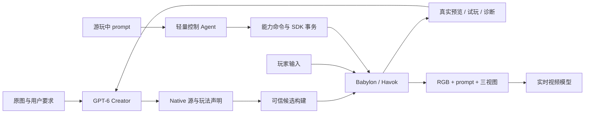

# GPT-6 可控世界创作与实时操作设计

- 状态：Draft — 详细设计已形成；实现、云端部署和产品验收尚未完成。
- 日期：2026-09-05。
- 工作分支：`codex/gpt6-world-agent-refactor`。
- 实现起点：`50a1e14a8f790da8e17c5fd935a3a49817f20e75`，其中继承的 54 个源码变更来自现有工作区，不是本设计新实现。
- 原分支 HEAD：`3bd0ab793bafdb630a1d56d8826653dff1e75952`。
- Native 集成候选：本地已知 `origin/main@761d854fa77c3ea17c6f60cc275974acea505733`；这是固定研究来源，不声称是远端最新状态。
- 基线清单：[source baseline](../plans/2026-09-05-gpt6-world-agent-source-baseline.json)。原工作区未切分支、未清理、未覆盖。
- 执行图：[implementation plan](../plans/2026-09-05-gpt6-world-agent-implementation-plan.md)。
- 云端合同：[Creator Runtime](2026-09-05-gpt6-cloud-creator-runtime-design.md)。

本文中新增类型、工具、包和 CLI 均是拟实施合同。已有同名能力仍以当前源码及实际验证为准；不能把本文件当成已部署能力清单。

## 1. 用户目标与成功条件

用户上传图片和 prompt。GPT-6 还原用户要求的世界、主体及玩法，首帧尽可能与原图一致；用户能够探索 3–5 分钟。白模 RGB 视频、prompt 和对象三视图输入实时视频编辑模型，得到最终画面。游玩期间用户继续用自然语言改变世界，轻量 LLM 通过明确接口执行已有操作，复杂新内容由后台 GPT-6 创建。

已确认视频模型不要求方块几何，也没有本轮要求增加 depth/instance/semantic 输入。颜色用于说明哪些白模对象对应哪些外观，必须保留稳定映射。深度、对象 mask 等可以作为 SDK 内部诊断，不成为视频模型接入前提。

用户所说的“拆件能力”已澄清为 **插件 / 工具能力**。本设计必须证明云端 Codex 能真实调用工具；上传 Skill 文本、设置模型名或 Worker 能渲染均不能替代该证明。三视图仍是用户明确需要的交付物。

| ID | 需求 | 必须获得的证据 |
|---|---|---|
| R01 | GPT-6 原图创作与修复 | 云端请求和实际执行为 `gpt-6-astra / xhigh`；同一创作会话使用真实预览反馈 |
| R02 | 首帧尽量一致 | 原图与真实 Runtime 首帧对比；主体尺度、地标位置、透视、遮挡及用户指定变化的评审 |
| R03 | 自由低模几何 | 真实坡面、曲线轮廓、台阶、桥体和非四种方块 Mesh 通过物理 / 相机 / 导航验证 |
| R04 | 复用现有资产 | 人形、25 个公开动画条目、27 个主体目录条目的资源与能力逐项核对；真实动作播放，不能只数目录 |
| R05 | 3–5 分钟有效探索 | 180–300 秒真实控制器轨迹、目标与区域覆盖、互动、关键帧；不能用面积或绕圈代替 |
| R06 | 轻量模型可控 | 搜索对象、读取能力、结构化命令的端到端成功率、拒绝原因和延迟分布 |
| R07 | 运行中修改不打断玩家 | spawn / resize / NPC / despawn 过程中玩家、相机、tick 连续，失败保留原世界 |
| R08 | 视频条件一致 | RGB、当前 prompt、三视图和外观映射绑定同一有效 revision 与 frame/tick |
| R09 | 云端插件真实可用 | 固定 Runtime Profile 的工具发现、真实调用、图像读取、模型生成图能力及负向 canary |
| R10 | 可维护与可恢复 | 单一状态所有权、幂等、取消、候选隔离、结构变更保存、恢复及证据闭包 |

“无 bug”作为产品验收目标，落实为已声明能力内没有已知阻塞缺陷、必须门禁通过、对抗场景与人工抽样。有限测试不证明所有输入下绝对无缺陷。不能让模型一句“完成”替代证据。

## 2. 已核实的当前基线

| 当前事实 | 代码证据 | 本次意义 |
|---|---|---|
| 正式 Agent 固定 5.6-sol/xhigh，Scene 入口硬传 formal | `scripts/lib/lwdp-codex-profile.mjs`、`scripts/agents/run-spatial-world-agent.sh` | 需要明确迁移正式模型、profile 和审计信息 |
| Planner/Builder 强制分任务，规划图拥有首帧构图权威 | `.codex/skills/worldkit-block-builder/SKILL.md` | 新创作工作流不再继承该权威分配 |
| Builder 云端精简任务包缺完整 SDK；真截图在任务返回后执行 | `scripts/agents/run-lwdp-codex-task.mjs`、`run-spatial-world-agent.sh` | 需要重建云端工具执行路径 |
| 当前 Native API 只有 spawn / static collider 注册 | `packages/native-babylon/src/module.ts` | 通用可控实体是新增能力，不是简单换创作入口 |
| Gameplay 只有 bind/release、activate/cancel 四类命令 | `packages/gameplay-contracts/src/gameplay-contracts.ts:22` | 需要扩展统一命令系统，不能伪装成已有 NPC 能力 |
| Authoring Edit 发布仍 full-reload | `packages/authoring-host/src/journal/receipts.ts:163` | 增量发布是独立 Runtime 工作包 |
| 方块编译实体按 chunk cluster 派生 | `packages/block-world-compiler/src/compile.ts` | 控制身份不能依赖底层合批索引 |
| 分支已有主体/相机 helper 与真实 preview 入口 | `scripts/agents/agent-subject-setup.ts`、`agent-runtime-preview.ts` | 抽离并复用，去掉 Block 专属耦合 |

旧 backlog 和旧设计中的能力范围可能落后于此分支。迁移时回到固定 commit 的源码复验。源工作区后来继续产生的变更不自动进入本基线。

## 3. 总体决策

### D01 — 新 Creator 使用 Babylon Native，复用同一个 SDK Runtime

以现有 [ADR-0007](../../decisions/0007-canonical-and-babylon-native-authoring-lanes.md) 的 Native 方向为底座，按能力切片集成候选 main 的 Admission、Package、Havok 和 Hosted Isolation。新 Creator 每个世界选择 `sceneSource.kind = "babylon-native-scene"`。不扩展旧 Three Block Compiler 来表达任意网格，也不另造第二套 Babylon-like 几何 DSL。

`scene.ts` 及其相对 TS 模块是环境几何创作源。小型 bootstrap 继续描述世界身份、锁定资源、Gameplay 启动与相机意图；不得再次手写同一组环境顶点、落位和碰撞几何。Host 从同一已登记视觉几何及其可验证派生物冻结渲染、碰撞与通行贡献；代理来源规则见 §4.1。

现有 Canonical 入口可继续加载其自身制品。最终 Creator 路由只有 Native 一条；不能在一个世界中同时运行 Block 几何与 Native overlay 来掩盖迁移缺口。迁移期间保留旧工作流仅用于基准和回归，最终 cutover 删除被替代的默认编排，不留下永久新旧开关。

直接 merge main 会丢失本分支部分 Subject Pack、动作、kart 与 3C 行为，因此禁止按目录覆盖。GW-01 必须做语义三方集成。

### D02 — 一个创作会话对真实结果负责



Creator 固定使用 `gpt-6-astra / xhigh`。可以按需使用子 Agent 搜索素材、规划或复核，但候选工作区和最终提交有唯一负责人；不得并行编辑同一候选。规划图、区域草图和分析文件是可选辅助，不能成为必经独立生产阶段。

原图和用户指定变化始终是还原依据。Creator 自主决定调用工具与修复次数，由明确时间/费用/资源预算约束；预算到达只能报告未完成原因，不能放宽门禁。

### D03 — 创作自由与运行责任分离

| 状态或资源 | 唯一 Owner |
|---|---|
| 候选源代码、创作意图 | Creator，限其授权 workspace |
| 已提交环境几何与结构变更 | Native contribution + Host 结构 revision |
| 可控实体身份、能力、关系 | SDK Gameplay / WorldSession |
| 支撑、碰撞、速度和真实移动 | 现有 CharacterMovement / Motion Kernel / Havok |
| 玩家相机与碰撞收臂 | CameraDirector / Hard Decollider |
| 玩家及 NPC 每 tick 输入调度 | RuntimeHost 的一个 fixed-tick transaction |
| 动画状态与混合 | 现有 Action / AnimationPlayer |
| 外观身份、识别颜色、三视图版本 | Appearance Registry 与视觉状态记录 |
| prompt 变化的已接受/已生效状态 | 统一 command journal + mutation coordinator |
| 正式发布、签名、S3 | 可信 Host；Creator 无签名权 |

Native 创建普通视觉 Mesh。禁止它创建独立 Engine、Scene、主相机、物理世界、输入循环，或保留任意 observer/timer 在运行期间继续写 SDK 状态。自定义玩法通过已登记行为扩展执行，而不是解除这些状态边界。

## 4. 可控实体与几何合同

### 4.1 构建期登记

扩展现有 Native registration。下面是形状示意；GW-02 负责将它落实为唯一导出类型、parser、schema 与调用路径：

```ts
registration.registerEntity({
  id: "gate-west",
  displayName: "西侧城门",
  semanticTags: ["gate", "landmark"],
  visualRoot: gateRoot,
  appearanceRef: "worldkit://appearance/west-gate@1",
  physics: { kind: "static", colliderSource: { kind: "visual-geometry" } },
  capabilityRefs: ["worldkit://entity-capability/visibility@1"]
});
```

`visualRoot` / Mesh 只存在 Provider-specific 构建合同。Host 必须冻结归属，不把 Handle 序列化进 Command、WorldState 或 Package。不能以 Mesh 名称、颜色或 animation 名称推导碰撞/玩法。

- `id` 是稳定语义实体身份，不能来自数组下标、chunk 顺序、坐标或内容 hash。
- 独立可改的门、桥、树、NPC 单独注册；不可独立操作的三角面无需独立实体。
- Host 维护 entity → render instances / colliders / traversal surfaces / appearance 的索引和反向索引。
- batching 不得吞掉可变实体身份；需要拆分时由 Host 更新批次。
- 拥有同一外观的重复实例可共享 `appearanceRef`，不能共享可控 entity ID。
- 隐藏的未登记视觉可以存在，但不能被声明为交互对象、可站立地形或重要的可控实体；交付审计核对承诺的对象。

Collider 来源是闭合 union：`visual-geometry` 直接使用同一登记视觉几何；`derived-proxy` 只能引用 Host 从该视觉几何生成的代理及锁定 derivation profile/hash。Creator 不能另交任意隐藏坡面使可见楼梯通过验证。代理和视觉在同一 entity-local 坐标中，实体 transform 只有 Runtime 一个 Owner。

代理 profile 必须验证支撑面垂直偏差、边界/开口保真、主体净空、接触区与重要遮挡轮廓。允许误差由 GW-05 实验冻结为明确的 meter-valued 阈值；未经该 profile 验收不能接受代理。缩放/替换重新执行这些规则，并检查 world-space transform 一致。导航继续从最终 collider 生成，结合视觉/碰撞对应证据共同验收，不能单靠导航通过证明几何正确。

### 4.2 自由低模 Profile

首轮支持经过实际验证的静态三角网格、程序化坡面/地形、多层桥与平台，以及锁定资产。保留有限值、拓扑、单位、几何预算、退化三角形、winding、transform 等机器检查。

真实碰撞采用哪种 Havok 表达、哪些动态对象可以重建或缩放，先通过 GW-05/GW-08 的引擎实验确定。非均匀缩放、任意 deformable mesh、粒子交互或新的物理算法不能仅因 Babylon API 存在就列入能力目录。不能把不支持的 collider 静默替换为无法还原通行的外包盒。

方块 helper 可作为便利库。固定四种尺寸、0.5 米微网格和五个目标槽位不属于新 Creator 的全局合同。

### 4.2.1 新程序化对象的定义与实例

Creator 可以把新道具、生物代理或机关的局部构建模块发布为可复用实体定义。拟提供 Creator-only 的 `assets.publish_definition`：接受候选 source、默认参数 schema、局部几何、同源 collider 策略、能力及 appearance 引用；Host 执行准入、构建、测试并发布内容锁定的 `definitionRef`。运行中的轻量模型不直接上传或执行 factory 代码。

构建 factory 只在隔离候选环境执行，输出 Host 固化的局部模板；不得选择世界落点、生成运行 entity ID、创建控制器或持久运行循环。影响几何的参数变化重新走候选构建，不能通过所谓快速 setter 跳过验收。已发布模板的再次实例化可缓存。

初始 `registerEntity` 和后续 `entity.spawn` 都引用该定义，SDK 负责每个实例的稳定 ID、落位、状态和生命周期。结构日志绑定精确 `definitionRef` 与参数。验证覆盖：新生成程序化道具 → 发布定义 → spawn 两次 → 独立改尺寸/移除 → 保存恢复；不能用整场景重新生成代替。

### 4.3 持久结构与运行状态

当前世界由以下内容共同定义，而非两份竞争的几何源码：

1. 不可变 Native source revision、已锁定资源和行为实现；
2. SDK 解释的有序结构变更日志（实例化/移除/尺寸/持久外观等）；
3. 单独的运行 checkpoint（玩家/NPC 位姿、速度、动作、行为、tick、随机状态和事件游标）。

结构日志是对基线的操作，不重新序列化全场景顶点。Host 将基线与操作 materialize 成当前 Package，绑定 source、operation、capability 与 appearance hash。保存/重载必须保留已提交用户修改。

原始自然语言/相对意图与已解析 canonical operation 分开保存。提交记录必须包含最终 entity ID、锁定 definition/参数、绝对 transform、随机/候选选择结果、解析所依据的实体版本和有效 tick。恢复只重放已解析操作，不重新计算“玩家前方”或重新抽样。若准备期间参考对象移动使相对要求失效，提交前重新准备并记录新的解析结果。新增门禁：树生成后玩家移动，再保存重载，树仍在原位置且 ID 不变。

Checkpoint manifest 绑定 `worldRevision`、结构日志序列、command journal 幂等水位、统一事件序列、simulation tick、Runtime snapshot hash、行为/资源/SDK 版本和后续输入日志起点。不同 revision 的 checkpoint 不能拼装恢复。具体 durable commit 状态机见 §9.1。

后续 GPT-6 重写源代码时，按稳定实体 ID 对旧基线、新基线、当前修改进行三方合并。冲突返回创作工具，不能用重新生成覆盖用户已经提交的变更。确定性回放的承诺限定于锁定版本和经测试环境，不宣称跨设备 Havok 逐比特一致。

## 5. 资产、动作、颜色与三视图

### 5.1 保留资产投资

将现有 `agent-authoring-catalog` / `subject-setup` 从 Block 类型中抽离为 Registry 只读投影，继续提供 search、describe、实例化 helper、动作和镜头建议。基线可见 27 Subject Pack、4 Motion Pack、5 Camera Pack、G Bot 25 动作条目。

GW-04 逐项核对文件可用性、hash、Definition、rig、动作、socket、Motion 和 Camera。当前部分动物/车辆是静态模型；不能因为有名字或目录条目就声称有骨骼动画。动画 clip 与玩法能力分开；游泳姿态不授予游泳运动，攻击姿态不授予伤害逻辑。

推荐复用匹配的主体与动作，允许 Creator 为主要体型、轮廓、姿态或互动需要创建新几何。新骨架与动作重定向仍走资产准入；不得在每个世界里临时猜骨骼绑定。

### 5.2 外观身份与物理解耦

新增 Appearance Registry，资源声明颜色 token、文字描述、参考图裁剪、所属完整对象、三视图和版本。颜色只用于视觉映射，物理与可通行性存在独立属性中。颜色数量由可区分性与视频模型实际能力评测决定，不能任意承诺无限独特颜色。

颜色分配由 Host 稳定生成并可解释。相邻重要外观组应足够可区分；重复外观可共享。白模与 prompt 中使用同一映射；主体、挂件、三视图的完整组装归属必须一致。内部精确 ID pass 与用户白模颜色渲染分开，不能用有光照的 RGB 反推实体身份。

### 5.3 三视图闭包

最终运行几何生成 Front / Right / Back 白模三视图，三面共享尺度并使用明确语义正面。人形记录规范姿态或采样 tick；完整组装包含附件。外观参考三视图由图像生成能力基于真实三视图、用户参考和同一外观 anchor 生成，并检查视图顺序与对象完整性。

视频默认交付包包含白模视频、当前 render prompt、颜色→外观映射及接受的外观三视图。白模三视图保留为结构证据。未改变的外观资源按 hash 复用；几何/组装/外观改变使对应下游证据失效。

## 6. 单会话 Creator 工具与 prompt

工具来自一个受版本管理的 `worldkit-creator` 插件/MCP 包。CLI 和 MCP 调同一应用服务，不分别实现物理或验证。具体工具名由 GW-02 冻结；能力分组如下：

| 工具族 | 输入 | 结果与用途 |
|---|---|---|
| environment / assets | 当前 profile，搜索条件，资源 Ref | 生效环境、可用能力、短目录、真实模型/动作预览；Creator 可提交新定义候选 |
| world.validate | 不可变候选源标识 | 编译、注册、引用、资源、碰撞和能力合同诊断 |
| world.preview | 候选 + opening / 指定检查视角 | 真实 RGB、相机与碰撞报告、对象投影、可查看图像 |
| world.playtest | 候选 + 输入序列或探索目标 | 实际控制器轨迹、动作事件、关键帧与短片 |
| world.inspect | 对象/区域/当前操作 | 相关状态、能力、路径、支撑和错误定位 |
| world.capture_triviews | 候选 + appearance refs | 真实完整对象三视图及 hash 映射 |
| world.submit | 候选 + 所需证据引用 | 封存候选并交给独立可信验收，不能自签成功 |

所有证据带 creationSessionId、candidateId、sourceHash、SDK build hash、工具版本和 artifact hashes。实际 Native Package identity 复用现有 source-neutral identity；上述是工具信封，不另造物理真相。

preview / playtest 等长任务先返回 operation ID，通过 inspect / cancel 获取最终结果；同候选有唯一运行变更序列。旧候选的异步图像不能覆盖新候选证据。工具结果提供图像内容或真正能读取的本地路径；仅写路径字符串不算模型已查看。

Creator 核心说明只保留：

> 以原图和用户要求为目标创建可游玩的世界。优先复用现有资源；可自由编写准入的几何与玩法。为需要控制的对象登记身份和能力。用真实预览检查首帧与多视角，用实际试玩验证探索和交互。根据工具诊断持续修复。不要绕过 Runtime 所有权，不要修改 Host 派生证据；预算用完时如实报告未通过项。

详细工具参数与素材按需发现，不把整个目录和维护文档堆进初始 prompt。宿主工程用 AGENTS 与 Creator 工作区的短合同分开打包，防止旧的四方块、统一后视、固定 Planner 阶段继续影响新 Agent。

## 7. 首帧、相机与探索验收

### 7.1 首帧

用户要求的显式变化优先；其余可见投影以原图为准。取消统一居中、统一正后方和默认重排世界适配 yaw=0 的规则。

初始 Camera intent 由 SDK 相机合同承载，支持经确认的初始朝向、pitch、FOV、距离和目标。首次输入后的跟随相机过渡有独立策略，仍由 CameraDirector 执行；不允许 Native 私设 activeCamera。相机碰撞、最小安全距离和 reset 重现均需验证。

预览和最终视频共享明确的 viewport/resolution profile；在视频服务接受的尺寸中优先保留原图比例。需要裁剪、留边或转换时记录精确映射，并据此比较构图，不能继续隐含固定 16:9 或把拉伸后的匹配当原图还原。

首帧评估包括主体位置/尺度、地平线与透视、重要地标的屏幕区域、前后层次、遮挡和主要体量。RGB 像素差不能直接作为主指标，因为白模配色与原图不同。先用固定小基准校准构图容差与盲评规则；阈值冻结前不宣称达到自动相似度 GO。

候选还需侧/后/上视图与移动短片，排除薄片布景和相机外结构不成立。真正生效的 Spring Arm 缩臂必须出现在报告中。

### 7.2 探索与可玩性

以承诺的探索区域、目标和行为验收，不要求一切装饰表面都相连。地面、飞行、水面等运动能力分别确定承诺域；缺少真实能力时返回 gap。

- 从冻结 collider geometry 生成 Native 通行候选，复用 Recast/既有通行机制；无第二个自造地面高度真相。
- 真实控制器跑通关键连接、目标和返回路线；Recast 连接不等于 Havok 能通过。
- 一次 180–300 秒模拟探索包含新区域、视角变化及交互；不得 teleport/reset 凑轨迹或仅绕圈。
- 桥头、台阶、低顶、斜向窄口、坠落恢复、靠墙转镜头和跨 chunk 边界有对抗检查。
- 模拟时长、实际运行帧时间、输入延迟、内存峰值分别记录。模拟 300 秒不证明目标设备能实时显示。
- 最终视频回路单测输入到显示延迟、长时身份、快速转头和变化同步；SDK 通过不代表视频模型已通过。

测试阈值和目标设备由可执行 validation profile 记录；延迟数值需测量后冻结，禁止用未经实测的“即时”承诺。

## 8. 轻量实时 LLM 与统一命令

### 8.1 最小模型界面

只提供相关对象查询、能力详情、执行、操作查询/取消。query 返回有限候选和快照锚点；session、调用方授权、command ID、实体版本由工具层绑定。模型不能通过自己填写角色 ID 获得控制权。

普通调用直接使用当前实体投影出来的参数 Schema。参数含单位/坐标域，拒绝未知字段；定义与 handler、运行验证和 catalog 来自同一个注册源。不能只注册名称就开放能力。

保留 `GameplayCommandV1` 与现有 journal 作为统一命令所有者；重构共有 header 与按命令授权，避免所有操作都被迫伪装成玩家 possession。新的 world-control façade 仅负责模型友好投影与路由，不另造状态或日志。

| 首批命令 | 冻结语义 |
|---|---|
| entity.spawn | 实例化已锁定且当前支持的 definition；合法落点、资源、物理、外观和身份一起准备 |
| entity.despawn | 移除运行实体及其依赖；与玩家支撑/骑乘关系冲突时按已声明策略处理 |
| entity.visibility.set | 只改变可见性；工具说明明确碰撞仍保留，不能冒充移除 |
| entity.resize | 有验证范围的统一尺寸比例；比例相对定义基准，Host 从观察值解析“变大20%”；同步 collider/socket/envelope |
| npc.moveTo / follow / patrol / stop | 目标级行为，SDK 连续执行；有取消、阻塞、完成与替换语义 |
| action.activate / cancel | 复用已有动作系统，为自主 NPC 增加真实授权，不伪造玩家控制 |

示意的低负担参数：

```json
{"type":"npc.follow","actorEntityId":"guard.gate.left","followedEntityId":"player","followDistanceMeters":2}
```

自然语言“前面出现一棵树”由明确相对位置参数交给 SDK 在提交时解析；模型无需猜世界坐标。目标歧义时返回候选，不能把不唯一的名字随机匹配。

实时模型的具体型号由独立小型 benchmark 选择并配置，不能从本设计猜定。既有快速命令无需 xhigh；创作新资产、大改地形、未知玩法交给后台 Creator，准备完成前玩家继续游玩。

### 8.2 NPC

NPC 行为执行器保存 execution ID、actor、目标/路点、path revision、进度、启动 tick、取消与失败信息。状态使用 preparing / active / completed / blocked / failed / cancelled；accepted 不代表完成。

每 tick 先收集玩家与所有 NPC 意图，再推进一次世界物理。复用现有 motion kernel、CharacterMovement、Havok 和动画，不逐 NPC 推进整个世界，也不直接改 Mesh.position 达到目标。

这里“收集”仅收取已经在输入截止点之前完成校验的有限意图，不能等待 LLM 或任意扩展代码。可信内置行为可在预算内同步计算；隔离自定义行为使用 §8.3 的异步输入邮箱。

同一 NPC 的移动行为只有一个 Owner；新目标按操作策略替换或拒绝旧目标。玩家接管时统一暂停/取消自主控制。障碍变化使路径失效并重规划；不可达时报告阻塞，不能穿墙或暗中瞬移。

### 8.3 自定义玩法扩展

Creator 可注册带 schema 的自定义动作及序列化行为状态。SDK 为一次性状态修改与持续行为提供默认生命周期；特殊实现只补所需部分。自由代码经 source admission 和行为 conformance 后运行在受限扩展执行器，通过 SDK 意图/变更端口作用世界。

行为执行器不共享可信 Host 权限；运行预算、异常、取消、snapshot/restore 和 throwing cleanup 必须可测试。不能把任意闭包持久状态、定时器或用户代码直接放进 Havok transaction。新增算法先在候选环境验证，再进入能力清单。

扩展输入为带 `observationSimulationTick`、结构 revision、actor 版本和 execution generation 的只读快照；返回值声明 `effectiveSimulationTick` 与允许的有限意图。Runtime 的输入邮箱按执行身份、版本、生效窗口和单主体 Owner 校验。过期、取消、被新行为替换或旧进程 generation 的结果一律拒绝。

固定 tick 不等待扩展完成。缺席/超时使用注册行为明确的安全默认（首版停止施加自主 locomotion 输入，物理继续）；连续超时达到 profile 上限后终止该行为并发出诊断。意图只能在已声明窗口内生效，不能无限沿用上次方向。恢复后所有旧执行器 generation 作废。测试必须含脚本无限循环而玩家仍能移动、取消后晚到结果、恢复后旧进程回包。

## 9. 增量事务、并发与恢复

结构变更分为准备与提交。准备在隔离候选资源集合中加载资产、创建几何和 collider、计算受影响导航与外观；当前玩家继续运行。提交在 fixed-tick 边界短暂执行，重新检查实体版本、当前玩家支撑和依赖，成功才切换 revision。

拓扑变更还必须继承当前世界已承诺的探索目标、路线与通行域合同。spawn/resize/removal 计算受影响区域并检查必达目标、唯一出口和关键连接；必要时执行真实控制器局部探测。提交前确认相关结构/路线版本未变。用户明确要求封路、塌桥等玩法时，同一事务必须更新目标/路线及恢复策略；不允许用自动删掉验收目标来让普通修改通过。加入堵住唯一桥口/出口的负向门禁。

必须保留 worldSessionId、simulation tick、未受影响位姿/速度/动作、玩家控制、输入和相机 orbit。修改实体只能采用通过验证的状态迁移。出现意外依赖冲突时保留旧世界，不自动 full reload 或偷偷回出生点。

复用已有 command / authoring journal，由一个 mutation coordinator 仲裁跨域变化：

- 同 ID 同内容返回原结果；同 ID 不同内容拒绝。
- 结构 revision 不随 NPC 每帧移动递增；提交时对结构和即时支撑分别检查。
- 独立对象可并行准备，提交串行化；同对象冲突有明确结果。
- 长操作返回 accepted + operation ID；取消是独立可重试操作。
- 已提交变化不能假装取消回滚；反向操作是有新身份的补偿变更。
- 回执包含 accepted/committed/completed、affected entities、effective tick/revision 和诊断。

第一切片 resize 只覆盖经验证的 prop 及适用状态的人形 NPC；玩家自身、骑乘组合、任意地形或非均匀缩放不能通过一个通用 setter 宣称支持。最终范围按已完成能力发布，不改变用户总体目标。

### 9.1 持久提交与崩溃恢复

由 mutation coordinator 串联两类现有 journal，而不是分别提交后拼接结果。每次结构操作有唯一 transaction ID 和以下持久状态：`prepared → commit-decided → runtime-applied → committed`；提交决议前可 `aborted`，之后的取消遵守补偿规则。

`prepared` 保存精确 resolved operations、候选资源哈希、前置 revision、受影响约束和恢复材料。最终校验、提交预约及受影响依赖的保护必须在 durable decision 之前完成；abort/reprepare 也只允许发生在决议前。GW-08 必须证明依赖条件在决议至应用期间保持有效，并定义有界提交调度和必要的安全状态迁移，不能依靠暂停整个世界等待持久化。

`commit-decided` 是不可退回 aborted 的 durable 决议，绑定统一 commit manifest、目标结构 revision、计划生效边界、前置 checkpoint 与 journal 游标。Runtime 只消费已就绪的决议，在生效边界更新所有相关 Owner；不能在物理 step 内等待任意网络、模型或资产加载。决议后的事务只能完成、确认既有结果或进入显式补偿，不能事后重新解释/拒绝同一已决操作。若无法证明这些提交条件，该操作不得进入实时能力目录。

`runtime-applied` 记录实际有效 tick、状态迁移结果和 snapshot/event hash；只有这些数据、结构日志和 command 幂等结果在一致 manifest 中持久闭合后，才能对外返回 `committed`。后续行为完成另发 `completed`。接收成功、模型工具超时与持久提交是三个不同结果。

崩溃恢复只选择完整一致的 checkpoint/manifest，再处理未完成事务：无提交决议的候选释放；已有决议但运行切换未知的事务按锁定 resolved operation 和 journal 在恢复环境完成或确认既有结果，不生成新的 ID、不重新解释意图、不重复 spawn。恢复创建新的运行 incarnation，持久 command ID 继续去重，旧进程/会话的迟到写入被 fencing 拒绝；正常热修改保持同一 worldSession，进程重启的身份恢复不冒充未重启。

GW-08/GW-13 必须替换当前仅支持 full-reload 的 durable publication recovery 分支，并在 prepared、decision、runtime switch、receipt 持久化各切点注入进程中断。检查结构、玩家/NPC checkpoint、事件与幂等水位是否一致；不能只测试正常保存按钮。具体持久存储事务与生效调度由该工作包在锁定 Runtime 上证明，未通过不得发布热更新能力。

## 10. 视频条件与视觉变化

视觉状态记录作用对象/环境、appearance ref、描述、优先关系、生效/结束 tick 及版本。prompt 从当前状态生成，不无限拼接历史字符串。

| 请求 | 白模/SDK 工作 | 视频条件工作 |
|---|---|---|
| 极光 | 保存视觉事件，通常不新增 collider | 更新当前视觉描述与持续区间 |
| 可接近的龙 | 实体、主要轮廓、位置、运动、必要交互 | 准备同一 appearance 的三视图和描述 |
| 月球外观 | 可保留原地形与物理，明确是外观变化 | 月面/天空/光照条件 |
| 月球低重力与新月坑 | 真实物理/地形能力；未实现时转后台或明确 gap | 与提交 revision 一起切换外观 |

每个输出条件包绑定 world revision、simulation tick/frame index、RGB、render prompt、appearance map 和三视图 hashes。模型输入仍为用户确认的三种内容；系统内部保留元数据以拒绝过期结果。

结构与外观需要同时改变时，先准备两侧候选再生效；不允许 prompt 已出现可骑乘龙而白模仍无该实体。视频失败时 Runtime 继续，前端呈现已定义的白模/等待状态；不能把旧画面伪装成新世界。

真实视频 endpoint、分辨率/FPS、时延预算和接受的三视图编码尚未提供。GW-12 先完成明确适配合同与记录/重放 fixture；GW-15 必须使用实际服务验证，mock 不算产品 GO。

## 11. 云端插件能力是发布条件

主路线：LWDP 增加专用 Creator Runtime Profile 和资源池，复用其账户 lease。Codex、固定 SDK、素材、WorldKit 工具 Host、Chromium、ffmpeg 在同一任务环境可达，但可信 Host 与任意生成代码保持进程/权限/浏览器隔离。完整设计见 [云端规格](2026-09-05-gpt6-cloud-creator-runtime-design.md)。

本项目负责镜像/插件/工具包、客户端和证据；LWDP 负责受控 profile 字段、镜像与资源映射、账户选择、配置生成和调度。`runtime_env` 不作为动态安装依赖的机制。平台新字段当前尚不存在，禁止客户端静默忽略后继续当成功。

必须实际验证 shell/file tools、图像输入和看图、MCP 发现与调用、完整模型/动作加载、真实 WebGL/Havok preview、试玩/录制、三视图，以及需要外观图的 profile 中的 built-in imagegen。不依赖用户桌面的 CUA、已登录第三方插件或任意个人 config。

工具包在新 Codex session 启动前就绪；必需 MCP 初始化失败应阻止进入 authoring。长工具使用 operation receipt 和查询/取消，不能因默认 RPC 超时而伪造完成。

模型 receipt 记录实际 model/effort、CLI/plugin/SDK/runtime digest、账户能力探针和调用证据。缺能力报告基础设施失败，不降级模型、不用软件预览冒充 Runtime，也不省略要求的最终图像。

## 12. 验证与切换

### 12.1 逐级验证

1. 合同：schema/handler/capability 同源；稳定身份；跨版本与未知字段拒绝。
2. 本地真实 Runtime：自由网格、资产动作、首帧相机、NPC、增量状态、保存恢复。
3. 云端工具 canary：实际 GPT-6 使用插件、看图、真实预览与图像生成；账号或镜像缺项必须失败。
4. 云端完整场景：原图创作 → 至少一次基于真实预览的有记录修改 → 180–300 秒探索 → 三视图 → S3 → Studio 游玩。
5. 云端控制：生成守卫 → resize → 到桥边 → follow → patrol → stop → despawn → 保存/恢复；玩家状态连续。
6. 实时视频联调：RGB/prompt/三视图映射、极光/实体出现/外观切换、过期帧和长时一致性。
7. 对抗与回归：取消、重复请求、延迟提交、浏览器退出、素材缺失、不可达路径、脚下几何变化、并发两案例、两个 NPC 互不污染。

### 12.2 效果实验

固定代码、参考图、资产、工具版本和预算，至少比较 A=5.6旧流程、B=6旧流程、C=6工具驱动。C 的自由几何扩展作为后续可辨识实验维度，不把模型、物理、工具和配色的同时变化全部归因于 GPT-6。

首轮用已有海岸灯塔案例及另两个覆盖坡/桥/复杂构图的固定案例。保存原输入字节、用户事实、基线、命令日志、首帧、多视角、轨迹、实际耗时与成本；不同流程的产物用盲评规则比较。旧案例 passed 只作历史证据，不直接证明新树正确。

### 12.3 最终 cutover

Studio 新建世界进入新 Creator；新制品、控制投影、视频条件与 source kind 一致。旧流程从默认路径退出，历史制品仍按其锁定格式读取。所有 Agent 文档、模型文案、测试、catalog、部署 profile 和实际 worker digest 同步更新。

只有全部必需证据齐全才能标记 cloud/production GO。设计完成、CLI dry-run、mock、目录里出现工具文件，均不算云端跑通。

## 13. 本设计阶段结果与未决验证

本阶段已经完成隔离分支和源码快照，并以静态源码研究形成主路线。尚未改 Runtime、安装云端插件、升级 LWDP、部署 Creator 镜像或发起新云端任务。

以下通过前置工作包获得实证，不需要重复请求用户批准已授权重构：

- GW-01：固定 Native donor 的实际源码与本分支 3C/资产语义集成边界。
- GW-03：当前部署 LWDP 版本、GPT-6 与插件能力、runtime profile 扩展和账户配置机制；7 月本地源码只能作线索。
- GW-05/GW-08：锁定 Babylon/Havok 下自由几何、collider 更新、导航与状态迁移。
- GW-14：构图容差、探索质量与目标设备性能阈值。
- GW-12/GW-15：用户的实际视频服务接口与实时体验基准。

## 14. 参考

- [OpenAI GPT-6 Astra](https://developers.openai.com/api/docs/models/gpt-6-astra)：模型名、推理档位。
- [GPT-6 使用与迁移](https://developers.openai.com/api/docs/guides/latest-model?model=gpt-6-astra)：升级时检查旧技能与指令；不能把公开支持当成本账户可用性证明。
- [Codex MCP](https://learn.chatgpt.com/docs/extend/mcp?surface=cli)：STDIO/HTTP、必需 server、工具选择和超时配置。
- [审查协议](../../reviews/full-dimension-review-protocol.md)、[Runtime 审查清单](../../reviews/runtime-deep-review-checklist.md)：证据分层与状态 Owner；旧产品范围已由用户本次授权扩展。
