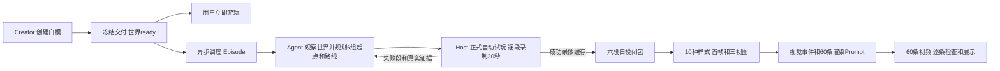

# Three 白模世界接入 Episode 数据生产：Agent 自主路线版

状态：设计 v2 的 SDK、云端工具、录制及样式适配已实现并完成本地验证；指定案例已完成真实云端路线规划与六段无 UI 录制；样式锚点最终 1/10 通过，其余达到修正上限，尚未完成三视图、事件与 60 份请求的端到端验收，Seedance 提交为 0。全局自动交付消费者尚未接入。2026-09-06。此版取代前版“先由 Host 提取可通行区域，再由 Agent 选路线”的建议。当前证据和未接通边界见 [续接记录](../plans/2026-09-06-three-episode-continuation.md) 和 [实现入口](../../../scripts/three-episode/README.md)。

研究基线：`codex/gpt6-world-agent-refactor@2b2d416d`；生产参考分支 `codex/episode-qualified-rerun-repair@3f17d4bc`。用户随后授权在 `codex/three-episode-agent-production` 实施并测试，必须停在 Seedance 提交之前；原创建分支及已发布案例不被替换。

## 1. 决策与产品边界

采用 **已交付世界 → Episode Agent 自主规划六组起点/路线 → Host 正式自动试玩并录制 → 失败段反馈 Agent → 十样式和视频生产**。

取消新 Three 支路中独立的 Host 区域提取、全图导航扫描、候选出生点目录和路线目录生成。Agent 能直接读冻结源码、已有世界规划图、实际预览和注册对象信息，按需获取坐标与局部物理事实。Host 保留指定起点检查、真实操控、录帧与错误反馈。

白模创建 Agent 的任务、工具使用要求和交付门槛保持现状：无需另写六段路线、区域报告、录像脚本或等待后处理。SDK 的自动观测/录制能力是一次性框架建设，不转化成每个 Creator 的额外任务。

世界与 Episode 有独立生命周期。白模 ready 后用户立即可玩；生产失败、排队或部分完成只更新对应 Episode，不撤销可玩状态，不修改原世界，不自动要求 Creator 重建。



取消区域提取能减少一个前置生产环节，也消除方块世界的区域规则对新世界的限制；不等于不再需要空间理解。Agent 的路线首轮成功率和修复成本需要实际测试，不能预先保证总成本一定下降。

## 2. 如何无缝接上创建流程

### 2.1 交付后自动异步入队

1. 现有创建链完成交付包校验，持久化 ready 与来源 manifest。
2. 在同一持久化记录中记录待调度的 `world.delivered` 事件或 outbox 项，不在创建请求中等待 Episode。
3. 独立消费者以 `worldBuildHash + episodeProfileHash` 为幂等键创建或恢复 Episode。重复通知不能生成两套付费任务；用户明确要求再生产时分配新的 run/seed。
4. 用现有持久化记录和任务队列实现即可，不要求引入新的消息中间件。采用可重放投递、条件写和幂等消费，处理进程在 ready 与消费之间退出的情况。
5. 不依靠用户打开网页或评测页面同步脚本触发生产；它们不是可靠调度源。

自动生产开关与生产策略属于后端配置，不在 Builder Prompt 里开启。重启后从未处理交付记录继续；各阶段实际 provider 提交沿用稳定 request ID 和未知结果对账。

### 2.2 使用原交付包，不重做世界

Episode 输入来自当前闭包：源码、已编译 playable、实际首帧、已有规划图、参考图、三视图及各项哈希。名称、实体位置、角色、动作和相机事实可从 SDK 自动观测接口读取。缺少可选规划图的历史案例仍能通过源码与实际观察规划，不补假文件。

录制 Worker 直接验证并挂载冻结 playable，使用最小静态服务和 Chromium；不启动旧 Studio/Babylon 编译链，不重新运行 Creator。录制浏览器与用户试玩浏览器完全分离，每段 reset 后使用自己的初始状态。共享不可变资产缓存，不共享活的物理世界、镜头或输入状态。

SDK 新版本自动安装 Host 录制口。已有旧包如果没有该能力，保持其原可玩产物；可明确从相同作者源码重建一个用于生产的新版本，并记录原来源和新的 runtime/worldBuild 哈希。不能静默替换已发布世界或把旧视频当作新运行时证据。

### 2.3 状态展示

世界只展示它本身的 ready/创建状态。独立 Episode 展示：规划中、白模录制 4/6、修复 2 段、样式图片 7/10、视频 23/60、失败原因与对应重试项。

每条实际生成的视频一旦完成必要的机器检查即可查看。整组十样式完成是另一个状态，不隐藏已完成结果。没有当前助手手工评审阶段；旧链的自动云端视觉审核属于后续图片生产角色，不影响白模可玩状态。

### 2.4 资源也需要隔离

创建任务与Episode使用独立队列和并发额度，在共享调度器里保留创建优先级/容量。后台样式任务不能无限并发占满Creator的Codex账户或HTTP提交槽位；繁忙时延后新的产数调度，已受理任务继续按原身份完成。GPU录制和用户交互服务也分开部署。

如果底层渠道只提供共享额度，单独进程并不等于容量隔离；需按实际池能力设置配额并监控创建延迟。可承诺的是创建不等待产数，并通过资源策略避免后台生产争抢创建容量，而不是仅靠“异步”声称负载绝无影响。

## 3. Episode Agent 如何直接规划

### 输入

- 用户要求、原参考图、Creator 已有的 ImageGen 世界规划图。
- 冻结的世界作者源码，可按需搜索，避免把整个 SDK 和资产二进制塞进上下文。
- 原始开场图、已有完整目标三视图，以及 SDK 注册对象的名称、ID、位置、外观描述。
- 当前角色尺寸、移动方式、walk/run 速度、跳跃能力和相机模式。
- 按需实际预览。俯视预览是现有世界的真实画面，可附坐标标记；不计算区域标签、路线目录或全图导航白名单。

规划图表达创作意图，实际场景和物理反馈表达执行事实。两者不一致时，Agent 以冻结代码和实际观察修正路线。

### 决策

同一个 Episode Planner 一次规划六组不同起点、初始朝向、途经点、步行/跑步偏好和观察用途。路线可以经过开放空间、道路、台阶或室内，只要实际能力支持；不需要命中 Host 预先采样的坐标或邻接格点。

六段应尽量体现不同位置、视角和空间关系；不能用几乎相同的起点微移伪装六组。这个选择由 Agent 根据内容作出，Host 可提供起点/实际轨迹重叠统计，但不需要先划分六个“认可区域”。六段采样仍不能证明全世界连通或全部覆盖。

路线应足以支持接近完整三十秒的游玩。开放路线可以长于三十秒而在录制时限结束；只有 Agent 声明可逆或闭环时，执行器才按其声明回走或循环。环路最后到最初的边也必须真实走过。取消旧“至少12m+固定往返”的全局限制，不以反复短圈作为默认录制策略。

### 最小计划示意

下面仅演示建议字段，不是实际 case 路线，版本和类型尚未发布：

```json
{
  "kind": "worldkit-three-episode-plan",
  "schemaVersion": 1,
  "worldBuildHash": "由任务输入提供",
  "segments": [
    {
      "id": "segment-00",
      "start": {
        "positionWorldMetersXYZ": [10, 0, 5],
        "facingYawRadians": 0
      },
      "waypoints": [
        {"positionWorldMetersXYZ": [10, 0, -10], "gait": "walk"},
        {"positionWorldMetersXYZ": [20, 1, -30], "gait": "run"}
      ],
      "endBehavior": "stop",
      "coverageTargetIds": ["main-landmark"],
      "purpose": "沿通路观察主要地标及其周边空间"
    }
  ]
}
```

真实提交需要六段；时长30秒、帧率、分辨率和编码由生产策略提供，Agent 不重复填写技术常量。`endBehavior` 可以是 stop/reverse/loop，默认 stop；太早结束导致长时间静止时返回路线不足。逆行或闭环的安全性不能只由 JSON 声明证明。

实际按键时序、物理参数、镜头插值、视频 Provider 请求都不进入这个计划。需要特殊观察或交互时，Agent 描述意图/引用已注册动作，Host 仅执行 SDK 宣布支持的能力。普通六段流程无需额外玩法扩展。

## 4. 给 Agent 的工具与内部 SDK 接口分开

### 三个 Agent 工具

| 建议工具 | 输入与返回 | 使用方式 |
|---|---|---|
| `episode_observe` | 开场/俯视/局部实际预览，或按 ID 查询实体和源码相关信息；返回图片、viewId、相机矩阵、世界版本、有限状态 | Agent 按需看世界，不自动先跑全场侦察 |
| `episode_probe` | 通过 viewId+画面点获取世界坐标/法线/对象，或检查指定起点与朝向的支撑、碰撞和相机状态 | 只回答所请求的点；可以批量几个指定点，不扩散搜区域 |
| `episode_submit_plan` | 首次提交六段，或以原计划版本为基准替换失败段；返回已受理操作及各段状态 | Host 随后自动调度正式录制；完成/失败异步回写，不要求模型逐帧轮询 |

这些能力要真实安装到云端 Episode Agent 的工具环境，并与冻结 SDK/协议匹配。单独给 Prompt 写“你可以看页面”不算接通。工具只读取世界和写入 Episode 计划/证据，不能向 Planner 暴露修改源世界的工具。

点选可能命中屋顶、桥面或非碰撞装饰。返回结果明确区分视觉命中、真实物理支撑及高度，不默认穿过屋顶替 Agent 选楼下。Agent 可以换视角或点选更明确的位置。

指定起点允许在约定的小范围内对齐支撑高度，但必须返回 requested/resolved 位置；保留 XZ 和楼层语义。没有支撑或身体穿墙时直接反馈，不静默换到最近“安全”房间。

### SDK/Host 内部接口

| 接口职责 | 承诺 |
|---|---|
| capabilities / observe / pick / probe | 来自真实世界及当前主体，局部查询不触发全图 NavMesh 构建 |
| prepareSegment | 暂停实时循环、reset、准备起点与相机、提交中性 tick，读取真实首帧；只在录制开始前定位 |
| advanceAndRender | 使用同一个 World 的输入、60Hz 时钟、物理、动画和相机，返回已提交状态、真实图像字节与 tick |
| abort / release | 停止该段并清理独占资源；不影响用户世界或其他录制段 |

标准 SDK 跟随相机从世界已有的相对构图初始化；起点变化时正确平移/旋转跟随关系，不沿用上个起点的绝对机位。固定机位或自定义相机走其明确声明的初始化能力，不一律改成某个固定第三人称模板。

这套内部接口自动由 SDK 安装，Creator 无需增加一行产数胶水代码。它是框架适配工作，目前尚未全部实现。

实际观察和正式录制使用同一个生产视口设置；1280×720属于产数副本，不能修改用户原页面的画布。若原世界为不同宽高比，记录产数相机/投影及该段真实首帧，不能声称六个新机位仍与用户参考图首帧相同。

相同源码哈希不自动保证每次初始化生成相同地形。默认复用同一次初始化后的reset基线；跨浏览器并行前验证初始实体/几何/seed身份一致。依赖非受控随机数或外部时间的世界，不能把六个不同初始化结果冒充同一个冻结世界。

## 5. 正式自动试玩就是第一次生产录制

提交计划后，六段按资源槽位独立执行：

1. 从相同冻结交付包 reset，准备这段起点。局部支撑/重叠/相机检查并入初始化。
2. 立即开始正式录制，不先要求六次短试录通过再重复全录。
3. Host 根据当前位置、目标点和当前镜头坐标系转换移动输入，持续按真实玩家控制执行。
4. SDK 负责碰撞、台阶、坡面、角色动作、相机避障与恢复；Host 不通过修改根位置或播放预先写好的位置曲线完成路线。
5. 每个输出帧按调度推进2/3个60Hz tick并捕获一次实际渲染；保存三十秒、720帧的白模视频、无损首帧和真实状态时间线。
6. 成功段直接缓存，失败段保存失败窗口并反馈；不能截掉失败内容后拼接新起点来凑足三十秒。

Host 可做镜头相对输入换算、朝目标的连续纠偏，以及沿实际已走过且仍有支撑的轨迹有限退回。它不调用全图寻路替 Agent 重新规划，不自动绕去另一条走廊，不传送过障碍。小范围恢复失败后，让 Agent 改途经点。

旧默认录制有每段小幅俯仰，00/02/04各一次原地观察和能力允许时的一次跳跃。新版本将其写入可版本化的录制策略，并根据实际角色/镜头能力执行；不强迫不会跳的主体做跳跃，也不把暂缓观察直接当世界失败。修改策略时同步 trace 和健康条件，保持数据分布可追溯。

固定步进只控制 SDK 所有的时间状态。作者若使用独立 Date.now/setInterval 驱动场景，不能假定它已精确重放；报告相应能力缺口。现有 world.onUpdate 的 simulation time 是正常可录制的使用方式，不另增 Creator 自测流程。

## 6. 失败反馈和局部修复

### 反馈要能让 Agent 直接改路线

每个失败段返回：失败类型与时间、当前途经点、实际人物位置/支撑状态、目标位置、碰撞对象、最近真实输入、实际已走轨迹、最后有效支撑位置、失败前后少量关键帧。短失败片段可用来观察，但不要求模型把完整长录像看一遍。

例如在某个转弯处撞到一根柱子，反馈应明确指出“第3个途经点之前、某位置、命中 pillar-east、沿目标方向没有进展”，附局部图；不能只返回“录制失败”。Agent 可以插入转弯点、改步行/跑步或另选起点。

区分三类失败：

| 类型 | 处理 |
|---|---|
| 路线/起点问题 | 把失败段交回 Episode Planner，保留成功段，修计划再录 |
| Runtime/SDK/世界本身错误 | 保留复现与失败状态，不让 Planner 擅自修世界或反复换路线掩盖错误 |
| 基础设施/配额/传输问题 | 按原任务身份对账或基础设施策略重试，不消耗内容修复次数 |

建议首次录制后，每段最多两次有新证据的计划修复，作为可配置生产预算。相同失败没有新计划/输入变化时不原样重跑。六段的失败可以合并反馈给同一个逻辑 Planner，避免为每段重启一套完整世界分析。

健康判断继续记录 Runtime 错误、时间停滞、移动不响应、撞墙滑动、路线偏离、无支撑坠落和长时间静止；阈值按当前角色速度/尺寸/移动方式和有意观察窗口解释。到达、退回、偏离都使用三维/楼层语义，不能只按XZ距离。下坡失败证据从真正失去支撑的窗口定位，不能把正常有支撑下降当成坠落。

### 缓存与失效

单段缓存身份绑定世界/运行时哈希、单段计划、起点策略、输入/镜头策略、seed、视口、录制器版本。六段合并后的 trace/manifest 另有集合身份。

- 只改03路线：重录03，重新闭合集合；其他白模段复用。
- 03视频改变：重新计算直接读取它的首帧、Prompt、渲染请求与成片。
- 00外观锚点、共享样式定义或三视图改变：可能影响同样式全部六段，按依赖失效。
- Gemini原来一次读取00/02/04：其中一段变化会使联合事件输入过期，不能只改视频而沿用旧事件。
- 世界/RNG或运行时变化：产生新的录制来源身份。

把“整集完整性哈希”和“任务实际输入哈希”分开，避免改一段就因旧整组hash耦合而重做六段十样式；同时也不能为了缓存错误复用下游。

## 7. 十样式及渲染继续复用

六段白模完成后接现有后处理：十样式规划→十个首段外观锚点→各样式其余五张首帧和完整目标三视图→自动视觉/多样性检查→每样式事件→六十条Prompt/视频→媒体检查与S3发布。

产出合同保持：六段白模总180秒；十样式总60条×30秒，即30分钟样式视频。Seedance收到真实白模RGB视频、该段样式首帧、完整目标样式三视图和Prompt，三维运动与相机仍以白模视频为准。

同六段白模按内容哈希上传一次；每样式三视图只生成/上传一次供六段共享。保持外观锚点、逐样式独立重试、现有provider幂等日志与确认失败后fallback。每条成品返回就处理和展示，整组多样性约束按既有策略执行；提前渲染需要明确的新策略，不能悄悄取消整组条件。

必须同时处理已有适配问题：

- 用注册ID和真实图像/局部投影替换固定identityColor颜色扫描；近似投影不能冒充可见像素。
- 去掉写死35mm/第三人称描述，以实际录制镜头事实生成Prompt。
- 旧上层合同最多5张三视图，且有截前5逻辑；新世界不能限制5个实体。下层客户端允许更多图片不等于服务能力已证明，需按真实渠道能力处理所有完整目标，不静默丢图。
- 保留新Creator的GPT-6 xhigh；下游模型按角色配置并版本化，不能因复用旧脚本意外改回旧Creator模型。
- providerReady缓存须验证当前输入身份，不能只看成功记录/文件存在。
- 修正“不允许补帧”配置与最终处理实际复制尾帧的冲突；保留原生视频、时间戳和派生记录，分别报告输出规格与时序对齐。
- 旧Gemini事件仅改变视频外观。需要Prompt实际控制白模物体时，另录SDK命令及执行后的真实白模；不能把视觉事件说成世界命令已执行。

## 8. 必须一起解除的旧依赖

不能只删 Prompt 中“Host 提取区域”的一句话。新 Three 生产模式使用新 Plan/Source 版本，下列位置一起迁移，历史 Babylon Episode继续按冻结旧合同重放：

| 位置 | 新支路改动 |
|---|---|
| run-episode-workflow.mjs | episode-prepare只准备来源并运行Agent；删除强制recon/navigation阶段、freshness和capture nav参数 |
| run-lwdp-playthrough-planner-agent.sh及Planner Skill | 输入换成冻结Three包/实际观察；删除Host-admitted坐标、safeStart、routeBand与导航hash要求 |
| playthrough-plan-structure.mjs | 只检查新版本结构、来源、有限坐标、六段和支持的意图；不要求目录成员或邻接采样点 |
| playthrough-dataset.mjs及.d.mts | 第二套validator/类型同步迁移，避免上层放开而底层仍拒绝 |
| worldkit-cloud-artifacts.mjs | prepare必需产物改为真实source context和plan；移除nav/recon必传，不能交空JSON占位 |
| episode input identity与source receipt | 支持真实Three交付哈希；分开单段与聚合集合身份 |
| Studio/Episode进度与恢复 | 删除新模式的区域提取阶段；保留旧历史读取，不更改world ready |
| route controller/health/repair evidence | 主体能力驱动，按真实轨迹局部恢复；反馈不再要求换Host认可路线 |

## 9. 实施工作图

只在此设计确认的职责下实施；接口和跨模块集成由主 Agent 负责。与其他进程的 SDK 变更先核对文件所有权，不覆盖其未提交工作。

| ID | 交付 | depends_on | blocks | 独占范围及接入点 | 模式与验证 |
|---|---|---|---|---|---|
| EP-01 | 新Source/Plan/RuntimePort与录制策略合同 | 无 | EP-02/03/04/05 | 新合同及版本路由，架构主Agent所有 | main-agent-only；真实新旧来源fixture、无nav字段可通过新合同 |
| EP-02 | SDK自动观察/局部probe/正式录帧能力 | EP-01 | EP-06 | Three Host adapter和必要SDK hooks；唯一capture kernel适配 | parallel-safe；同一clock、起点/相机提交、真实帧字节、多层支撑、用户实例隔离 |
| EP-03 | Agent自主规划工具与失败段修复 | EP-01 | EP-06 | 新Planner输入/Skill/tools和controller/health；不拥有EP-02时钟/相机文件 | parallel-safe；实际点选、无目录自由坐标、仅修失败段、无源世界写权限 |
| EP-04 | 交付事件调度、单段缓存、独立状态 | EP-01 | EP-06 | durable记录、Episode队列/manifest/进度；world ready仅原创建所有者写 | parallel-safe；重启恢复、重复事件只产生一项、失效范围、后台失败不回退世界 |
| EP-05 | 新视觉目标与既有样式后处理接入 | EP-01 | EP-06 | visual input adapter、引用闭包、相机Prompt和provider素材缓存 | parallel-safe；自由配色、7+目标、不丢引用、原生/派生媒体区分 |
| EP-06 | 云端完整接通 | EP-02/03/04/05 | 完成 | 独立云run和S3前缀；主Agent集成 | main-agent-only；一世界一段一样式闭环后扩六段十样式，验证中断和局部重试 |

首个开发闭环是一次性接通验证，不变成所有生产任务的额外试录阶段。SDK固定接口的回归由框架维护，不要求Creator再执行一遍。

## 10. 效率与完成证据

优先收益来自取消固定区域生成、取消重复试录、复用源码/规划图/三视图、六段单独缓存，以及共享素材只上传一次。六段是独立任务，可并发执行；实际按GPU承载和现有全局队列限额调度，不先承诺六倍加速。

基线接通后，可让segment-00正式录制通过即并行启动十样式锚点，其他五段继续录；需要其余首帧的任务等对应片段完成。前提是把样式规划/锚点输入身份收敛到它们真正读取的源世界与segment-00，去掉旧全六段聚合哈希的伪依赖。这会减少等待，但其他录像最终失败时可能浪费提前生成的图片，需作为可配置策略衡量成本。

评估时分开记录：世界ready耗时、Episode排队/Agent规划/录制/修复耗时、六段首轮成功数、每成功三十秒数据消耗的GPU分钟和模型成本。所有路线失败与成功成本都计入，不能只比较成功片段。

完成条件包括：白模照常交付可玩；后台自动出现Episode；Agent无需Host区域目录即可提交六段；真实录制和失败反馈形成闭环；六段白模与十样式六十条成品身份可追溯；重复通知和进程重启不重复创建付费请求；产数失败不修改源世界。

已有研究证据：旧参考分支33个health/plan/cloud-run测试通过；七个主要下游脚本/配置在两分支相同；环岩之谷真实交付有七个目标三视图。以上为实施前研究证据，不能替代新版验收。新版 SDK、MCP 与六段录制的真实云端证据及样式质量失败结论见续接记录；不得把本地测试或图像 provider 成功冒充整条产数链已验收。
