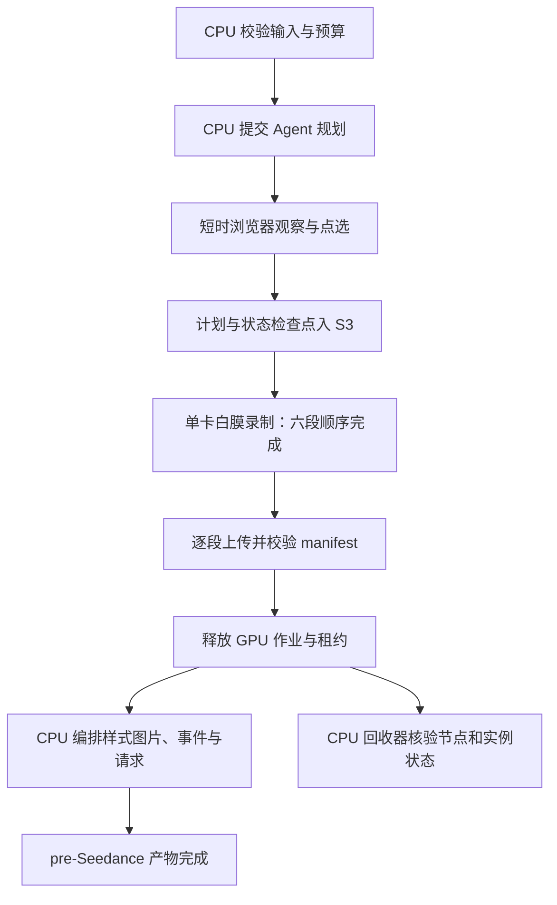

# Three Episode 调度与资源回收设计

日期：2026-09-06。状态：设计及仓库实现已更新；具体实现与验证见下方批量录制计划。尚未部署，本次没有创建计算任务。

最新用户约束：GPU 仅用于白膜录制；满 100 个录制任务发批次，本轮上游全部结束时立即发不足 100 的尾批。
后续执行以 [批量录制实施计划](../plans/2026-09-06-three-episode-batch-capture.md) 为准。
它替代下文的独立 GPU 观察会话、逐案例 GPU 提交和通用尾批等待建议；本文件的 H100 禁止、机型准入及资源闭合原则继续有效。

## 决策

本流程所有自有任务禁止使用 H100，容量不足时排队，不扩大到昂贵机型。
采用 CPU 编排队列、短时单卡图形队列、S3 检查点和独立资源回收器。
首先验证 g6.2xlarge 单卡 L4；只有通过实际录制验收和完整成本比较，才称其为正式最优配置。
不把换卡型等同于节省成本，也不把 Kubernetes Job 完成等同于 EC2 停止计费。
Seedance 保持未提交边界。

## 已核实的问题

- r9、r10 Host 都申请 4 CPU / 12 GiB，没有 GPU request，也没有 nodeSelector。
- r10 Pod 实际绑定到 p5.48xlarge：i-0b90a1375a0e9fc28，Job 于北京时间 10:51:59 完成。
- 真正的单 GPU capture Job 于 09:12:18 创建、09:14:49 完成；151 秒是整个 Job 生命周期，不能当作 GPU kernel 耗时或低端 GPU 基准。
- `threeEpisodeHostJob` 同时生成 CPU/GPU Job，默认 selector 和 tolerations 为空，没有 activeDeadlineSeconds。
- `threeEpisodeSourceUploadJob` 同样没有 CPU 硬约束，修复范围必须包含上传、重试和续跑入口。
- capture dispatcher 的两小时轮询超时只抛出 remote-pending，不会结束远端 Job。
- Job TTL 是七天，只控制完成对象的保留，不能替代节点回收策略。
- 现有 platform 池有明确 CPU 机型及 NoSchedule taint，总限额 16 CPU / 64 GiB；不能假设还有可用容量。
- 现有 `ray-gpu-spot-primary-clean-baked` / `ray-gpu-spot-fallback-baked` 包含 g6.12xlarge，空闲回收等待 1 小时。
- H100 Spot 池允许 p5.48xlarge、没有隔离 taint，空闲回收等待 10 分钟。

证据来自当日对 leap-world-us-east-2 的 Job、Pod、NodePool、NodeClaim 和 EC2 只读查询，以及当前仓库代码。
共享平台的既有配置只作为设计输入，不在本次设计中直接修改。

## 分阶段资源

以下 requests 和超时为初始方案，需采样后校准，不是已测峰值。

| 阶段 | 初始资源与落点 | 生命周期 |
| --- | --- | --- |
| 当前未拆分 Host | 保持 4 CPU / 12 GiB；明确的 CPU 池和 m6a.2xlarge 等已准入 8 核机型 | 先保证行为不变；不因小 CPU 节点放不下而放宽限制 |
| 拆分后的状态编排、API 轮询 | 0.5 CPU / 1 GiB，limit 2 CPU / 4 GiB；CPU 池 | 远端作业排队时只保存 jobId，由轻量 reconciler 接续 |
| 源码打包、解包、媒体校验、ZIP | 先保留重任务 4 CPU / 12 GiB，采样后分别收缩 | 短 Job；处理结束即退出，避免让轻量控制器装载全量媒体 |
| Agent 规划 | 模型 API 等待用 CPU；真实观察/点选所需浏览器另持短时图形会话 | 保留 Agent 自主规划；缓存带 world/state hash 的观察，不能用缓存冒充实时状态 |
| 六段白膜录制及三视图 | 1 GPU + 4 CPU / 12 GiB，候选 g6.2xlarge | 同一场景在一个 Job 中顺序完成六段，逐段上传检查点 |
| 十种样式、图片评估、事件生成 | 自有调度端仅 CPU，调用既有远端模型服务 | 不为等待模型结果保留本地/集群图形 GPU |
| 最终请求组装与发布 | CPU，复用已校验的媒体及 manifest | 停在 pre-Seedance |

g6.2xlarge 为 8 vCPU、32 GiB 内存、1 张 24 GB L4，支持图形 API；这是可行性依据，不是本项目实测性能保证。
当前 4 CPU request 不能直接塞进标称 4 vCPU 的 g6.xlarge 或 CPU xlarge，必须计入 kubelet 保留及 DaemonSet requests。
后续若实测能降低 CPU request，再测试 g6.xlarge；T4/g4dn 为第二轮候选，须验证镜像、驱动和区域供给。
不默认启用 GPU time-slicing、MIG、分数 GPU 或多案例同卡，先获得稳定的单案例基线。

## 硬约束与入口

1. 统一可信的执行 profile：`episode-cpu`、`episode-graphics`；Agent 只选择业务动作，不接收节点池、卡型或宽泛 toleration 控制权。
2. CPU profile 同时要求批准的 CPU 池和具体 CPU 机型正向名单；GPU profile 同时要求批准的图形池、精确 `g6.2xlarge` 和 `nvidia.com/gpu: 1`。
3. 使用 required node affinity / nodeSelector；不能用 preferred affinity 或 NodePool weight 充当安全边界。多条 nodeSelectorTerms 是 OR，每条都必须保留同样的限制。
4. profile 不允许空 selector、任意覆盖、nodeName 直绑、自选 scheduler 或手工 Pod binding 绕过；上传/init/续跑/克隆旧 manifest 路径也必须校验。
5. Pod 准入在服务账号或专用命名空间边界强制 profile 与资源上限，覆盖没有应用标签的 Pod；同时检查 Job template，提前返回易懂错误。选用集群支持的 ValidatingAdmissionPolicy 或已有 webhook。
6. 新建专用 `worldkit-episode-graphics` NodePool 时，只允许该具体单卡机型，加专用 taint；批准的 CPU 池使用不同 taint。不能简单继承 Ray GPU 池整套机型。
7. platform 团队可独立修复 H100 池的隔离 taint，作为全局第二道防线；本流程不依赖该修复才能拒绝 H100，也不改动别人的 H100 工作负载。
8. 启动前持久化 runId / stage / attempt / profileVersion / Job UID / 预算；绑定后记录 NodeClaim、EC2 ID、instanceType 和实际 renderer。运行前发现不匹配立即禁止执行、隔离本任务并进入资源核对。

现有 g6 池可以用于经平台允许的有界基准测试，但需硬限制到 g6.2xlarge；不能占用其他 Ray worker 已预留的 GPU。
正式生产优先独立图形池，避免本流程受共享池的一小时回收策略影响。

## 正常执行和异常恢复

- 图形会话空闲两分钟保存可恢复状态并释放；真实浏览器会话不能可靠恢复时，先实现状态恢复契约，不以重置世界冒充续接。
- 连续观察后立即录制可复用同一卡；Agent 长时间思考或外部模型等待不得无限续租。
- 初始全流程图形并发 1；六段不各启动一台机器。增加并发须以吞吐和成本实测为依据。
- 无合格节点等待五分钟后进入 capacity-pending，保存状态；不自动换 H100、其他多卡机型或更大实例。
- Spot 优先作为待测试方案；只有预先配置的同机型 On-Demand fallback 和价格上限允许时才切换。没有预算配置就继续排队。
- capture Job 初始 activeDeadlineSeconds=900，包含调度/启动/执行等待；另有帧进度与上传进度心跳，不能以 GPU utilization=0 单独判断任务死亡。
- 单次 run 图形资源累计预算先设为 30 个单卡节点分钟，包含冷启动、运行和尾部空闲；所有重试共享预算，不因换 attempt 清零。
- 预算触发时先冻结 run 和新建权限，再终止本 run 的执行并回收；云终止延迟仍计入实耗，不能承诺精确美元硬封顶。
- 只对已确认终止的可恢复故障补跑缺失段，初始最多一次；未知提交结果必须对账原 jobId，不得提交替代任务。
- 取消或预算耗尽写入持久化终态，reconciler 和任何恢复入口都尊重它，防止删掉任务后又补一台。
- 远端 T2I/Codex 调用按其 jobId 单独对账；图片单项失败不重录白膜。服务端模型资源属于另一计费边界，若要求整个端到端链路也禁止 H100，需核实服务端执行 profile，不能仅凭调用端 GPU=0 宣称满足。

## 资源回收闭环

专用图形池初始 `WhenEmpty` + `consolidateAfter: 2m`，无工作时不保持常驻 GPU。
该值是开始考虑回收的等待期，不是 EC2 必须两分钟内关闭的 SLA；终止、驱逐和存储分离可能继续耗时。
队列连续有任务时复用已启动单卡节点，减少镜像冷启动成本；不能为了复用而无限延长空闲。

回收器运行于 CPU，独立于 Host 存活，逐个核实：

1. 分段产物或失败诊断已上传，内容 hash 和 manifest 闭合。
2. 本 run 没有活跃执行或续跑租约；保留 S3 日志后清理终态 Job/Pod（建议 TTL 一小时，而非七天）。
3. 专用节点为空后交给 Karpenter 回收；若超时，先查阻塞原因和是否有其他租户，再操作确认独占的 NodeClaim。
4. 检查 EC2 为 terminated；确认相关持久 Spot request 已取消或非持久请求已关闭，不会自行重建。
5. 核对工作负载专属 EBS 卷是否删除，以及是否存在替代 NodeClaim；共享存储不在此清理范围。
6. 输出 `workload-complete` 与 `resource-closed` 两个状态，保存查询时间和实例 ID。API 无权限或关机未结束时保持 cleanup-pending，不能报告费用归零。

初始超时告警：Job 结束后五分钟仍未进入回收检查，或十分钟后仍有本 run 独占的运行实例。只有状态变化、失败或需要人工处理时通知。
NodePool 限额因并发扩容的一致性窗口不能独自当作硬预算；还需原子队列租约、提交准入和运行预算共同约束。

## 如何选出最划算的配置

本次不启动付费基准。实施时使用同一 source/runtime/plan hash、六段 720p/24fps 固定步进案例：

1. 首先在 g6.2xlarge 验证真实硬件 renderer、驱动、物理 ticks、720 帧/段、跳跃/镜头轨迹、PNG/视频完整性和 S3 闭合；不能以软件 fallback 的结果算 GPU 通过。
2. 记录冷启动与预热运行、CPU p95/峰值内存、GPU 显存、逐帧时延、编码/上传时长、Spot 中断率和 EC2 回收尾时。
3. 通过后，才用相同案例比较缩小 CPU 配额后的 g6.xlarge、T4 候选，以及有明确软件录制契约时的 CPU renderer。不能为省钱直接降分辨率、删帧或改变轨迹。
4. 每个候选至少一次冷启动和三次完整案例；这是初筛，不足以估计可靠 p95。选中后以至少二十次生产样本再校准超时及 requests。
5. 从目标区域获取带时间戳的 Spot / On-Demand 价格与可用区容量，连同失败重试和未利用节点时间计算：

   `单位成功案例成本 = (全部实例实际生命周期费用 + EBS/存储/传输 + 重试费用) / 成功案例数`

   外部模型 API 费用另列，不能把它混作自有 GPU 成本。共享节点同时记录分摊成本和整体闲置成本，避免报表掩盖浪费。
6. 先满足输出正确和交付时延要求，再选单位成功案例成本最低者；当前只有推荐候选，没有“已证明最便宜”的结论。

## 实施依赖图

所有任务当前由主 Agent 顺序集成；表中路径为本仓库相对路径，新增路径为拟定。

| ID | 目标及独占资源 | depends_on / blocks | 输入、输出与集成点 | 验证证据 | 执行方式 |
| --- | --- | --- | --- | --- | --- |
| S1 | 新增统一 scheduling profile；拥有 `scripts/cloud/three-episode-scheduling.mjs` 及其测试 | 无 / S2,S3 | profile → 不可放宽的 Pod scheduling；由 Host factory 调用 | r9/r10 与上传 manifest 漏约束的失败复现；H100/空选择/直绑被拒绝 | main-agent-only |
| S2 | 修改 `three-episode-host.mjs`、`capture-cloud.mjs` 及正式/临时续跑入口 | S1 / S4 | run 身份与 profile → CPU/GPU Jobs；停止复制旧未校验 manifest | CPU 满载、GPU 无货时保持 pending；全部入口负例；相关完整测试 | sequential |
| S3 | 平台配置提案：专用 CPU/图形池及服务账号准入策略 | S1 / S5 | 签定 profile → 精确机型池/taint/准入；平台 IaC 独占 | API 版本确认、server dry-run、禁止任意 Pod 绕过；不影响其他租户 | main-agent-only |
| S4 | 拆分 `workflow.ts` 等编排等待，增加持久状态和 GPU 租约/预算 | S2 / S5 | S3 检查点 + 原 jobId → 可恢复阶段；衔接 capture dispatcher | Host 崩溃、未知提交、取消后重启均不产生重复 Job | sequential |
| S5 | 新增 CPU 回收器及资源闭合回执，拥有其服务/日志与只读云查询身份 | S3,S4 / S6 | 租约与 Job UID → NodeClaim/EC2/EBS 闭合状态 | 正常/失败/Spot 中断/超预算的实测；权限失败保持 pending；共享节点不误删 | sequential |
| S6 | 有界单卡基准与发布，拥有独立 run/S3 前缀和基准报告 | S5 / 正式启用 | 冻结案例 + profile → 性能/总成本报告 | 捕获完整性、成本、无 H100、零替代任务和 EC2 终止证据 | main-agent-only |

发布顺序：先落地禁止 H100 的入口和准入约束，再部署队列与回收器，最后运行单卡基准。
在前两层保护未生效前，不恢复新的云端计算提交。禁止直接重放 r9/r10 的历史 Job JSON。

## 官方依据

- [AWS G6 机型、GPU 数量与图形能力](https://aws.amazon.com/ec2/instance-types/g6/)
- [Kubernetes required node affinity](https://kubernetes.io/docs/tasks/configure-pod-container/assign-pods-nodes-using-node-affinity/)
- [Kubernetes ValidatingAdmissionPolicy](https://kubernetes.io/docs/reference/access-authn-authz/validating-admission-policy/)
- [Karpenter NodePool 约束](https://karpenter.sh/docs/concepts/nodepools/)
- [Karpenter 回收机制](https://karpenter.sh/docs/concepts/disruption/)
