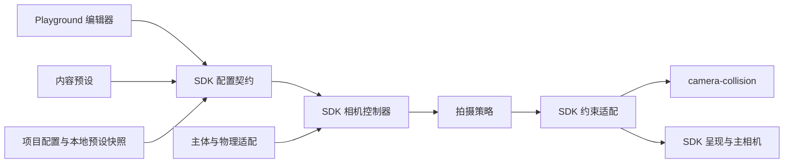

# 相机运行时与可视化配置技术设计

日期：2026-09-13。审计基线：`main@285246867`。状态：技术方案已完成深度审查，尚未实现。

本文定义相机子系统、可视化配置和迁移的目标契约。标注为“现状”的内容来自上述提交；
其他接口、类型、目录和协议均为拟议设计，不代表当前 SDK 已支持。

## 1. 范围与决策

本轮交付范围是第三人称人物／载具、现有第一人称与肩后视角、Playground 配置编辑，
以及 Creator／Episode 的同一配置消费。支持新增主体和拍摄策略，不实现过场时间线、
任意节点图、多人分屏或镜头自动导演。

优先保证职责、状态和参数语义合理。已有配置分为等价迁移、明确转换、重新标定三类；
旧效果用于对照，不要求新运行时保留魔数判断、错误作用域或两套长期执行路径。
有意变化必须有原因、影响范围和新的验收结果。已冻结交付不自动升级。

确定以下取舍：

- 相机留在 `@worldkit/three`，作为 SDK 内部完整子系统；不拆出自有相机 workspace 包，可按需引入第三方 npm 依赖。
- `@worldkit/camera-collision` 继续提供几何与碰撞恢复求解，不取得世界或主相机控制权。
- 保留 Three.js／Rapier 技术栈。优先复用适合新边界的算法，允许有依据的替换与重调。
- 采用版本化配置、明确视图、目标绑定、统一解析和策略求值；不用通用插件注册器。
- 可视化界面和 Agent 消费同一配置契约。编辑器不维护一份独立相机运行时。
- 生产操作规范仍以[架构](../../three-sdk-architecture.md#相机控制权与交接)和
  [资产接入规则](../../asset-production-integration.md#接入维护约束)为准。
  本设计中的维护回归不成为每次生成的新增门禁。

## 2. 参考实现与采用范围

参考代码用于核对实际职责、状态和生命周期，不机械复制语言、场景树或调度机制。

| 参考 | 已核对的机制 | 本项目决策 |
| --- | --- | --- |
| [UE Spring Arm](https://dev.epicgames.com/documentation/unreal-engine/using-spring-arm-components?application_version=4.27) | 属性配置臂长、偏移、旋转继承、碰撞和平滑 | 编辑器围绕明确参数和实时取景组织；参数作用对象及空间不能省略 |
| [UE Gameplay Camera System](https://dev.epicgames.com/documentation/unreal-engine/gameplay-camera-system-overview) | 配置资产、Rig、切换和选择职责分离；所查页面标为 Experimental | 采用数据与执行分离，不复制节点图和完整导演框架 |
| [Cinemachine CameraState](https://github.com/Unity-Technologies/com.unity.cinemachine/blob/69b205115495a374fbba329547ba608cdcfe7847/com.unity.cinemachine/Runtime/Core/CameraState.cs) | 基础机位、修正量与最终结果分开 | 策略输出数据；避障结果不回写作者配置 |
| [CinemachineComponentBase](https://github.com/Unity-Technologies/com.unity.cinemachine/blob/69b205115495a374fbba329547ba608cdcfe7847/com.unity.cinemachine/Runtime/Core/CinemachineComponentBase.cs) | 修改待提交状态，明确切换与目标瞬移通知 | SDK 协调求值和交接，不复制 MonoBehaviour 继承结构 |
| [Godot SpringArm3D](https://github.com/godotengine/godot/blob/c24bf5d933c53d9477d5e82c51403856a9e7da62/scene/3d/physics/spring_arm_3d.cpp) | 期望／实际臂长、形状探测、对象排除分开 | 保存探测配置，运行时提供碰撞身份；不依赖 Three 父子层级猜镜头目标 |
| [PlayCanvas OrbitController](https://github.com/playcanvas/engine/blob/7b00ca4db4bda4c903f4cc727f39b38b43b76aa3/src/extras/input/controllers/orbit-controller.js) 与 [CameraComponent](https://api.playcanvas.com/engine/classes/CameraComponent.html) | 控制器返回 Pose，镜头属性由组件管理 | 策略不写真实相机；不复制浏览器输入和显示时钟 |
| [camera-controls](https://github.com/yomotsu/camera-controls) | 目标状态、当前状态、reset 基线分开，宿主调用 update(delta) | 可作为数学／控制实现候选；其版本曾改变阻尼和角度归一化，采用前需对照标定 |

直接替换控制库不能解决目标绑定、配置来源和录制权限。先确定这些契约，再决定局部实现；
是否采用第三方库由代码量、行为覆盖、更新时序和迁移成本的实测对照决定。

### 2.1 第三方依赖与复用

实现采用成熟库优先。通用控制、数学、校验和 UI 能力先复用现有依赖或成熟 npm 包，
本项目只实现必要的配置语义、目标绑定、权限和生命周期适配。需要新增依赖可随实际消费代码
加入所属包；不为保留当前自研代码而排除成熟实现，也不预装尚无消费者的依赖。

| 能力 | 复用选择 | 边界与实施决策 |
| --- | --- | --- |
| 编辑器自由观察／环绕 | 已使用的 Three OrbitControls；需要平滑构图／fit 等能力时优先 camera-controls | 绑定独立预览相机，复用现有显示调度；不重写通用鼠标／触屏环绕算法 |
| 生产镜头控制与平滑 | camera-controls 优先做适配验证 | 核对固定 delta、完整状态恢复、目标切换和碰撞适配；接口足够时采用薄适配，不能用 toJSON/fromJSON 直接替代完整求解检查点 |
| 矩阵、四元数、包围体和几何辅助 | 已有 three 及其 addons | 复用公开实现；SDK 只定义本项目的坐标语义和约束组合 |
| 物理查询 | 已有 Rapier 包与项目修订版本 | 复用现有物理世界和 query adapter，不为相机再初始化一套物理 |
| 配置格式校验 | 已有 [Ajv](https://ajv.js.org/guide/getting-started.html) | 从同一字段契约派生 schema，复用编译后的 validator；配置引用、作用域和锚点条件由窄语义校验完成，不重写通用 JSON Schema 校验器 |
| 属性控件与表单 | 已有 React／Radix UI 及 Inspector 组件 | 共用控件和 SDK 元数据，避免增加第二套不相容的调参界面 |
| 内容摘要 | 已有 @noble/hashes 或 Node crypto | 复用项目既有环境实现，不自行实现 hash 算法 |

第三方实现位于所属适配边界，公开 CameraDocument 不包含库私有类型。若生产控制库内部需要
可写相机，只能持有不参与实际渲染的计算对象并输出数值，由 SDK 统一提交主相机。
检查点恢复不能依赖不稳定私有字段；若公共 API 不满足，优先评估上游支持或更合适的库，
只有无法复用的窄能力才保留自研，并记录具体原因。

已核对 camera-controls 的[序列化实现](https://github.com/yomotsu/camera-controls/blob/e541737375d12851358bda940611872ec796fcf0/src/CameraControls.ts#L2884-L2956)：
它保存目标终态及 reset 基线，没有同时保存当前平滑状态和各通道阻尼速度。
因此它适合优先承接独立编辑器观察；临时相机只能隔离写入，生产候选事务仍需受支持的状态恢复方案。
同一版本的 `update` 分别维护球坐标 theta／phi／radius，azimuth 支持累计圈数；
本项目采用这种显式轨道状态表示，使用约定的半衰期与完整 SDK 候选历史，
不复制库的私有状态、SmoothDamp 速度或极点 makeSafe 规则。

浏览器校验优先采用 Ajv 的构建期 [standalone validator](https://ajv.js.org/standalone.html)，
避免在每次配置应用时重新编译 schema。生成输入、工具版本和输出进入可复现构建及自带 sdk/
的源码／产物闭包，Host 不执行任意项目源码提取元数据。新增依赖声明在直接消费者的 package.json，
锁定实际测试版本并检查许可证、浏览器构建及运行时字节身份；这些是实施检查，不是新生产步骤。

## 3. 现状与问题定位

本节描述设计时的 `285246867` 基线；已退休模块链接固定到该历史源码。当前实现与迁移证据见[验证记录](../../reviews/2026-09-13-camera-implementation-verification.md)。

| 当前模块 | 实际职责／问题 | 目标处理 |
| --- | --- | --- |
| [公共 camera.ts](https://github.com/seedleap/agent-whitebox-world-sdk/blob/2852468670864e7b829c7f84c0f56f280494f88f/packages/three-world/src/camera.ts) | 首帧继承、轨道、镜头状态与碰撞协调混合 | 拆为 controller、策略、状态和约束适配 |
| [Humanoid camera.ts](https://github.com/seedleap/agent-whitebox-world-sdk/blob/2852468670864e7b829c7f84c0f56f280494f88f/packages/three-world/src/humanoid-runtime/camera.ts) | 原 FollowCamera 与共享 rig 适配并存，另存显示历史 | 提供人物／骑乘数据，执行与历史归唯一 controller |
| [config/camera.ts](https://github.com/seedleap/agent-whitebox-world-sdk/blob/2852468670864e7b829c7f84c0f56f280494f88f/packages/three-world/src/config/camera.ts)、[follow-camera.ts](https://github.com/seedleap/agent-whitebox-world-sdk/blob/2852468670864e7b829c7f84c0f56f280494f88f/packages/three-world/src/config/follow-camera.ts) | 两套字段语义；相同“跟随”参数作用于不同对象 | 按作用对象归一命名，保留真正不同的参数 |
| [CameraSubjectSample](https://github.com/seedleap/agent-whitebox-world-sdk/blob/2852468670864e7b829c7f84c0f56f280494f88f/packages/three-world/src/camera-subject.ts) | heading 中夹带回正等待和速率 | subject 只给姿态／速度，策略参数归配置 |
| [profile-runtime.ts](../../../packages/preset-content/src/profiles/profile-runtime.ts) | 当前资产 camera 被提交为全局覆盖 | 改为明确的主体绑定覆盖 |
| [Humanoid runtime.ts](../../../packages/three-world/src/humanoid-runtime/runtime.ts) | shared 模式报告 settingsApplied=false，却仍消费部分原配置 | 用逐字段有效值／来源替代笼统是否生效 |
| [Inspector](../../../apps/sdk-playground/src/inspector.tsx)、[Workbench](../../../apps/sdk-playground/src/workbench.tsx) | 已有相机编辑表单，各自计算部分适用性 | 共用配置编辑组件和 SDK 字段描述 |
| [Playground main.ts](../../../apps/sdk-playground/src/main.ts) | 文件预设、浏览器覆盖、运行时参数同步散落 | 归入编辑会话和配置加载适配 |

额外的源码事实必须进入迁移：

- `recoveryHalfLifeSeconds` 同时用于公共镜头的缩放平滑与碰撞恢复，需拆成两项。
- 人物距离等于 `8.8` 时会触发地图覆盖，即使这个值由用户显式设置；新运行时移除数值哨兵。
- 相机输入影响人物移动方向，更新顺序变化会改变操作轨迹，不能只比截图。
- 当前 Episode prepare 会 reset、移动起点并真实推进一 tick；release 恢复 viewport、清输入并停机，
  不恢复进入录制前的世界／相机，也不自动续跑。
- 静态审计发现 Episode 的视角调用可能由 engine 绕回 Humanoid 公共租约检查；这是待复现的
  权限路径风险，不声称已通过运行用例证实。新内部通道必须消除这种回路。

已知画面缺陷与完整操作链继续由[相机交接待办](../../reviews/2026-09-12-camera-handoff-todo.md)追踪。
历史修复提交与冻结产物身份不重写。

## 4. 模块结构与依赖

```text
packages/three-world/src/
  config/camera/
    types.ts            配置文档、视图联合类型、解析结果
    fields.ts           组合镜头／行为／约束字段定义，派生 schema
    defaults.ts         每种策略的 SDK 默认值
    resolve.ts          唯一覆盖解析、适用性与来源计算
    serialization.ts    当前格式校验和规范序列化
  camera/
    controller.ts       世界内唯一协调入口
    state.ts            提交快照、基线和世代校验
    subject.ts          只读目标事实与绑定解析契约
    lifecycle.ts        交接候选生成与原子提交
    constraints.ts      SDK 物理、主体过滤与几何求解适配
    presentation.ts     固定历史采样与最终姿态应用
    strategies/
      third-person.ts   保留构图／朝向目标的第三人称
      first-person.ts   眼位取景
      shoulder.ts       肩后取景
    editing.ts          受权限约束的相机编辑事务
packages/preset-content/config/cameras/   内容专有的标定覆盖
apps/sdk-playground/src/camera/           编辑会话、共用属性组件、构图预览
apps/sdk-playground/server/camera-config.ts  本地开发文件保存适配
scripts/migrations/                       一次性跨包迁移工具
```

文件按实际复杂度拆分：`fields.ts` 不扩张为包含全部模式逻辑的巨型表；复杂领域定义在同目录
按 lens／follow／constraints 分组。算法数值稳定常量留在所属实现，不能把每个 epsilon 都公开配置。
测试跟随模块归属。新文件只为上述实际职责建立，不预建空模块。



SDK 不导入 preset-content、DOM、浏览器存储或 Host。内容预设只提供数据；Creator 导出所选
预设的项目快照，生产源码不直接导入 preset-content。策略不接收完整 Humanoid runtime、World
或可写 Three.Camera。场景提供几何与项目绑定，不能扩展一条相机循环。

SDK 默认行为唯一保存于 defaults：例如无预设调用仍有完整人物／通用策略默认值。
内容层只存实际差异，不复制完整默认表。旧人物标定可作为 SDK 初始值，重调后更新唯一基线。

## 5. 持久化配置模型

### 5.1 文档与对象

正式项目文件为 `config/camera.json`，通过项目源码相对导入；不添加 project.json 新字段，
不自动扫描同名文件。配置自身不读取网络或文件系统。

| 对象 | 关键字段 | 语义 |
| --- | --- | --- |
| CameraDocument | kind=`world-camera`、schemaVersion=1 | 与旧 AssetProfile 版本号分属不同格式；不靠 version=1 猜格式 |
| 视图集合 views | 以稳定 viewId 为键；每项含 kind、可选 presetId、overrides 和适用时的 opening | viewId 是项目内标识，kind 为 third-person／first-person／shoulder |
| defaultViewId | views 中存在的 ID | 首次配置及 reset 的默认视图；当前用户视图另存运行状态 |
| binding | targetEntityId、mountTarget、subjectOverrides | 逻辑目标、骑乘时跟随 actor 或 vehicle、按实际主体 ID 的明确覆盖 |
| views[viewId].opening | 既有 CameraOpening 的位置、look-at、up 和 fovDegrees | 该 preserve-opening 视图独有的初始构图；默认视图决定世界开场，FOV 为垂直角度 |
| presets | 以 presetId 为键的本地快照，含 kind、values、sourceIdentity | 只包含本项目选用的预设；不能带目标实例或动态状态 |
| activation | on-input 或 immediate | 只决定首次／reset 的默认视图激活；默认 on-input，默认视图为第一人称时规范化为 immediate，备用视图不改变开场 |
| input | orbitRateRadiansPerSecond、cycleViewIds | 环绕速率和允许按键切换的视图顺序；空数组禁用按键切换 |
| transition | durationSeconds | 显式切视图的混合时长；不代替主体跟随平滑 |

`mountTarget` 默认 vehicle；它改变实际拍摄主体，不改变输入控制主体。直接以载具 ID 为
逻辑目标时不再二次解析。主体覆盖明确为
`binding.subjectOverrides[subjectId].views[viewId] = { presetId?, overrides? }`；
预设引用属于主体的具体视图，其 kind 必须匹配该视图。通用视图不强迫每个载具建立一个新 viewId。
opening 只属于项目视图，不允许主体覆盖或预设替换它。每个 preserve-opening 视图独立初始化
构图和意图缓存，编辑一个视图不会改变另一视图的 opening。首次安装显式采纳作者 pose 时，
缺失的默认 preserve-opening 构图先写入候选规范文档，再统一解析与计算 hash；不原地修改源输入，
inspection 与基线保存同一份可独立重建的文档，后续更新从该文档继续。

预设不相互继承，引用只发生一层，避免产生循环和无法解释的覆盖顺序。
内容仓库的预设是维护源；项目内快照是明确版本的交付依赖，两者不会自动同步。
sourceIdentity 记录来源 ID／版本，事实身份仍由文件实际字节核验。

最小项目文档示意，不是完整游戏示例：

```json
{
  "kind": "world-camera",
  "schemaVersion": 1,
  "defaultViewId": "explore",
  "views": {
    "explore": {
      "kind": "third-person",
      "overrides": { "framing": { "kind": "preserve-opening" } },
      "opening": {
        "positionWorldMetersXYZ": [0, 3, 8],
        "lookAtWorldMetersXYZ": [0, 1.4, 0],
        "fovDegrees": 50
      }
    }
  },
  "binding": { "targetEntityId": "player", "mountTarget": "vehicle" },
  "activation": "on-input",
  "input": { "cycleViewIds": [] }
}
```

默认 preserve-opening 视图未给 opening 时，首次安装可从尚未被 SDK 接管的作者相机采纳一次；
此首次采纳与 activation 时机独立，on-input 与 immediate 均须先规范化 opening 并完成零时间安全准入；immediate 直接进入 follow。该许可不扩展到 first-person 或无关的 immediate look-at 作者 pose。
其他 preserve-opening 视图必须显式给出。封存后不再逐帧读取相机反推配置。
初始化时将各 opening 与初始目标的参考位姿一起换算为该视图的相对构图；晚些时候首次切入
该视图按当前目标定位，不能回到配置中的旧世界位置。保存供独立重建的项目配置时必须将
采纳的 opening 显式化。first-person／shoulder 不接受 opening，使用锚点与策略配置。

### 5.2 视图联合类型与参数分组

每种 kind 有自己的完整解析类型，存储 overrides 为该类型的局部字段。公共参数只提取真实
共性，不允许任意键；过期／未知字段报带路径的格式错误。未选中的合法视图可以保留其配置。

| 分组 | 字段与作用对象 | 适用条件 |
| --- | --- | --- |
| lens | verticalFovDegrees、nearMeters、farMeters | 透视游戏视图；FOV `(0,180)`，near>0，far>near |
| framing | preserve-opening 或 look-at | 第三人称联合类型；其字段不互相混用 |
| position | distanceMeters、anchor、anchorOffset、subjectTranslationHalfLifeSeconds、anchorHalfLifeSeconds、armHalfLifeSeconds | 作用对象分别为主体平移、姿态锚点、相对镜头臂；不能合为一个 damping |
| orientation | initialPitchRadians、pitchLimitsRadians、yawLimitsRadians、referenceFrame、recenter | 角度采用弧度；世界上向／主体上向显式选择 |
| zoom | range（bounded 米制上下限或 unbounded）、halfLifeSeconds | 第一人称无缩放；当前距离是用户意图，不写回配置 |
| constraints.collision | enabled、radiusMeters、armClearanceMeters、pivotClearanceMeters | 按策略设置；半径>0、余量>=0 |
| constraints.recovery | halfLifeSeconds、speedLimit、clearHoldSeconds、releaseDeadbandMeters | speedLimit 为 limited 正数米每秒或 unlimited；只影响碰撞恢复 |
| constraints.visibility | preserve-framing 或 require-line-of-sight | 第三人称／肩后；第一人称不以自己身体入画为目标 |
| effects.speedDistance | enabled、fullEffectSpeedMetersPerSecond、maximumOffsetMeters、extendHalfLifeSeconds、retractHalfLifeSeconds | measured speed 到显式最大偏移；不读取动力学 spec.speed |
| effects.speedFov | enabled、fullEffectSpeedMetersPerSecond、maximumOffsetDegrees、halfLifeSeconds | 垂直 FOV 的速度附加量；默认关闭 |

anchor 为联合类型：主体原点 origin、根据身体范围计算的 body、实际 eye／seat 命名锚点，
或显式 subject-local 点。body 分支带 heightRatio（`[0,1]`），从主体提供的身体底部到顶部插值；
比例属于策略配置，实际身体范围属于采样事实。origin／eye／seat 不接受 heightRatio。
anchorOffset 指定 space=`world`、`heading` 或 `subject` 及 offsetMetersXYZ，分别对应世界坐标、
只含水平朝向的坐标、完整主体姿态坐标。偏移不能同时被解释成眼高或碰撞体尺寸。

referenceFrame 决定相机环绕和上向采用 world-up 还是 subject-up；不从 assetId 猜测。
第一人称的 `orientation.rollInheritanceRatio` 表达绕视线的主体横滚继承，取值 `[0,1]`；
作为维护者高级配置，初期不扩充生产 Agent 常用参数。接近垂直视线时保留最后有效参考基，
避免从退化投影求任意地平线。该规则不旋转车体、骨架或物理。

recenter 定义 enabled、delaySeconds、minimumSpeedMetersPerSecond、yawHalfLifeSeconds，
以及可选的 pitch={targetRadians, halfLifeSeconds}。无 pitch 时只回正 yaw；速度条件采用真实
主体速度，等待由最后一次手动环绕计时。新默认 yaw 等待 1.5 s、触发速度 .8 m/s、
半衰期 ln(2)/1.9 s；俯仰回正默认关闭，由载具预设明确启用。主体缺少可用朝向时报告 inactive，
不改为从模型任意轴猜测。第一人称手动观察的 yaw 限位与回正配置分别定义。

preserve-opening 不消费预设 distance、initialPitch、anchor 偏移或基础 FOV 来替换构图；这些值
若来自共用预设，报告 inactive。该视图的 FOV 编辑修改 views[viewId].opening.fovDegrees；运行中的环绕／缩放
修改意图。若用户明确改成 look-at，才采用对应字段。速度效果对 preserve-opening 默认关闭，
显式启用属于允许构图随速度变化的选择，不静默引入。

第一人称必须有真实 eye 锚点，默认启用碰撞、不执行自身可见性策略（safety-only）；肩后使用 eye／seat
锚点及明确偏移；第三人称 look-at 使用 body 锚点或显式点。缺失必要锚点拒绝激活该视图，
不猜通用人形眼高。参数能保存不代表目标当前支持该视图。

距离统一以米表示。third-person/look-at 可配置零基础臂长，朝向使用参考基中的 yaw／pitch 意图，
不调用位置等于目标的 lookAt；零距离不自动解释为第一人称。shoulder 距离必须大于零。
bounded range 满足 0<=minimumDistanceMeters<=maximumDistanceMeters，look-at 初始距离必须在范围内；
shoulder 的 minimum 必须大于零。unbounded 表示允许任意有限非负距离，不能保存 Infinity。
preserve-opening 的 zoom range、pitch/yaw 限位默认 unbounded，允许零臂；方向取 opening 的有效 look-at/up，look-at 点不能等于眼位。
显式预设／项目 bounded 角度限位若排除按实际主体参考系推导的 opening 初始角度，
在构图参考初始化／零时间安装时拒绝并报告对应字段路径；不静默夹紧作者开场。
显式 bounded range 若排除 opening 推导的距离则拒绝配置，不能无输入时夹紧作者机位。
因此通过几何避让改变 actual distance 不会改变合法的 nominal／用户距离意图。
运行时真实范围与 UI 滑杆建议范围分开：输入数值可超出建议滑杆范围，但必须满足 SDK 契约。
半衰期>=0，0 表示立即响应；禁用用 enabled=false，不保存 Infinity。
speedLimit 使用 `{kind:'limited', maximumSpeedMetersPerSecond:number}`（正有限值）或
`{kind:'unlimited'}`，避免用极大常数冒充无限。范围、单位、校验及适用条件由字段契约派生。

### 5.3 唯一解析与覆盖顺序

`resolveCameraConfiguration(document, subjectContext)` 是唯一纯解析入口，不访问场景对象。
subjectContext 只包含已解析主体 ID、种类、锚点能力和有效尺寸等事实；不包含相机调参。

按字段依次覆盖：SDK 策略默认 → 视图预设 → 主体预设 → 项目视图 overrides → 项目主体
view overrides。草稿是同一文档的未保存版本，不增加最高优先级覆盖层。编辑哪个作用域就修改
draftDocument 的对应路径，再使用相同 resolver；若修改的预设被项目覆盖，预览同样保持覆盖值，
并显示其来源。保存前后解析顺序完全一致。选错 kind 的预设拒绝，不跨策略深合并。
数组整体替换；framing.kind 等联合类型判别值改变时替换整个分支，禁止深合并留下另一分支字段。
显式项目字段若不属于所选联合分支则拒绝，编辑器切分支时显示并移除不兼容覆盖；
只对共用预设中的合法、当前未消费字段报告 inactive，不让项目错误字段静默失效。
JSON 不接受 undefined／非有限数；移除 override 字段即恢复继承。
增量编辑用明确的 set/remove 操作，持久化格式不以 null 兼任“清除”和“未配置”。

解析分为：格式与版本校验 → 引用解析 → 类型匹配 → 覆盖 → 锚点能力校验 → 数值关系校验 →
生成有效配置与来源。单字段来源为 sdk-default／view-preset／subject-preset／project-view／
project-subject／opening；同时区分 configured、effective 和 inactiveReason。
是否为未保存草稿是编辑会话状态，不改变字段的值来源。

camera JSON 的规范序列化为稳定键序、UTF-8、有限 JSON 值；数组顺序保留。源文件 hash 与
规范内容 hash 分开，后者可以判断排版变化是否影响配置，不取代实际文件身份。
`schemaVersion` 只随格式变化；实例 `configurationRevision` 只在采用新配置时递增。

同一规范文档及相同绑定上下文重复安装不制造新的配置 revision；视图切换、输入、每帧速度变化
也不递增 configurationRevision。主体／视图变化由 snapshot 身份字段区分；有效值重新解析时
保留其实际 subjectGeneration 和 viewId，不能拿旧主体的解析结果作为新主体配置。

## 6. 公共与内部接口

保留 `ThreeWorld` 身份及既有的 setCameraFollow／useAuthoredCamera 使用方向。完整配置成为
setCameraFollow 的新参数形式，当前零散参数经一次性源码迁移转换，不永久支持两套字段树。

```ts
// 拟议公共形状；具体字段定义在第 5 节。
declare function parseCameraDocument(value: unknown): CameraDocument;
interface CameraWorldAPI {
  setCameraFollow(options: { configuration: CameraDocument }): void;
  setCameraView(viewId: string): void;
  inspectCamera(): CameraInspection;
  useAuthoredCamera(): THREE.Camera;
}
```

`setCameraView` 仅改变运行视图，不改 defaultViewId。原 `setCameraPerspective`、Humanoid 数字模式
和 profile 相机字段在仓库调用迁移完成后移除；Episode 对外已有 cameraPerspective 可在其协议
边界映射到预设的 first-person／third-person 视图，再调用同一内部 owner。无法唯一映射时明确
拒绝并要求指定 viewId，不能把 shoulder 当普通 third-person 丢失。

setCameraFollow 提交完整文档，在允许修改的调用边界同步完成候选安装；返回时 inspection
必须反映新 configurationRevision。固定步／展示事务中不允许外部重入安装，立即拒绝，
不把同步 void API 延后成不可确认的队列操作。安装使用零时间相机求解，不推进世界时钟。
首次安装使用 defaultViewId／activation；后续更新保留仍合法的当前视图、模式、环绕／缩放和
相应历史，不因滑块应用跳回 pending。当前视图被删除或 kind 改变时拒绝热更新，先显式切入
仍存在的视图；完整世界重建可直接采用新的 defaultViewId。

热更新按差异处理：默认视图／按键权限只改变配置；平滑系数保持连续历史；锚点、碰撞或
referenceFrame 改变时重建受影响历史；显式距离／角度覆盖改变时同步对应用户意图。
移除距离／角度覆盖将当前意图设为解析后的继承值。zoom 范围若排除当前意图，拒绝应用并返回
所需距离调整，编辑器可将距离与范围合并为一次显式编辑。改变 opening 是显式重构图并 snap，
只作用于该视图；未改 opening 的更新不重新读取当前机位。binding 改变走目标交接规则。
保存配置与封存 reset 基线是不同操作。
inspectCamera 只返回当前已提交值，不触发物理刷新或重新解析配置。

内部入口分为：安装配置、消费输入、物理后求值、生命周期交接、显示采样。所有入口均由
WorldEngine 中唯一 CameraController 调用；Humanoid 不再创建自己的 rig 或 FollowCamera 实例。

| 内部边界 | 输入 | 输出与允许副作用 |
| --- | --- | --- |
| 配置解析 | 文档、主体事实 | 有效配置／来源；纯数据 |
| 主体采样 | logicalTargetId、sampleContext | 当前主体事实；只读 |
| consumeInput | 本 tick 的规范输入、已提交意图 | 新意图与 controlBasis；物理前 |
| evaluate | 最终主体样本、有效配置、策略历史、dt | CameraProposal 和新的策略历史；不写相机 |
| solveConstraints | proposal、固定上次结果、查询上下文、dt | 安全候选、诊断与恢复历史 |
| commit | 全部候选校验通过 | 替换固定快照、意图／策略历史；递增相应 revision |
| samplePresentation | 两个固定快照、统一 PresentationSampleContext、显示主体样本 | 显示 pose；只读恢复状态 |

策略采用同一小接口和各自可区分的状态类型，不继承深层相机基类；controller 不包含 assetId
或地图名分支。任何需要 scene/physics 的查询均通过约束适配，不将完整世界传入策略。

## 7. 运行数据与时钟

### 7.1 状态所有权

| 数据 | 唯一 owner | 保存／恢复原则 |
| --- | --- | --- |
| CameraDocument、有效配置与来源 | controller 的配置状态 | 安装成功后替换；不被输入或碰撞改写 |
| 完整不可变 CameraDocument、各视图初始构图参考及初始意图 | World 基线中的 camera 部分 | 首次 seal；显式提交相机基线原子替换整组，reset 据其重新解析 |
| 当前 viewId、yaw／pitch／zoom、回正等待 | controller 的用户意图 | 输入修改；视图返回按其意图缓存恢复 |
| 视图过渡的源帧、目标、时长和进度 | controller 的固定状态 | 切换时创建候选，随固定步推进；可中断，不读取 RAF 相机作为源 |
| 策略阻尼历史 | 当前策略状态 | 生命周期规则决定迁移或重建 |
| 碰撞恢复／last-safe | constraints 内的 solver 实例 | 由固定 solve 提交，display project 不推进 |
| previous/current 固定快照 | controller | 同时保存镜头、目标、镜头参数和身份 |
| display pose | presentation 局部结果 | 不进入配置、意图或下一固定步基线 |

每份固定快照含 lifecycleGeneration、simulationTick、configurationRevision、logicalTargetId、
resolvedSubjectId、subjectGeneration、viewId 和 cameraCommitRevision。同名主体被删除后重建是新 generation，旧引用失效。
cameraCommitRevision 在成功提交相机运行状态时递增，包含零时间切视图／配置更新；显示采样不递增。
它用于编辑检查点及相机状态的并发校验，与仅在文档改变时递增的 configurationRevision 分开。
碰撞体句柄不能进入 JSON 或跨世界重用。

CameraProposal 包含期望世界位置、世界四元数、look-at／参考上向、lens 与视图相关的可见性目标。
SolvedCameraFrame 额外记录实际位置、修正原因及碰撞阶段；不以 actual position 反算 desired distance。
与连续扫掠有关的上一安全位置允许作为明确的 solver 历史，但不反馈进作者意图。

### 7.2 单步执行

1. 先处理两 tick 之间已提交的切目标／瞬移事件，保证本步控制基采用当前绑定。
2. 消费规范相机输入，累计候选角度／距离意图，产生角色移动所用的 controlBasis。
3. 同一世界使用此 basis 解释角色输入，推进动作、动画相关状态和 Rapier。
4. 从物理后的固定状态读取主体、骑乘关系、速度和眼位；不读取显示插值后的 Object3D。
5. 处理本步新发生的主体／位置事件；按 operationId 和 generation 去重。
6. 策略求期望机位、朝向及镜头参数；混合路径仍进入约束求解。
7. 约束求解并校验有限值，成功后一次提交全部相机状态。
8. 显示或录制从已提交快照采样；正式捕获取 alpha=1。

本 tick 的意图、策略历史和碰撞恢复历史都属于候选事务；控制 basis 来自候选意图，
inspection 在提交前仍读取上一固定快照。碰撞 solver 使用已有 capture/restore 或等价候选状态，
任一步失败先恢复其内部历史，不能出现意图已更新而镜头仍是旧状态的半提交。
物理不回滚；已用于物理的输入也不重放。失败记录包含当步控制 basis，世界停止继续推进，
由显式 reset／重新准备恢复，不将这一步标为正常录制帧。

鼠标给出的弧度增量只消费一次；摇杆 ratio 按速率×dt 转换。一次显示间隔含多个固定步时，
指针增量按现有输入分发契约分配且总量保持，不在每个子步重复应用完整增量。
主体切换在物理中发生时，本步运动仍使用步开始已确定的控制基；下一步使用新绑定，避免同一步
输入解释被事后改写。

策略不允许非有限输出；控制与求值不依赖墙钟。指数平滑采用 `a=1-exp(-ln(2)*dt/h)`，h=0
时立即到目标。只有作用对象和算法都等价时，旧 response r>0 才可按 h=ln(2)/r 转换。
禁止通过全局倍速、改角色速度或多推进几帧掩盖镜头问题。

相对镜头臂使用所选参考系内显式保存的 yaw、pitch 和半径状态，统一由
`armHalfLifeSeconds` 平滑；位置与朝向从同一组状态构造。角度保留输入的展开路径，
不先插值世界笛卡尔臂向量再反推角度分支。固定半径与 pitch 下的大幅 yaw 环绕沿主体周围的圆弧移动，
不会沿弦缩短臂长或越过主体头顶；pitch 越过极点时状态连续。主体平移、锚点、zoom
和速度效果仍保有各自独立通道。切换参考系或瞬移由生命周期明确重基或重建这组历史。

### 7.3 显示与镜头对象

presentation 是实际 Three.Camera 的唯一 SDK 写入位置，接收固定结果或显示采样结果。
数学策略和碰撞包均不持有这个相机。透视投影、父变换、near/far/aspect 一起正确应用；
world pose 转回父局部坐标只在此处进行，不同策略不能重复转换。

主相机的受管父变换限定为可逆、无反射／剪切且世界尺度为 1 的刚性变换，相机自身 scale 为 1。
安装前检查正交基、行列式与重构误差，运行中父变换改变时复核；不满足即明确拒绝，不能仅用
parent quaternion 逆乘宣称支持任意缩放。迁移时将不支持的相机父绑定显式移到刚性节点并保持
世界机位，列出源码变更。[Three Matrix4](https://threejs.org/docs/pages/Matrix4.html) 也明确指出
非均匀缩放父节点可能无法进行预期的 TRS 分解；这项限制属于本项目的实现选择。
主体 subject-local 锚点使用主体完整受支持变换一次，包含模型缩放；anchorOffset 的米制向量
只随所选参考基旋转，长度不再乘模型缩放。eye／seat 的世界样本不得二次缩放。普通 object／asset CharacterOptions 通过可选
`eyePositionLocalMetersXYZ` 显式声明模型局部眼位点，随实际几何 world transform（含 scale）
转换一次，不受 semantic frontYaw 校正影响，也不从 body 高度推断。完整 Humanoid 分支
由实际姿态／动画提供眼位，拒绝此字段的冲突声明。

World 呈现协调者先确定一次 `PresentationSampleContext={epoch,previousTick,currentTick,alpha,cut}`，
人物、车辆、骨骼和相机必须消费同一上下文。现有 Humanoid 的 presentationEpoch／presentationCutTick
决策迁入或委托给这个协调位置，相机不得独立使用原始 RAF alpha。正式 alpha=1 捕获后的较早
显示请求触发统一 cut；所有对象一起取当前帧。该变化仅管理显示历史，不推进固定模拟或恢复时间。

插值不能跨 lifecycle／subject generation 或不兼容视图，发生上述变化时 previous=current。
中间位置调用无状态 project 做安全修正，失败时采用当前场景中重新校验合法的固定候选；
没有合法候选就报告执行失败，不伪造安全画面。重复截图不修改阻尼、恢复或下次输入结果。
第一人称自身网格裁切和临时三视图仍在同步展示事务中执行，并在 finally 恢复。

### 7.4 视图过渡与中断

过渡为 none 或 blend 联合状态，包含最近固定源帧（基础／最终 pose 和 lens）、目标 viewId、
elapsedSeconds、durationSeconds 及源主体参考。非活动源策略不继续运行；目标策略每步按真实
主体求值。兼容的第三人称／肩后采用 smoothstep 位置与 lens 插值、四元数 slerp，混合后仍走
当前约束。FOV、near、far 使用同一混合因子，碰撞适配消费本步混合后的镜头参数。

正在混合时再次切换，从最近已提交的混合结果创建新源帧；不能退回原始源视图，也不能采纳
当前 RAF 相机。普通上下车使终点按新主体重算，以当前固定结果重新建立剩余时长的过渡；
瞬移／reset／主体删除或 referenceFrame 不兼容时终止旧过渡并执行对应生命周期的 snap。
零时间安装只建立／校验源与终点，不增长 elapsed；固定求解成功才提交进度。

第一人称参与的切换第一版采用 cut（有效时长 0），避免用任意阈值决定身体裁切和近裁面。
指针锁需求、眼位、lens 和自身裁切在同次成功提交切换；第三人称／肩后均保留正常主体呈现。
第一人称平滑进入若以后需要，应作为单独的身体裁切与过渡策略扩展，不暗加在通用 blend 中。
cut／teleport／reset 清除跨镜头的 sweepFrom 和不兼容恢复历史，只校验新策略局部臂与新眼位；
不能用旧机位到新机位的扫掠截断一个不呈现中间路径的切换。连续 blend 才保留跨帧轨迹扫掠。
inspection 区分配置 duration 与 effective duration，说明 first-person-cut 等原因。

setCameraView 是明确激活行为，pending 时切视图进入 follow。viewId 在目标视图成功安装时更新；
snapshot.transition 给出 none／blend 和进度，不能用 viewId 已改变推断过渡完成。
控制 basis 使用物理前候选的基础朝向（含过渡，不含碰撞修正）；混合期间不提前跳到最终目标
朝向。cut 使用新视图基础朝向。请求与当前目标 viewId 相同不重启已有过渡。

### 7.5 非活动视图意图

每个视图仅缓存用户意图和其参考身份，不缓存继续推进的阻尼／碰撞实例。缓存关联 kind、
resolvedSubjectId、subjectGeneration、referenceFrame 与该视图相关配置版本；不靠一个裸 yaw／zoom
跨主体复用。视图删除或 kind 改变清除缓存；只改无关视图不使其他意图失效。

重新激活前按当前主体解析配置：同主体／同参考基且值合法时恢复意图，再初始化新的求解历史；
参考系改变时将保存的观察方向先转为世界方向，再表达于新参考基，按新角度范围限制并报告
重基结果。无法形成稳定参考时采用该视图的明确初始意图并报告原因，不复用旧四元数。
主体变化导致缓存距离／角度越界时，适配到新主体合法范围并记录 old/new/reason；这属于
显式主体交接规则，不回写配置。它与同主体热更新排除当前意图时拒绝应用的规则不同。
首次启用或缓存失效时使用当前主体的初始标定；preserve-opening 的项目构图仍按其规则建立，
不能被资产距离预设夹紧。body／eye／seat 缺失依旧拒绝激活，不靠范围适配虚构锚点。

## 8. 生命周期和故障语义

相机模式保持 authored／follow-pending／follow；视图策略与权限另存，避免产生 vehicle-pending、
episode-follow 等组合状态。dispose 由世界生命周期保护，不扩张模式枚举。

| 事件 | 前提 | 保留 | 重算／失效 |
| --- | --- | --- | --- |
| 首次安装／后续更新 | 格式、主体、锚点、候选机位合法 | 后续更新保留有效当前视图、模式与意图 | 首次建立策略初态；后续按第 6 节差异规则更新 |
| 首次有效输入 | pending | 封存构图、用户选择 | 移动、环绕或缩放激活；无关 UI 按键不激活；不从显示相机采纳 opening |
| 切目标／上下车 | 新主体已在同一世界提交 | 适用的视图、环绕和缩放意图 | 主体预设、过滤集合、锚点；按策略迁移历史；pending 同样处理 |
| 瞬移／换起点 | 带旧／新位姿及原因的明确事件 | 相对构图和允许迁移的意图 | 平移／旋转相关历史；清碰撞历史；显示 snap |
| 切视图 | 目标支持该视图 | 可返回的旧视图意图 | 新策略、near、裁切和过渡；成功后调整指针锁 |
| 目标删除 | 已确认删除 | 最后有效镜头 | 释放跟随成为 authored、清引用和过滤；不自动选另一个目标 |
| reset | World 重建主体／物理后 | 已封存配置与开场 | 重解析目标、碰撞句柄、历史并 snap |
| viewport 改变 | 尺寸有效 | 配置、意图、固定时间 | 当前投影与显示安全校验；不保存 aspect 为用户标定 |
| dispose | 世界终止 | 无 | 清查询引用、编辑句柄、事件；后续修改一致拒绝 |

切换和瞬移事件带同次生命周期操作标识，避免一次上车同时被 retarget 与 teleport 重复应用。
subject 提供当前 ID、generation、位置、姿态、body／eye／seat 锚点、速度和朝向，不提供回正速率。
朝向统一为米制、+Y 上向、语义前方 -Z；现有 Humanoid +Z 差异只在适配处转换。

首次 seal 的顺序为最终作者相机／配置 → 初始主体与人物朝向 → camera baseline → 可输入状态。
运行中拖动相机不改变人物 reset 朝向。编辑新的 opening 后，更新的是 camera baseline；
若要同时改变初始人物朝向，需显式的 World 初态编辑／重建，不能相机保存顺带旋转人物。

相机配置和交接采用候选事务：校验配置、目标、eye、初态及零时间安全解全部成功才提交。
这里的回滚仅涵盖相机状态；物理后求解失败不能声称回滚已经发生的动作或物理步。
外部配置失败保留上一份有效配置；实际主体已经变化而求解失败时记录错误并停在未成功呈现状态，
禁止继续发布“相机正常”的证据。

沿用 RuntimeError 的类型和已有错误码；缺失部分新增明确相机错误，不暴露零散字符串异常。
格式错误提供字段路径，缺锚点提供主体／视图，查询失败与无安全姿态属于执行错误。
可见性未知、诊断未采样或目标真实受遮挡是可解释的观测结果，不自动阻断生产。

## 9. 空间约束和构图

期望构图和镜头安全分别计算。第一版继续使用现有 Rapier 球形探测作为对照实现；若评估后
选择近裁面形状或其他探测，单独记录几何收益、性能和需重新标定项。

约束适配持有主体自身排除集合和镜头参数，几何包只接收世界空间查询及请求。FOV／near／aspect
改变时由该适配决定探测需求，UI 不计算第二份碰撞半径。查询结果的距离单位为米，padding
只由约定的一层添加，不能在 Rapier 和 solver 两处重复扣除。

启用碰撞时按顺序处理支点合法性、支点到期望眼位的阻挡、连续采样时上一固定眼位到候选眼位
的轨迹、回缩与恢复；最终修正量写回 solver 自己的历史。切视图的混合路径也必须接受约束；
第 7.4 节定义的 cut 不探测未被呈现的跨镜头路径，新眼位和新策略局部臂仍执行碰撞校验。
关闭碰撞是明确配置，诊断显示 disabled，不提供“已验证安全”的声明。

preserve-framing 可接受局部遮挡，但眼位进入实体仍需处理；require-line-of-sight 使用实际
主体采样判断能否维持视线。空间不足时输出受限构图和原因，不穿墙、不隐藏挡路对象、不改车身。
第三人称以主体投影和遮挡分别观察，不能把 visible=true 或 targetId 正确当作人物在画面里。
第一人称身体可见性不作为取景目标。

查询与恢复量来自当步真实数据，诊断带采样 tick。查询数、耗时、内存分配先在现有用例形成
基线，后续按受影响模块比较；不为“架构完整”增加全场景持续扫描或每帧录像。

## 10. 权限和 Episode 协议

相机不建立新的通用权限系统。公共 World 修改入口继续执行现有 Episode 租约保护；
World 内部通过已验证的 lease／生命周期上下文调用 CameraController，不能绕回 Humanoid 公共 API。
外部调用不能通过传入字符串 authority='episode' 取得权限。

| 调用来源 | 可读状态 | 可修改相机 | 可推进模拟 |
| --- | --- | --- | --- |
| 普通项目代码 | 已提交 snapshot／inspection | 世界允许修改时可配置／切视图 | 仅现有 World 入口 |
| Playground 编辑会话 | 配置／来源／诊断 | 租约空闲时可应用草稿或编辑基线 | 暂停编辑不推进；试玩通过 World |
| Creator 观察 | 已有固定／展示采样 | 临时视图走恢复事务，不修改配置 | 观察不推进；playtest 是显式执行 |
| Episode 持有效 lease | 同一 controller 的状态 | 经 Host 内部通道准备起点／切视图 | 仅 Episode advance／既有准备步骤 |

Episode `prepareSegment` 的协议维持：取得 preparing lease → 停实时循环 → reset → probe 起点 →
调整 viewport → 迁移主体及相机 → 按需切视图 → 真实 step({},1) → render → prepared。
新增的相机零时同步不替代现有准备 tick；如果后续修改该 tick，必须作为 Episode 协议行为变更。
准备起始视图通过已授权的内部生命周期入口强制 cut／零时 snap，忽略片段内 transition 时长；
随后仍执行既有一 tick。prepared 必须同时满足请求的实际 viewId 与 transition 非 blend，
不能让录像第一帧停在默认视图向目标视图的混合途中。片段内 camera.set-view 才按第 7.4 节过渡。

lease 未 prepared 时 advance／frame／execute 拒绝。prepare 失败释放 lease、恢复 viewport 并停机，
世界可能已经 reset 或移动，调用者需重新 prepare；不引入整个世界的通用事务回滚。
release 幂等：清输入和相关操作、解除占用、停机、恢复 viewport，保留当前世界及相机状态；
不自动恢复之前的镜头或实时运行。返回开场需显式 reset。

### 10.1 起始视图与片段内视图动作

多起点每次从相同封存基线准备，不能从上个片段最后的受阻镜头建立新起点。旧 Episode
cameraPerspective 优先于 humanoid.cameraMode；无前者时数字 0／1／2 分别映射
third-person／first-person／shoulder。选择同 kind 的唯一视图；有多个时仅在 defaultViewId
属于该 kind 时使用它，否则拒绝歧义。新的 EpisodeStart.cameraViewId 与任一旧字段并存则拒绝。
这些只属于旧 Episode 协议适配，controller 不读取数字模式。旧字段的调用迁移完成后再移除适配。

片段内视图动作迁移整条调用链，不能只支持 prepareSegment：

| 层 | 新契约 | 迁移要点 |
| --- | --- | --- |
| EpisodeActionIntent／ACTION_GOAL_SCHEMA | `{kind:'view', viewId:string}` | planner 从运行时声明视图中选择，旧 perspective 动作在计划导入边界转换 |
| EpisodeCommand／World 分派 | `{type:'camera.set-view', viewId:string}` | 有效 lease 内调用 controller；公共项目入口的租约拒绝保留 |
| 命令 receipt | applied 表示目标视图已安装或已开始过渡 | 不以 receipt 替代最终画面／状态完成 |
| ActionController 完成条件 | snapshot.camera.viewId 等于请求，且 transition 不再是 blend | third-person 的 explore／aim 必须区分，shoulder 不能折算为普通 third-person |
| 时间线与证据 | 记录 viewId、view kind、过渡状态、配置／主体身份及命令结果 | 保留真实触发 tick 和完成 tick，不靠缺省 perspective 代填成功 |

更新实际消费者 [Episode contracts](../../../packages/episode-pipeline/src/contracts.ts)、
[ActionController](../../../packages/episode-pipeline/src/planning/action-controller.ts) 及
[SDK Episode 契约](../../../packages/three-world/src/episode-contracts.ts)。切换失败按 actionGoal
现有超时／拒绝结果记录；被后续事件改成其他视图不算原请求完成。相同视图请求可直接满足
已完成状态，但仍须有匹配 snapshot。旧请求存在选择歧义时停止计划准入，不猜目标视图。

### 10.2 冻结运行时准入

新相机协议使用 `EpisodeRuntimePort.schemaVersion=2`，capabilities.schemaVersion 同为 2，
camera 能力包含声明的 `views:[{viewId,kind}]`、defaultViewId 和实际可读的 viewId／transition
状态契约。可用性另按当前主体采样，不把尚未骑乘时缺锚点解释为配置永远不支持该视图。

Episode 的 views/defaultViewId 来自已封存 baseline，而非未提交 live draft；baselineMode 与
声明的 documentHash 描述 reset 来源，current 复用实际 snapshot.camera（含其 documentHash
及配置／提交 revision）。无 CameraDocument 的 authored baseline 声明 views=[]、defaultViewId=null，
实际 viewId/viewKind=null；省略 cameraViewId 保留 relative-authored 准备，显式具名视图拒绝。
保留有效文档的 authored baseline 声明该文档的视图；省略仍 authored，显式选择通过同一
controller 候选完成激活及起点旋转重基，要求原有 initial-reference 关联有效。pending/follow
省略视图时激活 reset default 并 cut。起点不会改写规范文档或 hash。

Host 在计划视图选择和 prepare 前核对端口及能力版本、请求的视图集合和返回状态形状。
仅方法名存在不足以准入；prepared 返回后、录制动作完成时继续核对实际 viewId，不能向旧
schemaVersion=1 端口发送未知字段并将其静默忽略视为成功。

本次新版 pipeline 对 v1／版本未知交付明确返回 `EPISODE_CAMERA_PROTOCOL_UNSUPPORTED`。
旧交付仍可独立试玩；需要旧录制时仅使用已保留且身份可核对的旧 pipeline，或显式升级项目
并重新构建验证。不自动替换冻结 runtime，不自动调度另一条生产任务，也不在新 controller
保留旧实现。发布迁移清单必须列出受此准入限制影响的旧交付，不能承诺新 Host 无条件消费它们。

## 11. Playground 编辑与保存

### 11.1 可视化界面

统一扩展现有 Inspector。Workbench 选择主体／测试场景后打开同一编辑组件，不复制表单字段。
属性按镜头、跟随构图、朝向、碰撞和过渡分组；基础项优先，高级项按需展开。
界面显示编辑作用域（预设／项目视图／项目主体）、继承值、覆盖值、有效值和未生效原因。

工作流：选主体与视图 → 调属性 → 观察实时画面 → 可选进入开场构图 → 试玩 → 看差异 → 保存。
构图预览可显示主体范围、期望／实际机位和探测体；调试覆盖不进入生产纯世界捕获。
不实现完整 UE 蓝图界面或时间线编辑器。

### 11.2 编辑会话

编辑器持有 loadedDocument、draftDocument、appliedDraftRevision、savedFileSha256、撤销栈。
SDK 持有相机检查点；UI 不序列化 collider handles 或运行时内部对象。

编辑入口为 `world.beginCameraEdit()`，返回只操作该世界相机的 CameraEditSession。
其方法为 applyDraft(document, expectedConfigurationRevision)、commitBaseline(expectedConfigurationRevision)、
cancel() 和 dispose()。applyDraft 同步返回实际 revision 与配置 inspection；commitBaseline 在当前
文档及初始主体参考均有效时原子提交完整 camera 基线。重复取消／释放幂等，失效句柄的应用明确拒绝。
该入口归维护者工具契约，不加入生产 Agent 的默认操作清单，也不授予文件系统或绕过 lease 的权限。
入口要求普通 start／step 已封存 camera baseline；未封存时返回 CAMERA_BASELINE_REQUIRED，
不隐式封存人物或 World 初态。另提供只读
`createOpeningDraft(document, { viewId, opening? }): CameraDocument`：viewId 必填，
opening 复用 CameraOpeningConfiguration；省略时采用当前已提交镜头，显式提供时可来自独立预览。
返回冻结规范草稿，不安装配置、不修改基线或 revision。目标视图须显式选择 third-person／preserve-opening；
该方法不清除其他覆盖或切换 framing，只补入所选 opening 后校验完整文档。near／far 仍来自文档 lens。
SDK 校验逻辑目标、主体世代、骑乘及 World 生命周期关联，将当前参考转换到初始参考；
合法 reset 更新参考所对应的世代，保留初始位姿，旧会话仍失效；同 ID 替换不得借用旧初始参考。

- 字段修改只改变草稿；解析成功后应用。输入非法时保留最后有效预览并显示字段错误。
- 一次滑块拖动合并为一条撤销记录；应用失败不推进 appliedDraftRevision。
- SDK 编辑句柄由 World 显式创建，绑定 world generation 和 configurationRevision。
  applyDraft 提交完整文档及 expectedConfigurationRevision；冲突返回当前 revision，不覆盖外部修改。
- 会话分别保存取消基点 baseCheckpoint、最近一次由自己成功安装的 configurationRevision 和
  lastAppliedCameraCommitRevision，以及开始时 World camera 基线的对象身份。
  cancel 前先执行 lease／generation、基线身份与配置 revision 检查；会话外已安装新配置或替换基线时，返回编辑冲突，
  保留外部配置和 UI 草稿，不写回旧配置。dispose 只释放句柄，绝不隐式回滚。
- 当前 cameraCommitRevision 等于 lastAppliedCameraCommitRevision、主体／世界身份一致且没有新的输入意图时，
  cancel 可精确恢复 baseCheckpoint 的 pose、意图、策略及碰撞历史；并发身份不回退：
  cameraCommitRevision 取恢复前当前值加一，规范文档变化时 configurationRevision 同样递增，
  previous/current 帧同步换用新 revision，避免旧期望版本再次命中。试玩或外部切视图后不恢复旧运行历史；配置仍由会话持有时，只撤销
  会话的配置改动并按当前目标、当前视图重新求解，保留后来的合法用户意图。旧文档无法表达
  当前视图或意图时返回冲突，不自动切回旧视图。不能只凭“暂停”就覆盖期间发生的视图变化。
- commitBaseline 成功后，以已提交配置更新会话的取消基点；之后 cancel 仅撤销该次提交以后的
  草稿应用，不撤销已封存基线。同时刷新 baseCheckpoint、会话保存的基线对象身份和最近应用
  revision；baseCheckpoint 是提交时的会话状态，不等于 World 初始相机位置。
  需要撤销基线时显式提交另一份基线。
- reset／换世界／目标删除使旧检查点失效；编辑器保留文档草稿并要求重绑定预览。
- 录制期间可以编辑离线草稿，但拒绝将其应用到持 lease 的世界。

自由观察使用独立预览相机；正式预览使用 SDK controller。不得让 OrbitControls 和 SDK 同时
写主相机。采用当前构图必须显式执行，记录的是用户选择的开场 pose／lens，不自动将临时避障
结果写进预设。采用实际受阻画面作为新开场同样属于明确编辑动作，需重新检查该构图。

“采用为开场”修改当前视图的 opening 草稿；只有显式提交相机基线才替换 World 基线中的
完整 camera 文档和初始意图。reset 默认恢复已提交基线，尚未提交的编辑草稿仍留在编辑器。
开场预览使用已封存初始主体状态。若从试玩机位采用，先将机位／朝向／look-at 从当前主体参考系
变换回初始主体参考系（world-up 用平移与水平朝向差，subject-up 用完整刚性姿态差），再验收
reset 画面。当前主体与初始主体身份／骑乘关系不匹配时，要求回到初态重新构图，不能猜测转换。
视图初始参考随 camera 基线保存，运行时切视图在当前主体参考系重建相对构图。
world-up 使用当前主体平移原点和固定世界姿态基，普通物理转头仅由显式 recenter 改变 yaw；
subject-up 使用当前完整语义姿态。带旋转的明确 relocate／Episode 起点事件才同步重基
活动、缓存和未激活视图的参考，不因是否首次激活而额外叠加 heading 差。
它不能封存当前车辆／人物临时位置，也不能替代整个世界的 reset。保存磁盘文件不隐式修改
World 基线；两者状态分别显示。

### 11.3 本地文件协议

现状 Vite 没有写文件 API。新增适配仅存在本地开发服务，启动时绑定具体项目根和允许的
camera.json 文件；不加入生产 observer／MCP 观察对象，不使用 server.fs.allow 作为写权限。

| 请求 | 输入 | 输出 |
| --- | --- | --- |
| 读取 | 服务端绑定的配置 ID | 文档、fileSha256；不存在时明确 missing |
| 保存 | 配置 ID、expectedFileSha256 或 null、完整文档 | 新 fileSha256、规范文档；冲突返回当前版本 |

服务端校验同源开发请求和会话身份、固定路径及 realpath 范围、格式版本；同一路径串行执行
比较后原子替换。null 仅表示创建时要求文件不存在。接口不接受任意文件路径或自动覆盖外部修改。
开发写服务不暴露到网络部署；纯静态页面提供导出／导入，并明确尚未写回项目。

文件外部改变：无脏草稿时可重新读取；有脏草稿时显示冲突，保留双方数据。保存后撤销产生
新的未保存草稿，不静默回写旧文件。HMR 不能丢弃未保存草稿。

可见状态分为未保存草稿、本机恢复副本、已保存项目文件、当前构建已采用。
localStorage 只用于可选草稿恢复；旧 debugProfiles 保存可显式导入迁移，不作为正式配置来源。

## 12. Creator／Episode 配置消费与身份

Creator 当前已经收集 `.json`，将源文件逐个 hash，再计算 sourceHash 和 worldBuildHash；
配置可通过 esbuild 相对 import，无需新增文件扫描或另一套构建身份。
[编译器](../../../packages/creator-host/src/compiler/compiler.ts)限制作者导入本地源码、Three 和 SDK，
不允许直接导入 preset-content，因此项目导出包含所选预设快照，写入 CameraDocument.presets。
规范序列化只输出实际引用的预设；更新内容库不会改变已导出的项目快照。

最小绑定为：相对导入 config/camera.json → SDK parseCameraDocument → setCameraFollow。
项目创建仍使用现有 createWorld／createHumanoidWorld；SDK 解析配置不加载模型，不建立世界。
非可视化创作也可直接构造同一文档，不强制 Agent 打开 Playground。

已有源码／运行时身份继续承担发布验证；新增三类相机身份：

| 身份 | 含义 |
| --- | --- |
| schemaVersion | 文档格式，不随调参递增 |
| fileSha256 | 文件实际字节，用于保存冲突和 source inventory |
| configurationRevision | 单世界内已采用配置的递增序号，与世界 generation 一起解释 |

inspectCamera 返回当前文档规范 hash、configurationRevision、有效视图／主体、字段来源及
最近求解状态。hash 必须由实际采用的规范文档计算，不能信任文件自报值；该 hash 用于配置
对照，不取代 sourceHash／runtimeHash。派生的有效值还关联主体及视图，不能只比文档 hash。

生产只读通路明确接到 SDK observer：新增可选 `WorldObservation.inspectCamera()`，由
World.observe 转发同一 controller 的已提交 inspection；不包含编辑或文件保存入口。
Creator [bridge](../../../packages/creator-host/src/browser/bridge.ts) 新增按需 camera section，
[MCP 工具定义](../../../packages/creator-host/src/cli/mcp.ts) 和服务参数 schema 同步接受
`world_inspect({sections:['camera']})`。返回值位于 observation.camera，包含完整配置来源；
未请求时不进行完整采样。current-view 反馈使用同一结果，删除对 Humanoid profile.camera／
settingsApplied 的专属推导。缺失旧 observer 方法或辅助读取失败时返回 unavailable／null，
说明原因并保留实际截图，不把未知视为配置匹配。

snapshot.camera 只保留必要摘要：规范配置 hash、configurationRevision、cameraCommitRevision、
viewId、transition、目标及采样身份。Creator playtest 和 Episode frame 在已有采样中记录这些字段，
完整字段来源按需查询。测试须通过实际 observer→bridge→world_inspect 和录制采样断言，
不能只单测 world.inspectCamera() 存在。

“构建已采用”需同时满足源 inventory 包含预期字节、运行时报告实际采用的规范内容与有效配置。
保存成功、打包成功、实际消费是三个状态；仅文件存在不能宣布链路打通。

Episode [source](../../../packages/episode-pipeline/src/source/source.ts) 校验并复制交付，
[capture](../../../packages/episode-pipeline/src/capture/browser.ts) 运行交付 index.html，使用冻结 runtime。
Episode 的呈现处理可产生新 worldBuildHash；保留 sourceWorldBuildHash 与 runtimeHash 的关联，
不要求两条链路所有构建 hash 相同。

Creator discovery 从当前项目实际 SDK 的公开字段契约获取 schema／说明；自带 sdk/ 时必须
跟随 runtimeSourceHash。现有源码提取器需同步适配新增目录和联合类型，不能回退到宿主默认表
冒充项目能力。无法提取的辅助说明标为 unavailable，不执行任意项目源码来获得配置元数据。
编译后的实际消费由已有 inspect／playtest 采样核对，不新增每次生成的独立相机验收流程。

## 13. 迁移清单与转换规则

### 13.1 字段映射

| 旧字段／行为 | 新位置或转换 | 注意事项 |
| --- | --- | --- |
| baseFovDegrees | lens.verticalFovDegrees | 明确垂直 FOV；速度附加量单独配置 |
| targetHeightOffset／horizontalOffset | position.anchorOffset | 携带实际坐标空间；不是 body 高度或公共 targetHeightMeters |
| recenterDelaySeconds | orientation.recenter.delaySeconds | 保留等待含义 |
| recenterResponsePerSecond | orientation.recenter.yawHalfLifeSeconds | r>0 时 ln(2)/r；r=0 转 enabled=false，不能转 h=0 |
| followResponsePerSecond | anchorHalfLifeSeconds 或 armHalfLifeSeconds | 按旧消费路径转换，不统一成世界平移半衰期 |
| followHalfLifeSeconds／targetHalfLifeSeconds | subjectTranslationHalfLifeSeconds | 不同 framing 可有不同默认值 |
| recoveryHalfLifeSeconds | zoom.halfLifeSeconds 与 constraints.recovery.halfLifeSeconds | 分别初始化，后续独立标定 |
| maximumRecoveryMetersPerSecond | constraints.recovery.speedLimit | 转为 limited 正数；旧无限语义转 unlimited |
| collisionEnabled／collisionRadiusMeters | constraints.collision | 肩后旧 min(.2,r) 不静默保留，转换报告实际有效值 |
| distanceMeters／pitchRadians | position.distanceMeters／orientation.initialPitchRadians | preserve-opening 不用这些数值替换作者机位 |
| targetHeightMeters | anchor=origin 加 world-space `[0,height,0]` 偏移 | 保留世界 Y 高度；旧缺省按身体高度比例推导时，转为 body 锚点及明确 heightRatio，不伪装为相同绝对高度 |
| opening | views[defaultViewId].opening | 保留作者构图；多个新视图各自独立保存 |
| rotationSpeedRadiansPerSecond | input.orbitRateRadiansPerSecond | 鼠标增量和 ratio 输入按各自单位解释 |
| transitionSeconds | transition.durationSeconds | 初始使用位置 smoothstep 与旋转 slerp；混合后仍做安全约束 |
| activateOnInput | activation | first-person 立即激活的规则显式化 |
| mode 0／1／2 | third-person／first-person／shoulder 视图 | 对应 viewId 和 cycleViewIds，不丢掉肩后 |
| defaultPerspective／keyboardToggleEnabled | defaultViewId／cycleViewIds | 键盘权限与程序切换权限独立 |
| CAMERA_EFFECTS.vehicleTurnLean | orientation.rollInheritanceRatio | 从阴影 presentation 配置移入相机朝向；保留高级／内部可见性 |
| spec.camera／vehicles[id].camera | 主体预设 position.distanceMeters | 从动力学配置移出，保留主体作用域 |
| AssetProfile.camera | 主体预设／项目主体 overrides | 删除应用为全局 camera 的扩散路径 |
| cameraDistanceMeters | 明确继承或项目覆盖 | 导入识别省略／null／显式值，运行时不保留旧双义字段 |
| map.characterCameraDistanceMeters | 项目／场景显式主体覆盖 | 按旧上下文计算后移除 8.8 哨兵；未知上下文列需重调 |
| 原构造相机 near、隐藏模式 near | 各视图 lens.nearMeters | 不在策略中恢复隐藏的构造值 |

### 13.2 算法和隐式标定

迁移工具盘点 SDK、preset-content、各已有项目及已导出的开发配置。当前 profiles.json 为空
不代表没有标定；默认表、载具 spec、地图覆盖和 dragon variants 都是来源。
浏览器未导出数据仅在明确访问对应浏览器时读取，未知部分不能宣称已迁移。

下列数值作为迁移基线，不自动成为新系统全部默认值：

- SDK 人物：FOV 58°、基础距离 8.8 m；普通公共 follow：距离 4 m、pitch .25 rad。
- 原 recenter 1.9/s 可等价初始化约 .3648 s 半衰期；7/s、8/s 分别约 .09902、.08664 s，
  仅在相同作用对象上成立。公共主体平移已有 .08／.1 s，不能与前两者混合。
- 原公共 zoom／恢复初值 .18／.24 s；拆分后各自保存初值并重新确认响应。
- 人物旧距离限制 [3.2,12] m，肩后 [1.3,3.2] m，载具以基础距离的 [.45,2.5] 倍限制。
  新系统统一米制边界；未知基础距离不能盲目转换。
- 载具旧速度拉远 min(speed*.075,4) m、FOV 附加 min(speed*.23,12)°；转换为明确的满效果
  速度和上限。肩后的 pace 分母来自 spec.speed，导出为显式标定，运行时不再读动力学最大速度。
- indoor-lab 的 5.6 m、NPC workshop 的 7 m 作为显式场景覆盖；距离恰等于 8.8 的来源不明时
  报上下文不足，不猜用户意图。
- 坦克、飞行载具等的眼位／目标偏移、俯仰限位、上向继承和速度响应移入命名锚点或预设；
  新运行时不根据 assetId、地图名或 airborne 列表注入参数。

不是所有旧行为都应保留：旧第一人称是否避碰、隐藏 clamp、角度归一化与双重阻尼应按新策略
明确选择。有意变化进入重调清单，不保留 legacy 分支追求逐帧一致。

### 13.3 迁移工具与结果

一次性工具读取指定来源和上下文，先输出计划与逐字段报告，再生成新文件。报告区分：
等价映射、明确转换、需重调、当前不适用、冲突、无法识别。输入文件与身份保留，不能静默丢字段。
写回前核对源 hash；重跑同一输入应生成同一规范输出，不产生重复覆盖。

纯格式读取放 SDK serialization；跨包旧字段、地图和资产关联放 scripts/migrations，
不把历史逻辑留在运行时。旧项目源码调用同步转换；无法安全改写的自定义代码列出精确位置。

重调流程是记录旧画面／操作 → 解释新语义 → 在 Playground 调整新配置 → 保存到新唯一来源 →
真实输入和 Creator／Episode 对照 → 建立新基线。无需为每个需重调项再索取架构取舍授权，
但不能将未验收结果升级为已完成生产交付。

## 14. 测试、标定与验收

设计文档检查与实现验收分别执行；本次写文档不运行完整游戏回归来冒充新架构验证。

| 层级 | 必须证明 | 归属 |
| --- | --- | --- |
| 配置契约 | 覆盖顺序、联合类型、来源、合法／不适用字段、序列化往返、未知版本拒绝 | SDK config/camera 测试 |
| 策略数学 | 确定性输入输出、边界角度、零 dt、独立平滑通道 | SDK camera/strategies 测试 |
| 生命周期 | pending／active、上下车、同主体瞬移、视图返回、reset、删除、失败提交 | SDK 公共入口 conformance |
| 物理与呈现 | 安全眼位、扫掠、恢复、插值、不同显示率、重复截图不影响下一步 | camera-collision 与 SDK 集成 |
| 编辑器 | 预设被项目覆盖时预览／保存一致、外部配置更新后取消不覆盖、基线独立、HMR 保留草稿 | Playground 组件与浏览器测试 |
| Creator | JSON 入 source inventory、实际调用、schema 提取、observer→bridge→camera section 和录制摘要 | 既有 compiler/discovery/integration 测试 |
| Episode | 准备权限、多起点、起始和片段内 viewId、完成过渡判定、版本准入、准备 tick、release／失败后重试 | SDK Episode port 与 pipeline capture 测试 |
| 迁移 | 所有已知来源有去向、范围和坐标不丢失、可重复执行、重调清单完整 | 一次性工具测试与迁移报告 |

代表性操作链复用既有待办：开场→首次输入；手动环绕／缩放→上下车；翻车→F 下车→行走；
贴墙回缩→换主体→开阔恢复；第一人称／肩后→返回；上述状态→reset；Episode 连续不同起点。
另外覆盖零距离载具、显式 8.8 m、变换父节点、近垂直视线和目标删除。
新增反例：混合中切第三个视图／上车；第一人称期间更换主体后返回缓存第三人称；
alpha=1 截图后收到较早 RAF 采样；非刚性相机父节点被明确拒绝；v1 冻结端口收到新视图请求
前被 Host 拒绝；同 kind 的两个不同 viewId 不能被 Episode 误判为已经切换成功。
还需验证两个合法眼位之间有墙时 cut 不被旧轨迹截停，以及配置长过渡的非默认起始视图在
prepare 完成时已经到位，片段内同一视图切换仍按配置过渡。

等价路径固定场景内容、输入时间线、固定 dt、浏览器和资产，分别记录新旧 sourceHash、runtimeHash、
配置 hash 与迁移映射；不能要求重构前后的源码或 runtime hash 相同。初始数学容差目标：
位置 1e-5 m、姿态夹角 1e-5 rad、FOV 1e-4°；先测基线自身可重复性，再确认用例阈值，不能事后
放宽阈值掩盖漂移。角色／车辆轨迹和动作结果同时检查，截图／短录像另做画面验收。

有意重调路径按事先明确的新行为目标检查：正常空间主体可见，意外横滚消除，用户输入连续，
相机不因切换丢失配置；物理轨迹变化须能归因于明确的输入语义变更，不能作为副作用忽略。
空间不可解时给真实限制原因，不要求所有场景绝对无遮挡。

性能在相同设备／场景比较求解 P50／P95、查询次数和分配热点；发生回退先定位具体阶段。
无性能实测时不声称更快。可视化体验验证和自动数学验证各自保留结果。

最终源运行受影响测试、typecheck、test census、runtime prebuild，以及相关 Creator／Episode
消费者；按[运行时检查表](../../reviews/runtime-deep-review-checklist.md)完成身份与生命周期核对。

## 15. 实施分段与完成定义

| 阶段 | 产出 | 完成判据 |
| --- | --- | --- |
| A：契约与迁移基线 | 字段定义、文档模型、旧来源清单、参考场景 | 每个旧字段有归属；新字段有实际消费；格式示例能解析 |
| B：统一配置与求值 | resolver、controller、目标适配、三个策略 | 无第二条 Humanoid 相机 owner；配置来源可查；基础操作链通过 |
| C：生命周期与约束 | 显式事件、权限内部通道、显示历史 | 多起点／切视图／reset／失败语义与协议一致；无观察推进 |
| D：可视化闭环 | 共用表单、构图编辑、保存适配、项目绑定 | 保存→重建→实际有效值一致；草稿与正式文件不混淆 |
| E：迁移与重调 | 新预设、项目配置、源码调用迁移、逐项报告 | 等价项验证，重调项建立新基线，未迁移部分明确 |
| F：清理与交付 | 删除旧分支、更新现有指南与测试入口 | 仓库无旧消费路径，源码／运行时／配置身份匹配 |

结构迁移、算法调整／重新标定和缺陷修复分提交，每步可回退。新配置准备好不代表交付完成；
切换生产消费者以最后验证的 runtime 字节为准，不能只更新 Host 文档或本地 Playground。
不为尚未切换的内部调用长期保留两套默认值和执行路径。

文档收敛：架构文档写最终职责与时序，SDK README 写公开契约，配置 README 写维护和单位，
Playground README 写编辑保存操作，Creator 编程指南保持最小绑定和观察入口；其他地方通过链接
引用。本技术设计保留方案及取舍，不成为另一份持续维护的使用规范。

待实施时重点核对的当前消费者：

- [World 公共与 Episode 入口](../../../packages/three-world/src/world.ts)、[WorldEngine](../../../packages/three-world/src/engine.ts)。
- [公共相机契约测试](../../../packages/three-world/src/camera-public-conformance.test.ts)和 Humanoid camera 测试。
- [Creator 相机发现](../../../packages/creator-host/src/discovery/camera-guidance.ts)、[schema 提取](../../../packages/creator-host/src/discovery/authoring-schema.ts)。
- [Creator 编译](../../../packages/creator-host/src/compiler/compiler.ts)与[项目 runtime 测试](../../../packages/creator-host/tests/compiler/workspace-runtime.test.ts)。
- [Episode source](../../../packages/episode-pipeline/src/source/source.ts)与[捕获测试](../../../packages/episode-pipeline/tests/capture/capture.test.ts)。

本轮产物仅为技术设计及文档检查。接口实现、旧配置迁移、重新标定和运行时验收尚未执行。
