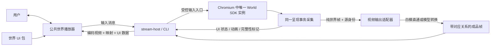

# 世界视频流、同步 UI 与公共播放器技术设计

日期：2026-09-17

状态：总体设计；首期本地白模流 + 同步 UI + 公共 Web 播放器已实现，生产 GPU / 世界模型链路尚未验证

代码核查基线：本地 `dev`，`514fd6ba261f079620c47c49228c70d70f6e8cb1`

本文整理世界流服务、Agent UI 创作和公共播放器的完整设计。用户已确定的产品边界与本文提出的技术方案分别标明；本文保留完整目标设计；当前可执行接口与首期范围以各包 README 和文首实现说明为准，后续章节中的示意 API 不全部代表已支持。实现与评审以用户指定的最新 `dev` 为开发基线；不改写既有生产任务的源码身份。

## 当前实现（2026-09-17）

四个公共包 `world-ui`、`stream-protocol`、`stream-player`、`stream-host`，以及
`apps/stream-web` 已落地。根目录 `pnpm dev:stream` 构建调试页并启动本地服务。
CLI 与调试页面复用同一 Chromium producer、协议和 React 播放器。

已覆盖 WebCodecs VP8 编码/解码、双 WebSocket、源帧 UI 映射、完整快照/增量、
数值动画中断重定向、世界自定义组件构建与哈希校验、控制者输入、重连与 epoch 重置。
Agent 可通过 `creator_get_authoring_schema({document:"ui.md"})` 获取真实编写约束。

布局已实现 React/CSS 风格的 `layout` 对象与独立 `layoutReference` 安全区选择，
不使用自定义 anchor/fill 定位语法。

首期保留边界：白模直通，尚未接世界模型；无 GPU 部署验证、生产吞吐承诺、
App 原生 renderer、动态 document 拓扑/repeat 或运行页 iframe 检视。复杂列表可通过
自定义组件的数组 props 实现。没有服务端再次烘焙 DOM 到视频的路径。
本地服务绑定回环地址；跨站接入需显式允许 origin，公网鉴权/多租户另行部署。

运行入口见 [Host README](../../../packages/stream-host/README.md)，
组件规范见 [Agent UI 文档](../../../packages/creator-host/docs/agent/ui.md)。

## 1. 目标与已确定的边界

用户在公共世界播放器中操作并观看世界。CLI 启动唯一世界实例，输出不含 HUD 的白模视频、UI 状态与动画记录；视频可经过外部世界模型转换，最终仍由同一个公共播放器同步展示视频与 DOM UI。

已确定的要求：

1. 开发与生产复用世界运行、采集、协议、UI 渲染和播放器实现。开发运行在本机，生产可运行在 GPU 服务端。
2. Playwright 管理 Chromium 的启动、页面和生命周期；真正执行 Three/WebGL/SDK 的运行时是 Chromium。Playwright 不承担逐帧截图、DOM 状态反推或另一套模拟循环。
3. 公共播放器负责输入采集和最终显示；世界运行端负责执行输入、模拟和采集。用户不需要在运行页和播放器之间切换操作。
4. 世界画面与 UI 从源头分离。正式白模视频只包含世界 renderer canvas；调试面板和世界 HUD 都不进入模型输入。
5. UI 数据与视频根据源帧和源时间对应，不根据网络到达顺序或猜测固定延迟同步。
6. 公共 SDK 先支持 Web/React。复用 json-render 的组件描述和绑定能力，采用 Motion 执行 Web 动画；视频时间同步由我们的 SDK 提供。
7. 世界项目可以定义自有 UI 和 React 组件，并随世界产物交付；播放器按世界加载，接入方不需要预先硬编码所有世界的组件。
8. Agent 能发现 UI schema、组件能力和示例，能定义、预览、修复并交付 UI。
9. 本地调试页面复用公共播放器，可并排查看运行页与最终画面。iframe 是开发容器选择，不是第二份世界。
10. 后续 App 复用协议与可移植核心；原生 App 需要对应渲染实现，不能承诺任意 Web 自定义组件自动转成原生组件。

首版不包含多人协同编辑、公共组件市场、任意网页 DOM 自动序列化、云端部署自动化或带 UI 的视频导出。录制文件与在线媒体流分别命名；现有 Seedance 异步任务不被描述为实时世界模型服务。

## 2. 当前实现与缺口

以下事实核查自上述 `dev` 基线，不能直接作为新增链路已实现的证据。

| 当前能力 | 源码 / 文档 | 本设计需要补齐的部分 |
| --- | --- | --- |
| `world.createPresentation()` 分离世界 canvas、模型输出、DOM UI | [公共契约](../../../packages/three-world/src/contracts.ts)、[Presentation 实现](../../../packages/three-world/src/presentation.ts) | 独立于本地世界的远端 UI 渲染与持久化记录 |
| `captureFrame()` 返回冻结的世界图像和 `SourceFrame`，内部保存 UI 样本 | 同上 | 在同一捕获事务中导出可序列化 UI 采样；实际编码帧关联 |
| `createStream()` 返回干净 canvas 的 MediaStream | 同上 | 它明确不保证逐帧对应；不能直接接一条元数据队列冒充可靠帧映射 |
| `ui.mount()` 挂载任意 DOM；`ui.bind()` 读取 JSON 状态 | 同上 | mount 的组件闭包、CSS 自运行动画不会自动形成流式 UI 记录 |
| 默认保留 240 次显式捕获的历史，重置清空 | 同上 | 按时间与字节设限的 Host 历史、快照、断线恢复；没有隐含整场录像存储 |
| Creator 用 canvas captureStream/MediaRecorder 录制自检 | [bridge.ts](../../../packages/creator-host/src/browser/bridge.ts) | 现有自检录屏不是在线编码帧服务，也不包含完整 UI 描述与记录 |
| Episode 独占录制时钟并编码视频文件 | [capture.ts](../../../packages/episode-pipeline/src/capture/capture.ts)、[编码器](../../../packages/browser-capture/src/rendered-frame-encoder.ts) | 离线 UI 记录扩展；不能直接拿文件编码器当实时传输器 |
| Seedance 独立提交任务、查询终态、下载成片 | [现有生产链路](../../three-episode-seedance.md) | 尚无已验证的实时模型适配器，也没有模型内部动作时间对应保证 |
| Creator 编译、schema 发现、提交有现有入口 | [编译器](../../../packages/creator-host/src/compiler/compiler.ts)、[schema 提取](../../../packages/creator-host/src/discovery/authoring-schema.ts) | UI 包编译、React 共享依赖、Agent 实际可查询目录和交付哈希闭包 |

保留[架构原则](../../three-sdk-architecture.md)：SDK 仍是世界固定时钟、物理、控制器、身体动画和主相机的唯一执行者。本文的 UI 动画时间求值不推进世界，也不改变身体动画 owner。

## 3. 总体架构



视频和 UI 是逻辑上独立的流；不要求它们恰好使用两个 TCP 连接。网络连接、消息顺序与画面时间是不同概念，协议不依赖它们天然相同。

播放器的显示层是视频像素层与 DOM UI 层。它不重跑世界，不根据按键猜测血量或物体位置。模型转换只处理纯世界图像；业务状态始终来自实际世界执行。

### 3.1 本地开发与 GPU 生产

| 项目 | 本地开发 | GPU 生产 |
| --- | --- | --- |
| 启动入口 | 同一 CLI，启用调试配置 | 同一 CLI，使用部署配置 |
| 世界页面 | Playwright 管理 Chromium，可 headed | Playwright 管理固定版本 Chromium，通常 headless |
| 世界产物 | 选定、编译后的世界与 UI 产物 | 相同结构和身份的部署产物 |
| 输入 / 采集 / 编码 | 使用正式模块 | 使用相同正式模块 |
| 最终显示 | `stream-web` 中的公共播放器 | 业务页面中的同一公共播放器 |
| 诊断面板 | 可见，按需采样 | 默认不显示，可读取诊断 |

“一致”意味着代码路径、资源身份、配置和消息语义一致。不同 GPU、驱动、字体栈、浏览器版本与负载可能影响像素和时延，因此还需要目标 GPU 环境验证；不保证跨机器逐字节相同。

### 3.2 iframe 与唯一世界

默认由 CLI 启动独立 producer 页面，普通调试网页显示同一会话的播放器与白模监视区。CLI 也可以显式启动受 Playwright 管理的 runner shell：其中唯一 producer iframe 执行世界，开发时并排显示公共播放器。两种容器复用同一 producer bootstrap / 运行 / 采集实现；需要对 Page/Frame 分别验证。展开面板不能改变 renderer 尺寸或相机 aspect。

普通浏览器打开本地 `debugUrl` 时默认是观察 / 控制客户端，不再次启动 producer。需要显示“世界运行情况”时，使用纯世界预览流和诊断数据。只有 CLI 已管理的 shell 可以展示实际 producer iframe。

关键约束：

- 每个会话只有一个 producer lease；未取得该 lease 的页面不能启动世界或发布源帧。
- 打开同一世界 URL 不是连接已有页面，而是可能创建另一份实例，必须在会话准入层阻止重复生产者。
- iframe 和调试客户端不通过读取对方 DOM 或 JS 内存来同步 HUD；仍走正式消息路径。
- 用户操作统一来自公共播放器；producer 预览默认不接收直接游戏输入。显式调试接管必须先释放远端控制权，并在证据中记录。
- 关闭唯一 producer 页面使会话进入失败 / 恢复流程；关闭一个观察客户端不等于关闭世界。
- producer 必须保持有效渲染，不能仅因设置了固定 viewport 就假设隐藏 iframe、最小化窗口与 headless 的 RAF 频率相同；这些状态需实际验证，不使用 `display:none` 作为生产采集保证。

## 4. 包与依赖边界

首期新增 4 个 packages 和 1 个应用，沿用 [workspace 布局](../../workspace-packages.md)。四个包与应用目录已创建；当前具体导出见各包 README。

| 包 | 职责 | 主要消费者 |
| --- | --- | --- |
| `@worldkit/world-ui` | UI 定义、组件 schema、状态应用、动画求值、Web 组件与 json-render/Motion 适配 | 世界项目、Creator、播放器、离线重放 |
| `@worldkit/stream-protocol` | 会话 / 帧映射 / UI 消息 / 输入消息的类型、校验和版本协商 | Host 与播放器 |
| `@worldkit/stream-player` | 连接、历史缓存、媒体调度、双流同步、世界 UI 包加载、输入采集及公共 React 组件 | 调试页、业务页面、后续 App 适配 |
| `@worldkit/stream-host` | CLI、本地 HTTP 服务、会话、producer 生命周期、输入转发、输出与模型适配 | 本地开发与生产部署 |
| `apps/stream-web` | 世界选择、会话操作、最终预览、诊断面板 | 开发者；依赖公共播放器 |

`world-ui` 不连接网络，不依赖 Three，不拥有视频时钟；给定 UI 数据和一个源时间即可求值。`stream-player` 决定显示哪一帧以及对应源时间。`stream-host` 不复制世界执行逻辑。模型适配先放在 Host 内部，未出现独立消费者前不另拆包。

拟定公开子入口：

```text
@worldkit/world-ui/schema     JSON 数据类型、校验、组件定义
@worldkit/world-ui/core       事务应用、动画轨道求值
@worldkit/world-ui/react      注册、组件、受控动画、挂载
@worldkit/stream-protocol     跨端消息、版本与媒体封装
@worldkit/stream-player/core  会话状态、缓存、同步策略
@worldkit/stream-player/react Web 播放器与输入采集
@worldkit/stream-host         Node 服务 API；另有 CLI bin
```

依赖方向：`stream-protocol → world-ui/schema`；`stream-player → stream-protocol + world-ui`；`stream-host → stream-protocol + world-ui/core + @worldkit/browser-capture/browser`，其 producer bridge 使用 `@worldkit/three` 公共接口。Creator 负责 UI 编译与交付，Host 消费已编译产物；若复用编译能力，必须使用 Creator 的公开导出，不能导入内部文件。

`world-ui` 不反向引用 stream-protocol。它的动画记录只包含源时间和 UI 身份；会话、传输和媒体封装由 protocol 增加。框架无关入口的实际依赖图中不能出现 React、DOM、Motion 或 Node API；不同 exports 名称本身不能证明隔离。

既有 `SourceFrameKey` 仍由 SDK 的公共契约定义。Host 将其映射为传输的 `SourceReference`，协议包不引入 Three；维护一个有直接契约测试的适配器，不在播放器手写 SDK 内部解析规则。不为抽取三个字段让 SDK 反向依赖整个流协议。

### 4.1 npm 依赖与归属

以下是首版实现的依赖计划，不是已执行安装。根据本设计基线的 package.json 与 lockfile，仓库已有 React/React DOM、Ajv、Playwright、esbuild、TypeScript、Vite 和测试工具；Zod 4 已作为传递依赖存在，但尚无 workspace package 直接声明。已有依赖也必须由实际 import 的包显式声明，不能依赖根目录提升或其他包的偶然安装。

| npm 包 | 使用位置 | 是否需要新增直接声明 / 用途 |
| --- | --- | --- |
| `@json-render/core` | `world-ui` 的 catalog 适配 | 新增；目录与定义处理 |
| `@json-render/react` | `world-ui/react` | 新增；React registry、Renderer、受控 state 绑定 |
| `motion` | `world-ui/react` | 新增；MotionValue、受控动画和局部显示更新；不另行直接引入 framer-motion |
| `zod` | `world-ui` 的 json-render 适配 | 新增直接声明；满足 json-render 的 schema/peer 合同，沿用兼容的 Zod 4 系列 |
| `ws` | `stream-host` | 新增；Node WebSocket server 与二进制媒体转发；浏览器使用原生 WebSocket |
| `fast-json-patch` | `world-ui/core` | 建议新增；复用 JSON Patch 应用/比较，外层仍限定协议子集与原子事务 |
| `json-schema-to-typescript` | Creator UI 构建端 | 建议新增；从 catalog 的 propsSchema 生成类型，避免自建完整 JSON Schema 类型编译器 |

json-render 官方安装说明要求 core 与 React renderer，并说明 React/Zod peer 约束。[安装说明](https://json-render.dev/docs/installation) 2026-09-17 只读查询 npm registry 得到的候选版本为 core/react `0.20.0`、Motion `13.4.0`、ws `8.21.3`、fast-json-patch `3.1.1`、json-schema-to-typescript `16.0.0`；这些版本已在首期实现中安装并进行本地集成验证，具体安装记录以 pnpm-lock.yaml 为准。查询中 json-render/react 的 peer 为 React `^19.2.3`，core 的 Zod 要求可由仓库锁定的 Zod 4.5.4 满足。实施 P0 固定实际验证后的精确版本，不盲用 latest。

已有依赖的使用规则：

- `react`、`react-dom`：Playground 当前已使用 19.2.8。公共 React 库按实际 import 声明 peerDependencies，并为本包开发声明对应依赖；`stream-web` 声明实际运行依赖。动态世界组件通过第 12 节 ABI 复用同一实例。
- `ajv`：继续负责 JSON Schema、协议与产物校验，现有版本为 8.17.1。Zod 仅作为 json-render 适配结果所需表示，catalog JSON 仍是作者唯一源；不要求 Agent 再写一份 Zod schema。
- `playwright`、`esbuild`、`typescript`：复用现有启动、编译和类型检查工具。新增使用者声明自己的直接依赖；版本与 workspace 对齐。
- `vite`、`@vitejs/plugin-react`、`@types/react`、`@types/react-dom`：复用现有 Web 开发工具版本，在 `stream-web` 或实际使用的包中声明。
- `@types/ws`：随 Node 服务实现按需要增加为开发类型依赖，不进入浏览器 bundle。

补丁库只处理数据操作，不处理视频时间、revision 或恢复。在克隆的候选状态上校验并应用整个 patch 与动画事务，全部成功后提交；不得采用库的默认原地修改使失败事务留下半份状态。[fast-json-patch API](https://github.com/Starcounter-Jack/JSON-Patch)

类型生成库只在构建端执行，不传到播放器。若 Creator 运行期间调用它进行 UI 编译，它属于 Creator 的运行依赖，不能仅因“用于构建”就放进会被生产安装省略的 devDependencies。限制其输入为已校验的本地 schema 闭包，不执行作者代码。[类型生成 API](https://github.com/bcherny/json-schema-to-typescript)

静态 catalog 到 Zod 的适配优先验证固定版本的受支持转换；当前 Zod 的 `z.fromJSONSchema()` 被标为实验 API，不能据此承诺完整 JSON Schema 兼容。PoC 必须覆盖第 12.4 节支持的子集，并拒绝不能忠实转换的字段；无需先引入另一套作者 schema。[Zod 转换说明](https://zod.dev/json-schema)

首版不需要因本设计新增 Zustand/Redux、Socket.IO、Remotion、Vercel AI SDK、A2UI/AG-UI 全套依赖或 FFmpeg WASM。WebCodecs、Canvas、Shadow DOM、浏览器 WebSocket 是浏览器 API，不对应必须安装的 npm 包。Node HTTP/crypto/util 可先使用内置模块；正式模型适配器所需客户端依赖在选定服务后单独确定。

## 5. 执行、采集与输出合同

### 5.1 同一呈现事务

每次采集的顺序为：

1. SDK 完成既有固定步与显示采样，并按当前视图渲染。
2. 在不 `await` 的同步事务中冻结 renderer 像素，记录源帧身份、当前 tick、世界 revision、源时间和画幅。
3. 在同一事务内读取已注册 UI 数据、投影锚点、动画记录及对应 UI revision；读取只能观察。
4. 结束事务后异步进行图像转换、编码、模型传输与网络发送；后续世界状态不能改变已冻结样本。
5. 释放 ImageBitmap / VideoFrame，所有失败与丢弃路径也必须释放。

需要扩展 SDK 的公共捕获入口以支持同步附带 JSON 采样，例如为 `captureFrame()` 增加受约束的同步 `readMetadata` 回调并返回冻结 metadata。最终签名在实现公共契约时确定；不得通过访问 Presentation 私有 history，或 `await captureFrame(); readLatestUi()` 来实现。

UI 数据可以在固定步后按真实状态变化记录，采集事务再为该帧封存其完整性标记。多个视频帧可以引用同一个 UI revision；一个固定 tick 也可能对应多个不同显示采样，tick 不代替帧身份。

采集节拍只是 SDK 状态的消费者。它可以请求一次受支持的 render/capture，不自行 step Rapier 或推进相机；过载时降低采集或丢弃尚未编码的帧，不能靠修改世界速度维持视频 FPS。

### 5.2 数据采集与 Playwright

producer 浏览器中的 bridge 调用正式采集接口，并使用持续连接输出数据。Playwright 用于启动、连接、就绪检查、页面日志和生命周期。不得每帧进行 page screenshot、DOM 扫描或大量 `page.evaluate` 往返。

第一轮可用 Playwright 绑定验证低频控制与就绪；最终性能测试必须覆盖持续帧传输路径。记录实际 WebGL renderer、浏览器构建、编码配置与硬件加速结果，GPU 节点存在不等于浏览器或编码器实际使用 GPU。

### 5.3 输出模式与模型适配

`whitebox` 直接输出纯世界帧，源对应关系可由采集链证明。`model` 通过模型适配器返回成品画面及对应关系。运行配置必须显式选择；模型失败时不静默改用白模假装成功。

拟定模型适配器的必要能力：输入源帧 / 源区间、处理请求身份、输出解码帧或编码片段、输出时间轴、对应关系质量、取消与错误。批量模型可以由离线适配器实现，但不能宣称满足实时交互 SLA。

输出对应关系分为：

- `exact-frame`：输出明确来自某个源帧；允许多个输出帧指向同一个源帧。
- `explicit-time-map`：未来由提供商或确定性的本地处理给出可验证的分段时间映射，说明插帧 / 变速策略。
- `unknown`：没有可用对应证据。允许展示视频与即时控件，隐藏需要精确状态的 HUD，并明确 `unmapped`。

相同时长、相同 FPS、请求中包含源帧 ID 都不是模型内容对应的证明。模型改变动作节奏或几何时，不能把输入 ID 原样贴在任意输出上。头顶标签只能承诺源世界投影；模型移动目标后需要额外跟踪，不包含在首版。

首版实现的判别联合仅为 `{quality:'exact-frame', source, uiRevision, ...}` 和 `{quality:'unknown', reason}`。`explicit-time-map` 是后续扩展，需另定区间覆盖、插值、`revisionAt(sourceTime)` 和缺口语义；不能为源帧之间的合成时刻伪造 sourceFrameId。帧率变化仍可通过多个不同输出 PTS 明确引用同一真实源帧。

## 6. 时钟、帧身份与映射

### 6.1 四种时间

| 字段 | 含义 | 用途 |
| --- | --- | --- |
| `simulationTick` | SDK 固定步编号 | 玩法、物理和执行证据 |
| `sourceTimeUs` | producer 当前 epoch 内的呈现时间，微秒整数 | UI 有效时间、动画时间、源帧排序 |
| `outputPtsUs` | 输出媒体时间轴上的展示时间戳 | 编码、解码和播放器调度 |
| 接收 / 墙钟时间 | 单机性能时钟或日志时间 | 测量、网络超时；不作为画面对应关系 |

源时间在 producer 内使用单一 epoch-relative 单调时间源，事件与画面共同读取；记录 SDK 的原始 `capturedAtMilliseconds` 用于审计，不跨机器直接相减。运行暂停与播放器暂停分别处理：播放停顿冻结 presented UI；世界暂停不会隐式改变媒体时钟，应用若需要冻结特定倒计时，应在真实状态中表达。

`sourceTimeUs`、duration 和 PTS 在本协议用非负安全整数；不混用毫秒和秒。epoch 变化后重建起点。控制超时使用独立单调墙钟，避免暂停视频导致按键租约永不超时。

### 6.2 身份字段

| 身份 | 归属 / 更新条件 |
| --- | --- |
| `worldBuildHash`、`runtimeHash`、`uiBundleHash` | 会话绑定的不可变产物 |
| `sessionId` | 一次世界会话，不能只用 worldId 区分 |
| `epoch` | 世界 reset / producer 重建时更新，旧输入、UI 与帧全部失效 |
| `presentationId` + `sdkEpoch` + `sourceFrameId` | SDK 源捕获身份；`sdkEpoch` 原样保存现有 SourceFrameKey.epoch |
| `outputStreamId` + `mediaGeneration` | 输出模式、编码器、连接重建导致媒体时间轴重建时更新 |
| `uiRevision`、`documentRevision` | 源 UI 状态事务和 UI 结构版本 |

多个观察客户端可以消费同一会话，但首版只有一个交互控制租约。换世界创建新会话；开发热更新创建新产物身份并显式重启或新 epoch，不把新版 UI 应用到旧世界记录。

Host 的会话 `epoch` 与 SDK `SourceFrameKey.epoch` 不是同一个计数器：producer 重建后 SDK 可能从 0 开始，而会话 epoch 已递增。传输层使用 `sdkEpoch` 保存原值，并在 session epoch 下绑定 presentationId；不要求两个数字相等。

### 6.3 每帧映射

编码帧须携带或可靠关联下列元数据。此处为协议 payload 示例，公用 envelope 见第 8 节。

```json
{
  "outputStreamId": "output-1",
  "mediaGeneration": 1,
  "outputFrameId": 361,
  "outputPtsUs": 12000000,
  "mapping": {
    "quality": "exact-frame",
    "source": {
      "presentationId": "presentation-1",
      "sdkEpoch": 0,
      "sourceFrameId": 301,
      "sourceTimeUs": 12000000,
      "simulationTick": 720,
      "worldRevision": 25
    },
    "uiRevision": 42,
    "documentRevision": 1,
    "uiCompleteThroughUs": 12000000
  },
  "image": { "widthPixels": 1280, "heightPixels": 720 }
}
```

`uiCompleteThroughUs` 表示 producer 已处理截至此源时间的全部 UI 事务，而非“最新收到一条 UI 消息的时间”。Host 只有验证 UI revision 链完整后才能向客户端发布该标记。无变化时也能推进完整性标记，无需重复发送整份状态。

传输重编码、丢帧、重复帧或变速时须保留组合映射：`浏览器显示帧 → 输出媒体身份 → 模型输出对应关系 → 源身份 → UI revision`。不使用 `presentedFrames`、截图计数或队列下标替代这条链。

输出画幅首版保持源 aspect ratio，允许等比缩放；播放器按实际 image rect 放置 UI。裁剪 / 旋转 / 非线性模型变形不靠 CSS 拉伸补齐；未来需显式空间变换。固定屏幕 HUD 与世界锚点分开声明。

同一 mediaGeneration 的展示 PTS 唯一且按播放顺序递增；首版在线 mapped 输出的 sourceTimeUs 不回退，重复源帧允许相等。提供商乱序结果应在有界输出调度中处理；超出窗口的旧结果丢弃并记录，不能在直播中偷偷倒放 UI。离线 seek 使用单独的回放重建操作。

## 7. 媒体传输与显示策略

### 7.1 首版技术提案

第一条可验收链路建议使用 **带帧头的二进制 WebSocket + WebCodecs**，控制与 UI 使用独立可靠 WebSocket。该选择优先让编码输入、输出和播放帧身份可审计；不是已验证的公网低延迟最优方案。Web 首版限定经过验证的 Chromium 与 secure context（localhost 或 HTTPS），编解码支持在启动时协商。

白模输出对冻结帧使用 `sourceTimeUs` 作为编码输入 timestamp，此模式的 `outputPtsUs` 与它相同。模型输出或重定时时，最终输出编码器使用独立的 `outputPtsUs`，不能继续拿 sourceTimeUs 代替；多个输出帧引用同一源帧时，其输出 PTS 仍须明确区分。客户端用 `(outputStreamId, mediaGeneration, decodedFrame.timestamp)` 查映射，解码 timestamp 对应 outputPtsUs。帧头和对应编码 payload 在同一二进制消息中，禁止另用“下一条元数据”配对。

帧消息布局为：4 字节大端 JSON 头长度、UTF-8 JSON 头、编码字节。头含第 6 节映射、codec 配置版本、key/delta 类型、duration 和 payload 长度。解码配置变化先发送配置记录，包括必要的 decoder description 字节；第一帧及重连恢复点须为可解码关键帧。编码 chunk 按 encoder 输出 / 解码顺序传输，解码完成后才按 PTS 调度显示，不能先按 PTS 重排编码 chunk。低延迟配置不假设必然没有重排，必须按实际 PTS 关联并测试。

播放器将解码后的画面绘制到专用视频像素 canvas，在其上叠加 DOM。这里传输的仍是编码视频流，不是 UI 截图；UI 没有烧进视频。公共 React API 不暴露 HTMLVideoElement 假设，以便未来增加标准视频轨道或 App 表面。

选定 codec、硬件加速、码率、帧率与资源开销须经 P0 实测后冻结，文档不承诺某一 GPU 一定支持硬件编码。WebCodecs 提供显式视频 timestamp；它本身不提供信令、网络传输、容器或业务对应关系。[WebCodecs 规范](https://www.w3.org/TR/webcodecs/)

### 7.2 WebRTC 的位置

WebRTC 是公网实时交互的重要后续候选，能提供成熟媒体传输；但单独 `canvas.captureStream() → RTCPeerConnection` 不足以实现可证明的源帧映射。接入前必须验证发送编码帧时间戳、RTP 身份与接收显示帧之间的关联，覆盖丢帧、时间戳回绕、重连和 track 替换。

若 P0 的 WebSocket 链路不能达到交互目标，应在媒体适配层评估 WebRTC，而不是在播放器猜固定延迟。不能开发用一套直连画面、生产另一套未经测试的媒体路径却声称一致。每个正式 transport 都要在本地调试和 GPU 生产共用。

标准 video 表面可利用 `requestVideoFrameCallback()` 的媒体元数据，但回调计数不是源编号，DOM 更新也不保证和视频在同一次 compositor 提交中完成。[视频帧回调文档](https://developer.mozilla.org/en-US/docs/Web/API/HTMLVideoElement/requestVideoFrameCallback)

### 7.3 背压与卡顿

WebSocket 的可靠有序交付会产生队头阻塞，浏览器 WebSocket API 也没有自动背压机制。[WebSocket 文档](https://developer.mozilla.org/en-US/docs/Web/API/WebSocket)

首版显式限制 encoder queue、待发送字节、解码队列和历史缓存：

- 优先在编码前丢弃过期采样；不删除 UI 事务，不修改模拟时间。
- 已发送或已编码的依赖帧不能任意丢弃；积压时切换 mediaGeneration、清空旧解码状态并从新关键帧恢复。增加 generation 不能清除 WebSocket 已排队字节；超出预算时关闭旧媒体 socket、重建媒体连接，旧连接迟到消息整条丢弃。控制 / UI 连接可继续存在，媒体恢复不强制增加其 connectionGeneration。
- 控制 / UI 通道与媒体字节分开，避免单个大视频包阻塞 release-all；仍需测量共享网络拥塞。
- 首版建议调试起点：1280×720、24fps，待编码帧不超过 2，未呈现解码帧不超过 3。它们是实验配置，不是已验证性能。
- 窗口、历史与配额上限写入会话协商结果，暴露实际丢帧和超限原因，禁止无限缓存换取表面连续。
- 模型处理时间持续超过预算时报告拥塞 / 延迟，不自动通过减慢世界时间伪装实时。

音频不纳入首版同步承诺；descriptor 明确 `audio: none`。后续音轨需要基于同一输出 PTS，不能因原生 video 自带音频就隐含宣称音画 / UI 全部同步。

## 8. 会话与消息协议

### 8.1 控制消息封装

控制 / UI 消息为一个 WebSocket text message 内一个完整 JSON 对象；日志存储可以用 JSONL，但不能把不完整的网络 JSON chunk 直接应用到状态。视频用第 7 节二进制封装。

```ts
// 拟定类型，非当前已导出 API。
interface MessageEnvelope<T> {
  protocolVersion: 1;
  type: string;
  sessionId: string;
  epoch: number;
  connectionGeneration: number;
  sequence: number;
  payload: T;
}
```

`sequence` 在每个方向的控制连接中递增，用于重复 / 缺口诊断；它不替代跨重连的 UI revision，也不用于视频配帧。`connectionGeneration` 每次连接重建更新；普通重连不重启世界，epoch 保持。媒体连接必须绑定同一会话的有效连接代，不接受旧 socket 的迟到包。

消息类型及责任：

| 消息 | 方向 | 主要 payload |
| --- | --- | --- |
| `session.hello` / `session.ready` | 双向 | 协议、客户端能力、产物身份、当前 epoch、限额 |
| `ui.definition` | 服务 → 客户端 | definition、catalog 与 UI 包 hash、documentRevision |
| `ui.snapshot` | 服务 → 客户端 | revision、有效源时间、完整 state、活动动画 |
| `ui.commit` | 服务 → 客户端 | baseRevision、revision、有效源时间、statePatch、动画操作 |
| `ui.watermark` | 服务 → 客户端 | completeThroughUs、已完整发布的 revision |
| `ui.resync` | 客户端 → 服务 | 已有 revision、目标源时间、缺口原因 |
| `media.config` / `media.restart` | 服务 → 客户端 | codec、配置字节、mediaGeneration、恢复 checkpoint |
| `input.acquire` / `input.lease` | 双向 | 控制租约、持有者、过期时间 |
| `input.state` / `input.action` | 客户端 → 服务 | 持续输入 / 离散动作及序号 |
| `input.release` / `input.receipt` | 双向 | 释放、接受 / 拒绝、消费 tick、操作身份 |
| `session.reset` / `session.ended` | 服务 → 客户端 | 新 epoch / 结束原因 |
| `diagnostics.sample` | 服务 → 客户端 | 按需且限频的实际观测 |

实现时用判别联合和运行时 schema 限定 payload，不能让任意字符串 type 配任意对象。协议版本与 UI renderer ABI 分开协商；不认识的可选诊断消息可以忽略，必需消息或不兼容 major version 明确拒绝。

### 8.2 快照、补丁和原子应用

每个 epoch 的权威 UI 事务有连续 revision。`ui.commit` 必须满足 `revision = baseRevision + 1`，按源时间不回退；同一源时间用 revision 排序。事务同时携带状态变化与动画操作，验证成功后原子提交，失败不留下部分 patch。

首版状态补丁采用 JSON Patch 的 `add / replace / remove` 子集，支持 RFC 6901 路径转义；不宣称实现完整 RFC 6902。限制原型污染路径、消息大小、嵌套深度与操作数。高频实体数据使用稳定 ID 对象表，减少数组插入造成的大面积索引变化。[JSON Patch 标准](https://www.rfc-editor.org/info/rfc6902/)

以下示例从 revision 41 进入 42：

```json
{
  "protocolVersion": 1,
  "type": "ui.commit",
  "sessionId": "session-1",
  "epoch": 2,
  "connectionGeneration": 1,
  "sequence": 105,
  "payload": {
    "documentRevision": 1,
    "baseRevision": 41,
    "revision": 42,
    "effectiveSourceTimeUs": 12000000,
    "statePatch": [
      { "op": "replace", "path": "/player/health", "value": 60 }
    ],
    "animationOps": [
      {
        "op": "replace",
        "track": {
          "animationId": "damage-42",
          "nodeInstanceId": "health-bar",
          "property": "displayValue",
          "startSourceTimeUs": 12000000,
          "durationUs": 300000,
          "from": 100,
          "to": 60,
          "easing": "linear",
          "fill": "forwards"
        }
      }
    ]
  }
}
```

客户端收到 42 时若只有 40，不能在 40 上强行应用；进入 `resyncing` 并获取缺少事务或 checkpoint。重复且内容一致的 revision 幂等忽略；相同 revision 内容冲突作为协议错误，不以最后到达者覆盖。

UI 快照 payload 至少包含：

```json
{
  "documentRevision": 1,
  "revision": 42,
  "effectiveSourceTimeUs": 12100000,
  "completeThroughUs": 12100000,
  "state": { "player": { "health": 60, "maxHealth": 100 } },
  "activeAnimations": [
    {
      "animationId": "damage-42",
      "nodeInstanceId": "health-bar",
      "property": "displayValue",
      "startSourceTimeUs": 12000000,
      "durationUs": 300000,
      "from": 100,
      "to": 60,
      "easing": "linear",
      "fill": "forwards"
    }
  ]
}
```

快照有效于该时刻及之后的连续事务链。12.1 秒的快照不能用于恢复 12.0 秒之前的视频。首版只允许终点能从当前绑定 state 确定性推导的展示属性，组件非动画回退值必须与终点一致；结束后移除轨道即可恢复稳定结果。不支持必须另存任意 settled value 的动画。`animationOps` 的取消操作按 nodeInstanceId/property 定位并立即回退到当前绑定值；替换轨道也必须最终到达绑定值，首版不支持永久保持任意中间值。

### 8.3 可呈现判定

一帧可以连同 HUD 呈现，当且仅当：

1. session、epoch、mediaGeneration、UI 产物身份相符。
2. 有当前帧可信的源映射与所需 UI revision。
3. 客户端有不晚于该源时刻的 checkpoint，且到所需 revision 的事务链完整。
4. 完整性标记覆盖该源时刻，且所需 UI 定义和组件资源已加载。

网络消息先进入有界历史；只有播放调度器选中一帧时才生成其 `PresentedUiState`。json-render 使用该受控 state，不能直接消费网络到达的最新 patch。

迟到处理的首版默认策略：最多等待一个协商的短窗口（调试起点 100ms）；超时继续展示视频、隐藏对应的 presented HUD，状态变为 `unmapped` / `resyncing`。不显示未来 HUD、不拿错误状态填空；live 菜单保持可用。若视频本身停在上一帧，保留与该帧匹配的 UI 和动画进度。

### 8.4 重连、跳转与 reset

连接重建时，客户端发送最后确认的 revision 与媒体位置。窗口内补发；窗口外由 Host 协调新的可解码关键帧及相应 UI checkpoint，客户端显式跳转到这个恢复点。不能把“当前最新 UI 快照”叠到旧缓冲视频。

reset 的顺序为：释放输入 → 停止发布旧 epoch → SDK reset 完成并建立新基线 → 清理旧帧与动画 → 发布新 epoch 的定义 / checkpoint / codec 配置 / 关键帧。reset 失败不声称新基线 ready。

源时间回退只在明确的离线回放 seek 操作中允许；用相应 checkpoint 重建，不反向执行 patch。在线媒体流首版不支持 DVR，跳到最新和 seek 是不同操作。

## 9. 输入回传与执行

### 9.1 单一输入 owner

公共播放器采集键盘、鼠标、触摸和 UI action。输入提交给 Host，再进入 producer 的既有 SDK 固定步。当前公开接口缺少通用的实时远端输入队列，需要新增狭窄入口；不能在网络收到消息时调用 `ThreeWorld.step()` 或 Episode `advance()`。

该入口维护 held state、一次性 edge action 与累积 pointer delta，由既有固定步消费。复用 [WorldInputRouter](../../../packages/three-world/src/input.ts) 的焦点、按键、拖拽和释放语义，并与本地键盘 / Episode 独占权互斥。现有 `humanoid.set-input` 只覆盖其特定命令，不等于已经覆盖所有世界主体和相机输入。

远端输入的焦点准入依据是播放器生命周期与控制租约，不是 producer 页的 document.hidden 或 blur。现有本地输入在失焦时清空的行为不能直接套到后台 producer，否则隐藏/iframe/headless 会错误释放远端操作。复用控制语义，同时明确区分本地与远端准入策略。

### 9.2 拟定输入 payload

```json
{
  "leaseId": "controller-1",
  "clientInputSequence": 83,
  "observedSource": {
    "presentationId": "presentation-1",
    "sdkEpoch": 0,
    "sourceFrameId": 301
  },
  "heldKeys": ["KeyW", "ShiftLeft"],
  "keyEdges": [
    { "edgeId": 91, "code": "Space", "kind": "down" },
    { "edgeId": 92, "code": "Space", "kind": "up" }
  ],
  "pointer": {
    "mode": "drag",
    "deltaImageFractionXY": [0.003125, -0.002778],
    "positionImageUV": [0.5, 0.5],
    "zoomSteps": 0
  }
}
```

完整消息还带 envelope 中的 session/epoch。物理键用 `KeyboardEvent.code`，按键绑定仍由世界 SDK 解释；触摸组件输出同一输入意图。`keyEdges` 包含有序 down/up 与稳定 edgeId，防止两次发送之间的短按键丢失。heldKeys 只校正持续状态，不再次生成一次性动作；边沿生成和去重只有一个 owner，快照恢复不重放历史按下事件。

`clientInputSequence` 在租约内单调增加；按 leaseId+序号拒绝重复 / 旧消息后，才能累积 pointer delta 或消费 edge。pointer delta 可在固定步前累积，不能被最新一次覆盖。输入应用回执记录实际消费 tick，`observedSource` 只表明用户看到什么，不触发模拟回滚。

pointer 的位置原点为视频有效 image rect 左上角，UV 在 `[0,1]`，黑边不产生世界点击；相对位移分别除以该 rect 的宽高。`mode` 区分 drag/pointer-lock，wheel 在客户端按 deltaMode 转成约定 zoomSteps。producer 适配器以会话固定的源 viewport / SDK 灵敏度转换，不能以整个外层窗口宽高计算。转换函数、单位和触摸策略在输入适配测试中固化，避免播放器缩放改变镜头手感。

离散动作单独带 `actionId`、命名 action 和经 schema 校验的参数。服务按租约与 actionId 去重；不允许网络包直接指定任意 JS、内部方法或写入历史 HUD 状态。`accepted` 表示准入，不代表动作完成；长操作沿用真实 operation 状态反馈。

持续输入定期发送完整 held state；blur、visibility loss、pointer cancel、租约失效和断连都释放。服务使用墙钟租约超时作为兜底，不能依赖客户端有机会发出 keyup。切换世界或 renderer 卸载时先 release-all。

### 9.3 UI 与游戏输入

UI 可交互区域消费点击，不把一次按钮点击同时变成世界鼠标操作。输入框聚焦时暂停游戏键盘采集。fullscreen、pointer lock 等浏览器手势能力在用户播放器页触发，不能要求后台 Playwright 页面代替用户手势。

世界命令始终作用于当前权威世界，即使用户看到的是延迟画面。命令可携带用户观察的目标身份供服务验证，但不从历史 HUD 直接断言动作仍可执行。应显示实际端到端延迟，UI 同步不能消除模型处理延迟。

## 10. UI 创作数据结构

### 10.1 三份数据分别负责什么

| 数据 | 写入者 | 用途 |
| --- | --- | --- |
| `UiDocument` | Agent / 项目作者，经编译冻结 | 布局、组件、绑定、动画规则、命名事件 |
| 权威 UI state | producer 中的只读 selector 从真实状态提取 | 描述世界事实，不形成第二份玩法状态 |
| presented UI state | 播放器根据源时刻重建 | 供渲染器显示；不可反写世界 |

本地菜单和输入草稿使用单独 client state。`$bindState` 等双向绑定仅允许写 client namespace；修改世界状态必须发命名 action 并等待实际执行结果。动画完成回调不能造成世界掉血、任务完成等玩法变化。

### 10.2 UI 定义示例

采用 json-render 的 `root + elements + props + children` 基础形态，外围加 World UI 的 schema/version 和 transition 定义。以下完整对象是拟定的 `UiDocument`，其中 `spec` 部分交给 json-render，其他字段由 world-ui 处理：

```json
{
  "schemaVersion": 1,
  "catalogId": "world-hud",
  "designViewport": { "width": 1280, "height": 720 },
  "spec": {
    "root": "hud",
    "elements": {
      "hud": {
        "type": "HudLayer",
        "props": {},
        "children": ["health-bar"]
      },
      "health-bar": {
        "type": "SciFiHealthBar",
        "props": {
          "value": { "$state": "/player/health" },
          "max": { "$state": "/player/maxHealth" },
          "anchor": "top-left",
          "offset": [24, 24]
        },
        "children": []
      }
    }
  },
  "transitions": {
    "health-bar": {
      "value": {
        "targetProperty": "displayValue",
        "durationMs": 300,
        "easing": "linear",
        "interrupt": "from-current"
      }
    }
  }
}
```

组件目录声明 `value` 为可绑定数值、`displayValue` 为可动画展示属性，且结束时回退到 `value`。Agent 不填写 sourceTimeUs、revision 或 animationId；source-side world-ui/core 在真实变化发生时生成这些记录。

`designViewport` 使用逻辑设计单位。播放器先计算视频实际 image rect（含 letterbox），再把 HUD 根坐标等比映射进去。屏幕边缘布局相对该 rect，App safe-area 是外层布局约束；不能把源 framebuffer 像素、CSS 像素和 DPR 当成同一单位。

producer 的状态入口可由项目声明为只读 selector，例如 `readUiState()` 返回 `{player:{health:healthHandle.value,maxHealth:100}}`，其中 healthHandle 是现有世界状态句柄。Host 在固定步提交之后及同步捕获事务中通过正式桥接调用它；不把所有 SDK snapshot 无差别传给客户端。selector 的返回类型由项目 UI state schema 校验，绑定路径必须能在该 schema 中找到。

首版运行中 UI 结构固定，通过数据绑定控制内容、显隐、列表和状态。Agent 编辑结构后重新编译并生成新 definitionHash；任意在线树 patch / hot swap 留到明确需求后，不为支持状态流顺带引入协同编辑协议。

列表模板 nodeId 与实际 nodeInstanceId 分开。无 repeat 时实例 ID 等于 nodeId；有 repeat 时由共同的实例展开函数根据模板 nodeId 与稳定 item key path 生成无碰撞身份，嵌套 repeat 包含全部 key。禁止用数组下标作实例身份；source 动画生产与客户端 renderer 必须使用同一展开算法。绑定与过渡触发只允许 source 和 renderer 共享的纯确定性表达式；自定义 computed 若依赖 DOM、墙钟、随机或网络则不属于首版可重放绑定。

### 10.3 为什么使用 json-render

它提供组件目录、平台 registry、JSON Pointer 数据绑定与可控 state store，可复用我们自己的 React 组件。[目录](https://json-render.dev/docs/catalog)、[注册](https://json-render.dev/docs/registry)、[绑定](https://json-render.dev/docs/data-binding)

其 SpecStream 面向增量生成 UI 定义，不处理本文的源时钟、视频身份或重连。Agent 生成阶段可用其能力；运行时仍使用本文的版本化事务，不能直接把 `useUIStream` 当作视频 HUD 同步器。[流式定义文档](https://json-render.dev/docs/streaming)

依赖版本必须在第一次实施 PoC 后精确锁定，验证当前 catalog、registry、external store 的实际 API。文档中的新增 wrapper API 不伪装成第三方已存在功能。A2UI 的组件与数据分离、AG-UI 的 snapshot/delta 可作设计参考，首版不同时叠加多套 UI 协议。

## 11. 动画语义与 Motion 适配

### 11.1 规范由纯 core 求值定义

源端对绑定结果的变化检测发现 100 → 60 的真实血量变化时，在一条 ui.commit 中同时发布目标 state 和显式 animation track。首版只支持数值 tween，easing 为固定枚举或四个有限数值的 cubic-bezier，其两个 x 控制点必须在 `[0,1]`，y 可越界但显示属性按组件声明的范围裁剪。不传 JS 函数，不支持关键帧序列、隐式惯性、无限循环和依赖 DOM 测量的 layout 动画。

动画区间为 `[startSourceTimeUs, startSourceTimeUs + durationUs)`，duration 为 0 时立即完成。数值轨道的规范为：

```text
durationUs == 0 时直接取 to，否则：
p = clamp((presentedSourceTimeUs - startSourceTimeUs) / durationUs, 0, 1)
displayValue = from + (to - from) × easing(p)
```

动画尚未开始时不覆盖已有显示状态；结束时取终点。相同 nodeInstanceId/property 同时只有一个有效动画 owner，首版采用 replace。颜色 / 复杂类型先通过组件的标准数值展示参数表达，后续扩展时必须定义可移植插值语义。

### 11.2 连续掉血与恢复的确定结果

以第 8 节线性动画为例：12.000 秒从 100 到 60；12.150 秒显示 80。此时真实血量再降到 40，源端 core 计算旧轨道在 12.150 秒的值 80，发布第二条显式轨道 `80 → 40`。不能读取某个客户端当时 DOM 中的宽度作为新起点，因为每个客户端可能处于不同播放位置。

| 情况 | 规范行为 |
| --- | --- |
| 消息迟到 | 直接求当前源时刻的轨道值，不从头播放 |
| 视频重复帧 / 暂停 | 使用同一 sourceTimeUs，进度保持 |
| 同时刻多次变化 | 按 revision 排序，后一事务替换前一轨道 |
| 初次连接 / 重连 | 从 checkpoint 的活动轨道恢复，保留原 start/from/to |
| 播放丢帧 | 在下一实际展示源时间重新求值 |
| 世界 reset | 清理旧 epoch 的轨道与 fallback |
| 节点移除 / 世界切换 | 取消订阅、动画与资源，旧加载结果不可再挂载 |

24fps 视频按帧锁定 UI 时，HUD 的世界相关动画也是 24 个时间采样/秒。首版不以自由运行 60Hz 动画掩盖此事实。未来可在已确认的连续映射区间内平滑采样，但必须在视频停顿和 watermark 边界停止，不能超前显示未来状态。

### 11.3 自定义 React 组件的接入

拟定 Hook 查询已存在的轨道，而不是在 props 变化时自行创建动画：

```tsx
function SciFiHealthBar({ nodeInstanceId, props }:
  WorldUiComponentContext<HealthBarProps>) {
  const displayed = usePresentedMotionValue({
    nodeInstanceId,
    property: 'displayValue',
    fallback: props.value,
  });
  // displayed 为 MotionValue<number>；Visual 通过局部订阅更新填充比例。
  return <HealthBarVisual valueMotion={displayed} max={props.max} />;
}
```

`nodeInstanceId` 由 renderer 稳定注入，作者不临时生成。`usePresentedMotionValue` 返回稳定的 MotionValue<number>，不是逐帧触发整棵 React tree 更新的 number；Visual 消费相同值而不再启动 tween。前期讨论中的 `usePresentedNumber({value, durationMs})` 只是想表达便捷性，不能作为完整合同：缺少源时间、轨道身份和恢复基线时，无法保证同步。

Web 默认采用 core 求值结果更新受控 MotionValue / 目标属性；也可对经过一致性验证的 tween 使用 paused Motion animation 并显式设置 `time`。Motion 的秒与协议微秒只在适配边界转换。不能同一属性同时启用 CSS transition、普通 Motion animate 和轨道求值。[Motion 控制 API](https://motion.dev/docs/animate#controls)

React 负责组件生命周期和离散状态更新，逐帧显示属性通过局部订阅更新，不对整棵树每帧 setState。菜单 hover、按钮按压等即时本地反馈可用正常 Motion 动画，但必须标为 live UI。

UI 与媒体 DOM / canvas 最终提交存在浏览器调度误差。我们承诺使用同一个确认源时间求值，并测量呈现偏差；不承诺与烧录到视频像素一样原子合成。

## 12. 世界自定义 UI 包

### 12.1 项目与交付结构

建议在世界源码内增加明确的 UI 入口，而不是扫描任意 DOM 自动生成协议：

```text
world-project/
  scene.ts                    世界与真实状态
  ui/
    definition.json           UiDocument
    catalog.json              自定义组件 / 动作 schema
    state.schema.json         selector 输出的数据 schema
    state.ts                  在 producer 执行的只读数据 selector
    components.tsx            自定义 React registry 入口
    styles.css
    assets/
```

项目入口字段由 Creator project schema 明确声明，不能仅凭目录名启用。catalog 是可静态读取的 JSON；Host 不执行作者 Node 构建脚本或 import 作者模块来提取 schema。state selector 编译进世界浏览器产物，只读取已有 SDK 状态句柄 / 公开观察接口。

UI 交付清单示意：

```json
{
  "kind": "worldkit-ui-bundle",
  "schemaVersion": 1,
  "runtimeAbiVersion": "world-ui-web/1",
  "catalog": { "path": "catalog.json", "sha256": "CATALOG_SHA256" },
  "stateSchema": { "path": "state.schema.json", "sha256": "STATE_SCHEMA_SHA256" },
  "definition": { "path": "definition.json", "sha256": "DEFINITION_SHA256" },
  "module": { "path": "components.mjs", "sha256": "MODULE_SHA256" },
  "styles": [{ "path": "styles.css", "sha256": "STYLE_SHA256" }],
  "assets": [{ "path": "assets/hud.woff2", "sha256": "FONT_SHA256" }]
}
```

示例中的 hash 为占位符，实际产物须校验真实字节。`uiBundleHash` 由无自引用的规范化 UI 清单内容与文件身份生成；世界总体 build hash 再引用它。世界与 UI 的绑定在外层 delivery/session manifest 表达，UI 清单不反向嵌入 worldBuildHash，避免循环哈希。

交付包含源码、构建后 JS/CSS、字体、图片、catalog、state schema 和定义；只 hash JSON 不足以标识实际 UI。state schema 同时用于 selector 校验、绑定检查和 Agent 发现。UI 包包含在 Creator 的已验证 payload 闭包内，服务据此分发内容寻址资源，不依赖开发机器路径。

### 12.2 React 单例与动态模块 ABI

动态 UI 包输出一个受控 factory，例如 `createWorldUiModule(runtime)`，返回该世界的 registry。编译器把允许的 React、JSX runtime 和 world-ui hooks 绑定到 factory 参数，通过闭包解析；组件不得自带第二份 React，也不依赖业务宿主自动解析 bare module imports。

```ts
// 拟定导出形式；factory 由受控 UI build 产生。
export function createWorldUiModule(runtime: WorldUiWebRuntime): WorldUiModule;

interface WorldUiModule {
  catalogId: string;
  components: Record<string, unknown>; // 实现时收紧为已校验组件定义
  dispose?(): void;
}
```

普通源码仍可使用熟悉的 React import / JSX，由编译器生成绑定，不要求 Agent 手写依赖注入代码。v1 bundle 是无剩余外部模块导入的单个 ESM factory；资源 URL 通过运行时注入的清单解析器取得，不依赖 blob URL 的相对路径。

SDK 静态包使用 peer dependency 与构建去重；动态包使用明确 runtime ABI。仅写 `external: ['react']` 无法保证组件使用的 React 与 React DOM 相同。[React 重复模块说明](https://react.dev/warnings/invalid-hook-call-warning#duplicate-react)

### 12.3 加载与卸载事务

1. 获取会话绑定的 UI manifest，校验协议 / ABI / catalog / definition 版本。
2. 取回并校验实际 module、CSS、asset 内容。首版可对单文件 factory 使用校验后的 Blob module import；Host CSP 必须显式支持此路径，不能假设 dynamic import 自带 SRI 校验。
3. 提供共享 React/JSX/hooks/runtime 参数，创建会话局部 registry；它由 SDK 内置组件（如 HudLayer）与世界自定义组件合并，名称冲突明确拒绝。检查 catalog 组件都有实现且 props 契约匹配，不允许世界包悄悄覆盖内置实现。
4. 在播放器私有 UI 根内加载样式、字体与资源，再提交初始快照并显示 HUD。视频可先播放，UI 处于明确的 loading 状态。
5. 换世界时先递增加载 generation、停止订阅并卸载 root，执行 dispose、取消动画、清除监听并撤销 Blob URL；旧请求即使晚到也不能重新挂载。

UI 使用 ShadowRoot 或同等明确的作用域隔离方案；v1 建议 ShadowRoot，portal 目标由 SDK 注入并留在对应根内。字体和 CSS 变量显式声明，防止业务页面全局样式改变世界 HUD。

构建 / 加载器必须将 CSS 的 `url()`、`@font-face` 和允许的 `@import` 重写到清单内已校验的资源地址，或在构建时内联展开；不能让相对路径落到业务页面 origin 下。资源闭包之外的样式导入拒绝，卸载时同时释放生成的资源 URL。

自定义模块是执行代码。v1 支持可信、经当前工具链构建交付的世界包；哈希保证身份，不保证代码安全。Shadow DOM 隔离样式但不隔离权限。若未来接入任意第三方不可信代码，需要独立 origin/sandbox iframe 的执行边界与消息 ABI，不能通过“JSON schema 校验”宣称已隔离。

### 12.4 Agent 编写组件库的固定接入契约

组件内部可以使用普通 React、HTML/CSS、SVG、局部 Hook 和子组件；可流式消费的边界必须固定。json-render 不会自动识别项目里任意导出的组件，也不会自动把 DOM 或组件闭包转换成 schema。

Agent 提交的最小集合是 `catalog.json + components.tsx + definition.json + state.schema.json + state.ts`；没有自定义组件的世界可直接使用 SDK 内置 catalog/registry。文件路径可由项目清单指定，但入口职责和导出形态一致。

**A. catalog 是唯一属性契约。** 以下为 World UI 拟定格式，不是 json-render 原生 catalog 对象；构建器会把它转换为固定版本 json-render 所需的 catalog，并生成对应 TypeScript 类型。

```json
{
  "schemaVersion": 1,
  "catalogId": "world-hud",
  "components": {
    "SciFiHealthBar": {
      "description": "显示真实生命值，并以受控动画绘制血条",
      "propsSchema": {
        "type": "object",
        "additionalProperties": false,
        "required": ["value", "max", "anchor", "offset"],
        "properties": {
          "value": { "type": "number", "minimum": 0 },
          "max": { "type": "number", "exclusiveMinimum": 0 },
          "anchor": { "type": "string", "const": "top-left" },
          "offset": {
            "type": "array",
            "items": { "type": "number" },
            "minItems": 2,
            "maxItems": 2
          }
        }
      },
      "bindableProps": ["value", "max"],
      "animatableProps": {
        "value": {
          "presentationProperty": "displayValue",
          "fallbackProp": "value",
          "interpolation": "number"
        }
      },
      "slots": [],
      "events": []
    },
    "WorldButton": {
      "description": "发送命名操作事件的按钮",
      "propsSchema": {
        "type": "object",
        "additionalProperties": false,
        "required": ["label"],
        "properties": { "label": { "type": "string" } }
      },
      "bindableProps": ["label"],
      "animatableProps": {},
      "slots": [],
      "events": ["press"]
    }
  },
  "actions": {}
}
```

首版 propsSchema 使用可静态转换的 JSON Schema 子集：object、array、string、number、integer、boolean、null、required、additionalProperties、const、enum 和数值/长度边界；不支持的 schema keyword 在构建时明确拒绝，不能降级成 any。props 是已经解析完成的 JSON 值，不包含函数、DOM 节点、Three 对象或 SDK 状态句柄。`$state` 等表达式属于定义层，在进入组件之前解析。

catalog 不重复写业务默认值和动画时长：schema 的可选值规范化只由一个编译/绑定层完成，文档和生成类型消费同一结果；动画时长在 definition.transitions 中指定。动作如有定义，需提供静态 paramsSchema，事件在 definition 的 on 映射中绑定到已声明 action，使用时由服务验证。

**B. `components.tsx` 必须具名导出 `components` 表。** 表键与 catalog 中自定义组件名完全一致；私有辅助组件可以自由组织，不必全部登记。编译器根据 catalog 生成只读的 `catalog.generated.ts` 类型入口，Agent 不再手工维护第二份 props 类型。

```tsx
// 设计示意；已实现的 hook、context 与组件 ABI 以 Agent UI 文档为准。
import { motion, useTransform } from 'motion/react';
import {
  usePresentedMotionValue,
  type WorldUiComponentContext,
} from '@worldkit/world-ui/react';
import type { CatalogProps, CatalogComponents } from './catalog.generated';

function SciFiHealthBar({
  props, nodeInstanceId,
}: WorldUiComponentContext<CatalogProps['SciFiHealthBar']>) {
  const displayed = usePresentedMotionValue({
    nodeInstanceId,
    property: 'displayValue',
    fallback: props.value,
  });
  const scaleX = useTransform(() =>
    Math.max(0, Math.min(1, displayed.get() / props.max))
  );
  return (
    <div style={{
      position: 'absolute', left: props.offset[0], top: props.offset[1],
      width: 200, height: 16, background: '#233',
    }}>
      <motion.div style={{
        width: '100%', height: '100%', background: '#0fc',
        transformOrigin: 'left', scaleX,
      }} />
    </div>
  );
}

function WorldButton({ props, emit }:
  WorldUiComponentContext<CatalogProps['WorldButton'], 'press'>) {
  return <button onClick={() => emit('press')}>{props.label}</button>;
}

export const components = {
  SciFiHealthBar,
  WorldButton,
} satisfies CatalogComponents;
```

上述代码保留设计阶段示意；当前实现已将外层定位移入节点 `layout`，使用标准 React/CSS 的 top/right/bottom/left、width/height、百分比和 translate。组件只负责内部样式；实际协议与示例见 Agent UI 文档。Motion 的派生值只做数值映射，不产生自己的动画时间线。[useTransform 文档](https://motion.dev/docs/react-use-transform)

**C. World UI 适配器连接 json-render。** 实际消费路径固定为：

```text
catalog.json → 静态校验 / 类型生成 / json-render catalog 转换
components.tsx 的 components → World UI registry adapter
definition.spec + 已对齐的 presented state → json-render Renderer
Renderer 解析 props/children/slots/命名事件 → adapter → React 组件
```

json-render 原生 registry context 已提供 `props`、`children`、`slots`、命名 `emit(event)` 等字段；`nodeInstanceId` 和 presented 动画 Hook 是我们的扩展。适配器必须从受控 spec 实例展开层注入身份，不能假设 json-render 原生回调已经有该字段，也不能接受从远端 props 伪造的 nodeInstanceId。React 的特殊 `key` 不会作为普通 prop 传入组件，不能拿它代替上下文身份。[原生 Registry 合同](https://json-render.dev/docs/registry)

`WorldUiComponentContext<Props, EventName = never>` 以只读 props、稳定 nodeInstanceId、已渲染 children/slots、`emit(eventName)` 为核心；可选 loading/client-state 接口由 SDK 明确提供。`emit` 不接受任意函数或隐式 payload；动作参数来自经校验的声明式 on 绑定。组件不能自行调用 Host 内部 API 或改写 presented store。

catalog 注册入口统一使用本节和第 11.3 节的 context 签名。已有普通组件只需要写一层小 wrapper 接收 props/children/emit，无须重写内部视觉实现。适配器必须用 `<Component {...context} />` 创建 React 元素，不能直接调用 `Component(context)`，以保持 Hooks、组件身份和卸载行为。作者也不手写 `createWorldUiModule(runtime)`：它是构建产物 ABI，由编译器自动生成。

**D. 可自由编写与必须约束的边界。**

| 可由 Agent 自由实现 | 必须遵守的公共约定 |
| --- | --- |
| 外观、HTML/SVG、局部布局、私有组件拆分 | catalog 名称、props schema 与具名 components 导出一致 |
| hover、输入草稿、折叠面板等本地状态 | 世界相关状态只读传入 props，不能访问运行页的闭包 / 全局 World |
| 本地交互的装饰动画 | 与视频关联的动画使用已发布轨道和统一 Hook |
| 组件内部 effect、订阅与资源 | 卸载时清理；重挂载不能修改世界或重新触发历史动作 |
| 内部普通函数和回调 | 不把函数传进流式 JSON；跨端行为使用命名事件 / action |

编译验收至少检查 catalog/schema 合法、bindable/animatable 引用存在、components 键精确匹配、definition 中每个 type 有实现、props 和绑定类型正确、transition 的目标属性已声明、事件和 action 绑定合法。静态检查不能证明自定义组件正确使用动画 Hook；公共预览还需按几个确定源时间采样验证。Agent 得到节点、字段和实际错误反馈后修复，无需学习底层媒体传输。

## 13. 公共播放器 API

业务接入仅需要会话描述和容器；不暴露内部视频传输实现。下面是拟定接口：

```tsx
import { WorldStreamPlayer } from '@worldkit/stream-player/react';

<WorldStreamPlayer
  session={sessionDescriptor}
  interactive
  onStatusChange={handleStatus}
  onDiagnostics={handleDiagnostics}
  onError={handleError}
/>
```

`sessionDescriptor` 包含服务地址、session/epoch、产物身份、媒体能力、UI manifest 引用、临时会话访问凭据、角色和限额。业务侧负责获得会话访问权；组件不包含模型服务或云存储长期密钥。

内部逻辑：

```text
SessionClient → MediaReceiver / UiHistory / InputSender
                                ↓
                     PresentationCoordinator
                       ↓               ↓
                  VideoSurface    WorldUiRenderer
```

展示协调器是唯一写入 presented frame/time 的模块。世界运行端、UI core 和 React effect 不能各自维护互相竞争的播放时钟。控制输入实时回传，展示时间只用于 HUD 与观察身份。

拟定播放器状态：`connecting → loading-ui → buffering → playing`，并有 `resyncing / unmapped / disconnected / ended / failed`。媒体、UI 和连接状态分别保留，不能因为 UI 加载失败就把正在播放的视频报告为完全失败。必需组件缺失明确显示 UI 不可用；可选诊断局部降级。

尺寸变化仅影响客户端视频 rect 和 UI 布局，不隐式改变远端分辨率、FOV 或世界状态。若需要修改源 viewport，由会话命令明确协商，并切换媒体配置 / 映射，不通过 ResizeObserver 偷偷接管相机。

本地 `stream-web` 与正式业务页面均使用该组件；调试面板通过同一公共 diagnostics API 读取状态。业务页面可以添加自己的菜单，但不能覆盖 presented store 或重复安装全局游戏输入监听。

## 14. Agent 创作与 Creator 接入

### 14.1 一份组件定义，多处消费

catalog 定义组件名称、props 类型与单位、默认值、布局 / slot、可绑定字段、可动画展示属性、事件参数和最小示例。同一份定义派生：

- Agent 可查询说明与示例。
- UI JSON 的运行时校验和编译诊断。
- React 注册契约及生成类型。
- 流服务对命名 UI action 参数的校验。

json-render 适配只能映射这些字段，不能成为第二份维护的 schema。自定义组件新增后，项目 catalog 必须进入同一发现与校验流程；不是只把组件 JS 放到目录就算 Agent 可用。

### 14.2 扩展现有发现入口

在 Creator 的实际 `creator_get_authoring_schema` 路由增加 UI 文档 / sections，例如 definition、state、catalog、animations、actions、module。命名在工具 schema 中实现后才写入生产指引；本文不宣称这些参数已经存在。

扩展位置：

- [authoring-schema.ts](../../../packages/creator-host/src/discovery/authoring-schema.ts)：现有 topic 与实际公共类型提取。
- [agent-docs.ts](../../../packages/creator-host/src/discovery/agent-docs.ts)：导航和文档 allowlist。
- [creator-discovery.ts](../../../packages/creator-host/src/discovery/creator-discovery.ts)：实际工具消费。
- [runtime-guidance.ts](../../../packages/creator-host/src/discovery/runtime-guidance.ts)：受验证源码的能力来源。
- [编程指南](../../../packages/creator-host/docs/agent/programming.md)：最小 UI 定义、绑定和自定义组件实例。

默认返回简短组件目录，按名称读取详细 schema。Agent 写 UI 定义、必要的自定义组件和状态 selector；时间戳、revision、patch 差分、动画打断和网络恢复由运行时负责。

原 `presentation.ui.mount(hud)` 保持其普通本地 DOM 用途，但不能将它描述为自动流式交付。新流式世界必须使用可交付 UI 入口；维护现有示例时明确两种用途，不能让 Agent 误认为所有旧 DOM 闭包都可远端加载。

### 14.3 编译与交付

Creator 的世界源码编译仍只允许受控 Three/SDK/相对依赖。已新增独立 UI 编译入口与固定 React/Motion 依赖映射，不全局解除 import 边界。继续不执行作者 Node 脚本和构建配置。

将 UI 源码、catalog、定义、样式、字体、图片、renderer ABI 和编译器版本加入缓存与产物身份；同名 UI 更新产生新 hash。`world_validate` 检查实际构建和 schema 消费，错误包含 nodeId、组件名、JSON Pointer、期望 / 实际类型。

在 [Creator tools](../../../packages/creator-host/src/tools/tools.ts) 的 payload/delivery 文件闭包内携带 UI 输出；[Episode source](../../../packages/episode-pipeline/src/source/source.ts) 导入时验证并复制真实依赖。后续离线 UI 重放记录包含 definitionHash、bundleHash、checkpoint、commit 与媒体映射；不修改历史任务产物身份。

预览沿用公共播放器，展示实际帧和同步状态。动画 seek 测试使用冻结 UI 记录，不推进真实世界；有真实输入的试玩必须继续记录执行证据。维护者的全部时序回归不变成每次 Agent 生产的固定附加步骤。

## 15. Host、CLI 与本地调试服务

### 15.1 拟定启动方式

以下命令尚不存在，用于明确首版操作界面：

```sh
world-stream serve \
  --worlds /absolute/compiled-worlds \
  --listen 127.0.0.1:53900 \
  --output whitebox \
  --debug
```

默认启动本地服务与世界目录，用户选择世界后创建会话和 producer；可提供 `--world` 直接启动指定产物。`--headed` 用于显示 Playwright 运行页；实际 iframe shell 作为可选开发模式，需要显式选择。

CLI 输出机器可读的服务 ready 记录，包括 `baseUrl`、`debugUrl` 和会话查询入口。stdout 不是隐式裸 H.264 输出；视频消费者使用协商后的媒体连接。模型模式由明确配置选择适配器，凭据仅在私有运行配置 / 部署 Secret，不进入 UI bundle 或播放器。

拟定服务入口：

| 方法 / 路由 | 含义 |
| --- | --- |
| `GET /v1/worlds` | 已编译可运行世界及产物身份、能力 |
| `POST /v1/sessions` | 选定 worldBuildHash、输出模式、运行配置；使用请求幂等键 |
| `GET /v1/sessions/:id` | 会话 descriptor 和状态 |
| `POST /v1/sessions/:id/reset` | 显式 reset，生成新 epoch |
| `DELETE /v1/sessions/:id` | 释放会话资源 |
| 会话 control / media WS | 输入、UI、映射与媒体传输 |
| `GET /ui/:uiBundleHash/...` | 与会话产物绑定的 UI 内容寻址资源 |

创建会话超时后按幂等键查询原请求，不重试创建第二个世界。可见 worldId 用于选择，准确执行对象是不可变 worldBuildHash。

### 15.2 生命周期与资源

会话状态为 `created → starting → ready → running → stopping → stopped`，失败单独记录原因。ready 表示 producer 注册成功、运行能力符合要求、首个 UI 基线可用；播放就绪还需首个可解码媒体帧，不能把进程启动等同于画面 ready。

stop / 异常退出顺序：拒绝新输入与工作 → release-all → 取消模型请求或记录不可取消状态 → 停止采集、编码、发送 → 关闭 frame/bitmap 与连接 → 关闭 producer/context → 清理临时资源。资源属于 session，不属于最后一个 React 组件 render。

首版每会话一个 BrowserContext，唯一 producer；共享浏览器进程的策略由 Host 管理。GPU 容量按实际显存、render/encode 与模型占用压测，不能默认一个 GPU 无限多世界。辅助诊断失效不接管或重置世界。

复用 `@worldkit/browser-capture/browser` 的启动策略，避免另建矛盾默认值；其现有 `/video` 是离线文件编码接口。实时编码实现首期归 Host 的媒体适配模块，若后续出现实际共享消费者再提取通用部分。现有 Episode 还有自己的 launch/CSP 路径，不能宣称它已经自动复用新 Host。

新的 producer 静态服务显式配置自己的 frame-ancestors、connect-src 和资源访问范围。现有 Episode 的 `frame-ancestors 'none'` 不为支持开发 iframe 而全局放宽。CLI 管理页只允许自己的已绑定 producer，不在普通世界列表公开可复用的生产者凭据。

### 15.3 调试界面

默认本地网页包含世界列表、公共播放器、同源帧的白模监视区和诊断。可选 Playwright-owned shell 把唯一运行 iframe 与播放器并排。Page/Frame 的 bootstrap、wait-ready、日志和释放都通过统一 target 适配，不能在 iframe 模式漏注入 bridge。

诊断展示 session/epoch、源码和 UI hash、源帧 / 输出帧 / tick、映射质量、UI revision、水位线、采集 / 编码 / 解码 FPS、队列与丢帧、输入回执和资源状态。复制调试报告包含这些身份，不把私有凭据写入报告。

普通调试页刷新只重连会话。UI 预览失败不会隐式重录；需要 reset 或替换世界时提供显式操作并记录新 epoch。

## 16. 可观测性、成本与兼容性

最小测量集：

| 指标 | 解释 |
| --- | --- |
| 输入发送到消费回执延迟 | 网络与输入队列，不等于最终视觉响应 |
| 源采集 / 编码 / 模型 / 解码 / 呈现各段耗时 | 单机单调时间内测量；跨机器时间差需要显式同步估计 |
| media/UI 缓存的时间跨度与字节数 | 判断延迟是否持续增长 |
| mapped / unmapped 帧数、缺失 revision 次数 | 对齐可信程度 |
| UI 求值与提交 P50/P95 | 自定义组件是否拖慢客户端 |
| 原始帧丢弃、编码恢复、解码后丢弃 | 区分背压与模型丢帧 |
| GPU renderer / 编码能力 / 浏览器版本 | 证明实际运行环境 |

初始 UI 历史建议按“时间窗 + 字节上限”双重约束配置，具体数值由 P0/P1 测试确定；240 帧只相当于 24fps 下约 10 秒，不能沿用为所有模型延迟预算。历史窗口外必须 checkpoint 恢复或报告不可映射。

UI 定义和资源一次加载、缓存复用；状态只在变化时发送，多个事务可以批量封装但保留逻辑顺序。连续数值的发布策略可声明量化/采样，不能吞掉短促按键、任务触发或伤害动画。先测实际 payload，再决定是否增加 CBOR/MessagePack；首版不增加二进制 UI schema 或 CRDT。

renderer、同步 core 与媒体适配器各自独立测量。Web 首版在能力协商不满足时明确拒绝对应 transport，不静默换成不带映射的流。App 原生后续复用消息和求值语义，需要平台 VideoSurface、输入和组件 registry；若使用 WebView，可评估直接复用 Web renderer，但仍要验证编解码和手势能力。

## 17. 验证计划与验收标准

### 17.1 分层验证

| 层 | 必须覆盖的情况 | 完成依据 |
| --- | --- | --- |
| UI core | 补丁原子性、revision 缺口、重复、同时间替换、连续掉血、快照恢复 | 相同记录 / 源时间得到相同展示值 |
| 源捕获 | UI 与像素同事务、不同 tick/alpha、异步 bitmap、reset 竞态 | 每帧身份和采样吻合；观察不步进 |
| 媒体 | 编码丢帧、解码重排、配置变化、关键帧恢复、队列超限 | 由实际 timestamp 找到源映射，无序号猜测 |
| 输入 | 本地/远端互斥、blur、租约过期、断连、重复 action、pointer 聚合 | 不残留输入，不因消息到达额外推进 tick |
| 播放器 | UI 早到/迟到、视频停顿、重复帧、reset、窗口外重连、组件加载失败 | 不显示未来或错误 epoch 的 HUD |
| 自定义组件 | React 单例、catalog 不匹配、字体/CSS、两播放器隔离、卸载 | 无重复 React、样式串扰和残留订阅 |
| Agent / Creator | schema 可发现、真实编译、错误定位、预览、UI payload 闭合 | 工具返回与实际消费者一致 |
| GPU parity | 同世界/SDK/UI产物、固定输入序列与配置，本地和目标 GPU | 行为与身份可比，画面/性能有真实证据 |

首个贯通用例只需要一个可操作世界、项目自定义血条、操作提示和按键反馈。固定事件包含：第一次伤害、动画中再次伤害、短按键、UI 消失、视频停顿、消息迟到、重连、reset。白模先验证，模型使用显式模拟适配器测试重排/延迟/缺失映射；模拟通过不代替真实模型验收。

核心正确性标准：显示帧与 UI 的源身份必须相符；失配只能进入明确不可用状态，不能误报 mapped。对于 DOM 呈现偏差，初始工程目标为正常负载下 P95 不超过一个显示刷新间隔，实际目标需在 P0 测量后确认，不写成实现保证。24fps HUD 的时间量化与 DOM 提交延迟分开报告。

性能验证至少持续 10 分钟，记录 FPS、P95、内存、队列和 UI/video payload；至少包含一个慢客户端和有限带宽 / 抖动条件。通过标准是资源有界、延迟不持续累积、恢复后状态正确；绝对延迟目标由模型和部署环境单独确定。

### 17.2 现有回归与文档验证

实现时按影响运行 SDK presentation/input、Creator compiler/discovery/capture、Episode source/capture 的实际测试；新增包测试与 owner 同目录。完成 workspace boundary、typecheck、test census 和最终 source runtime prebuild；云传输在本地测试中 mock。不得为了新链路绕过旧输入 / Episode 控制权约束。

设计阶段先验证相对链接、JSON 示例、字段 / 单位一致性、现有源码声明与直接 schema 消费。当前已增加本地运行时和端到端验证，证据见实施记录；未运行的 GPU 或世界模型测试仍不算验收。

## 18. 实施阶段与决策检查点

| 阶段 | 交付 | 检查点 |
| --- | --- | --- |
| P0：证明关键接缝 | 同事务捕获、显式 PTS 编码传输、一个动画 core、目标浏览器能力记录 | 源身份端到端成立；确定 codec / transport 配置与误差基线 |
| P1：最小双流闭环 | 四包最小实现、CLI 唯一会话、远端输入、公共播放器、白模模式 | 同输入/采集路径，丢包/断连/重连/reset 正确 |
| P2：世界 UI 与 Agent | 自定义组件 ABI、UI build/delivery、组件发现和预览 | 一个 Agent 可创作并交付自定义 HUD，业务页面可直接加载 |
| P3：开发生产一致性 | stream-web、可选 headed/iframe、GPU 运行配置和回归报告 | 同产物/配置/协议，本地和 GPU 无双运行时 |
| P4：真实世界模型 | 经授权接入具备真实时间对应能力的适配器 | 实际延迟、动作时序与映射质量达标；未知保持未知 |

P0 的结果可能要求调整媒体 transport，但不能改变已确认的产品分层。任何替换都通过 adapter 明确版本、重跑真实映射验证，并同时用于开发和生产。文档写完不意味着授权启动外部 GPU 或模型生产任务。

实施前或相应阶段需落定的具体项：

1. 固定 Chromium / WebCodecs codec 的支持组合与硬件结果；WebSocket 吞吐是否满足目标交互环境。
2. SDK 同步 metadata 捕获入口和 queued live input 的最终公共签名，保持单一模拟 owner。
3. json-render / Motion / React 的精确版本与单例 ABI，验证真实组件 registry 与 controlled store 消费。
4. 模型服务的输入输出形式、每帧 / 分段映射合同、几何保持能力和延迟预算；未选定服务前不可写成已支持。
5. 若要接入不可信第三方 UI，另行确定执行隔离边界；首版可信产物范围保持明确。

## 19. 关键设计决策摘要

| 决策 | 理由 / 约束 |
| --- | --- |
| DOM 叠加，不先烧进视频 | 保留交互，避免实时 UI 截图和重编码；导出需求以后独立实现 |
| 开发 / 生产同一公共播放器 | 开发验证直接覆盖业务使用的渲染、同步与输入 |
| 唯一 CLI-owned producer | iframe / 调试页面不额外启动世界 |
| 四包 + 一个调试应用 | 每包有实际消费者；core/react 先用子入口隔离，不继续拆包 |
| JSON UI 定义 + 状态事务 + 显式动画轨道 | 结构低频、变化紧凑、恢复可重放，Agent 不维护传输细节 |
| 源端实例化动画，客户端按源时间求值 | 迟到、打断和重连不由各客户端到达时间决定 |
| WebCodecs/WS 作为首版待验证基线 | 显式 PTS 便于证明对应关系；公网性能和浏览器范围另验 |
| 不把 captureStream 或异步模型成片当作自动可映射实时流 | 保持现有真实能力与新增提案边界 |
| 按需 Harness 反馈 | 诊断帮助修复；维护者全套验证不加给每次生产任务 |
